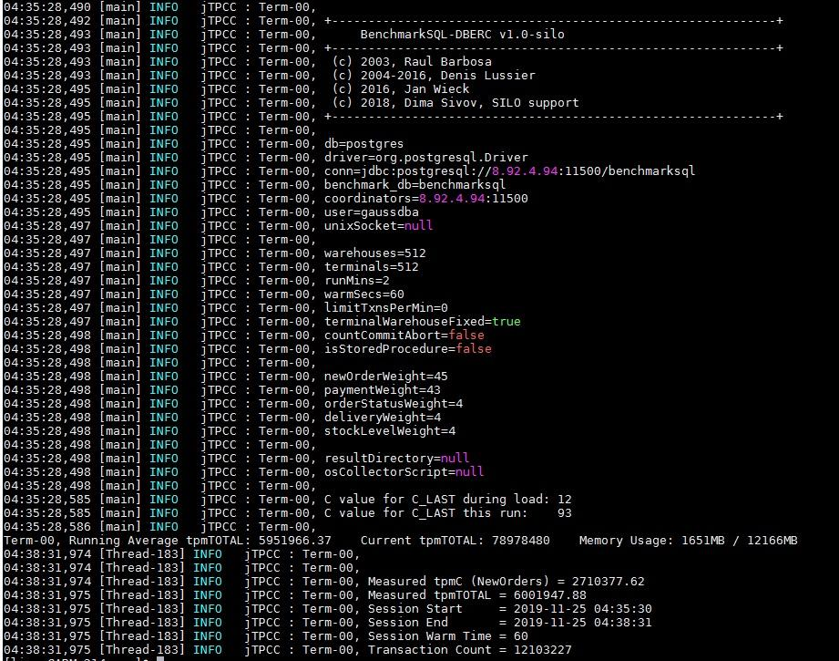

# Results Report

## Results in CLI

BenchmarkSQL result should appear as follows.

Over time, the benchmark measures and averages the committed transactions. The example above benchmarks for two minutes.

The score is  **2.71M tmp-C**  \(new-orders per-minute\), which is 45% of the total committed transactions, meaning the  **tpmTOTAL**.

