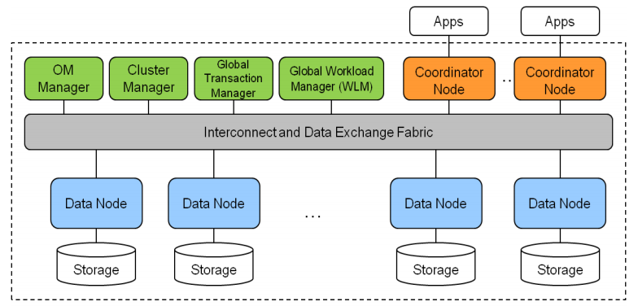

# Scale-out Distributed Database<a name="EN-US_TOPIC_0257867446"></a>

This feature is only available in the GaussDB, the enterprise version of the open-source openGauss database, which is a distributed SQL database.

**Figure  1**  GaussDB System Architecture<a name="en-us_topic_0257713328_fig9273144622519"></a>  


GaussDB is designed to scale linearly to hundreds of physical machines.  [Figure 1](#en-us_topic_0257713328_fig9273144622519)  illustrates the high-level logical system architecture. Database data is partitioned and stored in many data nodes, which fulfill local ACID properties. Cross-partition consistency is maintained by using a two-phase commit mechanism and global transaction management.

MOT is fully integrated in GaussDB and supports scale-out, distributed transactions and queries.

If a table was created as a MOT table, the SQL query processor directs all access to that table to the MOT storage engine, and then the table redirects its logging back to the data‑node envelope.

A sharded MOT table looks like the example below.

```
CREATE FOREIGN TABLE bmsql_warehouse (
w_id        integer   not null,
w_ytd       decimal(12,2),
w_tax       decimal(4,4),
w_name      varchar(10),
w_street_1  varchar(20),
w_street_2  varchar(20),
w_city      varchar(20),
w_state     char(2),
w_zip       char(9),
primary key (w_id)
)
SERVER mot_server
DISTRIBUTE BY HASH(w_id);
```

In this case, the w\_id****sharding key is handled by the Coordinator node.

