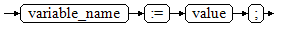

# Assignment Statements<a name="EN-US_TOPIC_0289899984"></a>

## Notice

Compared with the original openGauss, Dolphin modifies the assignment syntax as follows:

1. The syntax function of assigning values to variables through **set** is added between BEGIN and END.

## Syntax<a name="en-us_topic_0283137492_en-us_topic_0237122222_en-us_topic_0059778597_s0d14c5a042e2478fa57514f056522738"></a>

[Figure 1](#en-us_topic_0283137492_en-us_topic_0237122222_en-us_topic_0059778597_f1087f61f4ec24addbb3b79a2ccf21917)  shows the syntax diagram for assigning a value to a variable.

**Figure  1**  assignment\_value::=<a name="en-us_topic_0283137492_en-us_topic_0237122222_en-us_topic_0059778597_f1087f61f4ec24addbb3b79a2ccf21917"></a>  


The following is supported in B-compatible mode:

```
set variable_name := value;
```

The syntax is described as follows:

-   **variable\_name** indicates the name of a variable.
-   **value** can be a value or an expression. The type of **value** must be compatible with the type of **variable\_name**.

Example:

```
openGauss=# DECLARE
    emp_id  INTEGER := 7788; -- Assignment
BEGIN
    emp_id := 5; -- Assignment
    emp_id := 5*7784;
END;
/

In B-compatible mode:
openGauss=# DECLARE
    emp_id  INTEGER := 7788; -- Assignment
BEGIN
    set emp_id := 5;-- Assignment
    set emp_id := 5*7784;
END;
/
```

>  **NOTICE:**
>
> * You can run the **set variable\_name :=(=) value** command to assign a value to a variable between BEGIN and END.
