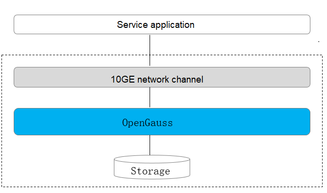
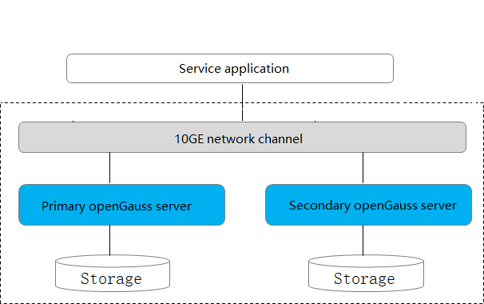

# Deployment Solutions

The openGauss can be deployed in standalone mode or with one primary node and multiple standby nodes.

## Common Concepts

-   Standalone

    There is only one database instance.

- Primary/Standby

  There are primary and standby database instances in the system. The primary instance supports read and write, and the standby instance supports read-only.

- One primary and multiple standbys

  The system has one primary node and multiple standby nodes. Up to  8  standby nodes are supported.

- Hot/Cold backup

  Cold backup: There is only a simple backup set that cannot provide services.

  Hot backup: Backup databases can provide services for external systems.

## Deployment Modes

For details about the standalone and HA cluster deployment modes, see  [Table 1](#en-us_topic_0243295239_en-us_topic_0240782908_table138801827134510).

**Table  1**  Deployment modes in openGauss

<table><thead align="left"><tr id="en-us_topic_0243295239_en-us_topic_0240782908_row88806271452"><th class="cellrowborder" valign="top" width="7.830783078307831%" id="mcps1.2.8.1.1">
Deployment Mode

</th>
<th class="cellrowborder" valign="top" width="11.561156115611562%" id="mcps1.2.8.1.2">
Technical Solution

</th>
<th class="cellrowborder" valign="top" width="10.051005100510052%" id="mcps1.2.8.1.3">
HA

</th>
<th class="cellrowborder" valign="top" width="10.671067106710671%" id="mcps1.2.8.1.4">
Basic Configuration Requirement

</th>
<th class="cellrowborder" valign="top" width="10.41104110411041%" id="mcps1.2.8.1.5">
Business Scenario

</th>
<th class="cellrowborder" valign="top" width="20.99209920992099%" id="mcps1.2.8.1.6">
Characteristics

</th>
<th class="cellrowborder" valign="top" width="28.48284828482848%" id="mcps1.2.8.1.7">
Technical Specifications

</th>
</tr>
</thead>
<tbody><tr id="en-us_topic_0243295239_en-us_topic_0240782908_row18811277455"><td class="cellrowborder" valign="top" width="7.830783078307831%" headers="mcps1.2.8.1.1 ">
Standalone

</td>
<td class="cellrowborder" valign="top" width="11.561156115611562%" headers="mcps1.2.8.1.2 ">
Standalone

</td>
<td class="cellrowborder" valign="top" width="10.051005100510052%" headers="mcps1.2.8.1.3 ">
HA is not supported.

</td>
<td class="cellrowborder" valign="top" width="10.671067106710671%" headers="mcps1.2.8.1.4 ">
Single equipment room

</td>
<td class="cellrowborder" valign="top" width="10.41104110411041%" headers="mcps1.2.8.1.5 ">
Physical machine (PM)

</td>
<td class="cellrowborder" valign="top" width="20.99209920992099%" headers="mcps1.2.8.1.6 "><ul id="en-us_topic_0243295239_en-us_topic_0240782908_ul61827011712"><li>No reliability and availability requirements for the system.</li><li>Used for trial use and commissioning.</li></ul>
</td>
<td class="cellrowborder" valign="top" width="28.48284828482848%" headers="mcps1.2.8.1.7 "><ul id="en-us_topic_0243295239_en-us_topic_0240782908_ul83681420142312"><li>RTO and RPO are uncontrollable.</li><li>Instance-level DR is not supported. The system is unavailable when instance faults occur.</li><li>Lost instance data cannot be restored.</li></ul>
</td>
</tr>
<tr id="en-us_topic_0243295239_en-us_topic_0240782908_row16881142774510"><td class="cellrowborder" valign="top" width="7.830783078307831%" headers="mcps1.2.8.1.1 ">
Primary/Standby

</td>
<td class="cellrowborder" valign="top" width="11.561156115611562%" headers="mcps1.2.8.1.2 ">
Primary node + Standby node

</td>
<td class="cellrowborder" valign="top" width="10.051005100510052%" headers="mcps1.2.8.1.3 ">
Instance faults can be withstood.

</td>
<td class="cellrowborder" valign="top" width="10.671067106710671%" headers="mcps1.2.8.1.4 ">
Single equipment room

</td>
<td class="cellrowborder" valign="top" width="10.41104110411041%" headers="mcps1.2.8.1.5 ">
PM

</td>
<td class="cellrowborder" valign="top" width="20.99209920992099%" headers="mcps1.2.8.1.6 "><ul id="en-us_topic_0243295239_en-us_topic_0240782908_ul617272701813"><li>No network latency between nodes.</li><li>Instance faults in the cluster can be withstood.</li><li>Applicable to scenarios without high reliability requirements.</li></ul>
</td>
<td class="cellrowborder" valign="top" width="28.48284828482848%" headers="mcps1.2.8.1.7 "><ul id="en-us_topic_0243295239_en-us_topic_0240782908_ul15571133112234"><li>RPO=0</li><li>Instance fault RTO &lt; 10s</li><li>AZ-level DR is not supported.</li><li>Recommended maximum availability mode</li></ul>
</td>
</tr>
<tr id="en-us_topic_0243295239_en-us_topic_0240782908_row1188192764517"><td class="cellrowborder" valign="top" width="7.830783078307831%" headers="mcps1.2.8.1.1 ">
One primary and multiple standbys

</td>
<td class="cellrowborder" valign="top" width="11.561156115611562%" headers="mcps1.2.8.1.2 ">
Primary node + Multiple standby nodes +Quorum +Paxos

</td>
<td class="cellrowborder" valign="top" width="10.051005100510052%" headers="mcps1.2.8.1.3 ">
Instance faults in the database can be withstood.

</td>
<td class="cellrowborder" valign="top" width="10.671067106710671%" headers="mcps1.2.8.1.4 ">
Single equipment room

</td>
<td class="cellrowborder" valign="top" width="10.41104110411041%" headers="mcps1.2.8.1.5 ">
PM

</td>
<td class="cellrowborder" valign="top" width="20.99209920992099%" headers="mcps1.2.8.1.6 "><ul id="en-us_topic_0243295239_en-us_topic_0240782908_ul1473717417212"><li>No network latency between nodes.</li><li>Instance faults in the database can be withstood.</li></ul>
</td>
<td class="cellrowborder" valign="top" width="28.48284828482848%" headers="mcps1.2.8.1.7 "><ul id="en-us_topic_0243295239_en-us_topic_0240782908_ul13758194392316"><li>RPO=0</li><li>Instance fault RTO &lt; 10s</li><li>AZ-level DR is not supported.</li><li>Primary/Standby synchronization is recommended.</li><li>At least two copies and at most four copies are supported.</li></ul>
</td>
</tr>
</tbody>
</table>

## Hardware and Software Specifications

openGauss supports the following CPUs and OSs:

**Table  2**  openGauss software and hardware specifications

<table><thead align="left"><tr id="en-us_topic_0243295239_en-us_topic_0240782908_row1521418485347"><th class="cellrowborder" valign="top" width="33.33333333333333%" id="mcps1.2.4.1.1">
Delivery Mode

</th>
<th class="cellrowborder" valign="top" width="33.33333333333333%" id="mcps1.2.4.1.2">
CPU

</th>
<th class="cellrowborder" valign="top" width="33.33333333333333%" id="mcps1.2.4.1.3">
OS

</th>
</tr>
</thead>
<tbody><tr id="en-us_topic_0243295239_en-us_topic_0240782908_row18214144823411"><td class="cellrowborder" rowspan="2" valign="top" width="33.33333333333333%" headers="mcps1.2.4.1.1 ">
Open source and offline

</td>
<td class="cellrowborder" valign="top" width="33.33333333333333%" headers="mcps1.2.4.1.2 ">
x86

</td>
<td class="cellrowborder" valign="top" width="33.33333333333333%" headers="mcps1.2.4.1.3 ">
CentOS 7.6 , openEuler 20.03 LTS or Asianux 7.6

</td>
</tr>
<tr id="en-us_topic_0243295239_en-us_topic_0240782908_row221414883410"><td class="cellrowborder" valign="top" headers="mcps1.2.4.1.1 ">
Kunpeng

</td>
<td class="cellrowborder" valign="top" headers="mcps1.2.4.1.2 ">
openEuler 20.03 LTS , Kirin V10 or Asianux 7.5

</td>
</tr>
</tbody>
</table>

## Introduction to Deployment Solutions

The overall deployment solution can be classified into three types: standalone deployment, primary/standby deployment, and one-primary and multiple-standby deployment. For details, see the following sections.

-   Standalone Deployment

    The standalone deployment does not ensure reliability or availability. There is only one data copy. If data is damaged or lost, data can be restored only through physical backup. Therefore, this deployment mode applies to scenarios such as experiencing databases and commissioning syntax functions in the test environment. You are not advised to use this mode on the commercial live network.

    **Figure  1**  Standalone deployment  
    

    

-   Primary/Standby Deployment

    The primary/standby deployment mode is equivalent to two data copies. The primary and standby nodes each have a data copy. The standby node receives and plays back logs.

    **Figure  2**  Primary/Standby deployment  
    

-   Deployment with One Primary and Multiple Standbys

    The multi-copy deployment mode provides the capability of defending against instance-level faults. This mode is applicable to scenarios where equipment room DR is not required but some hardware faults need to be prevented.

    Generally, the one-primary and two-standby mode is used for multi-copy deployment. There are three copies in total. The reliability of the three copies is 99.99%, which can meet the reliability requirements of most applications.

    -   In primary/standby DN quorum replication, data is synchronized to at least one standby to ensure the maximum performance.
    -   If any of primary and standby DNs is faulty, services will not be affected.
    -   There are three copies of data. If one node is faulty, the system still has two copies of data. In addition, any standby DN can be promoted to primary.
    -   The primary and standby instances cannot be deployed on the same physical machine.

    **Figure  3**  One-primary and multiple-standby deployment  
    

