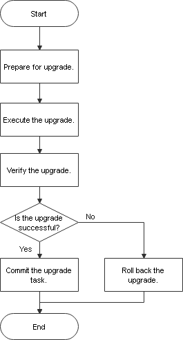

# Upgrade Process

This section describes the process for upgrade from an earlier version to the target version.

**Figure  1**  Upgrade flowchart  

> **NOTE:** 
>The time required for each procedure is an estimate and for reference only.

**Table  1**  Estimated time required for each procedure

<table><thead align="left"><tr id="row39004066"><th class="cellrowborder" valign="top" width="25.477452254774523%" id="mcps1.2.6.1.1">
Procedure

</th>
<th class="cellrowborder" valign="top" width="16.95830416958304%" id="mcps1.2.6.1.2">
Recommended Start Time

</th>
<th class="cellrowborder" valign="top" width="24.937506249375062%" id="mcps1.2.6.1.3">
Required Time

</th>
<th class="cellrowborder" valign="top" width="19.408059194080593%" id="mcps1.2.6.1.4">
Service Interruption Duration

</th>
<th class="cellrowborder" valign="top" width="13.218678132186781%" id="mcps1.2.6.1.5">
Remarks

</th>
</tr>
</thead>
<tbody><tr id="row11609170133510"><td class="cellrowborder" valign="top" width="25.477452254774523%" headers="mcps1.2.6.1.1 ">
Preparing for and Checking the Upgrade

</td>
<td class="cellrowborder" valign="top" width="16.95830416958304%" headers="mcps1.2.6.1.2 ">
One day before the upgrade

</td>
<td class="cellrowborder" valign="top" width="24.937506249375062%" headers="mcps1.2.6.1.3 ">
About two to three hours.

</td>
<td class="cellrowborder" valign="top" width="19.408059194080593%" headers="mcps1.2.6.1.4 ">
No impact on services.

</td>
<td class="cellrowborder" valign="top" width="13.218678132186781%" headers="mcps1.2.6.1.5 ">
Check and back up data and verify software packages before the upgrade.

</td>
</tr>
<tr id="row1335165713413"><td class="cellrowborder" valign="top" width="25.477452254774523%" headers="mcps1.2.6.1.1 ">
Perform the upgrade.

</td>
<td class="cellrowborder" valign="top" width="16.95830416958304%" headers="mcps1.2.6.1.2 ">
Service idle hours

</td>
<td class="cellrowborder" valign="top" width="24.937506249375062%" headers="mcps1.2.6.1.3 ">
The time is mainly spent in starting and stopping the database and modifying the system catalog of each database. Generally, the upgrade takes no more than 30 minutes.

</td>
<td class="cellrowborder" valign="top" width="19.408059194080593%" headers="mcps1.2.6.1.4 ">
The duration is the same as the operation duration. Generally, the duration does not exceed 30 minutes.

</td>
<td class="cellrowborder" valign="top" width="13.218678132186781%" headers="mcps1.2.6.1.5 ">
Start the upgrade according to the upgrade guide.

</td>
</tr>
<tr id="row786055223420"><td class="cellrowborder" valign="top" width="25.477452254774523%" headers="mcps1.2.6.1.1 ">
Verify the upgrade.

</td>
<td class="cellrowborder" valign="top" width="16.95830416958304%" headers="mcps1.2.6.1.2 ">
Service idle hours

</td>
<td class="cellrowborder" valign="top" width="24.937506249375062%" headers="mcps1.2.6.1.3 ">
About 30 minutes.

</td>
<td class="cellrowborder" valign="top" width="19.408059194080593%" headers="mcps1.2.6.1.4 ">
The duration is the same as the operation duration, which is about 30 minutes.

</td>
<td class="cellrowborder" valign="top" width="13.218678132186781%" headers="mcps1.2.6.1.5 ">
-

</td>
</tr>
<tr id="row1657334683411"><td class="cellrowborder" valign="top" width="25.477452254774523%" headers="mcps1.2.6.1.1 ">
Committing the Upgrade Task

</td>
<td class="cellrowborder" valign="top" width="16.95830416958304%" headers="mcps1.2.6.1.2 ">
Service idle hours

</td>
<td class="cellrowborder" valign="top" width="24.937506249375062%" headers="mcps1.2.6.1.3 ">
The upgrade commit takes no more than 10 minutes.

</td>
<td class="cellrowborder" valign="top" width="19.408059194080593%" headers="mcps1.2.6.1.4 ">
The duration is the same as the operation duration. Generally, the duration does not exceed 10 minutes.

</td>
<td class="cellrowborder" valign="top" width="13.218678132186781%" headers="mcps1.2.6.1.5 ">
-

</td>
</tr>
<tr id="row198573237207"><td class="cellrowborder" valign="top" width="25.477452254774523%" headers="mcps1.2.6.1.1 ">
Rolling Back the Upgrade Version

</td>
<td class="cellrowborder" valign="top" width="16.95830416958304%" headers="mcps1.2.6.1.2 ">
Service idle hours

</td>
<td class="cellrowborder" valign="top" width="24.937506249375062%" headers="mcps1.2.6.1.3 ">
Generally, the version rollback takes no more than 30 minutes.

</td>
<td class="cellrowborder" valign="top" width="19.408059194080593%" headers="mcps1.2.6.1.4 ">
The duration is the same as the operation duration. Generally, the duration does not exceed 30 minutes.

</td>
<td class="cellrowborder" valign="top" width="13.218678132186781%" headers="mcps1.2.6.1.5 ">
-

</td>
</tr>
</tbody>
</table>

