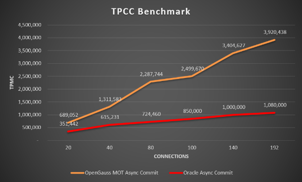

# Oracle In-Memory Option and Oracle TimesTen

++++ To Review 2nd  Priority

## Oracle In-Memory Option

The Oracle In-Memory Option[\[3\]](en-us_topic_0257713395.md#_ftn3)  is a pure column‑store engine that enables efficient Online Transactional Processing \(OLTP\) and operational analytics. It is not an OLTP row‑store, for which only a disk-based row‑store is suitable. Its benefits focus around transparent data conversion to columnar format \(without Extract, Transform, Load \[ETL\]\) and high performance analytics\).

However, Oracle In-Memory is not well designed for the resolution of OLTP performance bottlenecks, such as throughput, concurrency and latency. Only a single node is supported – no scale-out supported. Our tests show that MOT performance on TPC-C benchmarks surpasses Oracle 12C by almost four times \(X4\).

The following test results demonstrate the openGauss MOT benchmarks vs Oracle. These tests were performed using the following configuration:

-   Hardware and OS – x86 Intel Xeon 4x E7-8890v4 2.2GHz, 512GB RAM, 2TB SSD, Linux Centos
-   Asynchronous commit ON \(Oracle Asynchronous commit – BATCH, NOWAIT\)

    

    MOT also enables extremely high utilization of server resources while running a high load and contention, which is currently a known problem for all industry-leading databases. MOT enables utilization to reach 98% on four- and eight-socket servers, compared with the 65% and 55% achieved by Oracle.

    

## Oracle TimesTen

Oracle TimesTen[\[4\]](en-us_topic_0257713395.md#_ftn4)  is an in-memory relational database. Two versions are provided – TimesTen Classic single-node and TimesTen Scale-out \(from Oracle 18.1\), which is a distributed relational IMDB. Both versions can be used either as a standalone/replicated database for low-latency processing or as a cache layer for the primary Oracle database. Durability \(or persistence\) is provided both in Guaranteed \(synchronous\) and Delayed modes \(asynchronous\). TimesTen Classic is quite lightweight and is used as an embedded database inside applications \(in-process and cross-process\). It has multiple configuration options, including read-only cache groups, write-through cache groups and native TimesTen tables.

## Comparison

openGauss MOT, on the other hand, is an inherent part of the openGauss relational database that works alongside the disk-based storage engine. A major benefit of this approach is flexibility – users can choose the performance-sensitive tables only and convert them into an MOT format, while keeping the application intact \(no code changes are usually required\). An additional major benefit is its low cost – no extra servers are required for the IMDB part, there is no need to rewrite the application and administration costs are low because MOT is only part of the primary database.

