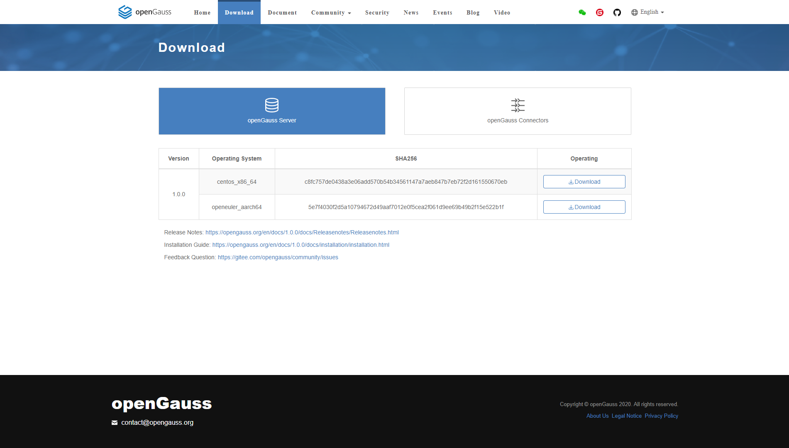
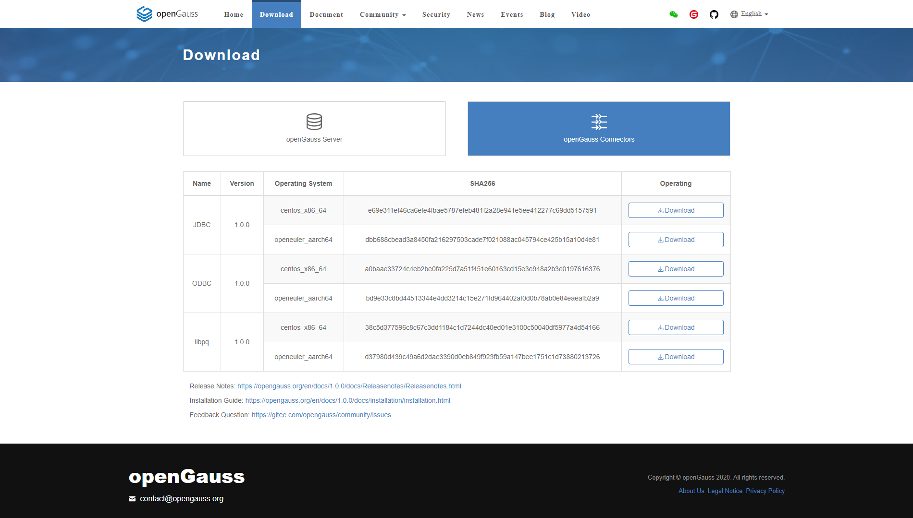

# Obtaining and Verifying an Installation Package<a name="EN-US_TOPIC_0283136484"></a>

You can obtain the installation package from the openGauss open-source community.

## Procedure<a name="en-us_topic_0241802590_en-us_topic_0085434667_en-us_topic_0059782060_section62223956163549"></a>

1.  Download the installation package of the corresponding platform from the openGauss community.  
a.  Log in to the openGauss open-source community at  [https://opengauss.org/en/download/](https://opengauss.org/en/download/)  and download the corresponding installation package.

    **Figure 1**  openGauss Server

    

    **Figure 2**  openGauss Connectors

    

    **Table  1**  openGauss Connectors installation packages

    <a name="en-us_topic_0241805803_en-us_topica_0085434653_en-us_topic_0059781995_te4a9d557337c400c85acff184476a722"></a>
    <table><thead align="left"><tr id="en-us_topic_0241805803_en-us_topic_0085434653_en-us_topic_0059781995_r6e873539a9a948579dd18ac7252c2f16"><th class="cellrowborder" valign="top" width="37.09%" id="mcps1.2.3.1.1"><p id="en-us_topic_0241805803_en-us_topic_0085434653_en-us_topic_0059781995_aeb07fb644a9c44c9b5867059f6978c73"><a name="en-us_topic_0241805803_en-us_topic_0085434653_en-us_topic_0059781995_aeb07fb644a9c44c9b5867059f6978c73"></a><a name="en-us_topic_0241805803_en-us_topic_0085434653_en-us_topic_0059781995_aeb07fb644a9c44c9b5867059f6978c73"></a>Installation Package</p>
    </th>
    <th class="cellrowborder" valign="top" width="62.91%" id="mcps1.2.3.1.2"><p id="en-us_topic_0241805803_en-us_topic_0085434653_en-us_topic_0059781995_a6e02d21de44f441f9802f741ccfffa0c"><a name="en-us_topic_0241805803_en-us_topic_0085434653_en-us_topic_0059781995_a6e02d21de44f441f9802f741ccfffa0c"></a><a name="en-us_topic_0241805803_en-us_topic_0085434653_en-us_topic_0059781995_a6e02d21de44f441f9802f741ccfffa0c"></a>Description</p>
    </th>
    </tr>
    </thead>
    <tbody><tr id="en-us_topic_0241805803_en-us_topic_0085434653_en-us_topic_0059781995_r175ab443930247f1a14e55b0a76ef425"><td class="cellrowborder" valign="top" width="37.09%" headers="mcps1.2.3.1.1 "><p id="en-us_topic_0241805803_en-us_topic_0085434653_en-us_topic_0059781995_a382ad5075b02419a99cc5c5894ee3dc8"><a name="en-us_topic_0241805803_en-us_topic_0085434653_en-us_topic_0059781995_a382ad5075b02419a99cc5c5894ee3dc8"></a><a name="en-us_topic_0241805803_en-us_topic_0085434653_en-us_topic_0059781995_a382ad5075b02419a99cc5c5894ee3dc8"></a>JDBC</p>
    </td>
    <td class="cellrowborder" valign="top" width="62.91%" headers="mcps1.2.3.1.2 "><p id="en-us_topic_0241805803_en-us_topic_0085434653_en-us_topic_0059781995_a30fe42f57dff4354a4ccdccb34e33005"><a name="en-us_topic_0241805803_en-us_topic_0085434653_en-us_topic_0059781995_a30fe42f57dff4354a4ccdccb34e33005"></a><a name="en-us_topic_0241805803_en-us_topic_0085434653_en-us_topic_0059781995_a30fe42f57dff4354a4ccdccb34e33005"></a>Used to install the JDBC driver in the SUSE Linux OS.</p>
    </td>
    </tr>
    <tr id="en-us_topic_0241805803_en-us_topic_0085434653_en-us_topic_0059781995_rc4332348c8c64404896b4c01435fb5bd"><td class="cellrowborder" valign="top" width="37.09%" headers="mcps1.2.3.1.1 "><p id="en-us_topic_0241805803_en-us_topic_0085434653_en-us_topic_0059781995_a95ee6d367d614b419e6a2f47dd8c9cc3"><a name="en-us_topic_0241805803_en-us_topic_0085434653_en-us_topic_0059781995_a95ee6d367d614b419e6a2f47dd8c9cc3"></a><a name="en-us_topic_0241805803_en-us_topic_0085434653_en-us_topic_0059781995_a95ee6d367d614b419e6a2f47dd8c9cc3"></a>ODBC</p>
    </td>
    <td class="cellrowborder" valign="top" width="62.91%" headers="mcps1.2.3.1.2 "><p id="en-us_topic_0241805803_en-us_topic_0085434653_en-us_topic_0059781995_ac74876654f444229b42953321aedd13c"><a name="en-us_topic_0241805803_en-us_topic_0085434653_en-us_topic_0059781995_ac74876654f444229b42953321aedd13c"></a><a name="en-us_topic_0241805803_en-us_topic_0085434653_en-us_topic_0059781995_ac74876654f444229b42953321aedd13c"></a>Used to install the ODBC driver in the SUSE Linux OS.</p>
    </td>
    </tr>
    <tr id="en-us_topic_0241805803_en-us_topic_0085434653_en-us_topbic_0059781995_rfcb5e881573c494593bc04c1bca8a09d"><td class="cellrowborder" valign="top" width="37.09%" headers="mcps1.2.3.1.1 "><p id="p947205712514"><a name="p947205712514"></a><a name="p947205712514"></a>libpq</p>
    </td>
    <td class="cellrowborder" valign="top" width="62.91%" headers="mcps1.2.3.1.2 "><p id="en-us_topic_0241805803_en-us_topic_0085434653_en-us_topic_0059781995_a1ad6388e500942829101ee341d2ad99e"><a name="en-us_topic_0241805803_en-us_topic_0085434653_en-us_topic_0059781995_a1ad6388e500942829101ee341d2ad99e"></a><a name="en-us_topic_0241805803_en-us_topic_0085434653_en-us_topic_0059781995_a1ad6388e500942829101ee341d2ad99e"></a>Used to install the libpq library in the SUSE Linux OS.</p>
    </td>
    </tr>
    </tbody>
    </table>

    b.  Click  **Download**.

2. Verify the installation package.

   Decompress the installation package and check whether the installation directory and files are complete. Run the following commands in the directory where the installation package is stored:

   ```
   tar -zxvf openGauss-1.0.1-openEuler-64bit.tar.gz
   ls -1b
   ```

   Run the  **ls**  command and information similar to the following is displayed. 

   ```
   total 50M
   drwxr-xr-x 14 root root 4.0K Jul  6 11:03 lib
   -rw-r--r--  1 root root   65 Jul  6 11:03 openGauss-x.x.x-openEuler-64bit.sha256
   -rw-r--r--  1 root root  50M Jul  6 11:03 openGauss-x.x.x-openEuler-64bit.tar.bz2
   drwxr-xr-x  5 root root 4.0K Jul  6 11:03 script
   -rw-r--r--  1 root root   32 Jul  6 11:03 version.cfg
   
   ```


