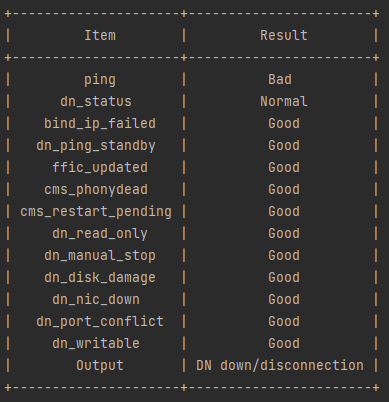

# 使用指导<a name="ZH-CN_TOPIC_0000002259758184"></a>

在DN实例产生异常告警时，一个完整的用于启动实例故障分析功能的命令是：

```
gs_dbmind component cluster_diagnosis --conf {confpath} --host {ip_address} --role dn --time "2023-04-20 16:00:00" --method tree
```

输入此命令后，系统读取所设定时间前3分钟的日志记录，并对选定的DN实例使用选定方法进行分析，分析的结果示例如[图1](#zh-cn_topic_0000001714948973_fig0615168103510)所示。

**图 1**  DN实例使用选定方法分析<a name="zh-cn_topic_0000001714948973_fig0615168103510"></a>  


返回结果前半部分的字典给出对日志的解析结果，其中Good表示该项正常，Bad表示该项有异常；最后的Output表示输出结果，详情请参见[表1](概述-24.md#zh-cn_topic_0000001714829137_table1342813795619)。

> **说明：** 
>-   单次诊断读取的是诊断时间点之前三分钟的日志和节点状态，由于网络延迟，模型计算用时等因素，实际时间会略短于三分钟，综合各种因素，以150秒内的诊断结果作为参考更为准确。
>-   集群故障诊断功能的网络连通性诊断是通过各个数据库节点之间的连通性来判断的，对于单节点集群，不存在数据库节点之间的连通性，所以集群诊断不支持单节点集群的故障诊断。
>-   数据库实例诊断功能中，判断网络连通性的超时时长是1秒，当网络延迟达到1秒及以上时，节点会被判断为断开连接。
>-   尝试对于新近纳管的集群进行集群诊断时，由于采集数据存在延迟，可能会出现短暂的网络异常。

