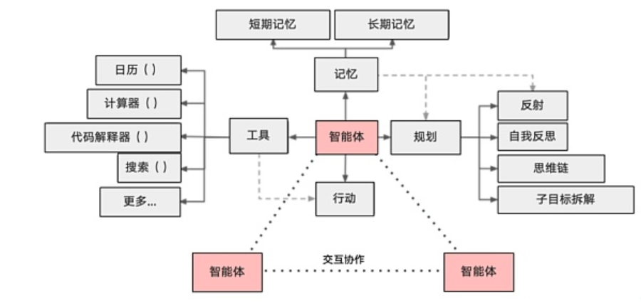

# 大模型Agent技术

LLM Agent是一种能够感知环境、进行决策和执行动作的智能实体，又称智能体。不同于传统的人工智能，LLM Agent 具备独立思考、调用工具去逐步完成给定目标的能力。LLM Agent往往以问答机器人作为交互入口，通过自然语言触发全自动的工作流，中间没有人工介入。

LLM Agent主要包括感知、分析、决策和执行四大能力。这些能力相互协同，构成了其基本的工作原理。

1.  感知能力：通过传感器获取外部环境的信息，使Agent能够对周围的情况有所了解。
2.  分析能力：通过对感知到的信息进行分析和处理，提取有用的特征和模式。
3.  决策能力：LLM Agent基于分析结果进行决策，制定相应的行动计划。
4.  执行能力：将决策转化为具体的行动，完成任务。

这四大能力相互配合，使得Agent能够在复杂的环境中高效地运行和执行任务。

在基于LLM的智能体中，LLM充当着智能体的大脑的角色，同时还有3个关键部分：**规划**、**记忆**、**工具使用**。如下图[图1](#fig8331451230)所示：

**图 1**  LLM Agent架构  

## 规划

根据提示技术，Agent会把大型任务分解为子任务，并规划执行任务的流程；同时会对任务执行的过程进行思考和反思，从而决定是继续执行任务，或判断任务完结并终止运行。常见的提示技术有思维链（Chain of Thoughts）、思维树（Tree of Thoughts）、ReAct（Reasoning And Acting）等。

## 记忆

记忆模块负责存储信息，包括过去的交互、学习到的知识、甚至是临时的任务信息。对于一个Agent来说，有效的记忆机制能够保障它在面对新的或复杂的情况时，调用以往的经验和知识。记忆分为两部分：短期记忆和长期记忆。

-   短期记忆是指在执行任务的过程中的上下文，会在子任务的执行过程产生和暂存，在任务完结后被清空。
-   长期记忆是指长时间保留的信息，一般是指外部知识库，通常用向量数据库来存储和检索。

GaussMaster基于短期记忆实现了多轮对话，参数追问的功能。短期记忆存储在openGauss元数据库中，其结构定义参考第5章节附录中[表5](附录.md#table1662525017292)。

## 工具使用

智能体与大模型的一个显著区别在于前者能够使用外部工具拓展其功能。 通过为智能体集成各种工具 API，比如：慢SQL诊断、索引推荐、集群诊断、数据库查询工具等，智能体就可以与物理世界交互，解决实际的数据库问题。

