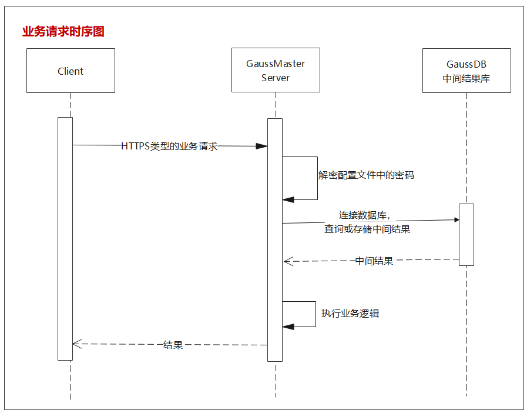
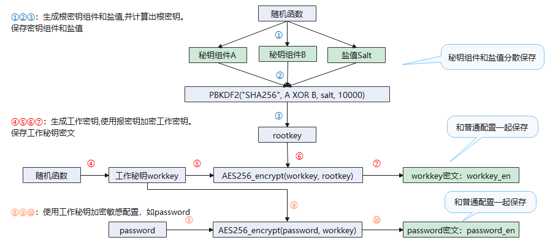
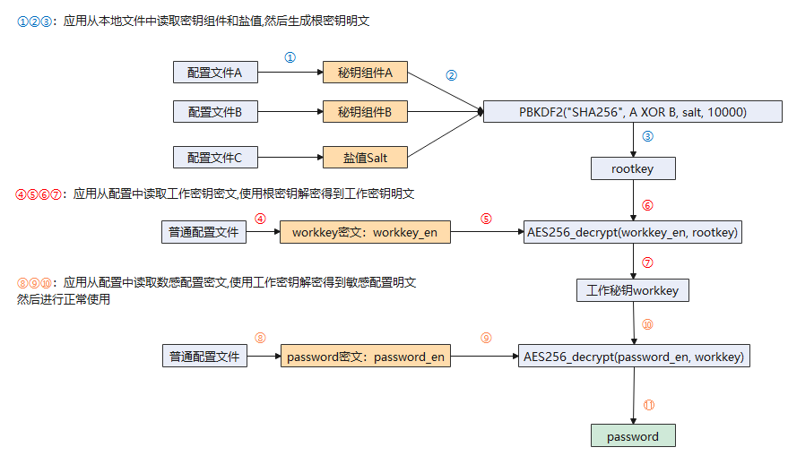

# 安全设计

GaussMaster服务运行过程中的中间结果会存储到GaussDB数据库中，因此GaussMaster服务启动之前，需要将数据库用户名和密码加密保存到配置文件中。

云管控作为客户端，调用API接口时，默认使用HTTPS双向认证。GaussMaster收到请求后，执行相应的业务逻辑，如果要连接GaussDB查询或存储中间结果，需要从配置文件中对密码进行解密，业务逻辑执行完之后，将最终结果返回给云管控。业务请求的时序图如下图[图1](#fig11274103110251)所示：

**图 1**  业务时序图  

其中GaussMaster使用libpq驱动连接GaussDB数据库，默认使用TLS加密协议。

由于GaussMaster需要连接DBMind和GaussDB，所以需要存储对应的密码。GaussMaster服务执行初始化命令时，用户使用管道符的方式输入密码，然后按照如下图[图2](#fig13844205852611)所示的加密方案存储到配置文件中，如果用户名或密码有修改，需要重新执行初始化命令。

**图 2**  加密流程  

需要使用密码时，按照如下图[图3](#fig117662342814)所示的解密方案对密文进行解密。

**图 3**  解密流程  

