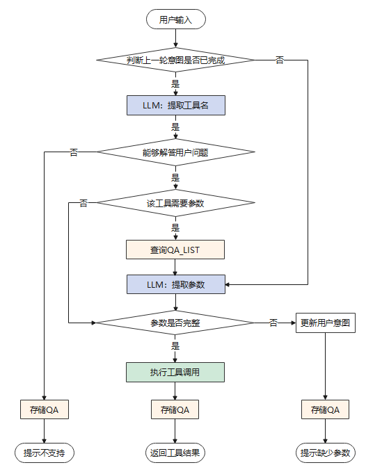

# 工具交互<a name="ZH-CN_TOPIC_0000002258589366"></a>

在用户进行工具交互前，需要先执行完成[前置操作](前置操作.md)，之后可以使用问答的方式对GaussMaster服务进行提问，后台接口为/v1/api/app/intelligent-interaction。此接口参数“mode”的值必须为“tool\_interaction”，即当前模式为工具交互，API详情请参考[API: /v1/api/app/intelligent-interaction](API接口说明-智能运维md#section95391566019)。工具交互默认支持多轮对话，对话记录长度为1轮。用户可以通过参数"history\_len"指定对话记录的长度，可支持的对话记录长度为\[1-3\]，即大语言模型最多可以记住3轮对话历史。

工具交互的流程图如下[图1](#fig518531224414)所示：

**图 1**  工具交互流程图<a name="fig518531224414"></a>  


## 工具交互约束<a name="section199011054151511"></a>

1.  用户可以使用华为云提供的pangu-38b开源模型工具，识别准确率为90%。也可以指定其他开源模型，通过接口的形式进行调用，使用其他开源模型做工具交互时，识别准确率无法保证。
2.  智能运维中工具交互支持参数追问，参数不全时可基于历史内容进行补全。
3.  DBMind/openGauss组件不可用/升级等场景下，GaussMaster服务会受到影响。
4.  GaussMaster智能运维不提供前台页面，且目前只支持中文问答。

当前内部已支持的DBmind工具（API）共22个（其中告警查询需要用到DBMind的两个API），如下表：

**表 1**  API列表

<a name="table1133317381846"></a>
<table><thead align="left"><tr id="row103342386416"><th class="cellrowborder" valign="top" width="7.200000000000001%" id="mcps1.2.6.1.1"><p id="p154771952398"><a name="p154771952398"></a><a name="p154771952398"></a>ID</p>
</th>
<th class="cellrowborder" valign="top" width="30.250000000000004%" id="mcps1.2.6.1.2"><p id="p1147745215911"><a name="p1147745215911"></a><a name="p1147745215911"></a>API接口</p>
</th>
<th class="cellrowborder" valign="top" width="16.310000000000002%" id="mcps1.2.6.1.3"><p id="p194601714174"><a name="p194601714174"></a><a name="p194601714174"></a>参数</p>
</th>
<th class="cellrowborder" valign="top" width="23.12%" id="mcps1.2.6.1.4"><p id="p347755216914"><a name="p347755216914"></a><a name="p347755216914"></a>关键信息</p>
</th>
<th class="cellrowborder" valign="top" width="23.12%" id="mcps1.2.6.1.5"><p id="p1247711521090"><a name="p1247711521090"></a><a name="p1247711521090"></a>对话示例</p>
</th>
</tr>
</thead>
<tbody><tr id="row63341138644"><td class="cellrowborder" valign="top" width="7.200000000000001%" headers="mcps1.2.6.1.1 "><p id="p20477452497"><a name="p20477452497"></a><a name="p20477452497"></a>1</p>
</td>
<td class="cellrowborder" valign="top" width="30.250000000000004%" headers="mcps1.2.6.1.2 "><p id="p1147716521097"><a name="p1147716521097"></a><a name="p1147716521097"></a>/v1/api/status/data-directory</p>
</td>
<td class="cellrowborder" valign="top" width="16.310000000000002%" headers="mcps1.2.6.1.3 "><p id="p04601414872"><a name="p04601414872"></a><a name="p04601414872"></a>- instance：str类型，必要参数，需要查询的数据库的数据节点的ip和port</p>
</td>
<td class="cellrowborder" valign="top" width="23.12%" headers="mcps1.2.6.1.4 "><p id="p94775521298"><a name="p94775521298"></a><a name="p94775521298"></a>数据库实例，数据库数据目录状态。</p>
</td>
<td class="cellrowborder" valign="top" width="23.12%" headers="mcps1.2.6.1.5 "><p id="p7477145211911"><a name="p7477145211911"></a><a name="p7477145211911"></a>查询10.90.56.xxx:xxx的数据目录状态。</p>
</td>
</tr>
<tr id="row73343387418"><td class="cellrowborder" valign="top" width="7.200000000000001%" headers="mcps1.2.6.1.1 "><p id="p4477852792"><a name="p4477852792"></a><a name="p4477852792"></a>2</p>
</td>
<td class="cellrowborder" valign="top" width="30.250000000000004%" headers="mcps1.2.6.1.2 "><p id="p847719521495"><a name="p847719521495"></a><a name="p847719521495"></a>/v1/api/app/workload-collection?data_source=dbe_perf.statement_history</p>
</td>
<td class="cellrowborder" valign="top" width="16.310000000000002%" headers="mcps1.2.6.1.3 "><p id="p1646011141076"><a name="p1646011141076"></a><a name="p1646011141076"></a>- start_time：str类型，必要参数，通过SQL语句的开始时间对SQL语句进行筛选，格式为%Y-%m-%d %H:%M:%S</p>
<p id="p6696291899"><a name="p6696291899"></a><a name="p6696291899"></a>- end_time：str类型，必要参数，通过SQL语句的结束时间对SQL语句进行筛选，格式为%Y-%m-%d %H:%M:%S</p>
<p id="p1483165716913"><a name="p1483165716913"></a><a name="p1483165716913"></a>- database：str类型，非必要参数，通过SQL语句运行的数据库名对SQL语句进行筛选，未指定默认为None</p>
<p id="p148314578919"><a name="p148314578919"></a><a name="p148314578919"></a>- schema:  str类型，非必要参数，通过SQL语句运行的数据库模式对SQL语句进行筛选，未指定默认为None</p>
</td>
<td class="cellrowborder" valign="top" width="23.12%" headers="mcps1.2.6.1.4 "><p id="p6477752494"><a name="p6477752494"></a><a name="p6477752494"></a>开始时间、结束时间、数据库名（非必须）、 schema（非必须）。</p>
</td>
<td class="cellrowborder" valign="top" width="23.12%" headers="mcps1.2.6.1.5 "><p id="p194771752492"><a name="p194771752492"></a><a name="p194771752492"></a>查询test_db数据库中上午10点到11点的sql列表。</p>
</td>
</tr>
<tr id="row173344386416"><td class="cellrowborder" valign="top" width="7.200000000000001%" headers="mcps1.2.6.1.1 "><p id="p184772525912"><a name="p184772525912"></a><a name="p184772525912"></a>3</p>
</td>
<td class="cellrowborder" valign="top" width="30.250000000000004%" headers="mcps1.2.6.1.2 "><p id="p124779525912"><a name="p124779525912"></a><a name="p124779525912"></a>/v1/api/app/workload-collection?data_source=pg_stat_activity</p>
</td>
<td class="cellrowborder" valign="top" width="16.310000000000002%" headers="mcps1.2.6.1.3 "><p id="p15460214274"><a name="p15460214274"></a><a name="p15460214274"></a>- database：str类型，非必要参数，通过SQL语句运行的数据库名对SQL语句进行筛选，未指定默认为None</p>
<p id="p557644315812"><a name="p557644315812"></a><a name="p557644315812"></a>- schema:  str类型，非必要参数，通过SQL语句运行的数据库模式对SQL语句进行筛选，未指定默认为None</p>
</td>
<td class="cellrowborder" valign="top" width="23.12%" headers="mcps1.2.6.1.4 "><p id="p164771352992"><a name="p164771352992"></a><a name="p164771352992"></a>数据库名，正在执行的SQL。</p>
</td>
<td class="cellrowborder" valign="top" width="23.12%" headers="mcps1.2.6.1.5 "><p id="p13477152397"><a name="p13477152397"></a><a name="p13477152397"></a>查询test_db数据库中当前正在执行的SQL。</p>
</td>
</tr>
<tr id="row19334133815420"><td class="cellrowborder" valign="top" width="7.200000000000001%" headers="mcps1.2.6.1.1 "><p id="p1247712521598"><a name="p1247712521598"></a><a name="p1247712521598"></a>4</p>
</td>
<td class="cellrowborder" valign="top" width="30.250000000000004%" headers="mcps1.2.6.1.2 "><p id="p11477195217912"><a name="p11477195217912"></a><a name="p11477195217912"></a>/v1/api/summary/sql/top</p>
</td>
<td class="cellrowborder" valign="top" width="16.310000000000002%" headers="mcps1.2.6.1.3 "><p id="p1346017143715"><a name="p1346017143715"></a><a name="p1346017143715"></a>None</p>
</td>
<td class="cellrowborder" valign="top" width="23.12%" headers="mcps1.2.6.1.4 "><p id="p2477952198"><a name="p2477952198"></a><a name="p2477952198"></a>执行频繁的SQL。</p>
</td>
<td class="cellrowborder" valign="top" width="23.12%" headers="mcps1.2.6.1.5 "><p id="p144778524912"><a name="p144778524912"></a><a name="p144778524912"></a>查询top SQL。</p>
</td>
</tr>
<tr id="row2033418381345"><td class="cellrowborder" valign="top" width="7.200000000000001%" headers="mcps1.2.6.1.1 "><p id="p174779522097"><a name="p174779522097"></a><a name="p174779522097"></a>5</p>
</td>
<td class="cellrowborder" valign="top" width="30.250000000000004%" headers="mcps1.2.6.1.2 "><p id="p1747795212911"><a name="p1747795212911"></a><a name="p1747795212911"></a>/v1/api/summary/sql/locking</p>
</td>
<td class="cellrowborder" valign="top" width="16.310000000000002%" headers="mcps1.2.6.1.3 "><p id="p74604142718"><a name="p74604142718"></a><a name="p74604142718"></a>None</p>
</td>
<td class="cellrowborder" valign="top" width="23.12%" headers="mcps1.2.6.1.4 "><p id="p547705215915"><a name="p547705215915"></a><a name="p547705215915"></a>锁等待、阻塞、SQL。</p>
</td>
<td class="cellrowborder" valign="top" width="23.12%" headers="mcps1.2.6.1.5 "><p id="p164771052492"><a name="p164771052492"></a><a name="p164771052492"></a>查询当前被阻塞的SQL。</p>
</td>
</tr>
<tr id="row1233512389417"><td class="cellrowborder" valign="top" width="7.200000000000001%" headers="mcps1.2.6.1.1 "><p id="p174771952691"><a name="p174771952691"></a><a name="p174771952691"></a>6</p>
</td>
<td class="cellrowborder" valign="top" width="30.250000000000004%" headers="mcps1.2.6.1.2 "><p id="p154771752596"><a name="p154771752596"></a><a name="p154771752596"></a>/v1/api/summary/alarms和/v1/api/summary/cluster-diagnosis</p>
</td>
<td class="cellrowborder" valign="top" width="16.310000000000002%" headers="mcps1.2.6.1.3 "><p id="p12460191416710"><a name="p12460191416710"></a><a name="p12460191416710"></a>- start_time：str类型，必要参数，用来筛选告警的时间范围的开始时间，格式为%Y-%m-%d %H:%M:%S</p>
<p id="p101875509109"><a name="p101875509109"></a><a name="p101875509109"></a>- end_time：str类型，必要参数，用来筛选告警的时间范围的结束时间，格式为%Y-%m-%d %H:%M:%S</p>
</td>
<td class="cellrowborder" valign="top" width="23.12%" headers="mcps1.2.6.1.4 "><p id="p1847817524919"><a name="p1847817524919"></a><a name="p1847817524919"></a>开始时间、结束时间、查询告警。</p>
</td>
<td class="cellrowborder" valign="top" width="23.12%" headers="mcps1.2.6.1.5 "><p id="p747813527918"><a name="p747813527918"></a><a name="p747813527918"></a>查询今天10点到12点的告警。</p>
</td>
</tr>
<tr id="row17335838743"><td class="cellrowborder" valign="top" width="7.200000000000001%" headers="mcps1.2.6.1.1 "><p id="p2478145218910"><a name="p2478145218910"></a><a name="p2478145218910"></a>7</p>
</td>
<td class="cellrowborder" valign="top" width="30.250000000000004%" headers="mcps1.2.6.1.2 "><p id="p194781252392"><a name="p194781252392"></a><a name="p194781252392"></a>/v1/api/agents</p>
</td>
<td class="cellrowborder" valign="top" width="16.310000000000002%" headers="mcps1.2.6.1.3 "><p id="p1846011141079"><a name="p1846011141079"></a><a name="p1846011141079"></a>None</p>
</td>
<td class="cellrowborder" valign="top" width="23.12%" headers="mcps1.2.6.1.4 "><p id="p947885213912"><a name="p947885213912"></a><a name="p947885213912"></a>查询纳管集群信息。</p>
</td>
<td class="cellrowborder" valign="top" width="23.12%" headers="mcps1.2.6.1.5 "><p id="p15478115218915"><a name="p15478115218915"></a><a name="p15478115218915"></a>查询当前纳管的所有集群信息。</p>
</td>
</tr>
<tr id="row533514380410"><td class="cellrowborder" valign="top" width="7.200000000000001%" headers="mcps1.2.6.1.1 "><p id="p1478165220913"><a name="p1478165220913"></a><a name="p1478165220913"></a>8</p>
</td>
<td class="cellrowborder" valign="top" width="30.250000000000004%" headers="mcps1.2.6.1.2 "><p id="p1478452297"><a name="p1478452297"></a><a name="p1478452297"></a>/v1/api/status/instances</p>
</td>
<td class="cellrowborder" valign="top" width="16.310000000000002%" headers="mcps1.2.6.1.3 "><p id="p174607141076"><a name="p174607141076"></a><a name="p174607141076"></a>None</p>
</td>
<td class="cellrowborder" valign="top" width="23.12%" headers="mcps1.2.6.1.4 "><p id="p94781652190"><a name="p94781652190"></a><a name="p94781652190"></a>数据库实例状态。</p>
</td>
<td class="cellrowborder" valign="top" width="23.12%" headers="mcps1.2.6.1.5 "><p id="p2047805212913"><a name="p2047805212913"></a><a name="p2047805212913"></a>查询当前数据库实例状态。</p>
</td>
</tr>
<tr id="row0335133815410"><td class="cellrowborder" valign="top" width="7.200000000000001%" headers="mcps1.2.6.1.1 "><p id="p847812521694"><a name="p847812521694"></a><a name="p847812521694"></a>9</p>
</td>
<td class="cellrowborder" valign="top" width="30.250000000000004%" headers="mcps1.2.6.1.2 "><p id="p1647855218919"><a name="p1647855218919"></a><a name="p1647855218919"></a>/v1/api/summary/database-list</p>
</td>
<td class="cellrowborder" valign="top" width="16.310000000000002%" headers="mcps1.2.6.1.3 "><p id="p1746018141277"><a name="p1746018141277"></a><a name="p1746018141277"></a>None</p>
</td>
<td class="cellrowborder" valign="top" width="23.12%" headers="mcps1.2.6.1.4 "><p id="p54783521096"><a name="p54783521096"></a><a name="p54783521096"></a>查询数据库列表。</p>
</td>
<td class="cellrowborder" valign="top" width="23.12%" headers="mcps1.2.6.1.5 "><p id="p74785522919"><a name="p74785522919"></a><a name="p74785522919"></a>查询当前实例下所有的数据库列表。</p>
</td>
</tr>
<tr id="row173353389417"><td class="cellrowborder" valign="top" width="7.200000000000001%" headers="mcps1.2.6.1.1 "><p id="p7478145218914"><a name="p7478145218914"></a><a name="p7478145218914"></a>10</p>
</td>
<td class="cellrowborder" valign="top" width="30.250000000000004%" headers="mcps1.2.6.1.2 "><p id="p747818528919"><a name="p747818528919"></a><a name="p747818528919"></a>/v1/api/summary/knob-recommendation/snapshots</p>
</td>
<td class="cellrowborder" valign="top" width="16.310000000000002%" headers="mcps1.2.6.1.3 "><p id="p1546071414720"><a name="p1546071414720"></a><a name="p1546071414720"></a>None</p>
</td>
<td class="cellrowborder" valign="top" width="23.12%" headers="mcps1.2.6.1.4 "><p id="p134783521915"><a name="p134783521915"></a><a name="p134783521915"></a>指标快照。</p>
</td>
<td class="cellrowborder" valign="top" width="23.12%" headers="mcps1.2.6.1.5 "><p id="p154787522919"><a name="p154787522919"></a><a name="p154787522919"></a>查询当前指标快照。</p>
</td>
</tr>
<tr id="row17335938246"><td class="cellrowborder" valign="top" width="7.200000000000001%" headers="mcps1.2.6.1.1 "><p id="p1847811527918"><a name="p1847811527918"></a><a name="p1847811527918"></a>11</p>
</td>
<td class="cellrowborder" valign="top" width="30.250000000000004%" headers="mcps1.2.6.1.2 "><p id="p147875219918"><a name="p147875219918"></a><a name="p147875219918"></a>/v1/api/summary/knob-recommendation/details</p>
</td>
<td class="cellrowborder" valign="top" width="16.310000000000002%" headers="mcps1.2.6.1.3 "><p id="p846081412712"><a name="p846081412712"></a><a name="p846081412712"></a>None</p>
</td>
<td class="cellrowborder" valign="top" width="23.12%" headers="mcps1.2.6.1.4 "><p id="p16478165218918"><a name="p16478165218918"></a><a name="p16478165218918"></a>参数推荐详情。</p>
</td>
<td class="cellrowborder" valign="top" width="23.12%" headers="mcps1.2.6.1.5 "><p id="p44787521193"><a name="p44787521193"></a><a name="p44787521193"></a>查询参数推荐详情。</p>
</td>
</tr>
<tr id="row143351838341"><td class="cellrowborder" valign="top" width="7.200000000000001%" headers="mcps1.2.6.1.1 "><p id="p1747817521591"><a name="p1747817521591"></a><a name="p1747817521591"></a>12</p>
</td>
<td class="cellrowborder" valign="top" width="30.250000000000004%" headers="mcps1.2.6.1.2 "><p id="p144787525918"><a name="p144787525918"></a><a name="p144787525918"></a>/v1/api/summary/knob-recommendation/warnings</p>
</td>
<td class="cellrowborder" valign="top" width="16.310000000000002%" headers="mcps1.2.6.1.3 "><p id="p174604141272"><a name="p174604141272"></a><a name="p174604141272"></a>None</p>
</td>
<td class="cellrowborder" valign="top" width="23.12%" headers="mcps1.2.6.1.4 "><p id="p247865217913"><a name="p247865217913"></a><a name="p247865217913"></a>不合理或告警的指标配置。</p>
</td>
<td class="cellrowborder" valign="top" width="23.12%" headers="mcps1.2.6.1.5 "><p id="p1847855212918"><a name="p1847855212918"></a><a name="p1847855212918"></a>查询当前不合理的指标配置。</p>
</td>
</tr>
<tr id="row33369389418"><td class="cellrowborder" valign="top" width="7.200000000000001%" headers="mcps1.2.6.1.1 "><p id="p54781052297"><a name="p54781052297"></a><a name="p54781052297"></a>13</p>
</td>
<td class="cellrowborder" valign="top" width="30.250000000000004%" headers="mcps1.2.6.1.2 "><p id="p1147818521595"><a name="p1147818521595"></a><a name="p1147818521595"></a>/v1/api/status/overview</p>
</td>
<td class="cellrowborder" valign="top" width="16.310000000000002%" headers="mcps1.2.6.1.3 "><p id="p346019141771"><a name="p346019141771"></a><a name="p346019141771"></a>None</p>
</td>
<td class="cellrowborder" valign="top" width="23.12%" headers="mcps1.2.6.1.4 "><p id="p647811525913"><a name="p647811525913"></a><a name="p647811525913"></a>数据库概览信息。</p>
</td>
<td class="cellrowborder" valign="top" width="23.12%" headers="mcps1.2.6.1.5 "><p id="p1478145211910"><a name="p1478145211910"></a><a name="p1478145211910"></a>查询数据库概览。</p>
</td>
</tr>
<tr id="row173365388416"><td class="cellrowborder" valign="top" width="7.200000000000001%" headers="mcps1.2.6.1.1 "><p id="p13478852095"><a name="p13478852095"></a><a name="p13478852095"></a>14</p>
</td>
<td class="cellrowborder" valign="top" width="30.250000000000004%" headers="mcps1.2.6.1.2 "><p id="p347819521597"><a name="p347819521597"></a><a name="p347819521597"></a>/v1/api/summary/metrics/pg_settings_setting</p>
</td>
<td class="cellrowborder" valign="top" width="16.310000000000002%" headers="mcps1.2.6.1.3 "><p id="p13215162004317"><a name="p13215162004317"></a><a name="p13215162004317"></a>- name:  str类型，必要参数，需要查询的GUC参数的名称</p>
</td>
<td class="cellrowborder" valign="top" width="23.12%" headers="mcps1.2.6.1.4 "><p id="p144781352591"><a name="p144781352591"></a><a name="p144781352591"></a>GUC参数名。</p>
</td>
<td class="cellrowborder" valign="top" width="23.12%" headers="mcps1.2.6.1.5 "><p id="p84784521293"><a name="p84784521293"></a><a name="p84784521293"></a>查询GUC参数wdr_snapshot_retention_days的值。</p>
</td>
</tr>
<tr id="row123362381743"><td class="cellrowborder" valign="top" width="7.200000000000001%" headers="mcps1.2.6.1.1 "><p id="p447935217913"><a name="p447935217913"></a><a name="p447935217913"></a>15</p>
</td>
<td class="cellrowborder" valign="top" width="30.250000000000004%" headers="mcps1.2.6.1.2 "><p id="p1847918522917"><a name="p1847918522917"></a><a name="p1847918522917"></a>/v1/api/summary/metrics/{name}</p>
</td>
<td class="cellrowborder" valign="top" width="16.310000000000002%" headers="mcps1.2.6.1.3 "><p id="p3456194175515"><a name="p3456194175515"></a><a name="p3456194175515"></a>- name:  str类型，必要参数，需要查询的GUC参数的名称</p>
</td>
<td class="cellrowborder" valign="top" width="23.12%" headers="mcps1.2.6.1.4 "><p id="p134797522919"><a name="p134797522919"></a><a name="p134797522919"></a>指标名、开始时间、结束时间。</p>
</td>
<td class="cellrowborder" valign="top" width="23.12%" headers="mcps1.2.6.1.5 "><p id="p94798521691"><a name="p94798521691"></a><a name="p94798521691"></a>查询指标os_mem_usage在今天上午8点到9点的数据。</p>
</td>
</tr>
<tr id="row1733613382420"><td class="cellrowborder" valign="top" width="7.200000000000001%" headers="mcps1.2.6.1.1 "><p id="p18479105211913"><a name="p18479105211913"></a><a name="p18479105211913"></a>16</p>
</td>
<td class="cellrowborder" valign="top" width="30.250000000000004%" headers="mcps1.2.6.1.2 "><p id="p164798521916"><a name="p164798521916"></a><a name="p164798521916"></a>/v1/api/app/slow-sql-rca</p>
<div class="note" id="note181257275363"><a name="note181257275363"></a><a name="note181257275363"></a><span class="notetitle"> 说明： </span><div class="notebody"><p id="p21251427113617"><a name="p21251427113617"></a><a name="p21251427113617"></a>为了提高工具交互的可用性，简化了原始DBMind的慢SQL诊断接口的入参，与锁事件和等待事件相关的根因，盘溢出根因暂不支持。</p>
</div></div>
</td>
<td class="cellrowborder" valign="top" width="16.310000000000002%" headers="mcps1.2.6.1.3 "><p id="p63161833171319"><a name="p63161833171319"></a><a name="p63161833171319"></a>- query:  str类型，必要参数，需要进行SQL根因分析的查询语句SQL</p>
<p id="p2316733101320"><a name="p2316733101320"></a><a name="p2316733101320"></a>- db_name:  str类型，必要参数，需要进行SQL根因分析的查询语句SQL所在的数据库名</p>
</td>
<td class="cellrowborder" valign="top" width="23.12%" headers="mcps1.2.6.1.4 "><p id="p144797521692"><a name="p144797521692"></a><a name="p144797521692"></a>sql语句、数据库名、慢SQL根因分析。</p>
</td>
<td class="cellrowborder" valign="top" width="23.12%" headers="mcps1.2.6.1.5 "><p id="p1347915217919"><a name="p1347915217919"></a><a name="p1347915217919"></a>数据库test_db中有一条慢SQL：select * from t1 where id = 10000;请帮我进行根因分析。</p>
</td>
</tr>
<tr id="row23368381944"><td class="cellrowborder" valign="top" width="7.200000000000001%" headers="mcps1.2.6.1.1 "><p id="p647918521196"><a name="p647918521196"></a><a name="p647918521196"></a>17</p>
</td>
<td class="cellrowborder" valign="top" width="30.250000000000004%" headers="mcps1.2.6.1.2 "><p id="p44793521991"><a name="p44793521991"></a><a name="p44793521991"></a>/v1/api/app/cluster-diagnosis</p>
</td>
<td class="cellrowborder" valign="top" width="16.310000000000002%" headers="mcps1.2.6.1.3 "><p id="p12215132024320"><a name="p12215132024320"></a><a name="p12215132024320"></a>- start_time：str类型，必要参数，进行集群诊断的时间点，格式为%Y-%m-%d %H:%M:%S</p>
</td>
<td class="cellrowborder" valign="top" width="23.12%" headers="mcps1.2.6.1.4 "><p id="p1847919522919"><a name="p1847919522919"></a><a name="p1847919522919"></a>集群诊断、时间、实例ip地址</p>
</td>
<td class="cellrowborder" valign="top" width="23.12%" headers="mcps1.2.6.1.5 "><p id="p1847945213918"><a name="p1847945213918"></a><a name="p1847945213918"></a>请帮忙对今天12点集群10.90.56.xxx的状态进行诊断。</p>
</td>
</tr>
<tr id="row3336338242"><td class="cellrowborder" valign="top" width="7.200000000000001%" headers="mcps1.2.6.1.1 "><p id="p15479152597"><a name="p15479152597"></a><a name="p15479152597"></a>18</p>
</td>
<td class="cellrowborder" valign="top" width="30.250000000000004%" headers="mcps1.2.6.1.2 "><p id="p124793521596"><a name="p124793521596"></a><a name="p124793521596"></a>/v1/api/app/metric-diagnosis-detail</p>
</td>
<td class="cellrowborder" valign="top" width="16.310000000000002%" headers="mcps1.2.6.1.3 "><p id="p14605141873"><a name="p14605141873"></a><a name="p14605141873"></a>- metric_name：str类型，必要参数，指标名</p>
<p id="p173531617133616"><a name="p173531617133616"></a><a name="p173531617133616"></a>- alarm_cause：str类型，必要参数，告警原因</p>
<p id="p1415221843619"><a name="p1415221843619"></a><a name="p1415221843619"></a>- start_time：str类型，必要参数，开始时间，格式为%Y-%m-%d %H:%M:%S</p>
<p id="p37661418183615"><a name="p37661418183615"></a><a name="p37661418183615"></a>- end_time：str类型，必要参数，结束时间，格式为%Y-%m-%d %H:%M:%S</p>
<p id="p8282191983614"><a name="p8282191983614"></a><a name="p8282191983614"></a>- metric_filter：str类型，非必要参数，指标过滤条件，要求格式为：key1=value1,key2=value2</p>
</td>
<td class="cellrowborder" valign="top" width="23.12%" headers="mcps1.2.6.1.4 "><p id="p154796520910"><a name="p154796520910"></a><a name="p154796520910"></a>指标诊断、指标名、告警原因、开始时间、结束时间、指标过滤条件（非必需）。</p>
</td>
<td class="cellrowborder" valign="top" width="23.12%" headers="mcps1.2.6.1.5 "><p id="p154797521498"><a name="p154797521498"></a><a name="p154797521498"></a>请帮忙诊断指标xlog_margin在上午8点到10点，发生告警high_xlog_count的原因。</p>
</td>
</tr>
<tr id="row43365389417"><td class="cellrowborder" valign="top" width="7.200000000000001%" headers="mcps1.2.6.1.1 "><p id="p154791352893"><a name="p154791352893"></a><a name="p154791352893"></a>19</p>
</td>
<td class="cellrowborder" valign="top" width="30.250000000000004%" headers="mcps1.2.6.1.2 "><p id="p1847912521297"><a name="p1847912521297"></a><a name="p1847912521297"></a>/v1/api/app/memory-check</p>
</td>
<td class="cellrowborder" valign="top" width="16.310000000000002%" headers="mcps1.2.6.1.3 "><p id="p1446014148719"><a name="p1446014148719"></a><a name="p1446014148719"></a>- latest_hours：int类型，非必要参数，对内存进行趋势预测的预测时长，默认值为4小时</p>
</td>
<td class="cellrowborder" valign="top" width="23.12%" headers="mcps1.2.6.1.4 "><p id="p2479125215910"><a name="p2479125215910"></a><a name="p2479125215910"></a>内存情况，诊断时长。</p>
</td>
<td class="cellrowborder" valign="top" width="23.12%" headers="mcps1.2.6.1.5 "><p id="p14794521915"><a name="p14794521915"></a><a name="p14794521915"></a>请对最近1小时的内存情况进行分析。</p>
</td>
</tr>
<tr id="row63371438843"><td class="cellrowborder" valign="top" width="7.200000000000001%" headers="mcps1.2.6.1.1 "><p id="p18479175211918"><a name="p18479175211918"></a><a name="p18479175211918"></a>20</p>
</td>
<td class="cellrowborder" valign="top" width="30.250000000000004%" headers="mcps1.2.6.1.2 "><p id="p847918527918"><a name="p847918527918"></a><a name="p847918527918"></a>/v1/api/app/index-recommendation</p>
</td>
<td class="cellrowborder" valign="top" width="16.310000000000002%" headers="mcps1.2.6.1.3 "><p id="p7216202011434"><a name="p7216202011434"></a><a name="p7216202011434"></a>- sql：str类型，必要参数，需要进行索引推荐的查询语句SQL</p>
<p id="p11894218771"><a name="p11894218771"></a><a name="p11894218771"></a>- db_name：str类型，必要参数，需要进行索引推荐的查询语句SQL所在的数据库名</p>
</td>
<td class="cellrowborder" valign="top" width="23.12%" headers="mcps1.2.6.1.4 "><p id="p747911521393"><a name="p747911521393"></a><a name="p747911521393"></a>sql语句，数据库名。</p>
</td>
<td class="cellrowborder" valign="top" width="23.12%" headers="mcps1.2.6.1.5 "><p id="p1479852294"><a name="p1479852294"></a><a name="p1479852294"></a>请对test_db数据库中sql语句select * from t1 where id = 1000;进行索引推荐。</p>
</td>
</tr>
<tr id="row33375381049"><td class="cellrowborder" valign="top" width="7.200000000000001%" headers="mcps1.2.6.1.1 "><p id="p84797527916"><a name="p84797527916"></a><a name="p84797527916"></a>21</p>
</td>
<td class="cellrowborder" valign="top" width="30.250000000000004%" headers="mcps1.2.6.1.2 "><p id="p19479752395"><a name="p19479752395"></a><a name="p19479752395"></a>/v1/api/app/risk-analysis/{metric}</p>
</td>
<td class="cellrowborder" valign="top" width="16.310000000000002%" headers="mcps1.2.6.1.3 "><p id="p178534454815"><a name="p178534454815"></a><a name="p178534454815"></a>- metric：str类型，必要参数，用来指定需要被预测的指标名</p>
<p id="p08532451189"><a name="p08532451189"></a><a name="p08532451189"></a>- warning_hours：int类型，必要参数，需要趋势预测的未来的长度，单位：小时</p>
</td>
<td class="cellrowborder" valign="top" width="23.12%" headers="mcps1.2.6.1.4 "><p id="p647913525916"><a name="p647913525916"></a><a name="p647913525916"></a>风险分析或指标预测、指标名、预测时长。</p>
</td>
<td class="cellrowborder" valign="top" width="23.12%" headers="mcps1.2.6.1.5 "><p id="p194791952596"><a name="p194791952596"></a><a name="p194791952596"></a>对指标os_mem_usage未来2小时的状态进行预测。</p>
</td>
</tr>
</tbody>
</table>

## 工具交互参考示例<a name="section77501521189"></a>

工具交互调用API详情如下：

```
curl -X 'POST' 'https://x.x.x.x:x/v1/api/app/intelligent-interaction' -H 'accept: application/json' -H 'Content-Type: application/json' -d '{
"query":"数据库test_db中有条sql语句select* from t1 where id = 10000;请帮我进行一下索引推荐",
     "mode":"tool_interaction",
     "user_id":"user123",
     "session_id":"session123",
     "history_len ":1
}' --cacert /path/xxx.crt --key /path/xxx.key --cert /path/xxx.crt --pass "***"
```

工具交互的结果以流式返回，结果中包含多行，每行以“data:”开头，以“\\n\\n”结尾：

```
data:{"data":[{"content":"工具匹配中...","type":"progress"}],"success":true}\n\n
data:{"data":[{"content":"提取参数中...","type":"progress"}],"success":true}\n\n
data:{"data":[{"content":"工具调用中...","type":"progress"}],"success":true}\n\n
data:{"data":[{"color":"black","content":"推荐的索引如下表所示：","type":"str"},{"content":{"headers":["索引描述","预计占用","预计提升"],"rows":[["CREATEINDEX idx_t1_id ON public.t1(id);","2.49MB","99.91%"]]},"type":"table"}],"success":true}\n\n
data:{"data":[{"content":"DONE","type":"progress"}],"success":true}\n\n
```

> **说明：** 
>在工具交互的过程中，会在日志中记录各阶段的耗时，包括如下4个阶段：
>1.  推理工具。
>2.  推理参数。
>3.  调用工具。
>4.  调用大语言模型。
>日志级别为INFO，用户可以根据需要查看各阶段的耗时。

