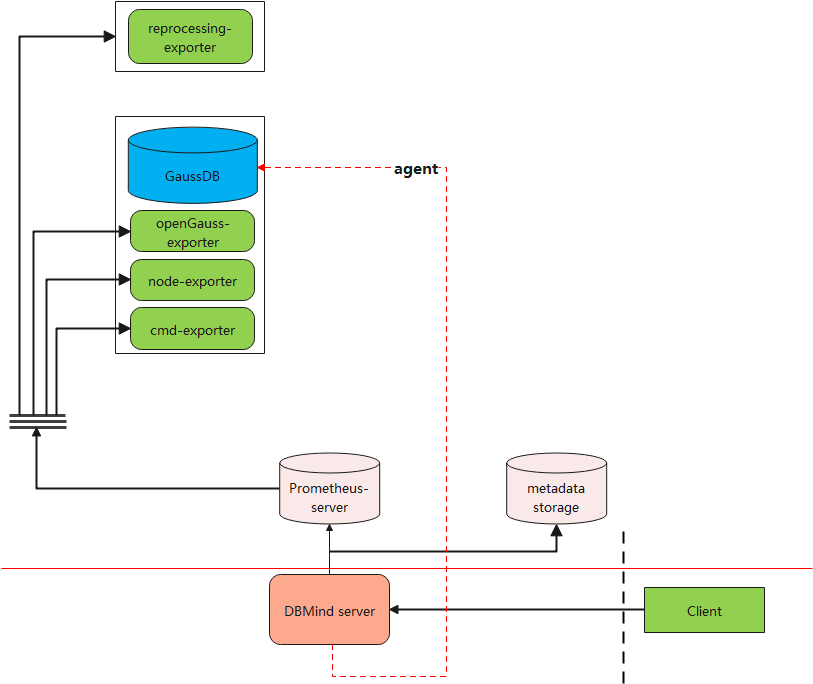

# 架构设计

DBMind的监控平台以开源Prometheus为主，并提供了数据生产者exporter，可与Prometheus平台完成对接。DBMind服务架构如[图1 DBMind服务架构](#fig3224154930)所示：

**图 1**  DBMind服务架构  

图中各关键组件说明：

-   DBMind Service：DBMind后台服务，可用于定期离线计算，包括慢SQL根因分析、时序预测等；
-   Prometheus-server：存储Prometheus监控指标的服务器；
-   metadatabase：DBMind在离线计算结束后，将计算结果存储在此处，支持openGauss数据库；
-   client：用户读取DBMind离线计算结果的客户端，目前该客户端支持命令行及Web API操作；
-   opengauss-exporter：用户从openGauss数据库节点上采集监控指标，供DBMind服务进行计算，并作为Agent，在纳管的实例中执行SQL；
-   node-exporter：Prometheus官方提供的exporter，可用于监控对应节点的系统指标，如CPU和内存使用情况；
-   reprocessing-exporter：用于对Prometheus采集到的指标进行二次加工处理，例如计算CPU使用率等。
-   cmd-exporter：用于采集命令行和日志指标。

