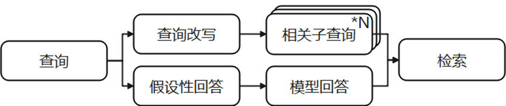

# 查询优化模块

用户在输入查询时，可能由于口语化、表述不清晰等原因导致无法检索到相关知识片段，因此需要引入查询优化模块对用户查询进行改写。GaussMaster中引入了查询改写与假设性回答两种方案分别对查询进行改造，生成合适的查询内容进行检索，扩展检索的知识片段，提升检索模块的召回率。查询优化的主要流程如下图[图1](#fig7240516184920)所示：

**图 1**  查询优化流程图  

其中，各部分说明如下：

1.  查询改写：对于原始查询，首先构建查询改写提示，传递给大模型生成多个相关子查询；
2.  假设性回答：对于原始查询，构建假设性回答提示，由大模型基于认知给出回答；
3.  检索：将查询改写与假设性回答结果分别进行检索获取相关上下文，并进行重排序，选择出其中相关性最高的结果作为上下文用于后续回答生成。

