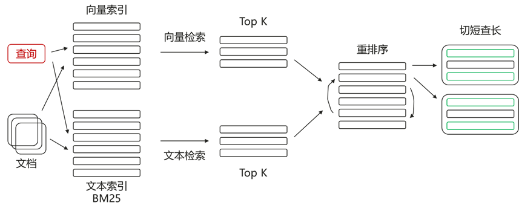

# 检索模块

检索模块的主要功能是根据用户查询，从知识库中检索出最相关的知识片段。当前业界主要采用向量检索方案，通过计算查询向量和知识片段向量间的相似度，选出最相关的前K个文档作为上下文信息。然而，向量间的相似度不一定能够反映真实的语义相似度，仅靠向量化难以保证检索召回率。因此GaussMaster提出了融合检索+重排序的方案，在向量检索的基础上引入了文本检索，并对所有检索结果进行重新排序，获取最终检索结果。文本检索的引入解决了向量检索在搜索人名/短语等方面的缺陷，通过关键词匹配的方式检索到对应结果，多路检索之后，通过重排序模型来判断查询与文档的相似度，将最相关的信息排在最前面，提升了检索模块的召回率。检索模块整体流程如下图[图1](#fig060842511242)所示：

**图 1**  检索模块整体流程图  

其中，各部分说明如下：

1.  索引构建：对于切分好的知识片段，分别进行向量化和文本分词，然后构建向量与文本索引；
2.  向量检索：对于用户查询，进行向量化后进行相似度匹配，获取相似度最高的知识片段作为向量检索topK；
3.  文本检索：对于用户查询，使用BM25算法进行文本相似度匹配，获取相似度最高的知识片段作为文本检索topK；
4.  重排序：对于多路检索的topK，与用户查询构建QA对，传递给重排序模型，计算查询与知识片段的相关性，并使用阈值过滤掉其中相关性较低的结果，重新排序出最相关的topK结果；
5.  切短查长：对重排序之后的知识片段，分别获取相邻知识片段进行整合，丰富上下文信息，提高大模型生成回答的质量。

