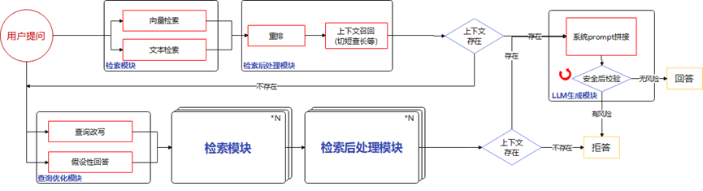

# 端到端问答流程

基于上述三个模块，GaussMaster提供了端到端的问答流程，其流程如下图[图1](#fig1172673785210)所示：

**图 1**  端到端问答流程图  

其中：

1.  当用户进行提问，对应查询首先经过检索模块进行向量检索与文本检索，从向量知识库中获取相关信息；
2.  通过检索处理模块，将检索结果进行重排序，并经过切短查长等方式获取上下文；
3.  判断上下文是否存在；
    1.  当检索的上下文存在时，则对查询与上下文进行prompt拼接，随后传递给大模型LLM，经过安全校验判断无风险则进行回答；如果存在风险信息，则拒答；
    2.  当检索的上下文不存在时，对用户提问进行查询优化，分别通过查询改写与假设性回答方法生成多个子查询，随后经过检索与检索后处理模块，获取相关上下文，如果相关上下文不存在，则进行拒答；如果相关上下文存在则进行prompt拼接，由LLM进行安全校验，有风险则进行拒答，无风险则给出生成的回答结果。

此外，由于大模型生成具有一定的随机性，回答的效果与完整性可能存在差异，因此GaussMaster提供反馈途径，用户可以通过对回答正确且完善的答案进行点赞，对回答不友好的答案进行举报等操作，将相应的反馈信息传递到GaussMaster侧，帮助GaussMaster后续进行迭代改进，提高问答的准确性以及完整性。

