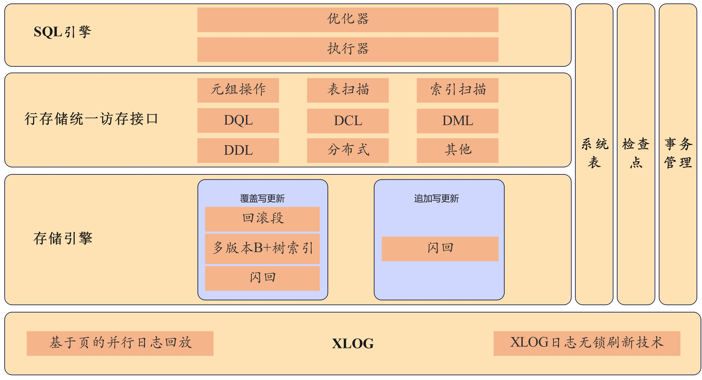
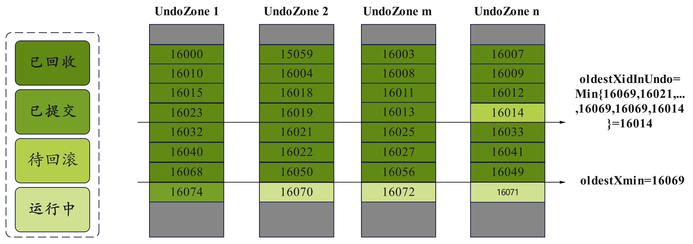
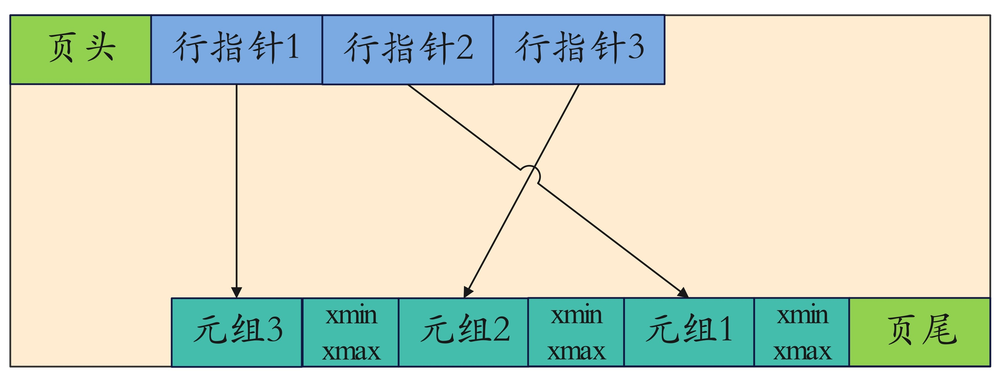

# In-place Update 存储引擎

## 可获得性

本特性自openGauss 2.1.0 版本开始引入。

## 特性简介

In-place Update 是 openGauss 内核新增的一种存储模式，中文意思为原地更新。此前的版本使用的行存储引擎是 Append Update（追加更新）模式。追加更新对于业务中的 INSERT、DELETE以及 HOT Update（页面内更新）有很好的表现，但对于跨数据页面的非HOT UPDATE场景，垃圾回收不够高效，Xstore 存储引擎可很好解决上述问题。

## 核心优势简介
-   **高性能**：对插入、更新、删除等不同负载的业务，性能以及资源的使用表现相对均衡。更新操作采用原地更新模式在频繁更新类的业务场景下可拥有更优秀的性能表现。
-   **高效存储**：采用原位更新的方式极大节约了空间，将回滚段、数据页面分离存储，具备更高效、平稳的IO使用能力。
-   **细粒度资源控制**：Xstore 引擎提供多维度的事务“监管”方式，防止异常、非预期内的行为出现，方便数据库管理员对数据库系统资源使用进行规范和约束。

## Xstore简介

Xstore 是 openGauss 内核新增的一种存储模式，其最大程度结合各种设计的优势，在多版本上的架构设计如表 1 所示：

**表 1** Xstore在多版本管理上的架构设计

<table><thead align="left"><tr id="zh-cn_topic_0243295239_zh-cn_topic_0240782908_row88806271453"><th class="cellrowborder" valign="top" width="7.830783078307831%" id="mcps1.2.8.1.1">
维度

</th>
<th class="cellrowborder" valign="top" width="11.561156115611562%" id="mcps1.2.8.1.2">
架构设计

</th>
</tr>
</thead>
<tbody><tr id="zh-cn_topic_0243295239_zh-cn_topic_0240782908_row18811277456"><td class="cellrowborder" valign="top" width="7.830783078307831%" headers="mcps1.2.8.1.1 ">
版本存储方式

</td>
<td class="cellrowborder" valign="top" width="11.561156115611562%" headers="mcps1.2.8.1.2 ">
分离存储

</td>
</tr>
<tr id="zh-cn_topic_0243295239_zh-cn_topic_0240782908_row18811277457"><td class="cellrowborder" valign="top" width="7.830783078307831%" headers="mcps1.2.8.1.1 ">
版本链组织方式

</td>
<td class="cellrowborder" valign="top" width="11.561156115611562%" headers="mcps1.2.8.1.2 ">
Newest to old

</td>
</tr>
<tr id="zh-cn_topic_0243295239_zh-cn_topic_0240782908_row18811277458"><td class="cellrowborder" valign="top" width="7.830783078307831%" headers="mcps1.2.8.1.1 ">
老版本管理方式

</td>
<td class="cellrowborder" valign="top" width="11.561156115611562%" headers="mcps1.2.8.1.2 ">
PbRCR(Page Based RCR)

</td>
</tr>
</tbody>
</table>

相较于 Astore ，虽然同样是采取分离存储的版本存储策略，但 Xstore 的版本存储更加灵活。由于取消了 Undo 日志，转而采用增量日志存储的方式，将每次更新操作的增量数据存储到独立的日志文件中。历史版本不再直接保存在主数据结构中，而是通过增量日志进行维护，使得数据更新更加高效，减少了数据迁移的开销。同时，由于对日志结构的优化， Xstore 可以在一定程度上减少磁盘 I/O 操作，提升存储效率。

**图 1**  Xstore框架图    
 

-   Xstore 的设计重点是提升写入性能，尤其是在高并发和高更新负载的场景下。由于去除了 Undo 日志，减少了回滚和版本管理的复杂性， Xstore 在事务的提交、回滚、以及历史版本管理上都表现出更高的效率。同时，增量日志结构的引入，使得数据更新更加精细化，进一步提升了写性能。
-   Xstore 通过增量日志和 WAL 日志的组合，实现了更加高效的数据恢复。增量日志直接记录数据变更，使得恢复过程可以更快速地定位和恢复数据一致性。

## Xstore主要功能模块
Xstore 和 Astore 共用事务管理，并发控制、缓冲区管理、检查点、故障恢复管理与介质管理器。Xstore 的主要功能模块如表 2 所示：

**表 2** Xstore在多版本管理上的架构设计

<table><thead align="left"><tr id="zh-cn_topic_0243295239_zh-cn_topic_0240782908_row88806271553"><th class="cellrowborder" valign="top" width="7.830783078307831%" id="mcps1.2.8.1.1">
模块

</th>
<th class="cellrowborder" valign="top" width="11.561156115611562%" id="mcps1.2.8.1.2">
说明

</th>
</tr>
</thead>
<tbody><tr id="zh-cn_topic_0243295239_zh-cn_topic_0240782908_row18811277556"><td class="cellrowborder" valign="top" width="7.830783078307831%" headers="mcps1.2.8.1.1 ">
Xstore 表存取管理

</td>
<td class="cellrowborder" valign="top" width="11.561156115611562%" headers="mcps1.2.8.1.2 ">
向上对接 SQL 引擎，提供对 Xstore 表的行级查询，插入、删除、修改等操作接口，向下根据 Xstore 表页间、页内结构，以及 Xstore 表元组结构，完成对 Xstore 表文件的遍历和增、删、改、查操作。

</td>
</tr>
<tr id="zh-cn_topic_0243295239_zh-cn_topic_0240782908_row18811277557"><td class="cellrowborder" valign="top" width="7.830783078307831%" headers="mcps1.2.8.1.1 ">
Xstore索引存取管理

</td>
<td class="cellrowborder" valign="top" width="11.561156115611562%" headers="mcps1.2.8.1.2 ">
向上对接 SQL 引擎，提供对索引表的行级查询，插入、删除等操作接口，向下根据根据索引表间页、页内结构，以及索引表元组结构，完成对指定索引键的查找和增、删操作。

</td>
</tr>
<tr id="zh-cn_topic_0243295239_zh-cn_topic_0240782908_row18811277558"><td class="cellrowborder" valign="top" width="7.830783078307831%" headers="mcps1.2.8.1.1 ">
Xstore 表页面结构

</td>
<td class="cellrowborder" valign="top" width="11.561156115611562%" headers="mcps1.2.8.1.2 ">
包括 Xstore 表元组在页面内的具体组织形式，在页面内插入元组操作、页面整理操作、页面初始化操作等。

</td>
</tr>
<tr id="zh-cn_topic_0243295239_zh-cn_topic_0240782908_row18811277559"><td class="cellrowborder" valign="top" width="7.830783078307831%" headers="mcps1.2.8.1.1 ">
Xstore 表元组结构

</td>
<td class="cellrowborder" valign="top" width="11.561156115611562%" headers="mcps1.2.8.1.2 ">
包括 Xstore 表元组的填充、解构、修改、字段查询、变形等操作。

</td>
</tr>
<tr id="zh-cn_topic_0243295239_zh-cn_topic_0240782908_row18811277560"><td class="cellrowborder" valign="top" width="7.830783078307831%" headers="mcps1.2.8.1.1 ">
Undo 记录结构

</td>
<td class="cellrowborder" valign="top" width="11.561156115611562%" headers="mcps1.2.8.1.2 ">
包括 Undo 记录的结构、填充、编码、解码等操作。

</td>
</tr>
<tr id="zh-cn_topic_0243295239_zh-cn_topic_0240782908_row18811277561"><td class="cellrowborder" valign="top" width="7.830783078307831%" headers="mcps1.2.8.1.1 ">
多版本索引

</td>
<td class="cellrowborder" valign="top" width="11.561156115611562%" headers="mcps1.2.8.1.2 ">
包括 Xstore 专用多版本索引 UBtree的页面结构、查询、修改、可见性检查、垃圾回收等模块。

</td>
</tr>
</tbody>
</table>

## Xstore页面结构

Xstore 的页面结构和 Astore 的页面结构相同，在 openGauss 中也使用默认的 8KB 页面，其页面结构如下图 2 所示：

**图 2**  Xstore页面结构   

  
    

## Xstore的多版本管理

Xstore 多版本管理方式基于 MVCC 技术，确保在高并发的环境下的数据一致性和事务的隔离性。 Xstore 的多版本管理主要涉及以下几个方面的内容：
-   回滚段（Undo log）
	-   每当一个事务修改数据时，Xstore会将旧版本的数据放在回滚段的 Undo 目录中。回滚段用于在事务回滚时恢复数据，同时也支持多版本读取。当一个事务需要访问历史版本时，可以通过回滚段找到之前的旧数据。
-   MVCC
	-   Xstore 通过 MVCC 实现了高效的并发控制，允许多个事务同时执行读操作且不会相互阻塞，写操作需要额外增加同步机制，整体上 Xstore 的并发控制机制减少了事务间的冲突，提高了系统的吞吐量。
-   空间管理和回收
	-   Xstore 实现了自治式的空间管理机制，不依赖中量级的 VACUUM 和 AUTOVACUUM 清理机制。
    -   随着时间的推移，Xstore会通过垃圾回收机制来清理不再需要的旧版本和回滚记录，以释放存储空间和优化性能。
-   版本链
	-   Xstore 通过维护数据记录的版本链来管理多个版本的数据。每对一条记录进行更新时都会创建一个新版本，并将其连接到现有版本链的末尾。其中旧版本不会立即删除，而是保留在链上，以供正在进行的事务读取。
-   CSN ( Commit Sequence Number )
	-   CSN 是一个递增的序列号，用于标识事务的提交顺序。在 Xstore 中，CSN 与版本链配合使用，确保数据版本的可见性和一致性。一个事务只能看到它开始之前已经提交的事务所生成的数据版本。

### PBRCR ( Page Base Row Consistency Read ) Xstore 旧版本管理

Xstore的老版本管理的核心是通过 **回滚段 ( Undo Segment )** 来记录数据的历史版本的，以确保事务回滚、快照隔离级别读取等功能的实现。

**图 3**  版本管理   

  
    

-   旧版本数据会集中存放在回滚段的 Undo 目录中，为了减少读写冲突，旧版本的数据（回滚段记录）采用追加写的方式写入数据目录的 Undo 目录下。这样旧版本数据数据的读取和写入不会发生冲突，同一个事物的旧版本数据也会连续存放，便于进行回滚操作。
-   为了减少并发写入时的竞争，Undo 目录空间被划分为多个逻辑区域（ UndoZone ，回滚段逻辑区域）。线程会在自己的逻辑区域上进行分配，与其他线程完全隔离，从而写入旧数据分配空间时就不会有额外的锁开销。 UndoZone 还可以按照 CPU 的 NUMA 核进行划分，每个线程会从当前 NUMA 核上的 UndoZone 进行分配，进一步提升分配效率。
-   在分配 Undo空间时会按照事务粒度进行记录，旧版本的数据一旦确认没有事务进行访问，就会进行回收。

Undo 空间需要回收回滚记录来保证 Undo 空间不会无限膨胀，一旦事务 ID 小于当前快照中最小的 Xmin ( oldestXmin ) ，回滚记录中的旧版本数据就不会被访问，此时就可以对回滚记录进行回收。

如前述描述 Undo 空间中的回滚记录按照事务 ID 递增的顺序存放在 UndoZone 中，回收的条件如下：
1. 事务已经提交并且小于 oldestXmin 的 Undo 空间可以回收。
2. 事务发生回滚但已经完成回滚的 Undo 空间可以回收。

Undo 空间的回收过程如图 4 所示：

**图 4**  Undo 回收过程   

如上图所示，UndoZone1 中回收到小于 oldestXmin 的已提交事务 16068，UndoZone2 中回收到16050，UndoZone m 回收到 16056，UndoZone n 回收到事务 16012，而事务 16014 待回滚但未发生回滚，因此 UndoZone n 回收事务 ID 上限只到16014.其他 zone 的上限是 oldestXmin，oldestXidInUndo 会取所有 Undozone 上的上限最小值，因此 oldestXidInUndo 等于 16014。

### MVCC

MVCC（多版本并发控制，Multi-Version Concurrency Control）是一种并发控制方法，用于解决数据库中多个事务同时执行时可能产生的数据一致性问题。MVCC 在数据库中通过维护多个数据版本（记录历史版本）来提供高效的并发和数据一致性。

Xstore 的可见性检查和 Astore 类似，将快照的 CSN 和元组删除及插入事务的 CSN 进行比较，判断元组是否可见。Xstore 和 Astore 使用同一套事务管理机制和快照管理机制。
Xstore 和 Astore 最大的区别在于， Astore 会在页面上保留旧版本数据，而 Xstore 将旧版本的数据放到回滚段统一存放。在需要获取旧版本数据时， Astore 可以直接从 tuple 的头部读取到元组插入和删除的事务号，判断元组的可见性。但是 Xstore 需要从回滚段里读取到旧版本的事务信息，判断旧版本是否可见。

Xstore 在获取元组时，会先检查对应的事务目录。事务目录分成有效和无效两种。当事务目录是有效的，Xstore 直接就会得到元组上最新的事务。
如果事务目录被冻结 (FROZEN) ，意味着元组已经在所有的事务中都会可见。如果事务目录中的事务 id 小于 oldestXidInUndo ，意味着元组已经足够旧在所有事务中都可见。同时会把事务目录置成冻结，来加速后续的查询。

如果元组被标记有一个无效事务目录，意味着修改元组的事务已经提交，并且比当前的事务目录中的事务旧。此时 Xstore 会使用事务目录中的事务进行可见性判断。如果可见，意味着修改元组的事务更已经可见，就不需要从Undo目录中再读取事务信息。
下图为一元组查询过程的例子：

**图 5**  元组查询过程   

### 多版本索引

openGauss实现了多版本索引 UBtree ，是专用于 Xstore 的 Btree 索引的变种，相比于原有的 Btree 索引有以下差异。
1. 支持索引数据的多版本管理以及可见性检查，能够自主鉴别旧版本元组并进行回收，同时索引层的可见性检查使得索引扫描 ( Index Scan ) 及仅索引扫描 ( Index Only Scan ) 性能有所提升。
2. 在索引插入操作之外，增加了索引删除操作，用于对被删除或修改的元组对应的索引元组进行标记。
3. 索引按照 key + TID 的顺序排序，索引列相同的元组按照对应元组的 TID 作为第二关键字进行排序。会将 xmin、xmax 追加到 key 的后面。
4. 添加新的可选页面分裂策略 " insertpt " 。
5. 不依赖Vacuum进行旧版本清理。独立的空间回收能力，索引与堆表解耦，可独立清理，IO平稳度更优。

**图 6**  UBtree结构  

#### 索引页面组织

多版本索引层次结构与 Btree 索引基本相同，非叶子节点与 Btree 索引保持一致，仅页尾的Special字段有所不同，下图为UBtree叶子页面结构：

**图 7**  UBtree叶子页面结构  

与Astore堆页面中维护版本信息的方法类似，UBtree 的叶子节点中每个索引元组尾部都附加了对应的 xmin 和 xmax。索引只是用于加速搜索的结构，本身不与历史版本的概念强相关，仅通过xmin 来标识这个索引元组是从什么时候开始有效的，又是从什么时候被删除的，而不是像astore中堆元组一样会有指向旧版本元组的指针。

新插入的索引元组尾部用于存放 xmin 和 xmax 空间，在索引插入函数执行的过程中预留出来。预留的空间及 xmin 在索引元组插入时通过索引元组页面插入函数写入页面，而 xmax 在索引元组删除时通过索引元组页面删除函数写出页面。

在使用索引页面清理函数中，索引元组通过其 xmin 和 xmax 信息来判断该元组是否已经无效，进行进行独立的页面清理。该函数会尝试清除所有无效的元组，并进行相应的碎片整理。
索引扫描时会调用相应函数定位到第一个满足扫描条件的索引元组，然后获取当前页面中符合索引扫描条件且能通过可见性检查的元组。通过 xmin，xmax 和当前的快照进行可见性判断。

#### 索引操作
对于原有的 Btree 索引而言，主要有四类操作，索引创建、索引扫描、索引插入及索引删除。
-   **Create操作**：创建索引时需要依靠扫描函数扫描对应的 Xstore 表，并取出每个元组的最新版本及其对应的 xmin 和 xmax。若某个元组存在被原定更新的旧版本，会复用 Astore 原有的逻辑，禁止隔离级别为可重复读的老事务访问。创建过程中会接受扫描后传来的元组，并将其按照索引列和 TID 进行排序后依次插入到索引页面中，并构建相应的原页面及上层页面。整个创建流程需要将所有的页面都记录到 XLOG 中，并强制将存储管理中的内容刷到永久存储介质后才算成功结束。
-   **Scan操作**：用户在读取数据时，可通过使用索引扫描加速，索引扫描与 Btree 索引基本一致，UBtree 支持索引数据的多版本管理及可见性检查同时索引层的可见性检查使得索引扫描 ( Index Scan ) 及仅索引扫描 ( IndexOnly Scan )性能有所提升。对于索引扫描:
    1. 若索引列包含所有扫描列 ( IndexOnly Scan )，则通过扫描条件在索引上进行二分查找，找到符合条件元组即可返回数据；
    2. 若索引列不包含所有扫描列 ( Index Scan )，则通过扫描条件在索引上进行二分查找，找到符合条件元组的 TID，再通过 TID 到数据表上查找对应的数据元组。如图 8 所示：

**图 8**  Scan操作

  
    

-   **Insert操作**：UBtree的插入逻辑基本不变，只需增加索引插入时直接获取事务信息填写xmin字段。
-   **Delete操作**：UBtree额外增加了索引删除流程，索引删除主要步骤与插入相似，获取事务信息填写 xmax 字段 ( btree索引不维护版本信息，不需要删除操作 ),同时更新页面上的 active_tuple_count，若 active_tuple_count 被减为0，则尝试页面回收。
-   **Update操作**：对于 Xstore 而言，数据更新对 UBtree 索引列的操作也与 Astore 有所不同，数据更新包含两种情况：索引列和非索引列更新，下图为 UBtree 在数据发生更新时的处理流程：

**图 9**  update 操作  

在非索引列更新的情况下，索引不发生任何变化，index tuple 仍指向第一次插入的 data tuple，Uheap 不会插入新的 data tuple，而是修改当下 data tuple 并将历史数据存入Undo中。

在索引列更新的情况下，UBtree 也会插入新的 index tuple，但是会指向同一个 data linepointer 和同一个 data tuple，扫描旧版本的数据则需要从 Undo 中读取。

### 空间管理与回收

不同于 Astore 的空间管理和回收机制，Xstore 实现了自治式的空间管理机制。Xstore 里堆以及索引的空间分配和回收都在业务运行的过程中平稳地进行，不依赖中量级的 VACUUM 及 AUTOVACUUM 清理机制。

#### 自治式堆页面空间管理

Xstore 中堆页面的自治式空间管理，建立在与 Astore 类似的轻量级堆页面清理机制的基础上。在执行 DML 及 DQL 操作的过程中，Xstore 都会进行堆数据页面清理，以取代 VACUUM 清理机制。

对于 Astore 而言，复用数据元组的行指针前必须保证对应的索引元组已经被清理。这是为了防止通过索引元组访问已经被复用的行指针，导致取到错误的数据。在 Astore 中需要通过 VACUUM 操作将这样的无效索引元组统一清除掉后才能复用行指针，这使得堆页面和索引页面的清理逻辑耦合在一起，也会导致间断性的大量 I/O。在 Xstore 中能高效地单独进行数据和索引页面的清理，因为带有版本信息的 UBtree 能够独立检测并过滤掉无效的索引元组，不会通过无效索引元组访问对应的数据表。

#### 自治式索引页面空间管理
索引页面的空间管理不依靠 FSM 数据结构，而是依靠特有的 URQ ( UBtree Recycle Queue ) 结构，简称为回收队列。

索引中的回收队列分为两部分，一部分是潜在空页队列 ( Potential Empty Page Queue ) ，一部分是可用页面队列 ( Available Page Queue ) 。两个队列都是跨页面的循环队列，其中每个元素都会储存 blkno 以及 XID。其中 blkno 表示该元素对应索引页面的 block number；XID 表示该页面在哪个时刻能够被回收或复用。这些元素在循环队列单个页内按照 XID 的顺序进行排序，以便于快速找到 XID 小（最可能被回收或复用）的页面。其结构如图所示。

对于潜在空页队列而言，里面存放页内元组已经被全部删除但还没有全部无效的页面，其中的 XID 就标志页面中最后一个元组无效的可能时机。对于可用页面队列而言，里面存放已经被删除，可以或即将可以被复用的页面。其中 XID 就表示该页面可以被复用的时机。

在业务运行的过程中，索引会通过回收函数不断尝试对潜在空页队列中的页面进行回收。在索引申请新的页面时，会与可用页面队列交互，查找当前可用的空闲页面。当可用页面队列中没有可用页面时，一般会通过扩展索引物理文件的方式来获得新的页面。但也存在物理文件批量扩展，或扩展后还未来得及使用就出错退出的情况。此时在回收队列的元信息页面中保存了已正确追踪的页面数量，若该数量少于整个索引表的页面数量，会尝试去使用这一部分未追踪的页面，并更新已追踪的页面数量。

#### 中量级和重量级手动页面清理

与 Astore 相同，Xstore 也提供 VACUUM 语句来让用户主动执行对某个Xstore表及其上的索引进行中量级清理。其对外表现与 Astore 一致。重量级的 VACUUM FULL 也与 Astore 一致，会清理无效数据并对数据空间和索引空间重新进行组织。

## Xstore事务模型
### 事务与CSN

Xstore 支持事务以保证操作的 ACID 特性。 Xstore 事务具有以下特性：
-   事务隐式启动，第一次对数据的修改自动启动事务，没有显示的 start transaction 语句。
-   事务启动时，分配事务的唯一标识 XID。
-   默认非自动提交，语句结束不提交事务，可以通过设置会话参数 auto commit 改为自动提交。
-   事务结束时，产生代表事务唯一属性的 CSN。

CSN ( Commit Sequence Number ) 是一个具有时间属性的64位的整数。
-   数据库发生变更时会改变当前系统的全局 CSN 号。
-   可见性判断的主要标识。CSN 可以标记事务的以下状态：事务运行中、事务提交、事务同步回滚、事务正在提交、本事务为子事务、事务已冻结。

### 事务表管理

Xstore 的事务表中存储了事务与回滚段相关的所有信息，事务按照数据页面的方式，统一受缓冲区管理。事务页面存储于 Undo 表空间的特定区域，受 Undo 表空间管理。

### 事务类型

**普通事务**
-   事务是数据库管理系统中的基本工作单元，它是一系列操作，确保数据的完整性和一致性。事务具有四个特性，分别是原子性、一致性、隔离性和持久性。
-   查询不消耗事务，可见性判断基于 CSN。

**2PC事务**

2PC ( Two-Phase Commit ) 是一种简单的分布式事务协议，确保分布式系统中所有参与者在执行事务时的一致性。
-   优点：实现简单，适用于分布式数据库事务管理；
-   缺点：存在单点故障问题。如果协调者崩溃，参与者会被阻塞；如果网络分区发生，可能导致一致性问题。

使用场景：适用于需要事务一致性的分布式数据库、消息队列等系统。
Xstore 支持标准的 2PC 事务。

### 隔离级别
-   语句在执行开始时，获取当前系统的 CSN 作为当前语句的查询 CSN。
-   整个语句的可见结果由语句开始那一刻决定，不受后续其他事务修改影响。
-   Xstore 中 read committed 默认是保持一致性读的。
