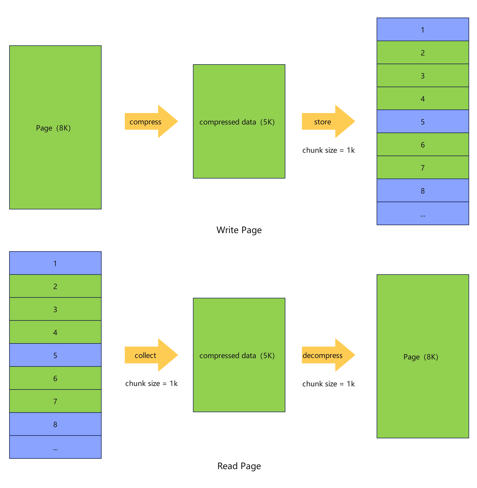
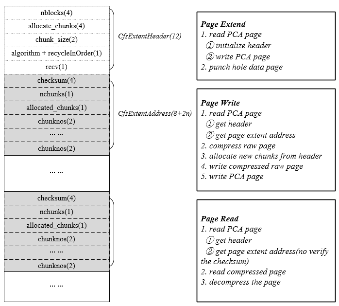

# 支持OLTP场景数据压缩

## 可获得性

本特性自openGauss 3.0.0版本开始引入。

在openGauss 3.1.0版本中将pca文件和pcd文件整合为一个文件；pca独立进行加载淘汰管理，不再依赖mmap操作；新增chunk碎片整理操作。

在openGauss 5.1.0版本支持修改行存表的压缩相关参数。


## 特性简介

OLTP场景下，对行存表(包括Ustore和Astore)的数据和索引页面，openGauss提供基于通用压缩算法的透明页压缩功能，降低磁盘空间占用的同时保持OLTP场景下的高性能。


## 客户价值

数据压缩，降低存储空间占用，同时维持较高OLTP性能。


## 特性描述

openGauss OLTP场景数据压缩，采用透明页压缩的方式实现，在单个页面的写磁盘流程中，首先调用压缩算法进行压缩，压缩后的数据以chunk为单位组织，而后落盘。chunk的大小可以在表定义中配置，与页面大小相关，可选配置为1/2、1/4、1/8或1/16个页面大小。读磁盘逻辑与之相反，首先读取属于同一页面的所有chunk，拼接成压缩后数据，解压后再加载到缓存中。上述改动在文件接口层实现，对于上层接口来讲，这些改动是透明的。

以一个页面为8K，chunk大小为1k，且压缩后大小为5K的页面为例，读写过程中，其原始数据和压缩存储的数据对应关系如图：



压缩后的数据存于一定数量的chunk中，而这些chunk的数量和位置信息也需要存储，这两部分内容分别存储于pcd（页面压缩数据）和pca（页面压缩地址）两个区域内，pcd存储以chunk为单位的压缩后数据，pca存储每个页面对应的chunk数量和地址等信息。如下图所示：


一个pca页面管理128个pcd页面大小的空间，对应128个未压缩的数据页面，称为压缩中的一个extent。由于压缩后数据小于等于原始页面大小（若压缩后变大则不进行压缩），因此一个extent的末尾通常会有空闲空间未被占用，这部分空间我们采用文件系统punch hole的方式分配，不占用实际的磁盘空间，从而实现磁盘空间的压缩。

openGauss压缩采用通用压缩算法，可选算法有：ZSTD和PGLZ。这些通用压缩算法的解压性能通常较压缩算法要好很多，因此压缩特性对读取页面性能影响较小。而对于页面落盘操作，通常由后台线程异步执行，因此对用户sql性能影响也较小。


## 特性约束

- 仅支持堆组织形式数据表的压缩，即普通行存表、Btree/UBtree索引压缩。
- 操作系统必须支持punch hole操作。
- 数据备份介质必须支持punch hole操作。
- 支持修改行存表的压缩相关参数，修改压缩相关参数会对行存表做重建。不支持修改索引的压缩相关参数。
- 压缩和解压缩的操作会对CPU、性能有一定的影响，优点是增大磁盘的存储能力，提高磁盘利用率，同时节省磁盘IO，减少磁盘IO压力。
- 3.1.0 版本起，功能转为非商用特性，创建或修改行存压缩数据库对象时，需开启GUC参数`support_extended_features`。
- 不支持段页式。

## 依赖关系

- 要求数据库支持双写操作。
- 压缩时使用开源压缩算法PGLZ、ZSTD。

## 基本原理

#### 压缩页面读写

一个压缩数据extent，由一个pca页面管理，其详细结构如下图：



一个pca页面由头部的`CfsExtentHeader`和多个`CfsExtentAddress`组成。`CfsExtentHeader`中，`nblocks`为extent中逻辑页面个数，`allocate_chunks`表示当前pcd中已分配的chunk数，同时也表示已申请的最后一个chunk的编号，`chunk_size`为单个chunk的大小，`chunk_size`后的一字节存储了压缩算法以及碎片空间整理信息，最后一个字节`recv`为预留。

`CfsExtentAddress`与每个逻辑数据页面一一对应，前4字节为`chunksum`，`nchunks`和`allocated_chunks`各占1字节，分别代表压缩后数据当前占用chunk个数，以及该逻辑页面实际分配的chunk个数，后面为`chunknos`列表，每个占2字节，总共为1个逻辑页面最大可能的chunk数量，其中前`allocated_chunks`有效。例如，页面大小为8k，chunk_size为1k则此处`chunknos`为8个，如果压缩后数据占5k且只分配了5个chunk，则后3个`chunknos`无效。

前文介绍过内存逻辑页面和磁盘压缩数据存储的转化，而上图结合pca展示了压缩数据的页面读写流程。

页面写入：

- 根据逻辑页号计算其所在extent和extent内序号，读取extent内pca页面，获取`CfsExtentHeader`，以及该逻辑页面的地址信息结构`CfsExtentAddress`；
- 通过通用压缩算法压缩数据，并以chunk_size为单位切分数据；
- 从extent内分配相应数量chunk，更新内存`CfsExtentHeader`和`CfsExtentAddress`；
- 将压缩后数据写入磁盘相应chunk内；
- 将`CfsExtentHeader`和`CfsExtentAddress`改动写入磁盘。

页面读取：

- 根据逻辑页号计算其所在extent和extent内序号，读取extent内pca页面，获取`CfsExtentHeader`，以及该逻辑页面的地址信息结构`CfsExtentAddress`；
- 读取所有chunk，拼接成压缩后数据；
- 调用通用解压算法解压缩。

extent扩展：

- 初始化`CfsExtentHeader`，pca页面落盘；
- 以punch hole方式分配128个页面的pcd空间（不占用实际磁盘空间）。


#### 碎片整理

正常情况下，新页面压缩落盘时，在pcd空间内占用的是连续的chunk，而随着数据的变化，压缩后数据大小也会变化，这就导致需要分配新chunk，或者已分配的chunk实际没有数据填充。前者会导致读盘时额外的IO读取次数，影响性能，后者会导致压缩率的劣化。为解决这些问题，压缩特性提供了碎片整理接口，整理后的页面对应chunk全部连续，按pca中`CfsExtentAddress`顺序依次排列。


## 使用指导

相关参数见[高效数据压缩算法相关参数](../DatabaseReference/高效数据压缩算法相关参数.md)。

#### 使用示例

- 建压缩表

```sql
create table tbl (c_int1 int, c_int2 int) with (compresstype=2,compress_chunk_size=1024,compress_level=1);
```

- 建压缩主键和索引

```sql
-- 创建主键时指定压缩
alter table tbl add constraint tbl_pkey primary key (c_int) WITH (compresstype=2, compress_chunk_size=1024, compress_level=1);
-- 创建索引时指定压缩
create index tbl_idx on tbl (c_int2) WITH (compresstype=2, compress_chunk_size=1024, compress_level=1);
```

- alter表支持压缩

```sql
create table tbl (c_int1 int, c_int2 int);
alter table tbl set (compresstype=2,compress_chunk_size=1024,compress_level=1);
```

- 碎片整理

```sql
shrink table tbl;
```

