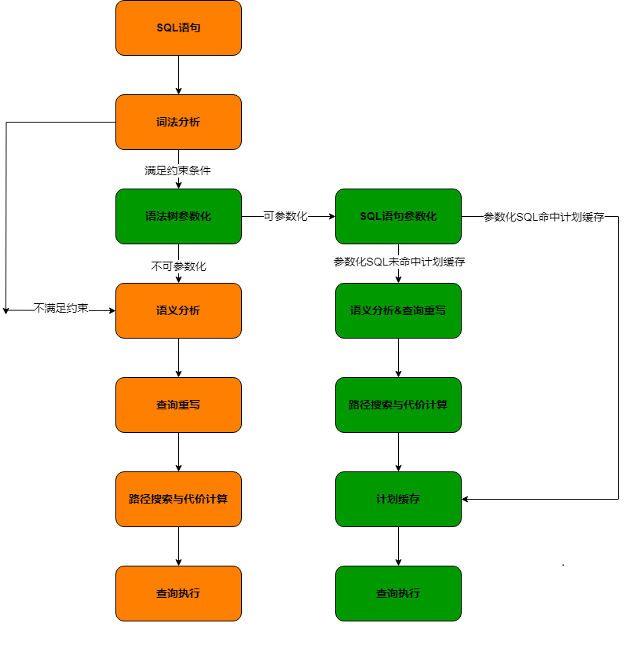

# 自动参数化

## 可获得性<a name="section3480125215592"></a>

本特性自openGauss 7.0.0-RC1版本开始引入。

## 特性简介<a name="section5814522588"></a>

openGauss的自动参数化功能是在需要反复执行相似/相同的SQL简单语句的情境下，通过复用执行计划缓存以减少SQL语句的执行时间。

## 客户价值<a name="section148987345722"></a>

提升大量相似简单SQL重复执行情况下的性能表现。

## 特性描述<a name="section117041846599"></a>

在存在大量相似/重复的简单SQL语句的场景下，对SQL语句进行参数化操作, 将其作为键值，并将相应的执行计划进行缓存，后续可通过相同参数化SQL语句直接寻找对应执行计划缓存，进而减少SQL语句执行时在查询重写，计划生成步骤所消耗的时间。



## 特性增强<a name="section23349265924"></a>

无。

## 特性约束<a name="section51513617598"></a>

- 仅支持IUD(Insert, Update, Delete)三类DML。
- 仅支持Simple Query Protocol， 不支持Extended Query Protocol。
- SQL语句的长度必须小于等于512。
- 不支持RETURNING关键词。
- 不支持WITH CLAUSE。
- 不支持UPSERT CLAUSE。
- 不支持HINT。
- 不支持子查询。
- 不支持ORDER BY关键词。
- 不支持LIMIT关键词。
- 不支持函数。
- 不支持COLLATE关键词。
- 不支持值的类型转换。
- 不支持使用NULL关键词。
- 不支持IGNORE关键词。
- 不支持DEFAULT VALUES与DEFAULT关键词。
- 不支持USING关键词。
- 不支持ON DUPLICATE KEY UPDATE语法。
- 不支持PARTITION关键词。
- 最大可存储缓存计划为512。

## 依赖关系<a name="section20491151513600"></a>

无。

## 使用指导<a name="section20491151514123"></a>

自动参数化功能由会话级别GUC参数控制，开启相关参数后满足条件的SQL语句将会通过自动参数化功能处理。下列参数的设置可参考[此处](../DatabaseReference/其他优化器选项.md#section6842184123547)进行设置。

- **开启自动参数化功能**

```
SET ENABLE_QUERY_PARAMETERIZATION=ON;
```

- **设置最大可缓存的执行计划数量**

```
SET MAX_PARAMETERIZED_QUERY_STORED=512;
```
