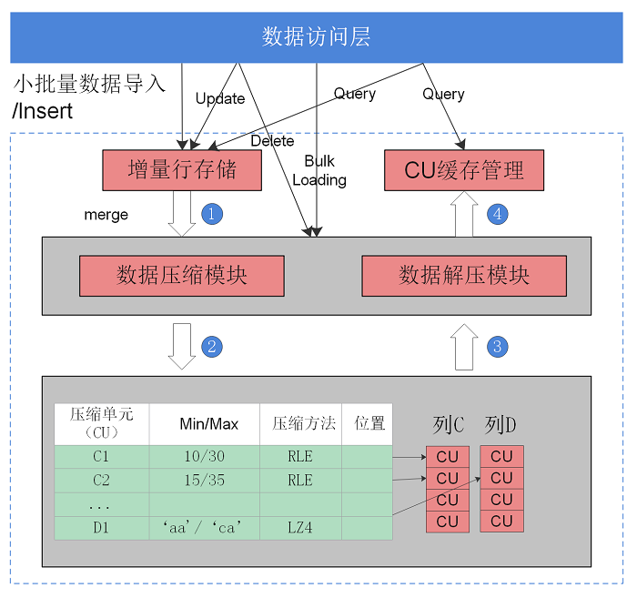

# 行列混合存储

## 可获得性

本特性自openGauss 1.0.0版本开始引入。

## 特性简介

openGauss支持行存储和列存储两种存储模型，用户可以根据具体的使用场景，建表时选择行存储还是列存储表。

一般情况下，如果表的字段比较多（即大宽表），查询中涉及到列不很多的情况下，适合列存储。列存储方式如[图1](#fig114741818102620)所示。如果表的字段个数比较少，查询大部分字段，那么选择行存储比较好。

**图 1**  列存储示意图  

## 客户价值

在大宽表、数据量比较大的场景中，查询经常关注某些列，行存储引擎查询性能比较差。例如，气象局的场景，单表有200\~800个列，查询经常访问10个列，在类似这样的场景下，向量化执行技术和列存储引擎可以极大的提升性能和减少存储空间。

## 特性描述

表有行存表和列存表两种存储模型。两种存储模型各有优劣，建议根据实际情况选择。

-   行存表

    默认创建表的类型。数据按行进行存储，即一行数据紧挨着存储。行存表支持完整的增删改查。适用于对数据需要经常更新的场景。

- 列存表

    数据按列进行存储，即一列所有数据紧挨着存储。单列查询IO小，比行存表占用更少的存储空间。适合数据批量插入、更新较少和以查询为主统计分析类的场景。列存表不适合点查询，insert插入单条记录性能差。

- 行存表和列存表的选择依据如下：

   - 更新频繁程度

     数据如果频繁更新，选择行存表。

   - 插入频繁程度

     频繁的少量插入，选择行存表。一次插入大批量数据，选择列存表。

   - 表的列数

     表的列数很多，选择列存表。

   - 查询的列数

     如果每次查询时，只涉及了表的少数（小于总列数的50%）几个列，选择列存表。

   - 压缩率

     列存表比行存表压缩率高。但高压缩率会消耗更多的CPU资源。

## 特性增强

无。

## 特性约束

无。

## 依赖关系

无。

