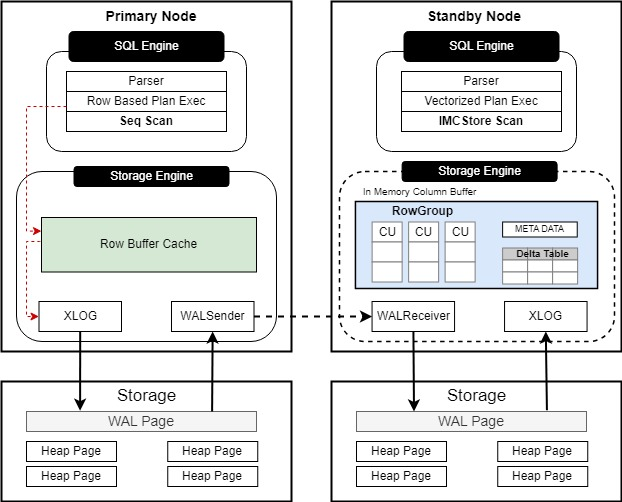

# HTAP 行列融合

## 可获得性<a name="section15406143204715"></a>

本特性自 openGauss 7.0.0-RC1 版本开始引入。

## 特性简介<a name="section740615433477"></a>

HTAP 行列融合特性在单机、主备场景下，通过节点的行列双格式内存模式，实现openGauss HTAP一体化数据库架构。 通过高效的行列转换技术方案，节点读取磁盘行存数据，生成列存储单元（Column Unit）存储至节点的列缓存中；支持节点通过代价估算生成列缓存查询计划，通过列存查询大幅提升复杂OLAP场景下的数据分析效率，使数据库同时具备较强的TP和AP能力。在主备场景下，列缓存数据均存储在备节点，通过日志读取回放，同步主节点在OLTP场景下大量的行数据变更，以维持列缓存数据的新鲜度。

**图 1**  主备场景行列转换特性设计方案<a name="fig114741818101675"></a>  



## 客户价值<a name="section13406743164715"></a>

随着企业数字化变更深入，实时的高并发事务处理及复杂的数据整合、分析混合工作负载成为企业数据库的核心诉求。业务系统逐步通过HTAP（Hybrid Transactional/Analytical Processing）数据库的模式升级来响应新的业务场景，即通过同一套数据库内存系统，同时支持高效的事务处理（OLTP）和复杂查询（OLAP）。

openGauss 通过简单的指令设置，有效利用备节点可用内存空间进行行存数据的列缓存转换及存储（In-Memory-Column-Store）。考虑列存的查询优势，在数据量庞大，表结构复杂，而用户仅关注部分列数据的查询的场景下，行列转换后的列缓存可有效提升企业执行大型复杂OLAP数据分析的整体查询效率。

## 特性描述<a name="section16406154310471"></a>

openGauss主备集群场景下，支持备节点形成行列双格式内存形式。针对主节点的行级修改，备节点通过日志同步主节点修改，将对应修改写入增量表中。同时，备节点后台启动的同步线程，将增量表中存储的行存修改同步至列存缓存中。用户在备节点发起的OLAP大型数据分析请求，将先通过逻辑判断是否已有查询表的列缓存数据，并根据代价计算形成基于列缓存的查询计划。

- 行列数据转换：

    用户在主节点发送针对表数据的行列转换请求，将通过网络通道将指令传输至备节点；备节点根据指令信息初始化增量表，并行读取行存数据，形成基础列存储单元（Column Unit），批量插入申请的列存内存中。

- 基于日志的行列数据同步：

    在不影响主节点行存数据修改效率的同时，为了保障备节点列缓存数据的实时性，设计备节点基于日志读取回放行存修改，以增量表及后台同步线程的方式进行列缓存数据的更新。

- 支持列缓存的扫描查询：

    新增In-Memory-CStore-Scan （IMCStore scan）列缓存查询算子，基于openGauss执行优化器及代价估算，生成包含列缓存查询算子的列存执行计划。


## 特性增强<a name="section1340684315478"></a>

无。

## 特性约束<a name="section06531946143616"></a>

HTAP 行列融合的规格约束如下：

-   表：仅支持普通表的行列转换，临时表、系统表、Toast表、Unlogged表、列存表、外表暂不支持，主备场景下不支持段页式表的行列转换。

-   数据类型：参考[列存表支持的数据类型](../SQLReference/列存表支持的数据类型.md)。特别地：
    - 不支持长度未知的数据类型，如：text、hll、cidr等类型。
    - 不支持长度超过 8kb 的可变长度数据库类型，如：char(2500)、varchar(2500)。不建议转换较长长度的数据类型的列。
-   其他
    - 当前仅在单数据库下支持行列转换。
    - 主备场景下，由主节点发起行列转换请求，所有备节点均执行行列转换，主节点不存储列缓存。
    - 主备场景下，主节点引起的数据修改，在备节点通过列缓存查询存在一定延迟。
    - 当前不支持重新行列转换，已经转换的表/分区需要先取消行列转换后，再重新行列转换。
    - 转换分区表时，若指定某个分区行列转换，仅支持指定一级分区，若指定一级分区下存在二级分区，默认自动行列转换。
    - 已行列转换的表，不支持 truncate表、修改列名/列属性、增加/删除列、修改表压缩参数操作。特别地，已经转换的分区表，不支持新增、删除、交换、清空、分割、合并、移动、重命名操作。
    - 对于间隔分区表，自动新增的分区，当前不会自动行列转换。

## 依赖关系<a name="section8406643144716"></a>
无。

## 注意事项<a name="section147831546105511"></a>
- 主备场景下，需要修改主备节点的pg_hba.conf认证方式，以允许行列转换请求传输（这里的值取决于实际的网络配置以及用于连接的用户）：

```
host     all     dbuser     primary_ip/32     trust
host     all     dbuser     standby_ip/32     trust
```