# 资源池化多机并行

## 可获得性

本特性自openGauss 6.0.0-RC1 版本开始引入。

## 特性简介

SPQ（SharedEverything Parallel Query）是在openGauss开源数据库上的一个多机并行查询框架，该框架部署在资源池化场景内，该场景下集群部署的为一写多读架构，集群下存在一个写/读节点和多个读节点，现有openGauss集群只存在同时一个读节点查询的能力，集群的查询性能非常受限。SPQ基于SharedEverything分布式架构，所有节点都共享集群内的资源，优化器首先生成多机执行计划，之后计划通过分发到各节点执行，再由查询节点汇聚各节点数据实现所有读节点并行查询，充分发挥集群的OLAP能力。使资源池化同时具备较强的TP和AP能力。

**图 1**  资源池化多机并行方案  

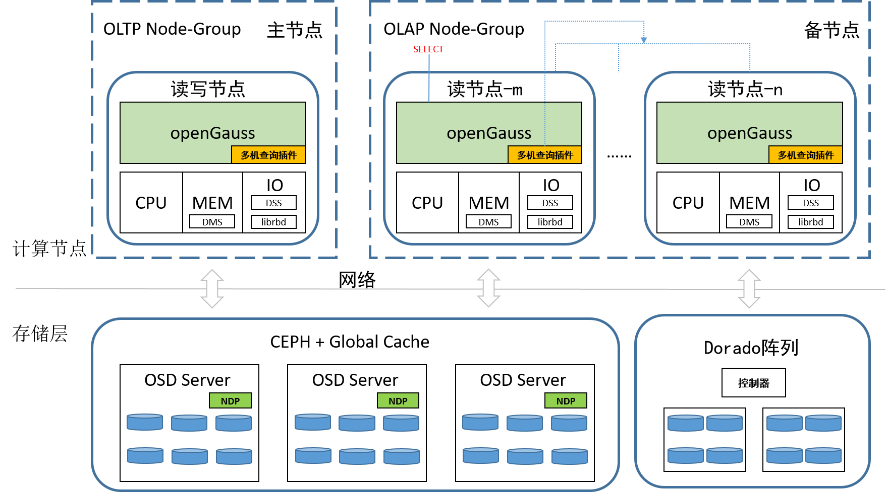

## 客户价值

客户在读节点执行大规模数据查询时实际上使用的是当前查询节点的算力，其余节点算力没有被有效利用起来。多机并行可以充分利用所有计算节点算力从而大幅提升查询效率。

## 特性描述

openGauss资源池化一写多读架构通过构建虚拟Node-Group将OLTP业务和OLAP业务隔离，任一个节点均可以发起查询SQL请求。根据代价和规则决定采用多机查询或者原生单机查询，对上层应用透明，用户无感知。为实现上述需求，SPQ在openGauss原有设计基础上，研发以下几项新特性功能：

- 对接开源ORCA优化器，生成SPQ多机并行执行计划，适配后的组件以动态库模式加载至openGauss内核。
- 新增基础扫描算子、计算算子适配多机计划，实现节点间数据交互与数据分发。
- 新增自适应扫描机制消除数据倾斜问题。
- 支持DML、DDL增强。

### 1. 对接分布式优化器
使用GreenPlum社区研发的开源组件GPORCA优化器，对其适配openGauss生成多机执行计划，适配后的组件以动态库的方式被openGauss多机查询调用。 由于ORCA本身已模块化，输入、输出均接口化，在适配时，我们仅对下图蓝框部分做相应适配逻辑，核心改动包含：

- 针对资源池化存储特性，扩展扫描节点生成方案，调整表数据扫描范围。
- 在共享存储基础上，匹配相应代价模型，生成分布式扫描计划。

**图 2**  openGauss对接ORCA
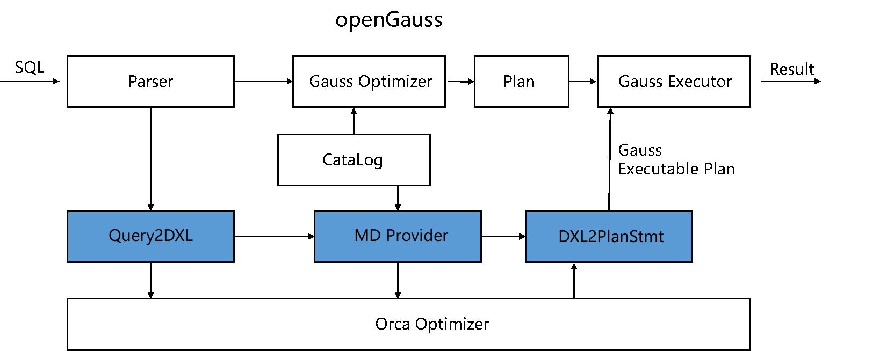
### 2. 多机并行执行框架
1) 节点逻辑适配： 通过适配现有openGauss分布式执行流程，在资源池化集群中引入QC(Query Coordinator) 与 QE(Query Executor) 的逻辑概念，匹配CN/DN角色。且集群任一节点发起查询请求均可成为QC， QE也可通过GUC参数动态配置。

**图 3**  SPQ工作集群
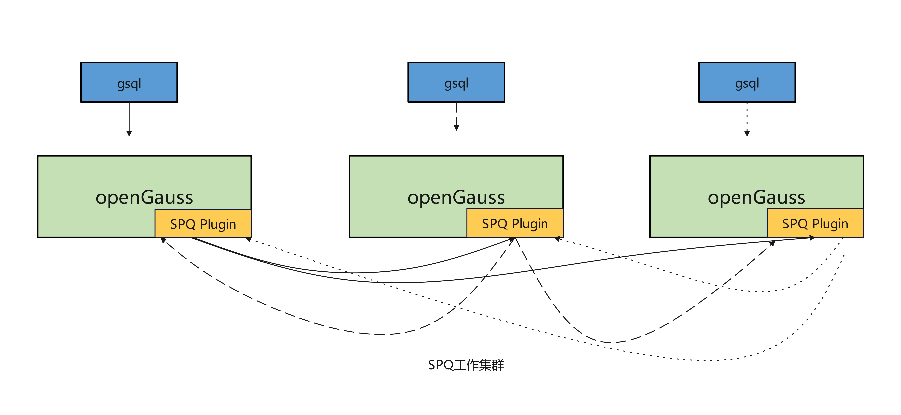

2) 自适应扫描：SPQ设计实现自适应扫描机制，不再限定每个Worker扫描特定的ID。 采用 请求-响应(Request-Response)模式，通过QC进程与QE Worker进程间的特定RPC通信机制，由QC进程负责告知每个Worker进程可执行的扫描任务，从而消除计算数据倾斜的问题。

**图 4**  自适应扫描
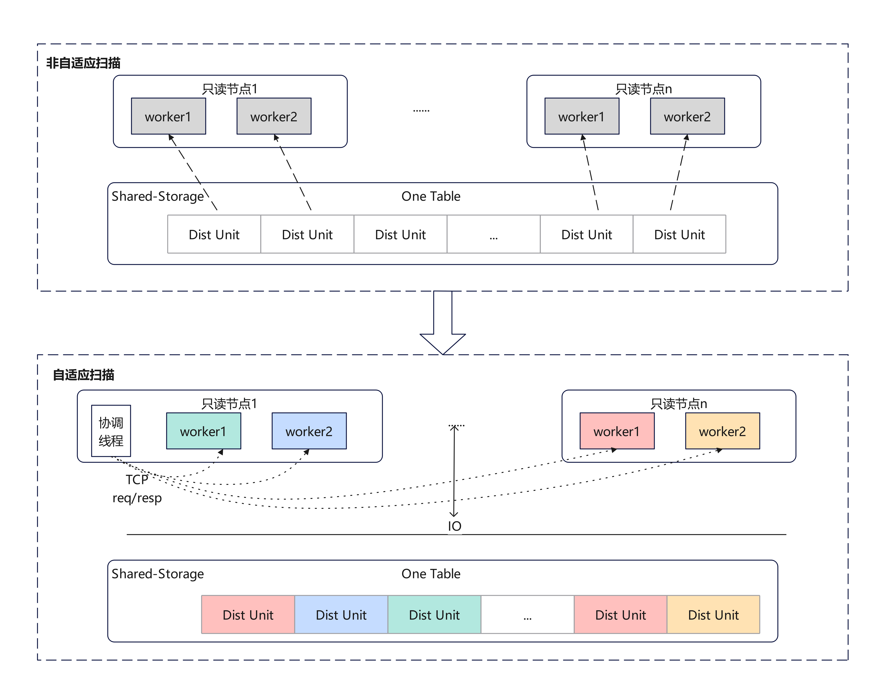

3) 基础算子支持： SPQ多机并行执行器对原有基础算子(Scan,Join,Aggregate,Sort等)及Stream类算子（Gather/Broadcast/Redistribute）的并行化提供支持。 在原有算子的实现基础上，为确保节点间数据的切分读取及执行过程完整适配ORCA生成的分布式执行计划，新增/修改以下算子：
- 扫描类算子： 新增SpqSeqScan、SpqIndexScan、SpqIndexOnlyScan、SpqBitmapHeapScan四类算子，适配分布式扫描范围。
- 计算类算子： 新增Aggregate分布式FinalAgg、PartialAgg计算逻辑。HashJoin算子支持Orca生成的LASJ_NOTIN semi-join分支。
- Shuffle类算子：新增SpqRemoteQuery、Redistribute算子，适配分布式计划。

**图 5**  TPC-H性能对比数据

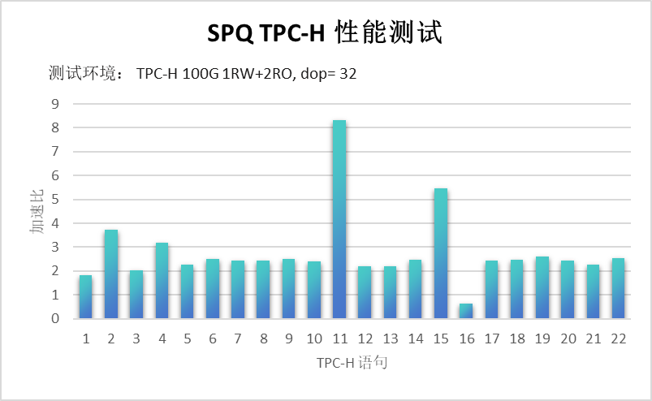

本次测试采用TPC-H 22 条标准语句，测试数据量100G，在资源池化（一主两备）场景下执行SPQ与openGauss原生语句，整体性能提升约2.58倍。

### 3. 多机并行DDL增强
openGauss中创建索引的基本原理即原始表数据的扫描、排序，在内存中生成索引页面，并将页面数据写入磁盘。SPQ采用多机并行加速索引创建原始数据扫描、排序过程，提升创建索引性能。当前支持SPQ多机并行btree创建索引、btree在线(concurrently)创建索引。

**图 6**  SPQ创建索引设计方案

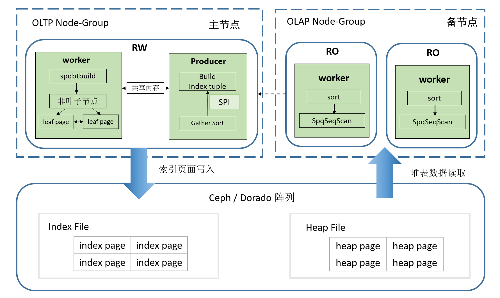

**图 7**  创建索引性能比较

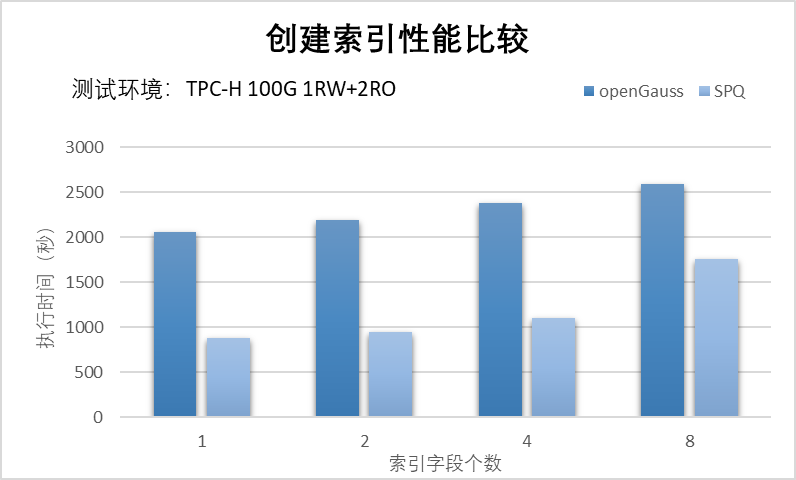

针对100G数据量创建索引测试，在资源池化（一主两备）场景下执行SPQ与openGauss创建索引语句，整体性能提升约2倍。

### 4. 多机并行DML增强
openGauss中DML主要分为两部分：查找数据，写入符合要求的数据。SPQ采用多机并行加速读取数据和写入数据，通过多个只读节点来提升查询性能，从而提升DML性能。当前多机并行DML支持单线程写入（insert、delete和update）。

**图 8**  SPQ DML设计方案

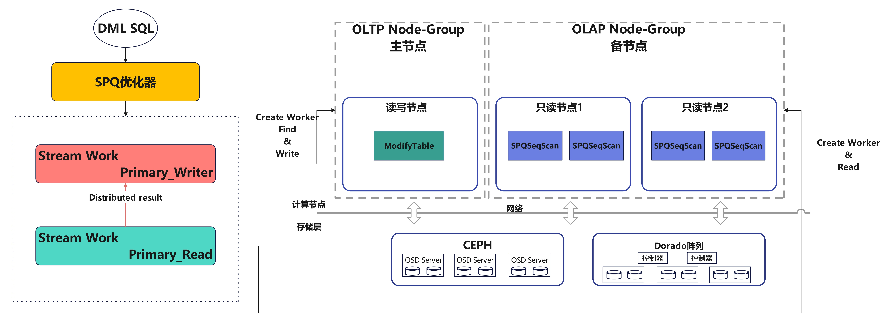

-  Insert

**图 9**  SPQ Insert性能测试

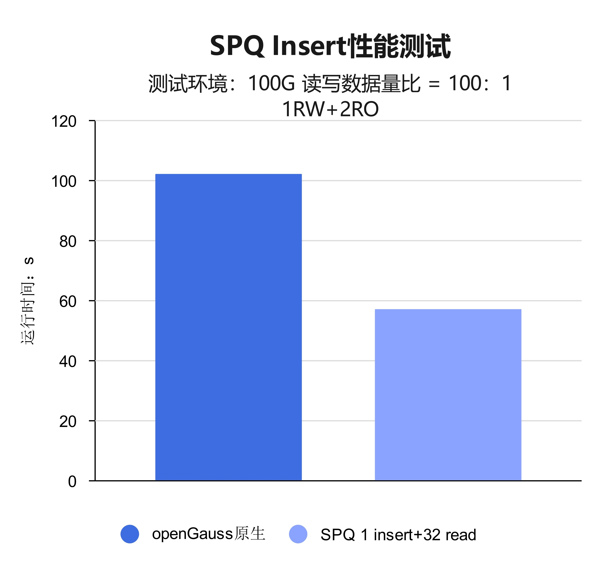

本次测试数据量100G，写线程数为1，每个节点的读线程数为32，在资源池化（一主两备）场景下执行SPQ和openGauss原生语句。在读数据量远大于写数据量的情况下，性能提升最高2倍左右。

-  Update

**图 10**  SPQ Update性能测试

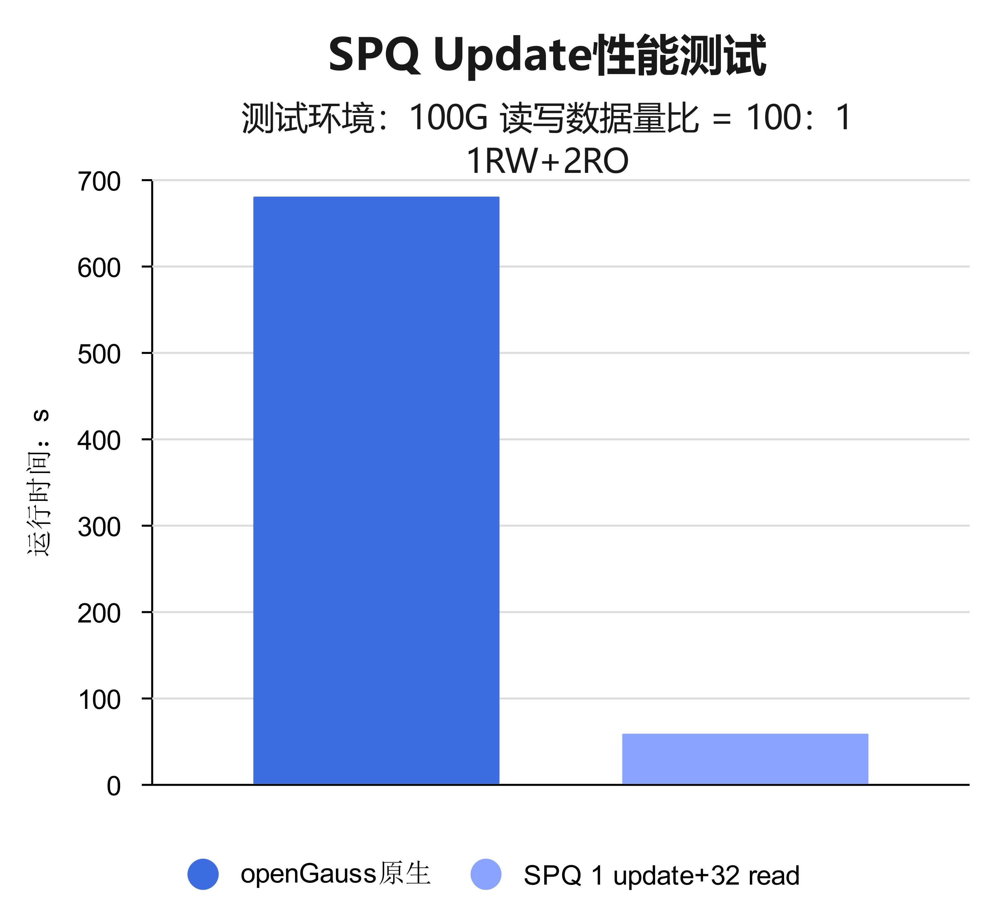

本次测试数据量100G，写线程数为1，每个节点的读线程数为32，在资源池化（一主两备）场景下执行SPQ和openGauss原生语句。在读数据量远大于写数据量的情况下，性能提升最高10倍左右。

- Delete

**图 11**  SPQ Delete性能测试

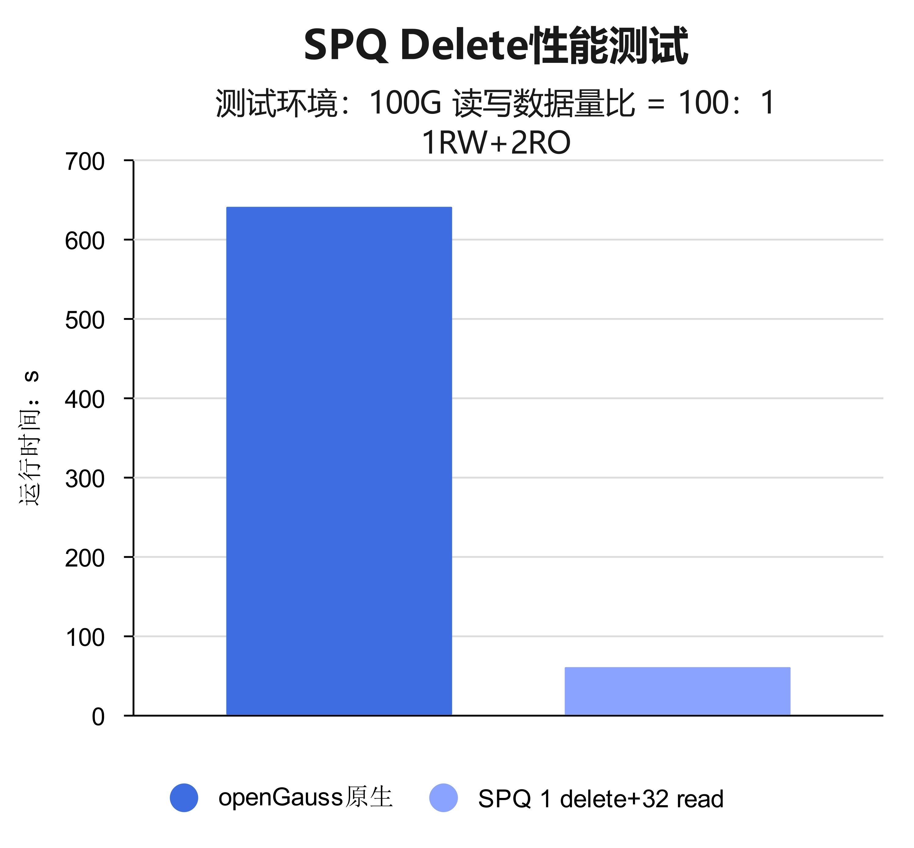

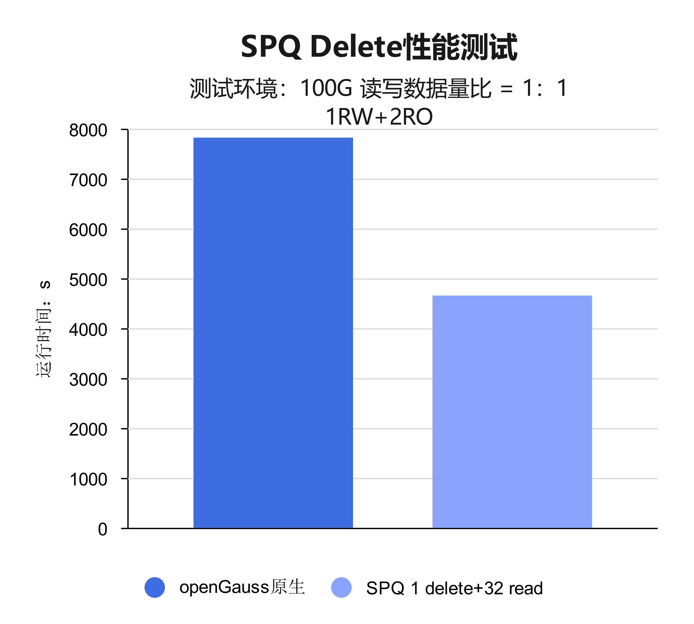

本次测试数据量100G，写线程数为1，每个节点的读线程数为32，在资源池化（一主两备）场景下执行SPQ和openGauss原生语句。在读数据量远大于写数据量的情况下，性能提升最高10倍左右；读写数据量相同的情况下，性能提升1.7倍左右。

## 特性增强

无。

## 特性约束

- 本特性仅支持在资源池化部署下使用。
- 暂时仅支持[shared_preload_libraries](../DatabaseReference/内核资源使用.md)方式加载插件。
- 分区表、系统表、伪列、自定义函数、存储过程的查询暂不支持。
- 加载SPQ的节点所配置的节点名称[pgxc_node_name](../DatabaseReference/openGauss事务.md)互不相同。

## 依赖关系
无。
