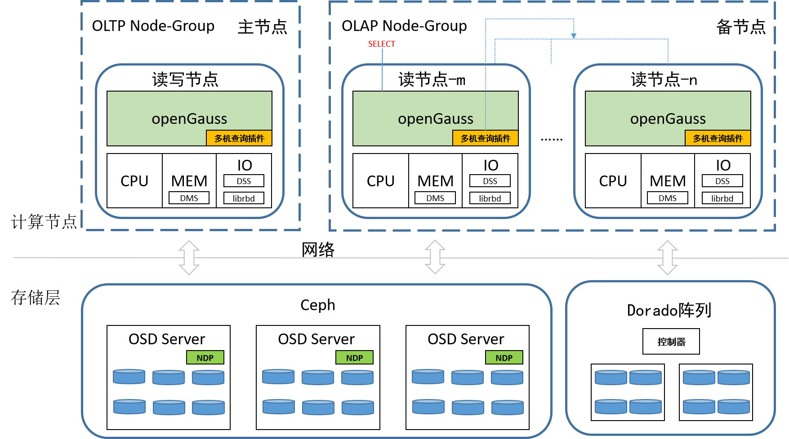

# 资源池化多机并行

## 可获得性

本特性自openGauss 5.1.1 版本开始引入。

## 特性简介

SPQ（SharedEverything Parallel Query）是在openGauss开源数据库上的一个多机并行查询框架，该框架部署在资源池化场景内，该场景下集群部署的为一写多读架构，集群下存在一个写/读节点和多个读节点，现有openGauss集群只存在同时一个读节点查询的能力，集群的查询性能非常受限。SPQ基于sharedEverything分布式架构，所有节点都共享集群内的资源，优化器首先生成多机执行计划，之后计划通过分发到各节点执行，再由查询节点汇聚各节点数据实现所有读节点并行查询，充分发挥集群的OLAP能力。使资源池化同时具备较强的TP和AP能力。

**图 1**  资源池化多机并行方案  

## 客户价值

客户在读节点执行大规模数据查询时实际上使用的是当前查询节点的算力，其余节点算力没有被有效利用起来。多机并行可以充分利用所有计算节点算力从而大幅提升查询效率。

## 特性描述

openGauss资源池化一写多读架构通过构建虚拟Node-Group将OLTP业务和OLAP业务隔离，任一个节点均可以发起查询SQL请求。根据代价和规则决定采用多机查询或者原生单机查询，对上层应用透明，用户无感知。
使用开源Orca优化器组件对其适配openGauss生成多机执行计划，适配后的组件以动态库的方式被openGauss多机查询调用；复用openGauss Streaming算子框架实现plan node不同节点间的交互以及节点内的SMP；新增节点间的数据shuffle网络通道支持TCP；新增算子扫描协调辅助线程并且适配SCAN算子实现共享存储上的表逻辑分区；结合NDP进一步减少计算节点和存储节点之间的网络IO流量。

## 特性增强

无。

## 特性约束

- 本特性仅支持在资源池化部署下使用。
- 暂时仅支持[shared_preload_libraries](../DatabaseReference/内核资源使用.md)方式加载插件。

## 依赖关系
无。
