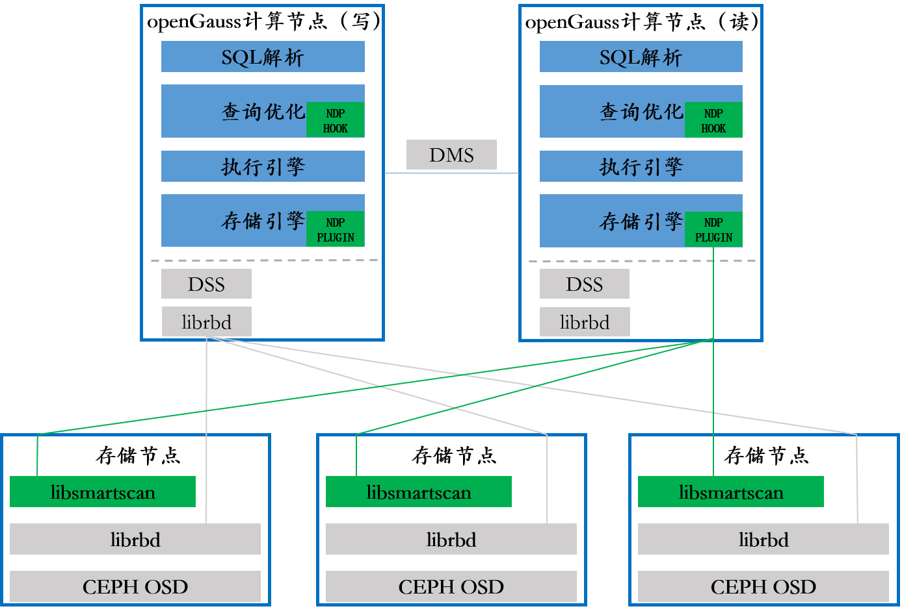

# 资源池化算子卸载

## 可获得性

本特性自openGauss 5.1.0 版本开始引入。

## 特性简介

共享存储虽然带来弹性，可靠性的好处，但是和本地盘单机比较性能会下降较多，主要是网络IO和分布式存储自身带来的延迟，尤其对于大规模查询buffer pool无法缓存的场景，大量的数据需要从存储节点搬运到计算节点，这些批量数据经过滤后大部分场景有效数据内容占比非常少，耗费大量的无用网络IO时间，性能较差。通过算子卸载将数据过滤卸载到存储侧执行，去除不需要的数据，从而减少网络通信数据量，提升端到端性能。

**图 1**  资源池化算子卸载方案  

## 客户价值

资源池化场景下大量查询通过网络获取非必要数据后进行分析处理，影响查询性能。对于大部分使用场景为查询业务的用户可以选择将数据预处理放在存储侧执行，过滤掉非必要数据减少网络传输数据量，提升查询性能。

## 特性描述

openGauss资源池化算子卸载特性支持Agg、SeqScan、Filter、Projection的逻辑在存储节点上运行，将过滤、投影或聚合后的结果传输到计算节点，计算节点对接收的NDP结果继续处理输出上层算子或者聚合NDP结果，业务对算子卸载无感知。此特性可以减少网络传输的数据IO，同时也可以利用存储节点的算力，提升查询的性能。本特性总体方案分为两部分：

#### 计算侧数据库内核
- 以插件的方式提供数据库内核算子卸载功能，不能算子卸载的场景按照内核原有流程执行
- 决定适合算子卸载的场景只有收益/可以卸载的场景才进行卸载，不能算子卸载的场景按照内核原有流程执行
- 构造算子卸载的上下文信息包括snapshot、clog、csnlog、expr，表的shema等信息发送到存储侧libsmartscan进程
- 通过DSS获取文件位置对应存储单元（条带）信息，构造NDP请求发送到对应的存储节点上处理。对于不在Buffer Pool（当前读节点及写节点）中PAGE/BLOCK进行NDP处理，否则按照原有内核流程执行
- 获取存储节点NDP处理后数据的特殊处理，输出到上层算子或者汇聚中间结果
#### 存储侧libsmartscan进程
- 提供近存储数据计算的功能
- 通过存储的接口以存储的语义读取数据，只会读取存储节点的本地数据
- 解析数据并对可见性进行判断，无法判断可见性或者无法获取对应版本数据（ustore场景）对应的PAGE/BLOCK交由计算侧原始流程处理
- 对可见的数据进行过滤、聚合、投影等操作并返回处理后的数据到计算节点

计算侧算子卸载并不会改变原有的执行计划以及算子的相关信息，通过存储引擎接口hook实现NDP数据的处理逻辑屏蔽执行引擎感知卸载的存在。

插件安装与使能见：**[ndpplugin-Extension](../ExtensionReference/ndpplugin-Extension.md)**

## 特性增强

无。

## 特性约束

-   本特性仅支持在资源池化部署下使用。
- 暂时仅支持shared_preload_libraries方式加载插件
- 暂不支持Toast表场景
- 暂不支持ustore场景
- 暂不支持synchronize_seqscans

## 依赖关系
无。

