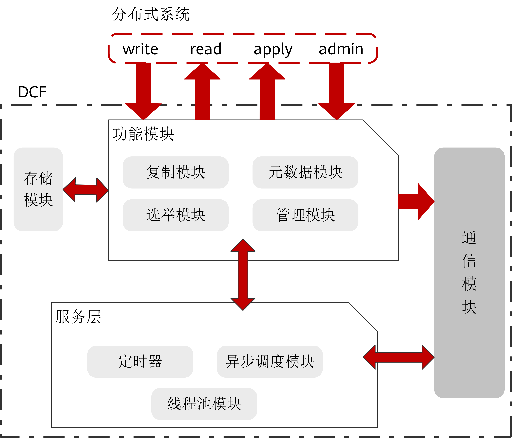

# DCF<a name="ZH-CN_TOPIC_0000001180294758"></a>

DCF全称是Distributed Consensus Framework，即分布式一致性共识框架。DCF实现了Paxos、Raft等解决分布式一致性问题典型算法。使用DCF可以提供日志复制、集群高可用等能力。DCF提供了自选主能力，支持少数派强起能力，日志复制支持动态流量调整。同时也提供了基于Paxos多种角色节点类型，并能进行调整。

DCF是一款高性能、高度成熟可靠、易扩展、易使用的独立基础库，其他系统通过接口与DCF简单对接，就能够轻松拥有Paxos算法赋予的强一致、高可用、自动容灾等能力。

## 架构介绍<a name="section1667455612274"></a>

DCF功能架构如[图1](#fig31591049102410)所示，主要包括：功能模块、存储模块、通信模块、服务层等。

**图 1**  DCF功能架构图<a name="fig31591049102410"></a>  


-   **算法模块：**

    算法模块是基于multi-paxos协议实现，同时结合自身业务场景、及高性能和生态的需求，DCF做了很多功能扩展和性能优化，使其相对于基础的multi-paxos，功能变的更加丰富，在多种部署场景下性能都有明显的提升。其主要包括：Leader选举模块，日志复制模块，元数据模块，以及集群管理模块等。

-   **存储模块：**

    出于特定业务场景和极致高性能考虑，DCF将日志存储单独抽取出一套公共接口，并实现了一个默认的高性能存储模块。有特定场景或极致高性能及成本需求的用户，可以结合已有的存储系统，对接DCF的日志存储接口来实现其特定需求，这也是DCF作为第三方独立库的优势之一。

-   **通信模块：**

    通信模块主要是基于MEC实现（Message Exchange Component），提供整个DCF组件实例间通信能力，以及异步事件处理框架。主要功能有：可扩展的多种通信协议，单播、广播、环回的发送接口，消息异步处理的框架，支持多channel机制和多优先级队列，支持压缩和批量发送等。

-   **服务层：**

    服务层是驱动整个DCF运行的基础，提供程序运行所需要的各种基础服务。例如：锁、任务异步调度、线程池服务、定时器能力等。


## 功能介绍<a name="section392523316281"></a>

-   **支持在线添加、删除节点，在线转让Leader能力**

    DCF在标准的multi-paxos基础上，支持在线添加、删除节点，支持在线将leader能力转让给其他节点。这更适合广泛业务场景，构建开发的生态。

-   **支持优先级选主和策略化多数派**
    -   **策略化多数派：**经典Paxos 理论中，多数派达成一致后数据就可以提交，而多数派是非特定的，并不能保证某个或某些节点一定能得到完整的数据。在实际应用中，往往是地理位置较近的节点会拥有强一致的数据，而地理位置较远的节点，一直处于非强一致的状态，在发生城市级容灾的时候无法激活为主节点，形同虚设。策略化多数派能力，可以让用户通过动态配置，指定某个或某些节点必须保有强一致的数据，在出现容灾需求的时，可以立即激活为主节点。
    -   **优先级选主：**用户可以指定各个节点的优先级。DCF严格按照指定的优先级选主，只有在优先级高的节点全部不可用时，才会激活优先级低的节点。

-   **支持节点角色多样性**

    DCF除了可以提供经典的Leader、Follow、Candidate角色外，还可以提供定制化的角色。例如Passive角色（有日志，有数据，没有被选举权，不参与多数派投票），log角色（有日志，没有数据，没有被选举权，参与多数派投票）。有了这些节点角色的支持，DCF可以支持节点同步、同异步混合部署等多集群部署方式。

-   **Batch & Pipeline**
    -   **Batch：**DCF支持多级batch操作，主要包括：

        -   将多个日志合并成单个消息进行发送。
        -   将多个日志合并写磁盘。
        -   将多个日志合并复制。

        Batch可以有效的降低消息粒度带来的额外损耗，提升吞吐。

    -   **Pipeline：**是指在上一个消息返回结果以前，并发的发送下一个消息到对应节点的机制，通过提高并发发送消息数量（Pipeline数量），可以有效的降低并发单请求延迟，提升性能；DCF在日志持久化、网络发送、日志复制等多个阶段采用纯异步方式，将Pipeline性能发挥至极致。

-   **高效流控算法**

    Batching、Pipelining虽然能够提升系统整体吞吐量和性能，但是过大Batch也容易造成单请求时延过大，导致并发请求数过高，继而影响吞吐和请求时延，为此DCF设计实现了一套高效自适应的流控算法，自动探测网络带宽、网络发送时延、请求并发量等参数，并适时调整Batch和Pipeline参数，控制业务流量的注入。

    流控算法主要流程如[图2](#fig548518330404)所示：

    **图 2**  流控算法流程<a name="fig548518330404"></a>  
    

    核心算法流程如下：

    1.  DCF主节点周期性采样和计算共识信息：这里的共识信息主要是端到端达成共识的时延、端到端达成共识的日志带宽、系统整体日志回放带宽。
    2.  计算控制量：主节点根据本次采样结果和历史结果，得出性能变化趋势，根据历史控制量的值和变化趋势调整本次控制方向和控制步长，朝更优性能方向计算得出新的控制量。
    3.  控制周期到达后，更新控制量。
    4.  控制量持续作用到业务流量，控制业务流量注入的频率。


## 使用示例<a name="section763763217423"></a>

假设集群三个节点，ip分别为，192.168.0.11,192.168.0.12,192.168.0.13。node id分别为1,2,3；节点角色分别为LEADER，FOLLOWER，FOLLOWER。

使用DCF组件能力需要在使用OM安装部署阶段，在配置文件中，开启开关enable\_dcf的值为on（默认是关闭的），并配置DCF config配置信息。

在script/gspylib/etc/conf/centralized/cluster\_config\_template\_HA.xml获取XML文件模板。

每行信息均有注释进行说明。加粗字体内容为DCF相关内容。示例如下：

```
<?xml version="1.0" encoding="UTF-8"?>
<ROOT>
  <!-- 整体信息 -->
  <CLUSTER>
  <!-- 数据库名称 -->
    <PARAM name="clusterName" value="Sample1" />
  <!-- 数据库节点名称(hostname) -->
    <PARAM name="nodeNames" value="node1,node2,node3" />
  <!-- 节点IP，与nodeNames一一对应 -->
    <PARAM name="backIp1s" value="192.168.0.11,192.168.0.12,192.168.0.13"/>
  <!-- 数据库安装目录-->
    <PARAM name="gaussdbAppPath" value="/opt/huawei/newsql/app" />
  <!-- 日志目录-->
    <PARAM name="gaussdbLogPath" value="/opt/huawei/logs/gaussdb" />
  <!-- 临时文件目录-->
    <PARAM name="tmpMppdbPath" value="/opt/huawei/logs/temp" />
  <!--数据库工具目录-->
    <PARAM name="gaussdbToolPath" value="/opt/huawei/tools" />
  <!-- 集群数据库类型，此处示例为非分布式，即集中式类型-->
    <PARAM name="clusterType" value="single-inst"/>
  <!-- 是否开启DCF模式, 开启：on，关闭：off -->
    <PARAM name="enable_dcf" value="on/off"/>
  <!-- DCF config配置信息 -->
    <PARAM name="dcf_config" value="[{&quot;stream_id&quot;:1,&quot;node_id&quot;:1,&quot;ip&quot;:&quot;192.168.0.11&quot;,&quot;port&quot;:17783,&quot;role&quot;:&quot;LEADER&quot;},   {&quot;stream_id&quot;:1,&quot;node_id&quot;:2,&quot;ip&quot;:&quot;192.168.0.12&quot;,&quot;port&quot;:17783,&quot;role&quot;:&quot;FOLLOWER&quot;},  {&quot;stream_id&quot;:1,&quot;node_id&quot;:3,&quot;ip&quot;:&quot;192.168.0.13&quot;,&quot;port&quot;:17783,&quot;role&quot;:&quot;FOLLOWER&quot;}]"/> 
  </CLUSTER>
...
```

1.  **安装完成后查询集群状态**

    使用gs\_ctl查询集群状态。

    ```
    # gs_ctl query –D <data_dir>
    # gs_ctl query -D /nvme0/gaussdb/cluster/nvme0/dn1
    HA state:
           local role                     : Primary   
           static connections             : 2   
           db state                       : Normal 
           detail information             : Normal 
    Paxos replication info:
           paxos write location           : 964/87134528  
           paxos commit location          : 964/87134528  
           local write location           : 964/87134528  
           local flush location           : 964/87134528  
           local replay location          : 964/87134528  
           dcf replication info           : {"stream_id":1,"local_node_id":1,"role":"LEADER","term":3,"run_mode":0,"work_mode":0,"hb_interval":1000,"elc_timeout":3000,"applied_index":14300633605."commit_index":14300633605,"first_index":14300625186,"last_index":14300633605,"cluster_min_apply_idx'14300633605,"leader_id":1,"leader_ip":"172.16.137.38","leader_port":17783,"nodes":[{"node_id":1,"id":"172.16.137.38","port":17783,"role":"LEADER","next_index":14300633606,"match_index":14300633605,"apply_index":14300633605},{"node_id":2,"ip":"172.16.137.40","port":17783,"role":"FOLLOWER","next_index":14300633606,"match_index":14300633605,"apply_index":14300633605},{"node_id":3,"ip":"172.16.137.42","port":17783,"role":"FOLLOWER","next_index":14300633606,"match_index":14300633605,"apply_index":14300633605}}}
    ```

    其中:

    -   dcf\_replication\_info：表示当前节点dcf信息。
    -   role：表示当前节点角色，角色一共有如下几种，LEADER、FOLLOWER、LOGGER、PASSIVE、PRE\_CANDICATE、CANDIDATE、UNKNOW。从上图可以看出当前节点是LEADER节点。
    -   term：选举任期。
    -   run\_mode：DCF运行模式，当前0表示自动选举模式，2表示关闭自动选举模式。
    -   work\_mode：DCF工作模式。0表示多数派模式；1表示少数派模式。
    -   hb\_interval：DCF节点间心跳间隔时间，单位ms。
    -   elc\_timeout：DCF选举超时时间，单位ms。
    -   applied\_index：被应用到状态机的日志位置。
    -   commit\_index：已被大多数DCF节点保存的日志位置，此commit\_index之前日志均已持久化。
    -   first\_index：DCF节点保存的首条日志位置，此位置会随着DN调用dcf\_truncate而向后推进，之前的日志会被清理。
    -   last\_index：DCF节点保存的最后一条日志位置，此日志位置包含DCF节点存储在内存里但是没有持久化的日志，故而last\_index \>= commit\_index。
    -   cluster\_min\_apply\_idx：集群最小已应用的日志位置。
    -   leader\_id：leader节点ID。
    -   leader\_ip：leader节点IP。
    -   leader\_port：leader节点端口，DCF内部使用 。
    -   nodes：集群其他节点信息。

2.  **集群规模在线调整**

    若在线增加副本，执行以下一条命令即可。

    ```
     # gs_ctl member --operation=add --nodeid=<node_id> --ip=<ip> --port=<port> -D <data_dir>
    ```

    若需在线降副本，执行下面命令：

    ```
     # gs_ctl member --operation=remove --nodeid=<node_id> -D <data_dir>
    ```

    在集群状态正常的情况下，5分钟就可以完成删除单个副本的任务。

3.  **集群支持少数派强起功能**

    在多数派故障场景下，按正常的Paxos协议无法达成一致，系统无法继续提供服务。为了提供紧急服务能力，需在少数派情况下紧急启动提供服务。

    使用命令如下：

    ```
     # cm_ctl setrunmode -n <node_id> -D <data_dir> --xmode=minority --votenum=<num>
    ```

    在集群3副本的情况下，2副本故障，只需1副本达成一致即可提交。

    加回命令为：

    ```
     # cm_ctl setrunmode -n <node_id> -D <data_dir> --xmode=normal --votenum=<num>
    ```

4.  **主动switchover操作**

    支持一主多备部署模式下切换数据库主备实例，实现AZ间的相互切换。switchover为维护操作，需确保数据库实例状态正常，所有业务结束并无主备追赶后，再进行switchover操作。

    例如节点备升主操作命令：

    ```
     # cm_ctl switchover –n <node_id> -D <data_dir>
    ```

5.  **备机重建功能**

    支持主备模式下全量build能力。实现过程是当主DN收到全量build的请求后，阻塞主DN回收DCF日志，备DN从主DN复制xlog日志和数据文件，在备DN拉起后设置DCF开始复制日志点。

    命令示例如下：

    ```
    # gs_ctl build -b full -D <new_node_data_dir>
    ```


