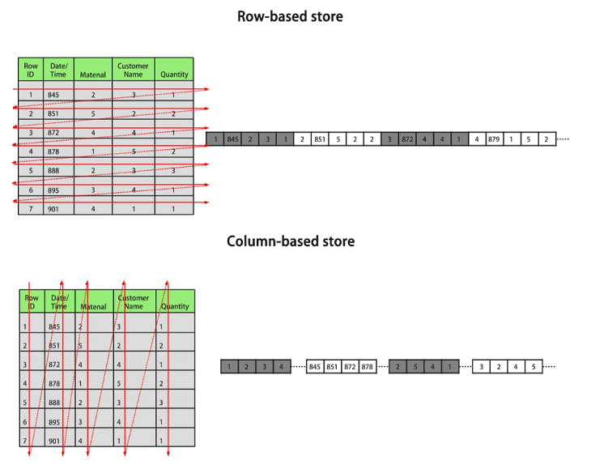

# 列存储

openGauss支持行列混合存储。行存储是指将表按行存储到硬盘分区上，列存储是指将表按列存储到硬盘分区上。

行、列存储模型各有优劣，建议根据实际情况选择。通常openGauss用于OLTP（联机事务处理）场景的数据库，默认使用行存储，仅对执行复杂查询且数据量大的OLAP（联机分析处理）场景时，才使用列存储。默认情况下，创建的表为行存储。行存储和列存储的差异请参见[图1](#zh-cn_topic_0283136734_zh-cn_topic_0237120296_fig1417354233018)。

**图 1**  行存储和列存储的差异<a name="zh-cn_topic_0283136734_zh-cn_topic_0237120296_fig1417354233018"></a>  




上图中，左上为行存表，右上为行存表在硬盘上的存储方式。左下为列存表，右下为列存表在硬盘上的存储方式。

行、列存储有如下优缺点：

<a name="zh-cn_topic_0283136734_zh-cn_topic_0237120296_table8447131119519"></a>
<table><thead align="left"><tr id="zh-cn_topic_0283136734_zh-cn_topic_0237120296_row16451411125113"><th class="cellrowborder" valign="top" width="14.14141414141414%" id="mcps1.1.4.1.1"><p id="zh-cn_topic_0283136734_zh-cn_topic_0237120296_p7453131117518"><a name="zh-cn_topic_0283136734_zh-cn_topic_0237120296_p7453131117518"></a><a name="zh-cn_topic_0283136734_zh-cn_topic_0237120296_p7453131117518"></a><strong id="zh-cn_topic_0283136734_zh-cn_topic_0237120296_b2453151113516"><a name="zh-cn_topic_0283136734_zh-cn_topic_0237120296_b2453151113516"></a><a name="zh-cn_topic_0283136734_zh-cn_topic_0237120296_b2453151113516"></a>存储模型</strong></p>
</th>
<th class="cellrowborder" valign="top" width="39.39393939393939%" id="mcps1.1.4.1.2"><p id="zh-cn_topic_0283136734_zh-cn_topic_0237120296_p199221916145119"><a name="zh-cn_topic_0283136734_zh-cn_topic_0237120296_p199221916145119"></a><a name="zh-cn_topic_0283136734_zh-cn_topic_0237120296_p199221916145119"></a><strong id="zh-cn_topic_0283136734_zh-cn_topic_0237120296_b183421054185116"><a name="zh-cn_topic_0283136734_zh-cn_topic_0237120296_b183421054185116"></a><a name="zh-cn_topic_0283136734_zh-cn_topic_0237120296_b183421054185116"></a>优点</strong></p>
</th>
<th class="cellrowborder" valign="top" width="46.464646464646464%" id="mcps1.1.4.1.3"><p id="zh-cn_topic_0283136734_zh-cn_topic_0237120296_p164535117512"><a name="zh-cn_topic_0283136734_zh-cn_topic_0237120296_p164535117512"></a><a name="zh-cn_topic_0283136734_zh-cn_topic_0237120296_p164535117512"></a><strong id="zh-cn_topic_0283136734_zh-cn_topic_0237120296_b1463713025117"><a name="zh-cn_topic_0283136734_zh-cn_topic_0237120296_b1463713025117"></a><a name="zh-cn_topic_0283136734_zh-cn_topic_0237120296_b1463713025117"></a>缺点</strong></p>
</th>
</tr>
</thead>
<tbody><tr id="zh-cn_topic_0283136734_zh-cn_topic_0237120296_row445671111516"><td class="cellrowborder" valign="top" width="14.14141414141414%" headers="mcps1.1.4.1.1 "><p id="zh-cn_topic_0283136734_zh-cn_topic_0237120296_p124571811115110"><a name="zh-cn_topic_0283136734_zh-cn_topic_0237120296_p124571811115110"></a><a name="zh-cn_topic_0283136734_zh-cn_topic_0237120296_p124571811115110"></a>行存</p>
</td>
<td class="cellrowborder" valign="top" width="39.39393939393939%" headers="mcps1.1.4.1.2 "><p id="zh-cn_topic_0283136734_zh-cn_topic_0237120296_p1654125142613"><a name="zh-cn_topic_0283136734_zh-cn_topic_0237120296_p1654125142613"></a><a name="zh-cn_topic_0283136734_zh-cn_topic_0237120296_p1654125142613"></a>数据被保存在一起。INSERT/UPDATE容易。</p>
</td>
<td class="cellrowborder" valign="top" width="46.464646464646464%" headers="mcps1.1.4.1.3 "><p id="zh-cn_topic_0283136734_zh-cn_topic_0237120296_p1727415115212"><a name="zh-cn_topic_0283136734_zh-cn_topic_0237120296_p1727415115212"></a><a name="zh-cn_topic_0283136734_zh-cn_topic_0237120296_p1727415115212"></a>选择(SELECT)时即使只涉及某几列，所有数据也都会被读取。</p>
</td>
</tr>
<tr id="zh-cn_topic_0283136734_zh-cn_topic_0237120296_row1546241120517"><td class="cellrowborder" valign="top" width="14.14141414141414%" headers="mcps1.1.4.1.1 "><p id="zh-cn_topic_0283136734_zh-cn_topic_0237120296_p6462111105112"><a name="zh-cn_topic_0283136734_zh-cn_topic_0237120296_p6462111105112"></a><a name="zh-cn_topic_0283136734_zh-cn_topic_0237120296_p6462111105112"></a>列存</p>
</td>
<td class="cellrowborder" valign="top" width="39.39393939393939%" headers="mcps1.1.4.1.2 "><a name="zh-cn_topic_0283136734_zh-cn_topic_0237120296_ul1556111817542"></a><a name="zh-cn_topic_0283136734_zh-cn_topic_0237120296_ul1556111817542"></a><ul id="zh-cn_topic_0283136734_zh-cn_topic_0237120296_ul1556111817542"><li>查询时只有涉及到的列会被读取。</li><li>投影(Projection)很高效。</li><li>任何列都能作为索引。</li></ul>
</td>
<td class="cellrowborder" valign="top" width="46.464646464646464%" headers="mcps1.1.4.1.3 "><a name="zh-cn_topic_0283136734_zh-cn_topic_0237120296_ul1796819916297"></a><a name="zh-cn_topic_0283136734_zh-cn_topic_0237120296_ul1796819916297"></a><ul id="zh-cn_topic_0283136734_zh-cn_topic_0237120296_ul1796819916297"><li>选择完成时，被选择的列要重新组装。</li><li>INSERT/UPDATE比较麻烦。</li></ul>
</td>
</tr>
</tbody>
</table>

一般情况下，如果表的字段比较多（大宽表），查询中涉及到的列不多的情况下，适合列存储。如果表的字段个数比较少，查询大部分字段，那么选择行存储比较好。

<a name="zh-cn_topic_0283136734_zh-cn_topic_0237120296_zh-cn_topic_0097078338_table3891877"></a>
<table><thead align="left"><tr id="zh-cn_topic_0283136734_zh-cn_topic_0237120296_zh-cn_topic_0097078338_row12104456"><th class="cellrowborder" valign="top" width="19.73%" id="mcps1.1.3.1.1"><p id="zh-cn_topic_0283136734_zh-cn_topic_0237120296_zh-cn_topic_0097078338_p40936856"><a name="zh-cn_topic_0283136734_zh-cn_topic_0237120296_zh-cn_topic_0097078338_p40936856"></a><a name="zh-cn_topic_0283136734_zh-cn_topic_0237120296_zh-cn_topic_0097078338_p40936856"></a>存储类型</p>
</th>
<th class="cellrowborder" valign="top" width="80.27%" id="mcps1.1.3.1.2"><p id="zh-cn_topic_0283136734_zh-cn_topic_0237120296_zh-cn_topic_0097078338_p46632853"><a name="zh-cn_topic_0283136734_zh-cn_topic_0237120296_zh-cn_topic_0097078338_p46632853"></a><a name="zh-cn_topic_0283136734_zh-cn_topic_0237120296_zh-cn_topic_0097078338_p46632853"></a>适用场景</p>
</th>
</tr>
</thead>
<tbody><tr id="zh-cn_topic_0283136734_zh-cn_topic_0237120296_zh-cn_topic_0097078338_row38265132"><td class="cellrowborder" valign="top" width="19.73%" headers="mcps1.1.3.1.1 "><p id="zh-cn_topic_0283136734_zh-cn_topic_0237120296_zh-cn_topic_0097078338_p12468015"><a name="zh-cn_topic_0283136734_zh-cn_topic_0237120296_zh-cn_topic_0097078338_p12468015"></a><a name="zh-cn_topic_0283136734_zh-cn_topic_0237120296_zh-cn_topic_0097078338_p12468015"></a>行存</p>
</td>
<td class="cellrowborder" valign="top" width="80.27%" headers="mcps1.1.3.1.2 "><a name="zh-cn_topic_0283136734_zh-cn_topic_0237120296_zh-cn_topic_0097078338_ul61112063105242"></a><a name="zh-cn_topic_0283136734_zh-cn_topic_0237120296_zh-cn_topic_0097078338_ul61112063105242"></a><ul id="zh-cn_topic_0283136734_zh-cn_topic_0237120296_zh-cn_topic_0097078338_ul61112063105242"><li>点查询(返回记录少，基于索引的简单查询)。</li><li>增、删、改操作较多的场景。</li><li>频繁的更新、少量的插入。</li></ul>
</td>
</tr>
<tr id="zh-cn_topic_0283136734_zh-cn_topic_0237120296_zh-cn_topic_0097078338_row64051613"><td class="cellrowborder" valign="top" width="19.73%" headers="mcps1.1.3.1.1 "><p id="zh-cn_topic_0283136734_zh-cn_topic_0237120296_zh-cn_topic_0097078338_p20798169"><a name="zh-cn_topic_0283136734_zh-cn_topic_0237120296_zh-cn_topic_0097078338_p20798169"></a><a name="zh-cn_topic_0283136734_zh-cn_topic_0237120296_zh-cn_topic_0097078338_p20798169"></a>列存</p>
</td>
<td class="cellrowborder" valign="top" width="80.27%" headers="mcps1.1.3.1.2 "><a name="zh-cn_topic_0283136734_zh-cn_topic_0237120296_zh-cn_topic_0097078338_ul38359637105253"></a><a name="zh-cn_topic_0283136734_zh-cn_topic_0237120296_zh-cn_topic_0097078338_ul38359637105253"></a><ul id="zh-cn_topic_0283136734_zh-cn_topic_0237120296_zh-cn_topic_0097078338_ul38359637105253"><li>统计分析类查询 (关联、分组操作较多的场景)。</li><li>即席查询（查询条件不确定，行存表扫描难以使用索引）。</li><li>一次性大批量插入。</li><li>表列数较多，建议使用列存表。</li><li>如果每次查询时，只涉及了表的少数（&lt;50%总列数）几个列，建议使用列存表。</li></ul>
</td>
</tr>
</tbody>
</table>

## 语法格式<a name="zh-cn_topic_0283136734_zh-cn_topic_0237120296_zh-cn_topic_0066331191_zh-cn_topic_0059778293_s0420ba4662e14672b8ec55415ddca941"></a>

```
CREATE TABLE table_name 
    (column_name data_type [, ... ])
    [ WITH ( ORIENTATION  = value) ];
```

## 参数说明<a name="section415419560710"></a>

-   **table\_name**

    要创建的表名。

-   **column\_name**

    新表中要创建的字段名。

-   **data\_type**

    字段的数据类型。

-   **ORIENTATION**

    指定表数据的存储方式，即行存方式、列存方式，该参数设置成功后就不再支持修改。

    取值范围：

    -   ROW，表示表的数据将以行式存储。

        行存储适合于OLTP业务，适用于点查询或者增删操作较多的场景。

    -   COLUMN，表示表的数据将以列式存储。

        列存储适合于数据仓库业务，此类型的表上会做大量的汇聚计算，且涉及的列操作较少。


## 示例<a name="zh-cn_topic_0283136734_zh-cn_topic_0237120296_zh-cn_topic_0066331191_zh-cn_topic_0059778293_s05b88010070445598ab2a86454e5d88b"></a>

不指定ORIENTATION参数时，表默认为行存表。例如：

```
openGauss=# CREATE TABLE customer_test1
(
  state_ID   CHAR(2),
  state_NAME VARCHAR2(40),
  area_ID    NUMBER
);

--删除表
openGauss=# DROP TABLE customer_test1;
```

创建列存表时，需要指定ORIENTATION参数。例如：

```
openGauss=# CREATE TABLE customer_test2
(
  state_ID   CHAR(2),
  state_NAME VARCHAR2(40),
  area_ID    NUMBER
)
WITH (ORIENTATION = COLUMN);

--删除表
openGauss=# DROP TABLE customer_test2;
```

