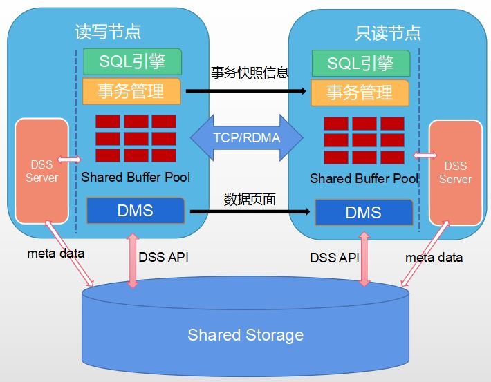

# 资源池化

## 特性简介<a name="section5152529165610"></a>

资源池化特性主要提供主备机共享一份存储的能力，提供一种新HA部署形态，解决传统HA部署下存储容量较单机翻倍的问题，满足降低存储容量及成本的诉求，同时备机支持实时一致性读。

## 架构介绍<a name="section190917443263"></a>

资源池化整体架构图如下所示。

**图 1**  资源池化架构图<a name="fig38139561096"></a>  


-   磁阵设备并且已经安装ultrapath多路径软件，磁阵设备可用。
-   分布式存储服务DSS（Distributed Storage Service）

    DSS组件分为DSSAPI和DSSSERVER。DSSSERVER是独立进程，直接管理磁阵裸设备，并对外提供类似分布式文件系统的能力；DSSAPI是动态库，集成在数据库内部。DSS组件通过共享内存和客户端API动态库，为数据库提供创建文件、删除文件、扩展和收缩文件、读写文件的能力。

-   分布式内存服务DMS（Distributed Memory Service）

    DMS是动态库，集成在数据库内部，通过TCP/RDMA网络传输PAGE内容，将主备内存融合，提供内存池化能力，以此实现备机实时一致性读功能。

-   主备页面交换通过RDMA加速，依赖CX5网卡，并且依赖OCK  RDMA动态库。

## 功能特点<a name="section139901033135516"></a>

-   主备共享一份数据，显著降低传统HA的存储容量。
-   主备之间去除了日志复制功能，增加了主备页面交换功能，备机支持实时一致性读。
-   默认情况下，主备之间是通过TCP网络进行页面实时交换。为了降低页面交换的延迟，可选通过OCK RDMA动态库加速备机实时一致性的性能。

## 适用场景与限制<a name="section13547620181410"></a>

-   要求存储设备是磁阵，磁阵的LUN需要支持SCSI3的PR协议（包括PR OUT（“PERSISTENT RESERVE OUT”）PR IN（“PERSISTENT RESERVE IN”）和INQUIRY）， 用于实现集群IO FENCE；除此之外, 还需要支持SCSI3的CAW协议（COMPARE AND WRITE）, 用于实现共享磁盘锁。如Dorado 5000 V3磁阵设备。
-   最高支持1主7备部署。
-   由于资源池化依赖类似分布式文件系统的功能来实现备机实时一致性读能力，因此要求文件元数据变更越少越好。基于性能考虑，本特性只支持段页式表。
-   只支持主备部署在同一磁阵设备上，不支持容灾部署，也不支持主备混合部署（如主和备部署在不同的磁阵设备上）。
-   主备页面交换可选通过RDMA加速，依赖CX5网卡，并且依赖计算提供的OCK  RDMA动态库。
-   暂不支持备机重建及节点替换、节点修复等能力。
-   不支持传统模式数据库和资源池化模式数据库相互升级。

## 手动安装示例<a name="section188071153201818"></a>

与传统gs\_initdb建库相比，资源池化建库将目录分为三种类型，每实例独占且不共享、每实例独占且共享、所有实例共享。其中需要共享的目录均需存放到磁阵设备上，而不共享的目录存放在本地盘上。另外备机建库只需要建隶属于自己的目录，不需要再次创建所有实例共享的目录结构。资源池化新增了相关GUC参数，以及将系统表存储方式从页式切换到段页式。

> **说明：** 
>此处的单步手动安装是指工程编译之后，可单步执行相关命令进行资源池化建库。openGauss常规安装请参照《安装指南》。

-   前置条件
    -   工程已完成代码编译，编译请参见[软件安装编译](../CompilationGuide/版本编译.md)。
    -   主机已经挂载磁阵LUN设备，并且已经安装ultrapath多路径软件，磁阵设备可用。


-   操作步骤
    1.  <a name="li0988195961613"></a>为磁阵LUN盘符创建软链接，并赋予相应的用户权限（假设磁阵LUN对应的盘符为/dev/sde, /dev/sdf）。

        ```
        sudo ln -s /dev/sde /dev/tpcc_data
        sudo ln -s /dev/sdf /dev/tpcc_log
        sudo chmod 777 /dev/tpcc_data
        sudo chmod 777 /dev/tpcc_log
        ```

    2.  为需要磁阵RAWIO权限的可执行文件赋权。

        ```
        sudo -i setcap CAP_SYS_RAWIO+ep 绝对路径/perctrl
        ```

        perctrl：用于对dss相关工具和进程赋予读写权限的可执行工具。

    3.  创建DSS服务端进程及建资源池化库需要的配置文件。

        测试目录\(假设为/data/test\)

        ```
        └─dss_home/
        ├── cfg
        │   ├── dss_inst.ini
        │   └── dss_vg_conf.ini
        └── log // 启动前需存在log目录
        ```

        dss\_init.ini配置内容如下：

        ```
        INST_ID=0
        _LOG_LEVEL=55
        _LOG_BACKUP_FILE_COUNT=128
        _LOG_MAX_FILE_SIZE =20M
        LSNR_PATH=/data/test/dss_home
        STORAGE_MODE=RAID
        _SHM_KEY=12
        ```

        上述配置中参数说明如下：

        -   INST\_ID配置实例号，取值范围\[0, 63\]，每个主备下的dssserver进程各不相同。
        -   \_LOG\_LEVEL日志级别。
        -   \_LOG\_BACKUP\_FILE\_COUNT日志文件最多保留的个数。
        -   \_LOG\_MAX\_FILE\_SIZE为单个日志文件最大大小。
        -   LSNR\_PATH为DSS客户端与服务端之间通信使用的domain socket保存的目录，一般设为DSS服务端进程的家目录。
        -   STORAGE\_MODE为DSS对应的存储设备类型，磁阵的话配置为RAID。
        -   \_SHM\_KEY共享内存KEY，需要保证每个DSS各不相同。

        dss\_vg\_conf.ini配置内容如下，

        ```
         data:/dev/tpcc_data
         log: /dev/tpcc_log
        ```

        表示+data目录的内容存放在/dev/tpcc\_data设备上，+log目录内容存放在/dev/tpcc\_log设备上。这里要注意下，约定通过根目录名是否有+字符区分是文件系统中的文件，还是DSS中的文件。用户可以把DSS当做类似分布式文件系统来看待。

    4.  使用DSS客户端工具（dsscmd）在磁阵设备上初始化VG（类似于在裸盘上初始化文件系统的操作）。

        ```
        # 清空磁阵LUN开头数据
        dd if=/dev/zero bs=2048 count=100000 of=/dev/tpcc_data
        dd if=/dev/zero bs=2048 count=100000 of=/dev/tpcc_log
        # 创建VG
        dsscmd cv -g data -v /dev/tpcc_data -s 2048 -D /data/ss_test/dss_home
        dsscmd cv -g log  -v /dev/tpcc_log -s 65536 -D /data/ss_test/dss_home
        # 拉起dssserver
        dssserver -D /data/ss_test/dss_home &
        ```

    5.  <a name="li23296624419"></a>通过gs\_initdb建立资源池化库。

        ```
        gs_initdb -D /data/ss_test/dn_primary --nodename=single_node -w Gauss_234 --vgname="+data,+log" --enable-dss --dms_url="0:127.0.0.1:1611,1:127.0.0.1:1711" -I 0 --socketpath="UDS:/data/ss_test/dss_home/.dss_unix_d_socket"
        ```

        其中新增5个相关参数：

        -   --vgname 卷组名，指定资源池化库建在哪个卷组下，这个名字与dss\_vg\_conf.ini文件中的配置项相关，卷组名需要出现在配置文件中，并且以‘+’字符开头。
        -   --enable-dss 表示资源池化库要建到DSS里。
        -   --dms\_url "0:127.0.0.1:1611,1:127.0.0.1:1711"，格式为instance\_id:ip:port。
        -   -I  指定当前节点的实例号，取值范围\[0,63\]。
        -   --socketpath 指定DSS客户端（这里指集成到数据库相关可执行文件中的DSS客户端动态库）与服务端通信使用的unix domain socket存放的位置。

    6.  建资源池化库成功，通过gs\_ctl start命令拉取数据库进程。

        ```
        gs_ctl start -D /data/ss_test/dn_primary
        ```

    7.  按照上述步骤再重新执行安装备机。


## OCK RDMA使用示例<a name="section19145134925317"></a>

资源池化特性提供备机实时一致性读功能，主备之间页面交换可选择通过RDMA加速。此章节简要描述如何在资源池化中开启RDMA通信功能。

-   前置条件

    开启RDMA功能依赖CX5网卡，并且依赖OCK RPC动态库。


-   操作步骤
    1.  获取OCK RPC包。

        从指定openGauss接口人处获取。

    2.  部署OCK RPC包。
        1.  解压OCK RPC包。

            ```
            tar -zxf OCK_platform_rpc_22.0.0_EulerOS-aarch64.tar.gz
            cd OCK_platform_rpc_22.0.0_EulerOS-aarch64_release
            tar -zxf OCK_platform_rpc_EulerOS_aarch64.tar.gz
            tar -zxf OCK_platform_rpc_sbin.tar.gz
            cp rpc_sbin/ock_rpc_opengauss.sh ./
            ```

        2.  修改部署脚本ock\_rpc\_opengauss.sh参数。

            ```
            # Deployment user, which is the same as the opengauss user. 
            # It is a non-root user. Ensure that this user exists on all servers.
            USER_NAME="${USER}"
            
            # Deployment server, which can contain native
            HOST_IP=(30.30.xx.7 30.30.xx.8)
            
            # Deployment package. The package name starts with OCK_platform_rpc.
            PACKAGES="OCK_platform_rpc_aarch64_EulerOS.tar.gz"
            
            # Specifies the path from the SCP package to the server. 
            # If the path does not exist, the path is automatically created.
            PATH_TO_SCP="/home/ock/test"
            
            # Opengauss environment variable
            GAUSSHOME="/home/ock/mppdb_temp_install"
            
            # OCK_RPC environment variable. Do not change
            OCK_RPC_LIB_PATH="${GAUSSHOME}/lib"
            ```

            脚本中涉及参数如下：

            1.  USER\_NAME：DN所在机器用户名。
            2.  HOST\_IP  ：集群机器ip，包括本机机器。
            3.  PACKAGES： 获取到的ock rpc二进制包名（与机器操作系统架构匹配）。
            4.  PATH\_TO\_SCP： 拷贝路径。
            5.  GAUSSHOME：  同openGauss配置的环境变量GAUSSHOME一致。
            6.  OCK\_RPC\_LIB\_PATH：ock rpc二进制所在路径，资源池化会通过动态加载方式使用，请务必配置正确。

        3.  执行部署脚本ock\_rpc\_opengauss.sh。

            ```
            sh ock_rpc_opengauss.sh
            ```

            > **说明：** 
            >实现功能：
            >-   完成集群中OCK RPC二进制包的部署，解压和拷贝。
            >-   配置好相关的环境变量$OCK\_RPC\_LIB\_PATH。
            >-   配置集群节点UCX环境变量。\(UCX为基于RDMA开发的通信组件，OCK RPC是在UCX基础上开发的适配资源池化的通信组件。\)

        4.  配置其他参数环境变量。

            ```
            export UCX_ZCOPY_THRESH="32768"
            export UCX_USE_MT_MUTEX=n
            export UCX_NET_DEVICES=mlx5_1:1
            ```

            参数说明：

            1.  UCX\_ZCOPY\_THRESH优化参数，RDMA传输过程中减少内存申请。单位：byte。默认值：32768。（可选参数，建议默认值）。
            2.  UCX\_USE\_MT\_MUTEX优化参数，RDMA发送过程中保证数据一致性锁的类型，n:原子锁；y:互斥锁。（可选参数，建议使用原子锁，性能较好）。
            3.  UCX\_NET\_DEVICES，UCX配置参数，用于指定网卡端口，可安装mlnx\_ofed驱动，使用ibdev2netdev命令查看当前RDMA活动端口。（建议指定活动端口）。

                > **说明：** 
                >环境变量配置完之后，执行 source \~/.bashrc


    3.  执行[1](#li0988195961613)\~[5](#li23296624419)完成gs\_initdb建库。
    4.  修改postgresql.conf配置文件。

        配置ss\_interconnect\_type=RDMA，添加配置项ss\_rdma\_work\_config与ss\_ock\_log\_path。参数说明及配置请参见[资源池化参数](../DatabaseReference/资源池化参数.md)。

        示例：

        ```
        ss_interconnect_type=RDMA
        ss_rdma_work_config ='6 10'     （OCK RDMA使用用户态poll方式，并绑定cpu [6 10]，空格分开）
        ss_ock_log_path=“/home/ock_test/log”(OCK RDMA 消息通信过程日志记录)
        ```

    5.  执行gs\_ctl start命令拉取数据库进程。

        ```
        gs_ctl start -D /data/ss_test/dn_primary
        ```


## OCK SCRLock使用示例

SCRLock，全称smart cached remote lock，是一个带有本地锁缓存的分布式锁SDK。本章介绍其安装部署方法。

- 前置条件

  1. 开启RDMA功能依赖CX5网卡。
  
  2. 安装libunwind软件包，可从OS对应的镜像中获取


- 操作步骤

  1. 获取OCK scrlock包。

     从指定openGauss接口人处获取。

  2. 部署OCK scrlock包。

     1. 主机解压OCK scrlock包。

        ```shell
        tar -zxf OCK_scrlock_22.0.0_openEuler-aarch64.tar.gz
        cd OCK_scrlock_22.0.0_openEuler-aarch64_release
        tar -zxf OCK_scrlock_openEuler_aarch64.tar.gz
        cd scrlock_sbin
        ```
     
     2. 修改部署脚本scrlock.sh参数。
     
        ```shell
        # user
        USER_NAME="omm"
        
        # ${USER_NAME} group
        USER_GROUP="dbgrp"
        
        # slave server
        HOST_IP=(30.30.xx.59 30.30.xx.58)
        
        # user mode sdk path
        SCP_TO_PATH="/home/${USER_NAME}/scrlock"
        
        # OCK_SCRLOCK environment variable
        OCK_SCRLOCK_LIB_PATH="/home/${USER_NAME}/lib"
        ```
        
        脚本中涉及参数如下：
        
        1.  USER\_NAME：OS用户名，用户自行配置。
        2.  USER_GROUP：OS用户所属组，用户自行配置
        3.  HOST\_IP  ：集群备机ip，用户自行配置。
        4.  SCP_TO_PATH：用户态软件包放置路径，用户自行配置，需要放在该OS用户有权限访问的路径下。
        5.  OCK_SCRLOCK_LIB_PATH：ock scrlock二进制所在路径，DMS会通过动态加载方式使用，请务必配置正确，必须与高斯动态库目录一致，一般是"${GAUSSHOME}/lib"
        
     3. 执行部署脚本。
     
        ```shell
        1.执行gs_preinstall（高斯部署脚本）
        2.执行scrlock_preinstall.sh，并根据提示输入root密码
        3.执行gs_install（高斯部署脚本）
        4.以OS用户进入SCP_TO_PATH目录后，执行scrlock_install.sh，执行source ~/.bashrc
        5.重新拉起高斯数据库(cm_ctl stop;cm_ctl start)
        ```
     
        > **说明：** 
        >实现功能：
        >
        >-   完成集群中OCK scrlock二进制包的部署，解压和拷贝。
        >-   配置好相关的环境变量$OCK\_SCRLOCK_LIB\_PATH。
        >-   gs_preinstall和gs_install为高斯部署脚本，与scrlock安装包无关。需要严格按照上述顺序执行。
