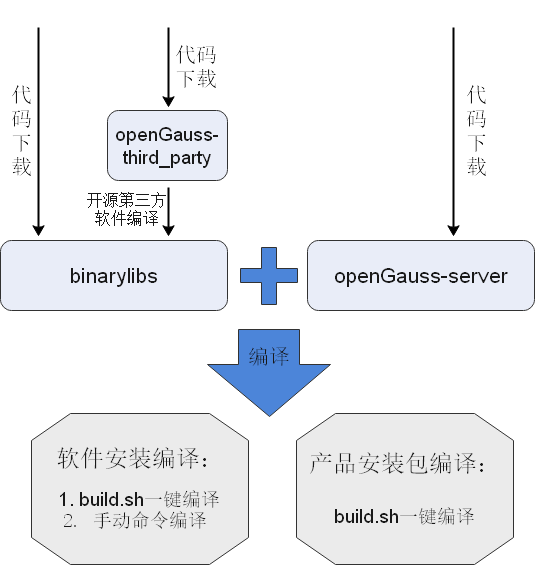

# 版本编译<a name="ZH-CN_TOPIC_0241496980"></a>


openGauss的编译过程和生成安装包的过程已经写成了一个一键式的脚本build.sh，可以方便的通过脚本进行编译操作。也可以自己配置环境变量，通过命令进行编译。

<!-- TOC -->

- [编译前准备](#编译前准备)
- [软件安装编译](#软件安装编译)
- [产品安装包编译](#产品安装包编译)
- [openGauss-OM编译](#openGauss-OM编译)
- [编译后验证](#编译后验证)

<!-- /TOC -->

本章节会介绍openGauss编译需要满足的前提条件，编译的操作步骤等，下图是对编译流程的大致概括，详细内容见下文。




## 编译前准备

### 代码下载

**前提条件**

已在本地安装并配置git和git-lfs。

**操作步骤**

1. 执行如下命令下载代码和开源第三方软件仓库：

   ```
   [user@linux sda]$ git clone https://gitee.com/opengauss/openGauss-server.git openGauss-server -b branchname #openGauss的代码仓库
   [user@linux sda]$ git clone https://gitee.com/opengauss/openGauss-third_party.git openGauss-third_party #openGauss依赖的开源第三方软件仓库
   [user@linux sda]$ # mkdir binarylibs        关于此注释步骤，请阅读说明
   ```

    > **说明：** 
   >
   >-   branchname：代码分支名称，缺省可不填，如需编译openGauss 2.1.0的代码，可加上-b 2.1.0的参数。
   >-   binarylibs：存放编译构建好的开源第三方软件的文件夹，用户可通过[开源软件编译构建](#开源软件编译构建)获取。由于开源软件编译构建耗时长，我们特地使用openGauss-third\_party编译构建出了一份binarylibs并压缩上传到了网上，用户可以直接下载获取。  
   > 社区提供三个平台编译好的二进制文件。对应各个平台下载地址：\
      **openEuler_arm:** https://opengauss.obs.cn-south-1.myhuaweicloud.com/3.1.0/binarylibs/openGauss-third_party_binarylibs_openEuler_arm.tar.gz
      **openEuler_x86:** https://opengauss.obs.cn-south-1.myhuaweicloud.com/3.1.0/binarylibs/openGauss-third_party_binarylibs_openEuler_x86_64.tar.gz
      **Centos_x86:** https://opengauss.obs.cn-south-1.myhuaweicloud.com/3.1.0/binarylibs/openGauss-third_party_binarylibs_Centos7.6_x86_64.tar.gz

   >  下载完毕后执行解压并重命名 mv openGauss-third_party_binarylibs binarylibs。

2.  下载项进度均显示为100%时表示下载成功。

### 开源软件编译构建

**开源软件编译构建**

openGauss的编译，需要提前把所依赖的开源第三方软件进行编译和构建。这些开源第三方软件存放在代码openGauss-third\_party代码仓中，用户下载完毕之后应用git lfs pull获取代码仓中的大文件，并且用户通常只需要构建一次。若存在开源软件版本更新，则需要重新构建。

由于此步骤耗时较长，我们使用openGauss-third\_party编译构建出了一份binarylibs，用户可以参考[代码下载](#代码下载)直接下载获取。

**表 1**  openGauss开源第三方软件编译前置软件要求

<a name="zh-cn_topic_0283136302_table1212531681911"></a>

<table><thead align="left"><tr id="zh-cn_topic_0283136302_row317811661910"><th class="cellrowborder" valign="top" width="50%" id="mcps1.2.3.1.1"><p id="zh-cn_topic_0283136302_p14178216101910"><a name="zh-cn_topic_0283136302_p14178216101910"></a><a name="zh-cn_topic_0283136302_p14178216101910"></a>所需软件</p>
</th>
<th class="cellrowborder" valign="top" width="50%" id="mcps1.2.3.1.2"><p id="zh-cn_topic_0283136302_p1117815167195"><a name="zh-cn_topic_0283136302_p1117815167195"></a><a name="zh-cn_topic_0283136302_p1117815167195"></a>建议版本</p>
</th>
</tr>
</thead>
<tbody><tr id="zh-cn_topic_0283136302_row12665347175013"><td class="cellrowborder" valign="top" width="50%" headers="mcps1.2.3.1.1 "><p id="zh-cn_topic_0283136302_p666574775019"><a name="zh-cn_topic_0283136302_p666574775019"></a><a name="zh-cn_topic_0283136302_p666574775019"></a>python3</p>
</td>
<td class="cellrowborder" valign="top" width="50%" headers="mcps1.2.3.1.2 "><p id="zh-cn_topic_0283136302_p10665104719506"><a name="zh-cn_topic_0283136302_p10665104719506"></a><a name="zh-cn_topic_0283136302_p10665104719506"></a>建议版本：3.6</p>
</td>
</tr>
<tr id="zh-cn_topic_0283136302_row197487916204"><td class="cellrowborder" valign="top" width="50%" headers="mcps1.2.3.1.1 "><p id="zh-cn_topic_0283136302_p107489922013"><a name="zh-cn_topic_0283136302_p107489922013"></a><a name="zh-cn_topic_0283136302_p107489922013"></a>python3-devel</p>
</td>
<td class="cellrowborder" valign="top" width="50%" headers="mcps1.2.3.1.2 "><p id="zh-cn_topic_0283136302_p2748179172017"><a name="zh-cn_topic_0283136302_p2748179172017"></a><a name="zh-cn_topic_0283136302_p2748179172017"></a>建议版本：3</p>
</td>
</tr>
<tr id="row263592810916"><td class="cellrowborder" valign="top" width="50%" headers="mcps1.2.3.1.1 "><p id="p3635128198"><a name="p3635128198"></a><a name="p3635128198"></a>setuptools</p>
</td>
<td class="cellrowborder" valign="top" width="50%" headers="mcps1.2.3.1.2 "><p id="p14635728598"><a name="p14635728598"></a><a name="p14635728598"></a>建议版本：36.6.1</p>
</td>
</tr>
<tr id="row07201041201615"><td class="cellrowborder" valign="top" width="50%" headers="mcps1.2.3.1.1 "><p id="p18720144111617"><a name="p18720144111617"></a><a name="p18720144111617"></a>libaio-devel</p>
</td>
<td class="cellrowborder" valign="top" width="50%" headers="mcps1.2.3.1.2 "><p id="p2720144110166"><a name="p2720144110166"></a><a name="p2720144110166"></a>建议版本：0.3.109-13</p>
</td>
</tr>
<tr id="row56941338161617"><td class="cellrowborder" valign="top" width="50%" headers="mcps1.2.3.1.1 "><p id="p126948386168"><a name="p126948386168"></a><a name="p126948386168"></a>flex</p>
</td>
<td class="cellrowborder" valign="top" width="50%" headers="mcps1.2.3.1.2 "><p id="p56954385169"><a name="p56954385169"></a><a name="p56954385169"></a>要求版本：2.5.31 以上</p>
</td>
</tr>
<tr id="row18537134151611"><td class="cellrowborder" valign="top" width="50%" headers="mcps1.2.3.1.1 "><p id="p135391734101615"><a name="p135391734101615"></a><a name="p135391734101615"></a>ncurses-devel</p>
</td>
<td class="cellrowborder" valign="top" width="50%" headers="mcps1.2.3.1.2 "><p id="p553973412160"><a name="p553973412160"></a><a name="p553973412160"></a>建议版本：5.9-13.20130511</p>
</td>
</tr>
<tr id="row10128237131716"><td class="cellrowborder" valign="top" width="50%" headers="mcps1.2.3.1.1 "><p id="p1912963771719"><a name="p1912963771719"></a><a name="p1912963771719"></a>lsb_release</p>
</td>
<td class="cellrowborder" valign="top" width="50%" headers="mcps1.2.3.1.2 "><p id="p14129143711712"><a name="p14129143711712"></a><a name="p14129143711712"></a>建议版本：4.1</p>
</td>
</tr>
<tr id="zh-cn_topic_0283136302_row36571916172017"><td class="cellrowborder" valign="top" width="50%" headers="mcps1.2.3.1.1 "><p id="zh-cn_topic_0283136302_p18657151610204"><a name="zh-cn_topic_0283136302_p18657151610204"></a><a name="zh-cn_topic_0283136302_p18657151610204"></a>pam-devel</p>
</td>
<td class="cellrowborder" valign="top" width="50%" headers="mcps1.2.3.1.2 "><p id="zh-cn_topic_0283136302_p16578161209"><a name="zh-cn_topic_0283136302_p16578161209"></a><a name="zh-cn_topic_0283136302_p16578161209"></a>建议版本：1.1.8-1.3.1</p>
</td>
</tr>
<tr id="zh-cn_topic_0283136302_row8539145811555"><td class="cellrowborder" valign="top" width="50%" headers="mcps1.2.3.1.1 "><p id="zh-cn_topic_0283136302_p154012589557"><a name="zh-cn_topic_0283136302_p154012589557"></a><a name="zh-cn_topic_0283136302_p154012589557"></a>libffi-devel</p>
</td>
<td class="cellrowborder" valign="top" width="50%" headers="mcps1.2.3.1.2 "><p id="zh-cn_topic_0283136302_p115401158175510"><a name="zh-cn_topic_0283136302_p115401158175510"></a><a name="zh-cn_topic_0283136302_p115401158175510"></a>建议版本：3.1</p>
</td>
</tr>
<tr id="zh-cn_topic_0283136302_row317914169193"><td class="cellrowborder" valign="top" width="50%" headers="mcps1.2.3.1.1 "><p id="zh-cn_topic_0283136302_p201791916201910"><a name="zh-cn_topic_0283136302_p201791916201910"></a><a name="zh-cn_topic_0283136302_p201791916201910"></a>patch</p>
</td>
<td class="cellrowborder" valign="top" width="50%" headers="mcps1.2.3.1.2 "><p id="zh-cn_topic_0283136302_p1018051610198"><a name="zh-cn_topic_0283136302_p1018051610198"></a><a name="zh-cn_topic_0283136302_p1018051610198"></a>建议版本：2.7.1-10</p>
</td>
</tr>
<tr id="row058514201981"><td class="cellrowborder" valign="top" width="50%" headers="mcps1.2.3.1.1 "><p id="p1658614202084"><a name="p1658614202084"></a><a name="p1658614202084"></a>golang</p>
</td>
<td class="cellrowborder" valign="top" width="50%" headers="mcps1.2.3.1.2 "><p id="p18586192014810"><a name="p18586192014810"></a><a name="p18586192014810"></a>建议版本：1.13.3及以上</p>
</td>
</tr>
<tr id="row1128152932212"><td class="cellrowborder" valign="top" width="50%" headers="mcps1.2.3.1.1 "><p id="p17291829182210"><a name="p17291829182210"></a><a name="p17291829182210"></a>autoconf</p>
</td>
<td class="cellrowborder" valign="top" width="50%" headers="mcps1.2.3.1.2 "><p id="p53092915223"><a name="p53092915223"></a><a name="p53092915223"></a>建议版本：2.69</p>
</td>
</tr>
<tr id="row1172523915224"><td class="cellrowborder" valign="top" width="50%" headers="mcps1.2.3.1.1 "><p id="p1725143902212"><a name="p1725143902212"></a><a name="p1725143902212"></a>automake</p>
</td>
<td class="cellrowborder" valign="top" width="50%" headers="mcps1.2.3.1.2 "><p id="p07251739142211"><a name="p07251739142211"></a><a name="p07251739142211"></a>建议版本：1.13.4</p>
</td>
</tr>
<tr id="row8361101702315"><td class="cellrowborder" valign="top" width="50%" headers="mcps1.2.3.1.1 "><p id="p13361117192311"><a name="p13361117192311"></a><a name="p13361117192311"></a>cmake</p>
</td>
<td class="cellrowborder" valign="top" width="50%" headers="mcps1.2.3.1.2 "><p id="p63616179237"><a name="p63616179237"></a><a name="p63616179237"></a>建议版本：3.18</p>
</td>
</tr>
<tr id="row6332136277"><td class="cellrowborder" valign="top" width="50%" headers="mcps1.2.3.1.1 "><p id="p83339361373"><a name="p83339361373"></a><a name="p83339361373"></a>diffutils</p>
</td>
<td class="cellrowborder" valign="top" width="50%" headers="mcps1.2.3.1.2 "><p id="p1133414367715"><a name="p1133414367715"></a><a name="p1133414367715"></a>建议版本：3.7</p>
</td>
</tr>
<tr id="row142086918107"><td class="cellrowborder" valign="top" width="50%" headers="mcps1.2.3.1.1 "><p id="p62105941014"><a name="p62105941014"></a><a name="p62105941014"></a>openssl-devel</p>
</td>
<td class="cellrowborder" valign="top" width="50%" headers="mcps1.2.3.1.2 "><p id="p1421039181011"><a name="p1421039181011"></a><a name="p1421039181011"></a>建议版本：1.1.1</p>
</td>
</tr>
<tr id="row116164361033"><td class="cellrowborder" valign="top" width="50%" headers="mcps1.2.3.1.1 "><p id="p76176361630"><a name="p76176361630"></a><a name="p76176361630"></a>libtool</p>
</td>
<td class="cellrowborder" valign="top" width="50%" headers="mcps1.2.3.1.2 "><p id="p161720364313"><a name="p161720364313"></a><a name="p161720364313"></a>建议版本：2.4.2及以上</p>
</td>
</tr>
<tr id="zh-cn_topic_0283136302_row185636241451"><td class="cellrowborder" valign="top" width="50%" headers="mcps1.2.3.1.1 "><p id="zh-cn_topic_0283136302_p65646241259"><a name="zh-cn_topic_0283136302_p65646241259"></a><a name="zh-cn_topic_0283136302_p65646241259"></a>libtool-devel</p>
</td>
<td class="cellrowborder" valign="top" width="50%" headers="mcps1.2.3.1.2 "><p id="zh-cn_topic_0283136302_p9564624153"><a name="zh-cn_topic_0283136302_p9564624153"></a><a name="zh-cn_topic_0283136302_p9564624153"></a>建议版本：2.4.2及以上</p>
</td>
</tr>
</tbody>
</table>


在开始编译第三方库之前，请自行准备好gcc7.3。建议用已发布的编译好的第三方库中gcc，并配置好环境变量。

在安装完[表1 openGauss开源三方件编译前置软件要求](#zh-cn_topic_0283136302_table1212531681911)中的软件后，请将python默认版本指向python3.x并执行如下操作：

1. 执行如下命令进入内核依赖的开源第三方软件目录，进行开源第三方软件的编译和构建，产生相应的二进制程序或库文件。/sda/openGauss-third\_party为开源第三方软件下载目录。

   ```
   [user@linux sda]$ cd /sda/openGauss-third_party/build
   [user@linux build]$ sh build_all.sh
   ```

2. 用户执行以上命令之后，可以自动生成数据库编译所需的开源第三方软件，如果想单独的生成某个开源三方软件，可以进入对应的目录，执行build.sh脚本，如：

   ```
   [user@linux sda]$ cd /sda/openGauss-third_party/dependency/openssl
   [user@linux openssl]$ sh build.sh
   ```

    即可编译生成openssl

    > **说明：**  
   >
   >相关的报错日志可以查看对应的build目录下对应名字的log以及对应模块下的log，如dependency模块下的openssl的相关编译安装日志可以查看：
   >
   >-   /sda/openGauss-third\_party/build/dependency\_build.log
   >-   /sda/openGauss-third\_party/dependency/build/openssl\_build.log
   >-   /sda/openGauss-third\_party/dependency/openssl/build\_openssl.log


**编译构建结果**

执行上述脚本，最终编译构建出的结果会存放在openGauss-third\_party目录下的output目录。这些文件会在后面编译openGauss-server时使用到。

### 编译脚本介绍
openGauss-server/build.sh是编译过程中的重要脚本工具。其集成了软件安装编译、产品安装包编译两种功能，可快速进行代码编译和打包。

详细参数选项如下表所示：

**表 2**  build.sh参数功能选项介绍

<a name="table1575410358472"></a>
<table><thead align="left"><tr id="row1975463519471"><th class="cellrowborder" valign="top" width="14.84148414841484%" id="mcps1.2.5.1.1"><p id="p27541635104712"><a name="p27541635104712"></a><a name="p27541635104712"></a>功能选项</p>
</th>
<th class="cellrowborder" valign="top" width="34.87348734873487%" id="mcps1.2.5.1.2"><p id="p272091325813"><a name="p272091325813"></a><a name="p272091325813"></a>缺省值</p>
</th>
<th class="cellrowborder" valign="top" width="12.520752075207521%" id="mcps1.2.5.1.3"><p id="p493319175413"><a name="p493319175413"></a><a name="p493319175413"></a>参数</p>
</th>
<th class="cellrowborder" valign="top" width="37.76427642764276%" id="mcps1.2.5.1.4"><p id="p1675513514716"><a name="p1675513514716"></a><a name="p1675513514716"></a>功能</p>
</th>
</tr>
</thead>
<tbody><tr id="row107551359472"><td class="cellrowborder" valign="top" width="14.84148414841484%" headers="mcps1.2.5.1.1 "><p id="p117551135124713"><a name="p117551135124713"></a><a name="p117551135124713"></a>-h</p>
</td>
<td class="cellrowborder" valign="top" width="34.87348734873487%" headers="mcps1.2.5.1.2 "><p id="p117201513155810"><a name="p117201513155810"></a><a name="p117201513155810"></a>不使用此选项</p>
</td>
<td class="cellrowborder" valign="top" width="7.520752075207521%" headers="mcps1.2.5.1.3 "><p id="p169341617443"><a name="p169341617443"></a><a name="p169341617443"></a>-</p>
</td>
<td class="cellrowborder" valign="top" width="42.76427642764276%" headers="mcps1.2.5.1.4 "><p id="p157551835144710"><a name="p157551835144710"></a><a name="p157551835144710"></a>帮助菜单。</p>
</td>
</tr>
<tr id="row0188244165818"><td class="cellrowborder" valign="top" width="14.84148414841484%" headers="mcps1.2.5.1.1 "><p id="p51882044145810"><a name="p51882044145810"></a><a name="p51882044145810"></a>-m</p>
</td>
<td class="cellrowborder" valign="top" width="34.87348734873487%" headers="mcps1.2.5.1.2 "><p id="p718894410584"><a name="p718894410584"></a><a name="p718894410584"></a>release</p>
</td>
<td class="cellrowborder" valign="top" width="17.520752075207521%" headers="mcps1.2.5.1.3 "><p id="p1993418171411"><a name="p1993418171411"></a><a name="p1993418171411"></a>[debug | release | memcheck]</p>
</td>
<td class="cellrowborder" valign="top" width="32.76427642764276%" headers="mcps1.2.5.1.4 "><p id="p5188184405812"><a name="p5188184405812"></a><a name="p5188184405812"></a>选择编译目标版本。</p>
</td>
</tr>
<tr id="row1675515357477"><td class="cellrowborder" valign="top" width="14.84148414841484%" headers="mcps1.2.5.1.1 "><p id="p6755235114711"><a name="p6755235114711"></a><a name="p6755235114711"></a>-3rd</p>
</td>
<td class="cellrowborder" valign="top" width="34.87348734873487%" headers="mcps1.2.5.1.2 "><p id="p1772010136588"><a name="p1772010136588"></a><a name="p1772010136588"></a>${代码路径}/binarylibs</p>
</td>
<td class="cellrowborder" valign="top" width="17.520752075207521%" headers="mcps1.2.5.1.3 "><p id="p1493614171349"><a name="p1493614171349"></a><a name="p1493614171349"></a>[binarylibs path]</p>
</td>
<td class="cellrowborder" valign="top" width="32.76427642764276%" headers="mcps1.2.5.1.4 "><p id="p1755173520474"><a name="p1755173520474"></a><a name="p1755173520474"></a>指定binarylibs的路径，需绝对路径。</p>
</td>
</tr>
<tr id="row1875543594716"><td class="cellrowborder" valign="top" width="14.84148414841484%" headers="mcps1.2.5.1.1 "><p id="p475523515475"><a name="p475523515475"></a><a name="p475523515475"></a>-pkg</p>
</td>
<td class="cellrowborder" valign="top" width="34.87348734873487%" headers="mcps1.2.5.1.2 "><p id="p372131325815"><a name="p372131325815"></a><a name="p372131325815"></a>不使用此功能</p>
</td>
<td class="cellrowborder" valign="top" width="7.520752075207521%" headers="mcps1.2.5.1.3 "><p id="p693619174418"><a name="p693619174418"></a><a name="p693619174418"></a>-</p>
</td>
<td class="cellrowborder" valign="top" width="42.76427642764276%" headers="mcps1.2.5.1.4 "><p id="p13756143512476"><a name="p13756143512476"></a><a name="p13756143512476"></a>将代码编译结果压缩封装成安装包。</p>
</td>
</tr>
<tr id="row1271210213485"><td class="cellrowborder" valign="top" width="14.84148414841484%" headers="mcps1.2.5.1.1 "><p id="p3713112184817"><a name="p3713112184817"></a><a name="p3713112184817"></a>-nopt</p>
</td>
<td class="cellrowborder" valign="top" width="34.87348734873487%" headers="mcps1.2.5.1.2 "><p id="p11982718195610"><a name="p11982718195610"></a><a name="p11982718195610"></a>不使用此功能</p>
</td>
<td class="cellrowborder" valign="top" width="7.520752075207521%" headers="mcps1.2.5.1.3 "><p id="p12969132175620"><a name="p12969132175620"></a><a name="p12969132175620"></a>-</p>
</td>
<td class="cellrowborder" valign="top" width="42.76427642764276%" headers="mcps1.2.5.1.4 "><p id="p371302154814"><a name="p371302154814"></a><a name="p371302154814"></a>如果使用此功能，则对鲲鹏平台的相关CPU不进行优化。</p>
</td>
</tr>
</tbody>
</table>


> **说明：** 
>
>-  -m \[debug | release | memcheck\]表示可选择三种目标版本：
>
>     -   release：代表生成release版本的二进制程序，该版本编译时，配置GCC高级别优化选项，去除内核调试代码，通常用于生产环境或性能测试环境。
>
>     -   debug：代表生成debug版本的二进制程序，该版本编译时，增加内核代码调试功能，通常用于开发自测环境。
>
>     -   memcheck：代表生成memcheck版本的二进制程序，该版本编译时，在debug版本基础上新增ASAN功能，通常用于定位内存问题。
>
>-  -3rd \[binarylibs path\]为binarylibs的路径。缺省情况下，会认为当前代码文件夹下存在binarylibs。因此如果将binarylibs移动到openGauss-server下，或在openGauss-server下创建了指向binarylibs的软链接，可不指定此选项。但需要注意其容易被git clean等操作删除。
>
>-  此脚本每个参数选项都设置了缺省值，且数量并不多，依赖关系简单，因此使用时非常方便。如果用户需求值与缺省值不同，请根据实际情况进行设置。

## 软件安装编译
软件安装编译即将代码编译生成软件，并将软件安装到机器上。提供一键式编译脚本build.sh进行操作，也可以自己配置环境变量手动操作。两种方式将在本章节的一键式脚本编译操作步骤、手动编译操作步骤中进行讲解。

### 前提条件

-   已按照[搭建编译环境](搭建编译环境.md)的要求准备好相关软硬件，并且已参考[代码下载](#代码下载)下载了代码。
-   已完成开源软件编译构建，具体请参见[开源软件编译构建](#开源软件编译构建)。并将gcc7.3按已发布的编译好的第三方库目录结构放置在output目录中。
-   了解[build.sh介绍](#编译脚本介绍)脚本的参数选项和功能。
-   代码环境干净，没有以前编译生成的文件。具体请参见[FAQ](FAQ.md)。 

### 一键式脚本编译

1.  执行如下命令进入到软件代码编译脚本目录。

    ```
    [user@linux sda]$ cd /sda/openGauss-server
    ```

2.  执行如下命令，编译安装openGauss。

    ```
    [user@linux openGauss-server]$ sh build.sh -m [debug | release | memcheck] -3rd [binarylibs path]
    ```

    例如：

    ```
    sh build.sh        # 编译安装release版本的openGauss。需代码目录下有binarylibs或者其软链接，否则将会失败。
    sh build.sh -m debug -3rd /sdc/binarylibs            # 编译安装debug版本的openGauss
    ```

3.  显示如下内容，表示编译成功。

    ```
    make compile successfully!
    ```

    -   编译后软件安装路径为：/sda/openGauss-server/mppdb_temp_install
    -   编译后的二进制放置路径为：/sda/openGauss-server/mppdb_temp_install/bin
    -   编译日志为：./build/script/makemppdb_pkg.log

4.  导入环境变量，即可进行初始化和启动数据库。

    ```
    export CODE_BASE=________     # openGauss-server的路径
    export GAUSSHOME=$CODE_BASE/mppdb_temp_install/
    export LD_LIBRARY_PATH=$GAUSSHOME/lib::$LD_LIBRARY_PATH
    export PATH=$GAUSSHOME/bin:$PATH
    ```


### 手动编译

1.  执行如下命令进入到软件代码目录。

    ```
    [user@linux sda]$ cd /sda/openGauss-server
    ```

2.  获取对应平台的三方库二进制文件。

3.  配置环境变量，根据自己的代码下载位置补充两处“_\_\_\_”

    ```
    export CODE_BASE=________     # openGauss-server的路径
    export BINARYLIBS=________    # binarylibs的路径
    export GAUSSHOME=$CODE_BASE/dest/
    export GCC_PATH=$BINARYLIBS/buildtools/gcc7.3/
    export CC=$GCC_PATH/gcc/bin/gcc
    export CXX=$GCC_PATH/gcc/bin/g++
    export LD_LIBRARY_PATH=$GAUSSHOME/lib:$GCC_PATH/gcc/lib64:$GCC_PATH/isl/lib:$GCC_PATH/mpc/lib/:$GCC_PATH/mpfr/lib/:$GCC_PATH/gmp/lib/:$LD_LIBRARY_PATH
    export PATH=$GAUSSHOME/bin:$GCC_PATH/gcc/bin:$PATH
    ```

4.  选择版本进行configure。

    debug版：

    ```
    ./configure --gcc-version=7.3.0 CC=g++ CFLAGS='-O0' --prefix=$GAUSSHOME --3rd=$BINARYLIBS --enable-debug --enable-cassert --enable-thread-safety --with-readline --without-zlib
    ```

    release版：

    ```
    ./configure --gcc-version=7.3.0 CC=g++ CFLAGS="-O2 -g3" --prefix=$GAUSSHOME --3rd=$BINARYLIBS --enable-thread-safety --with-readline --without-zlib
    ```

    memcheck版：

    ```
    ./configure --gcc-version=7.3.0 CC=g++ CFLAGS='-O0' --prefix=$GAUSSHOME --3rd=$BINARYLIBS --enable-debug --enable-cassert --enable-thread-safety --with-readline --without-zlib --enable-memory-check
    ```

    > **说明：** 
    >
    >-   _\[debug | release | memcheck\]_ 表示可选择三种目标版本，三种目标版本如下所示：
    >
    >     -   release：代表生成release版本的二进制程序，该版本编译时，配置GCC高级别优化选项，去除内核调试代码，通常用于生产环境或性能测试环境。
    >
    >     -   debug：代表生成debug版本的二进制程序，该版本编译时，增加内核代码调试功能，通常用于开发自测环境。
    >
    >     -   memcheck：代表生成memcheck版本的二进制程序。该版本编译时，实质上是在debug版本基础上增加了ASAN功能，此版本通常用于定位内存问题。
    >
    >-   在ARM平台上，CFLAGS需要添加-D\_\_USE\_NUMA。在ARMv8.1或者更高的平台上（例如鲲鹏920），CFLAGS需要添加-D\_\_ARM\_LSE。
    >
    >-   若将binarylibs移动到openGauss-server下，或在openGauss-server下创建了指向binarylibs的软链接，可不指定--3rd参数。但这样做的话需要注意其容易被git clean等操作删除。
    >
    >-   如需使用MOT，需要在命令中添加 --enable-mot。
    
5. 执行如下命令，编译安装。

   ```
   [user@linux openGauss-server]$ make -sj
   [user@linux openGauss-server]$ make install -sj
   ```

    >  **说明：**  
    >
    > - -s参数是silent模式，有些编译信息不会打印出来。
    > - 如果使用-j参数，make执行的时候会一直增加并发数，有时会遇到“cannot allicate memory”的错。一般-j参数后可指定数字为 cpu数 X 2。如编译环境是4 CPU，可使用make -j8的参数进行编译。

6. 显示如下内容，表示编译安装成功。

   ```
   openGauss installation complete.
   ```

   -   编译后软件安装路径为：$GAUSSHOME
   -   编译后的二进制放置路径为：$GAUSSHOME/bin

## openGauss-OM编译

源码编译完openGauss-server代码仓之后，并没有gs_om。如需使用gs_om，需单独编译openGauss-OM，并将编译好的openGauss-xxx-om.tar.gz的包拷贝到openGauss-server安装包所在的目录，再按照[企业版]( https://opengauss.org/zh/docs/latest/docs/installation/%E4%BC%81%E4%B8%9A%E7%89%88%E5%AE%89%E8%A3%85.html )的方式进行安装。

### 操作步骤

1. git clone OM代码仓：

   ```
   [user@linux sda]$ git clone https://gitee.com/opengauss/openGauss-OM.git
   ```

2. 执行编译：

   ```
   [user@linux sda]$ cd openGauss-OM
   [user@linux sda]$ chmod +x build.sh
   [user@linux sda]$ export BINARYLIBS_PATH=/root/binarylibs  (这里填写前面的第三方软件包解压后的目录)
   [user@linux sda]$ ./build.sh -3rd $BINARYLIBS_PATH
   ```

3.  显示以下内容，表示 Gauss-OM编译成功：

   ```
   ROOT_DIR: /root/binarylibs
   Everything is ready.
   success!
   ```

   

## 产品安装包编译

本步骤是制作openGauss软件安装包，安装包的编译打包过程也集成在build.sh之中。本步骤的编译结果将不含gs_om软件，如需使用，请按[openGauss-OM编译](#openGauss-OM编译)的方式处理。

### 前提条件

-   已按照[搭建编译环境](搭建编译环境.md)的要求准备好相关软硬件，并且已参考[代码下载](#代码下载)下载了代码。
-   已完成开源软件编译构建，具体请参见[开源软件编译构建](#开源软件编译构建)。
-   了解  [build.sh介绍](#编译脚本介绍)脚本的参数选项和功能。
-   代码环境干净，没有以前编译生成的文件。具体请参见[FAQ](FAQ.md)。 

### 操作步骤

1.  执行如下命令进入到代码目录。

    ```
    [user@linux sda]$ cd /sda/openGauss-server
    ```

2.  执行如下命令编译出openGauss产品安装包。

    ```
    [user@linux openGauss-server]$ sh build.sh -m [debug | release | memcheck] -3rd [binarylibs path] -pkg
    ```

    例如：

    ```
    sh build.sh -pkg       # 生成release版本的openGauss安装包。需代码目录下有binarylibs或者其软链接，否则将会失败。
    sh build.sh -m debug -3rd /sdc/binarylibs -pkg           # 生成debug版本的openGauss安装包
    ```

    本操作和[软件安装编译](#软件安装编译)相比，同样会经历的一键式编译最终生成软件的过程与将软件封装成安装包的过程。对比 [build.sh介绍](#编译脚本介绍) 的使用命令可发现，此处仅增加了一个“-pkg” 功能选项。

3.  显示如下内容，表示安装包编译成功。

    ```
    success!
    ```

    -   生成的安装包会存放在./output目录下。
    -   编译和打包日志为：./build/script/makemppdb_pkg.log。


## 编译后验证

编译结束后，可按以下方式对编译后的openGauss进行验证:

1. 使用root用户，创建用户omm：

```
[user@linux sda]# useradd omm -g dbgrp
[user@linux sda]# passwd omm
```

2. 使用omm用户，在~/.bashrc中增加以下环境变量：

```
export GAUSSHOME=/root/openGauss-server/dest/ ##编译结果的路径，可根据实际情况修改
export LD_LIBRARY_PATH=$GAUSSHOME/lib:$LD_LIBRARY_PATH
export PATH=$GAUSSHOME/bin:$PATH
```

 并使环境变量生效：

```
[user@linux sda]$ source ~/.bashrc
```

3. 建立数据目录和日志目录：

```
[user@linux sda]$ mkdir ~/data
[user@linux sda]$ mkdir ~/log
[user@linux sda]$ chown -R omm:dbgrp /root/openGauss-server
```

4.数据库初始化：

```
[user@linux sda]$ gs_initdb -D /home/omm/data --nodename=db1 
```

5. 启动数据库：

```
[user@linux sda]$ gs_ctl start -D /home/omm/data -Z single_node -l /home/omm/log/opengauss.log
```

启动完毕后可通过 ps -ef | grep gaussdb检查数据库进程情况，或通过 gs_ctl query -D /home/omm/data检查数据库状态，或使用 gsql -d postgres 进入gsql命令行查看数据库的相关信息。
