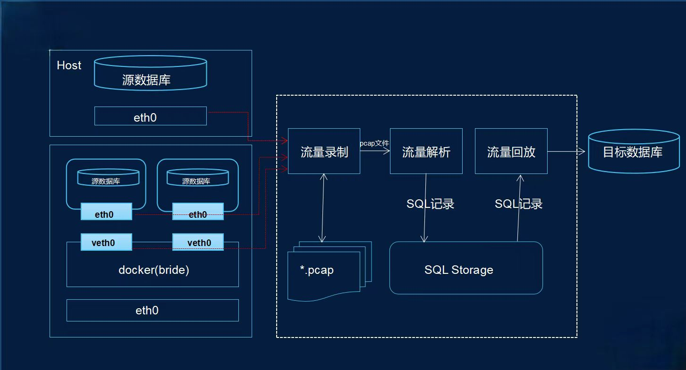
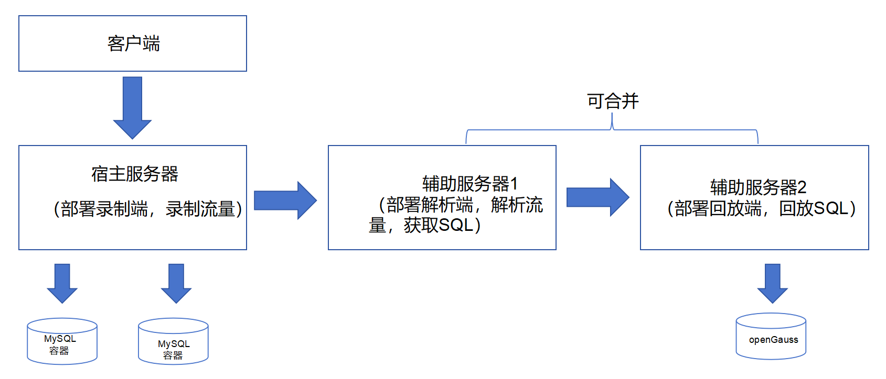

# 录制回放工具

## 功能介绍

SQL流量录制回放工具，可以录制源端数据库（MySQL）客户端的业务SQL，到目标端数据库（openGauss）进行回放，回放结束后可以查看统计到的慢SQL信息。

该工具支持三种录制方式和两种回放方式：

<table>
   <tr>
      <th>功能</th>
      <th>方式</th>
   </tr>
   <tr>
      <td>录制</td>
      <td>基于tcpdump录制 基于attach应用程序录制 基于MySQL系统表录制</td>
   </tr>
   <tr>
      <td>回放</td>
      <td>SQL语句筛选：全量回放；只回放查询语句
       回放策略：串行回放；并行回放；N倍压测
       回放媒介：基于数据库回放；基于json文件回放
      </td>
   </tr>
</table>

## 原理简介

### 录制
1. 基于tcpdump与数据库通信协议解析的流量录制，可以捕获源端数据库的网络流量，形成网络数据包文件，并根据源端数据库的通信协议，从网络数据包文件中解析出业务SQL。

   图1. tcpdump录制回放示意图

   

2. 基于attach应用程序的录制，可以对java应用程序进行动态插桩，直接采集java应用程序中的动态SQL，工具需与java应用程序部署在同一台机器上。

3. 基于MySQL系统表的录制，通过调整MySQL全局参数general_log=ON，log_output='table'，可以使MySQL的系统表mysql.general_log记录全量SQL，工具可以通过查询该表来录制业务SQL。

### 回放

在生产环境录制一个周期后，就可以将sql拿到实验环境进行回放，回放场景如下：

<table>
    <tr>
        <th>回放方式</th>
        <th>场景描述</th>
        <th>优势</th>
        <th>操作流程</th>
    </tr>
    <tr>
        <td>全量回放</td>
        <td>在实验环境将录制到的所有SQL进行回放</td>
        <td>可完全模拟录制期间的业务流</td>
        <td>全量迁移（业务环境MySQL到测试环境openGauss） --> 录制 --> 回放全部SQL（监控openGauss，发现问题）</td>
    </tr>
    <tr>
        <td>只回放查询</td>
        <td>在实验环境或业务环境将其中的查询语句进行回放</td>
        <td>可配合增量迁移直接在业务环境上进行N倍的查询压测，在割接之前暴露问题，但查询不是实时的</td>
        <td>全量迁移（业务环境MySQL到业务环境openGauss） --> 录制 + 增量迁移 --> 回放查询SQL + 增量迁移（监控openGauss发现问题） --> 割接 --> 反向迁移</td>
    </tr>
</table>

## 环境准备

该工具支持在Linux使用，Windows系统仅支持基于MySQL系统表的录制方式，所以推荐使用Linux系统，Linux上工具部署形态如下：

   

## 约束

### 前置操作

1. 录制前需保证源端数据库和目标端数据库基础数据一致。

### tcpdump录制

1. 录制需要root用户或sudo提权用户操作。
2. 在docker录制时需要docker中安装有docker os shell。
3. 源数据库客户端禁用ssl。
4. 目标服务器或容器需安装libpcap。

### attach录制

1. 目标进程应用程序为jdk8+，环境要求为jdk11+。
2. 目标进程使用的MySQL驱动为mysql-jdbc-connector 5.x及8.x。
3. 录制得到的SQL只支持json文件存储。
4. 无法获取SQL执行耗时。
5. 不支持采集多线程的目标程序。

### general_log录制

1. 调整MySQL全局参数general_log=ON，log_output='table'。
2. 无法获取SQL执行耗时。

### tcpdump解析

1. 只能完整解析开启录制的时间点之后新建连接执行的SQL。

### 回放

1. 只支持向openGauss数据库回放。
2. 回放库需要使用B库。
3. 只有通过tcpdump录制的SQL支持并行回放。
4. 只有update语句和select语句是慢SQL时，会打印执行计划。

## 操作步骤

### transcribe-replay-tool-6.0.0.jar

录制回放核心工具，用于调度各种插件进行录制，并负责解析网络数据包文件，以及SQL回放。

- 编译
~~~
cd transcribe-replay-tool
sh build.sh
~~~
编译后的工具包中已带有录制插件，使用者也可自己编译插件。

### 录制插件

#### tcpdump

网络流量采集工具，用于采集源端数据库的网络流量。

- 下载

~~~
wget https://www.tcpdump.org/release/tcpdump-4.9.3.tar.gz
~~~

- 解压 & 编译

~~~
tar -zxf tcpdump-4.9.3.tar.gz
cd tcpdump-4.9.3
./configure
make
~~~

#### attach.jar & agent.jar

动态插桩工具，用于直接采集java应用程序中的动态SQL。

- 源码地址

~~~
https://gitee.com/opengauss/compatibility-assessment/tree/master/dynamic_sql_collection
~~~

### 功能脚本

1. check.sh
   检查tcpdump插件进程运行状态，防止录制端异常停止时tcpdump进程未退出导致的异常采集，可与录制端同步开启，也可在录制进程结束后开启去清理残余进程。

2. scp.sh
   用于单向免密场景下，从录制端服务器转移网络数据包文件到本地，可在录制开始后执行该脚本，需传入以下参数：

~~~
-u: 录制端用户名
-h: 录制端服务器ip
-s: 录制端网络文件所在路径
-t: 免密端网络文件落盘路径
-n: 录制的网络文件名
~~~

- 编译

~~~
# 进入dynamic_sql_collection/agent和dynamic_sql_collection/attach进行编译
mvn clean package
~~~

## 工具使用

- 启动命令
~~~
java -jar transcribe-replay-tool-6.0.0.jar -t [transcribe|parse|replay] -f [transcribe.properties|parse.properties|replay.properties]
~~~

- 参数介绍
~~~
-t: 命令类型，可选transcribe/parse/replay，transcribe表示开启流量录制，parse表示开启解析网络数据包文件，replay表示开启sql回放
-f: 配置文件路径，根据命令类型分别可选录制端、解析端与回放端的配置文件路径，当采取attach方式录制时，只支持绝对路径
~~~

### 录制端

#### 启动命令

~~~
java -jar transcribe-replay-tool-6.0.0.jar -t transcribe -f transcribe.properties
~~~

#### 录制端配置项

~~~
# 全局配置项：三种录制方式均需配置
# sql.transcribe.mode: 录制方式，可选tcpdump/attach/general，分别表示流量采集，动态插桩与查询系统表的录制方式，String类型，无默认值
sql.transcribe.mode=tcpdump

# tcpdump配置，选择tcpdump录制方式时，另需配置以下项
# tcpdump
# tcpdump.plugin.path: tcpdump录制插件目录位置， String类型，默认值: 工具jar包路径下的plugin/子目录
tcpdump.plugin.path=/***/***/***
# tcpdump.network.interface: tcpdump工具监听的业务网口名称
tcpdump.network.interface=eth0
# tcpdump.database.port: tcpdump工具监听的数据库端口，int类型，无默认值
tcpdump.database.port=3306
# tcpdump.capture.duration: 录制时长，int类型，默认值: 1，单位: 分钟
tcpdump.capture.duration=1
# tcpdump.file.path: 网络数据包文件保暂存位置，录制得到的网络文件暂存在该路径下，若配置了远程主机信息，文件会被发送到远程主机，String类型，
# 默认值: 工具jar包所在路径下的tcpdump-files/子目录
tcpdump.file.path=/***/***/***
# tcpdump.file.name: 网络文件包名，String类型，默认值: tcpdump-file
tcpdump.file.name=tcpdump-file
# 单个网络文件包大小限制，int类型，默认值: 10，单位: MB
tcpdump.file.size=10
# max.cpu.threshold: 系统CPU使用率阈值，取值在0~1之间，当系统CPU使用率超过该值时，工具会停止录制，double类型，默认值: 0.85
max.cpu.threshold=0.85
# max.memory.threshold: 系统内存使用率阈值，取值在0~1之间，当系统内存使用率超过该值时，工具会停止录制，double类型，默认值: 0.85
max.memory.threshold=0.85
# max.disk.threshold: 磁盘使用率阈值，取值在0~1之间，当存储文件的磁盘占用率超过该值时，工具会停止录制，double类型，默认值: 0.85
max.disk.threshold=0.85
# remote.file.path: 远程主机的文件路径，录制生成的结果文件最终会发送到该路径下，String类型，无默认值
remote.file.path=/***/***/***
# remote.receiver.name: 远程主机的用户名，录制生成的结果文件最终会发送给该用户，String类型，默认值: root
remote.receiver.name=remote_user
# remote.receiver.password: 远程用户密码，String类型，无默认值
remote.receiver.password=******
# remote.node.ip: 远程主机ip，使用该ip将文件发送给远程主机，String类型，默认值: 127.0.0.1
remote.node.ip=127.0.0.1
# remote.node.port: 远程主机端口，int类型，默认值: 22
remote.node.port=22
# remote.retry.count: 发送失败重试次数，项远程主机发送文件允许的发送失败次数，超过该次数则停止录制，int类型，默认值: 1
remote.retry.count=1

# attach配置，选择attach录制方式时，另需配置以下项
# attach
# attach.plugin.path: attach.jar & agent.jar录制插件的位置，String类型，默认值: 工具jar包所在目录
attach.plugin.path=/***/***/***
# attach.process.pid: attach工具监控的java应用程序的pid，long类型，无默认值
attach.process.pid=1
# attach.target.schema: attach工具监控的java应用程序连接的数据库名称，String类型，无默认值
attach.target.schema=schema_name
# attach.capture.duration: attach工具采集sql的时长，int类型，默认值: 1，单位: 分钟
attach.capture.duration=1
# sql.file.path: attach采集到的sql文件存放目录，默认在工具jar包所在路径下的sql-files/子目录
sql.file.path=/***/***/***
# sql.file.name: attach工具采集到的sql文件名，String类型，默认值: sql-file
sql.file.name=sql-file
# sql.file.size: attach工具采集到的单个sql文件大小限制，int类型，默认值: 10，单位: MB
sql.file.size=10
# max.cpu.threshold: 系统CPU使用率阈值，取值在0~1之间，当系统CPU使用率超过该值时，工具会停止录制，double类型，默认值: 0.85
max.cpu.threshold=0.85
# max.memory.threshold: 系统内存使用率阈值，取值在0~1之间，当系统内存使用率超过该值时，工具会停止录制，double类型，默认值: 0.85
max.memory.threshold=0.85
# max.disk.threshold: 磁盘使用率阈值，取值在0~1之间，当存储文件的磁盘占用率超过该值时，工具会停止录制，double类型，默认值: 0.85
max.disk.threshold=0.85
# remote.file.path: 远程主机的文件路径，录制生成的结果文件最终会发送到该路径下，String类型，无默认值
remote.file.path=/***/***/***
# remote.receiver.name: 远程主机的用户名，录制生成的结果文件最终会发送给该用户，String类型，默认值: root
remote.receiver.name=remote_user
# remote.receiver.password: 远程用户密码，String类型，无默认值
remote.receiver.password=******
# remote.node.ip: 远程主机ip，使用该ip将文件发送给远程主机，String类型，默认值: 127.0.0.1
remote.node.ip=127.0.0.1
# remote.node.port: 远程主机端口，int类型，默认值: 22
remote.node.port=22
# remote.retry.count: 发送失败重试次数，项远程主机发送文件允许的发送失败次数，超过该次数则停止录制，int类型，默认值: 1
remote.retry.count=1

# general log配置，选择general录制方式时，另需配置以下项
# general.database.ip: 目标MySQL的ip，String类型，无默认值
general.database.ip=127.0.0.1
# general.database.port: 目标MySQL端口，int类型，默认值: 3306
general.database.port=3306
# general.database.username: 目标MySQL数据库查询用户，String类型，无默认值
general.database.username=db_user
# general.database.password: 目标MySQL数据库密码，String类型，无默认值
general.database.password=******
# general.sql.batch: 每次查询的数据条数，int类型，默认值: 10
general.sql.batch=10
# general.start.time: general log采集sql的开始时间，timestamp类型，默认值: 1970-01-01 00:00:01
general.start.time=1970-01-01 00:00:01
# sql.storage.mode: sql存储方式，可选json或db，选择json表示录制的sql存在json文件中，选择db表示录制的sql存在数据库中，String类型，默认值: json
sql.storage.mode=json
# 若选择sql存储方式为json，另需配置以下项
# sql.file.path: sql文件路径，String类型，默认值: 工具jar包所在路径下的sql-files/子目录
sql.file.path=/***/***/***
# sql.file.name: sql文件名，String类型，默认值: sql-file
sql.file.name=sql-file
# sql.file.size: sql文件大小限制，int类型，默认值: 10，单位: MB
sql.file.size=10
# 若选择sql存储方式为db，另需配置以下项
# database
# sql.database.ip: sql存储库的ip，String类型，无默认值
sql.database.ip=127.0.0.1
# sql.database.port: sql存储库端口，int类型，无默认值
sql.database.port=5432
# sql.database.username: sql存储库用户名，String类型，无默认值
sql.database.username=db_user
# sql.database.name: sql存储库名称，String类型，无默认值
sql.database.name=transcribe
# sql.database.password: sql存储库密码，String类型，无默认值
sql.database.password=******
# sql.table.name: 存储sql的表名称，String类型，默认值: sql_table
sql.table.name=sql_table
# sql.table.drop: 存储sql的表名若与数据库中已有表名一致，是否删除已有的表，boolean类型，默认值: false
sql.table.drop=false
~~~

注意：若选择的录制方式为tcpdump，需开启解析端对网络数据包文件进行解析，才能获取SQL。

### 解析端

#### 启动命令

~~~
java -jar transcribe-replay-tool-6.0.0.jar -t parse -f parse.properties
~~~

#### 解析端配置项

~~~
# parse
# 待解析的网络数据包文件所在目录
tcpdump.file.path=/***/***/***
# tcpdump.database.ip: tcpdump工具采集时监听的源端数据库的ip，String类型，无默认值
tcpdump.database.ip=127.0.0.1
# tcpdump.database.port: tcpdump工具采集时监听的源端数据库端口，int类型，无默认值
tcpdump.database.port=3306
# queue.size.limit: 解析时限定每次读取的最大报文条数，int类型，默认值: 10000
queue.size.limit=10000
# packet.batch.siz: 解析时每次提交sql所处理的报文条数，int类型，默认值: 10000
packet.batch.size=10000
# sql.storage.mode: sql存储方式，可选json或db，选择json表示录制的sql存在json文件中，选择db表示录制的sql存在数据库中，String类型，默认值: json
sql.storage.mode=json
# 若选择sql存储方式为json，另需配置以下项
# sql.file.path: sql文件路径，String类型，默认值: 工具jar包所在路径下的parse-files/子目录
sql.file.path=/***/***/***
# sql.file.name: sql文件名，String类型，默认值: parse-file
sql.file.name=parse
# sql.file.size: sql文件大小限制，int类型，默认值: 10，单位: MB
sql.file.size=10
# 若选择sql存储方式为db，另需配置以下项
# database
# sql.database.ip: sql存储库的ip，String类型，无默认值
sql.database.ip=127.0.0.1
# sql.database.port: sql存储库端口，int类型，无默认值
sql.database.port=5432
# sql.database.username: sql存储库用户名，String类型，无默认值
sql.database.username=db_user
# sql.database.name: sql存储库名称，String类型，无默认值
sql.database.name=db_name
# sql.database.password: sql存储库密码，String类型，无默认值
sql.database.password=******
# sql.table.name: 存储sql的表名称，String类型，默认值: sql_table
sql.table.name=sql_table
# sql.table.drop: 存储sql的表名若与数据库中已有表名一致，是否删除已有的表，boolean类型，默认值: false
sql.table.drop=false
~~~

### 回放端

#### 启动命令

~~~
java -jar transcribe-replay-tool-6.0.0.jar -t replay -f replay.properties
~~~

#### 回放端配置项
~~~
# 回放方式db或json，String类型，默认db
sql.storage.mode=json
# 回放策略 串行-serial 并行-parallel，String类型，默认serial
sql.replay.strategy = parallel
# N倍压测倍数，int类型
sql.replay.multiple=3
# 是否只回放查询语句，boolean类型，默认false，选择N倍压测时只能设置为true
sql.replay.only.query=false
# 并行回放的最大线程数，int类型
sql.replay.parallel.max.pool.size=5
# 慢SQL判定规则， 1或2，默认值： 2
sql.replay.slow.sql.rule=2
# 慢SQL判定规则规则1(与MySQL时间差距，单位：微秒)，int类型
sql.replay.slow.time.difference.threshold=1000
# 慢SQL判定规则2:(openGauss执行耗时)， int类型
sql.replay.slow.sql.duration.threshold=1000
# 存储慢SQL的csv文件路径
sql.replay.slow.sql.csv.dir=/***/***/***
# 慢SQL打印TOPN，int类型
sql.replay.slow.top.number=5
# MySQL和openGauss执行时间对比图采样间隔
sql.replay.draw.interval=1000
# 回放session白名单， 格式: 192.168.0.1，192.168.0.1:8888，[2407:c080:1200:22a0:a09f:d625:2787:800b]或者[2407:c080:1200:22a0:a09f:d625:2787:800b]:54068， session之间用';'分隔
sql.replay.session.white.list=[]
# 回放session黑名单， 格式: 192.168.0.1，192.168.0.1:8888，[2407:c080:1200:22a0:a09f:d625:2787:800b]或者[2407:c080:1200:22a0:a09f:d625:2787:800b]:54068， session之间用';'分隔
sql.replay.session.black.list=[192.168.0.229:60032]

# 回放端数据库ip，String类型，无默认值
sql.replay.database.ip=192.168.0.34
# 回放端数据库端口，int类型，无默认值
sql.replay.database.port=5432
# 源端数据库和目标端schema映射关系，不设置schema默认使用public，多个映射关系用;分割
sql.replay.database.schema.map=mysql1：opengauss1：schema1；mysql2：opengauss2
# 回放端数据库用户名，String类型，无默认值
sql.replay.database.username=opengauss_test
# 回放端数据库用户密码，String类型，无默认值
sql.replay.database.password=Sample@123

# 若选择sql回放方式为db，另需配置以下项
# database
# sql.database.ip: sql存储库的ip，String类型，无默认值
sql.database.ip=127.0.0.1
# sql.database.port: sql存储库端口，int类型，无默认值
sql.database.port=5432
# sql.database.username: sql存储库用户名，String类型，无默认值
sql.database.username=db_user
# sql.database.name: sql存储库名称，String类型，无默认值
sql.database.name=db_name
# sql.database.password: sql存储库密码，String类型，无默认值
sql.database.password=******
# sql.table.name: 存储sql的表名称，String类型，默认值: sql_table
sql.table.name=sql_table

# 若选择sql回放方式为json，另需配置以下项
# sql.file.path: sql文件路径，String类型，和解析端保持一致
sql.file.path=/***/***/***
# sql.file.name: sql文件名，String类型，和解析端保持一致
sql.file.name=parse-file
~~~
