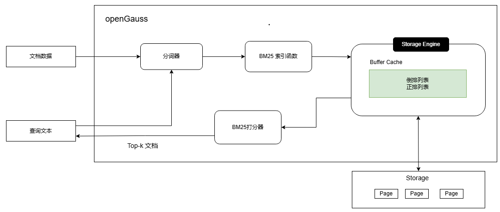

# BM25全文检索索引实现
本章节主要介绍openGauss中BM25索引的相关实现。BM25索引主要包含以下几个部分:

**1.文本数据输入**：输入待插入文档库或者查询的文本数据。

**2.文本分词**：对于输入的文本，使用分词器将其转换为一个个独立的术语。

**3.构建倒排索引和正排索引**：内置系统函数获取分词好的术语，构建正排索引（文档->[术语1，术语2，...]）和倒排索引（术语1->[文档1，文档2，...]）。

**4.正排、倒排索引对接openGauss存储引擎**：对接openGauss存储，将构建好的索引数据持久化，支持主备高可用、备份恢复等能力。

**5.索引扫描**：扫描时通过BM25算法对文档与查询文本之间的相关性进行打分，并返回排序结果。

## 分词器
openGauss BM25集成开源cppjieba分词器，使用“Keyword Extraction”、“Cut With HMM”、“CutForSearch”方法分词，无需手动分词。分词方法使用为内部实现，不支持自定义修改。jieba分词器是一款高效且广泛使用的分词工具，不仅支持英文分词，而且能够很好的将连续的中文文本切分为独立的词语或词组。其设计兼顾了准确性、灵活性和易用性，适用于自然语言处理（NLP）、文本挖掘、信息检索等多种场景。主要支持以下特性：
- 精确模式：基于前缀词典与动态规划算法，优先输出最合理的分词结果，适合文本分析。
- 搜索引擎模式：在精确模式基础上对长词再次切分，提升搜索相关内容的召回率。
- 支持用户自定义词典，允许添加专业术语或新词以提升领域适应性。
- 提供关键词提取等进阶功能，扩展分词后处理能力。

## 正排索引和倒排索引
由于openGauss存储引擎是以8k页面的形式存储数据。因此，正排索引和倒排索引的数据以页面链表的形式进行存储。

**正排索引**：
正排索引主要是记录文档本身信息和包含的术语信息：[key: doc_id] -> [citd, (术语1_location, ..., 术语n_location)]
- 记录文档id以及在行存表中的位置（citd）等信息，主要用于搜索时，返回文档实际数据以及进行可见性判断。
- 记录每篇文档包含了哪些术语，主要用于文档删除时，能够找到术语对应的倒排索引数据并删除记录的文档相关信息。

**倒排索引**：
倒排索引主要记录术语和包含该术语的文档列表之间的映射关系：[术语] -> [doc1, doc2, ..., docn]
- 文档列表记录该术语在每篇文档里出现的词频信息和文档长度信息，用于BM25评分。
- 倒排索引主要用于扫描，根据搜索词匹配相应的文档术语倒排索引，对包含该搜索词所有文档使用BM25算法进行相关性打分，筛选出top-k个相关性最高的文档。
