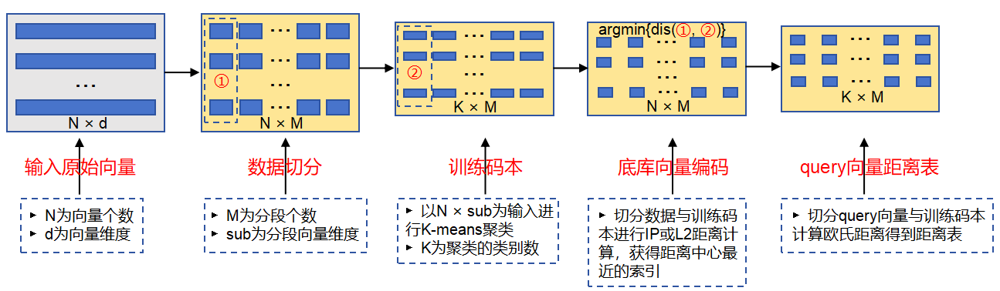
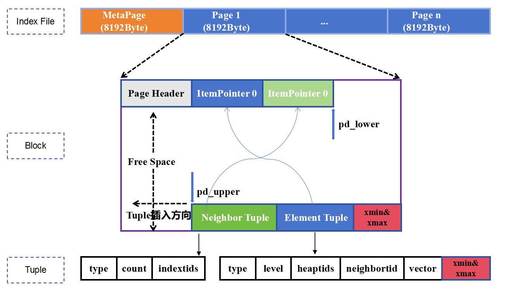
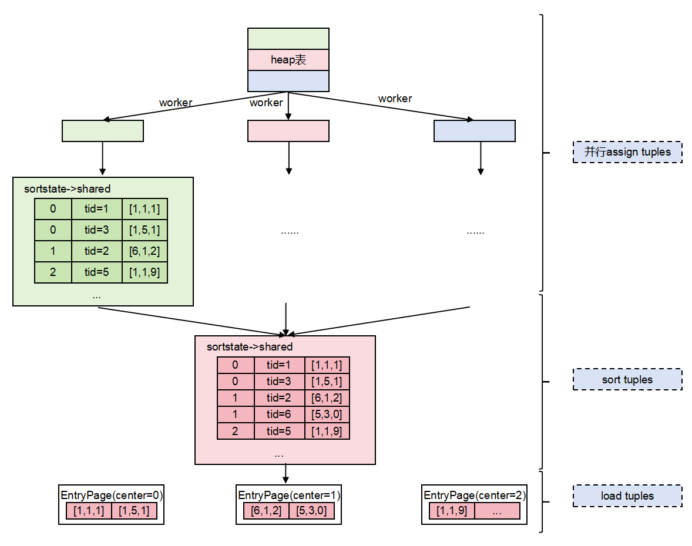

# 向量存储引擎

## 架构设计

#### SQL层
- Embedding：支持与DeepSeek、Qwen、盘古大模型对接，将高维数据转化为向量。
- 混合查询：基于RBO生成标量和向量混合的查询，支持大规模标签的过滤查询能力以及基于过滤率的向量查询策略。
- 向量计算：通过鲲鹏SVE/SME指令优化的距离计算如欧氏距离、余弦距离等。
#### 存储引擎层
- 向量存储：支持单页最高64000维向量数据存储
- 向量索引：支持多种高效ANN索引。
#### 硬件加速层
- 基于鲲鹏Boostkit量化压缩、向量指令集等软硬结合技术加速检索。

## BoostKit加速
openGauss DataVec 深度结合鲲鹏硬件，通过量化压缩算法、Rerank精排、向量化指令加速等软硬协同技术，加速向量检索进程。

**图 1**  BoostKit 加速检索

  
    

### PQ量化压缩
乘积量化(Product Quantization, PQ)是一种基于高效压缩高维向量的方法，适用于大规模数据集的相似度搜索。通过将高维向量分割成为多个低维子向量，并对每个子向量进行独立聚类，将原始向量表示为一系列质心，从而显著减少内存使用和提升检索速度。

#### PQ码本训练

训练阶段：将向量空间按照维度划分成若干子空间，然后再每个子空间采用聚类方法得到N个中心点，最后分段底库向量和分段query向量与分段聚类中心点进行距离求解，进而获得底库索引表和query距离表。流程如下

- step1：原始特征向量进行数据切分，切分后维度为N × M，其中N维底库元素的数量，M维切分的段数。
- step2：对切分数据进行K-Means据类，一般选择28 = 256个聚类中心，聚类后的训练码维度维K × M，K维聚类中心的个数。
- step3：底库切分向量和训练码本进行IP或者L2距离求解获得距离值，选择距离值中最小的据类中心索引，进而生成底库向量编码表，其维度为N × M。
- step4：对query向量进行切分，执行与step3相同的操作，生成query向量距离表，其维度为K × M。

**图 2**  PQ码本训练

  
    

#### PQ检索

检索阶段：通过训练阶段生成的底库索引表和query距离表，进行查表进而获得query向量与底库向量之间的距离。仅需通过M次查表和M次相加，即可得到query向量和任一底库向量之间的距离。

**图 3**  PQ检索

  
    

#### 分层导航+PQ融合索引
将PQ的查表法和分层导航索引结合在一起，用查表法来代替向量距离计算，进而提高检索性能，

在索引构时，并行构建分层导航图和PQ索引。在检索阶段，对0层以上的图求解query向量和图中节点之间的距离时采用Flat求解器求解，这样可以保证为第0层提供较好的入口节点。同时，顶层节点数较小也不会花费较长时间。在第0层进行检索时，采用PQ求解器的码本来代替距离求解，极大提高了计算效率。

为了进一步提高检索精度，对采用PQ查表法获取的候选集，进行二级精排，通过Flat求解器更新候选集中元素的距离，此时更新的距离为候选集向量与query向量之间的真是距离。然后对更新距离后的候选集进行二次更新，输出最终TopK结果。

### 向量指令集加速

具体来说，鲲鹏指令集包括一系列优化的指令，如NENO指令和内联汇编，这些指令能够加速向量运算、数据预取和流水线处理。通过利用鲲鹏处理器的硬件加速特性和优化的指令集，ANN算法能够在处理大规模数据集时显著提高性能和效率。

## 标量向量混合查询
DataVec还能够同时处理标量数据（如数值、类别）和向量数据（如文本、音视频）。这种混合查询的支持使得用户可以在同一个查询中结合不同类型的数据，从而实现更复杂和精细的分析。

**图 4**  融合查询

  
    

- SQL Join ：支持相似性搜索JOIN关系型数据。
- 复杂、融合SQL：
  - 支持所有类型的工作负载和数据模型：Graph, Text, JSON, Spatial, Relational, etc。
  - 支持所有SQL，包括复杂的运算和功能：Window analytic functions, stored procedures, aggregation。
- 与向量搜索组合成复杂融合的SQL：
  - 初始按照标量过滤条件生成过滤位图信息，通过ANN检索算法获取向量数据，将同时满足位图过滤和向量检索的数据返回，否则增大候选集再次检索。

## 支持原地更新引擎

ANN索引页面中在每个Element Tuple尾部附加xmin和xmax字段，从而支持原地更新引擎。这些字段在索引构建和查询过程中起到关键作用，确保数据的可见性和一致性。在实际实现中，插入新数据时系统会记录当前事务ID到xmin字段；在删除数据时系统会更新xmax字段。原地更新引擎采用原位更新的方式极大的节约了空间，将回滚段、数据页面分离存储，具备高效、平稳的IO能力。

**图 5**  ANN原位更新索引页面

  
    

## 并行构建索引

ANN支持并行构建索引，通过将数据集分成若干个子集分配到不同工作线程上，在每个线程上独立计算并将各线程结果合并形成最终全局索引，这极大地提升了处理大规模数据集的效率。
- 数据分片：数据按照工作线程数划分，切分为若干子集。
- 并行处理：leader线程创建Bgworker，每个Bgworker并行扫描各个数据子集，计算向量之间距离加入候选集。
- 结果合并：leader线程合并所有线程结果并进行排序，然后持久化到页面上。

**图 6**  ANN并行索引构建

  
    

