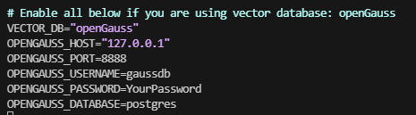
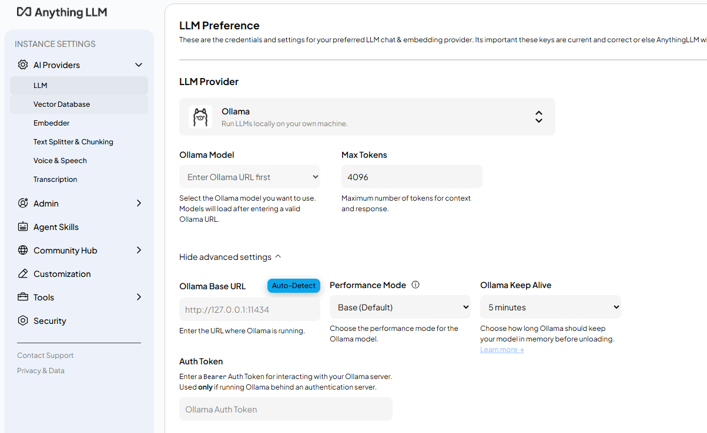

# 使用openGauss部署AnythingLLM
AnythingLLM是一个全栈应用程序，可以将任何文档、资源（如网址链接、音频、视频）或内容片段转换为上下文，以便任何大语言模型（LLM）在聊天期间作为参考使用。此应用允许您自定义LLM模型，并通过openGauss向量数据库RAG方案，解决大模型"幻视"问题，同时支持多用户管理并设置不同权限。

## openGauss容器化部署
详见[容器镜像安装](https://docs.opengauss.org/zh/docs/7.0.0-RC1-lite/docs/InstallationGuide/%E5%AE%B9%E5%99%A8%E9%95%9C%E5%83%8F%E5%AE%89%E8%A3%85.html)。

## AnythingLLM部署
### 获取AnythingLLM源码
本文以openGauss适配AnythingLLM代码演示部署流程
```bash
git clone https://github.com/SetnameWang/anything-llm.git -b 3479-add-opengauss-support
```

### 配置参数
进入目录并且修改配置参数:
```bash
cd ./anything-llm/docker
cp .env.example .env
vim .env
```
取消以下行的注释并且配置相应参数
```
VECTOR_DB="openGauss"
OPENGAUSS_HOST="127.0.0.1"
OPENGAUSS_PORT=8888
OPENGAUSS_USERNAME=
OPENGAUSS_PASSWORD=
OPENGAUSS_DATABASE=
```
如果使用docker安装openGauss，配置应如下图所示（需要修改password）



### 启动容器
执行以下命令，自动拉取对应Docker镜像并启动服务。
```bash
docker-compose up -d
```
容器启动后执行docker ps确保服务都正常运行

### 创建用户并登陆
访问本地部署的AnythingLLM web服务页面：
```bash
http://your_server_ip:3001
```

之后可以在设置界面修改LLM参数等，配置LLM后即可体验RAG功能

