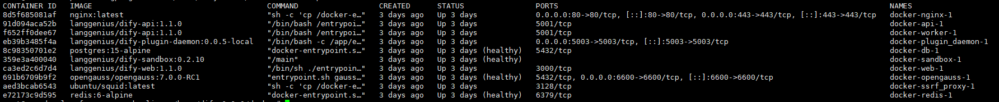

# 使用openGauss部署Dify
Dify是一个开源的大语言模型(LLM)应用开发平台。借助检索增强(RAG)引擎，可以对从智能体到复杂人工智能工作流程的大语言模型应用进行编排。
本文着重介绍如何部署Dify，并使用openGauss DataVec向量数据库作为RAG引擎语料库。

## Dify部署
### 获取Dify源码
访问链接https://github.com/langgenius/dify/archive/refs/tags/1.1.0.zip 获取Dify1.1.0源码。(Dify自1.1.0版本开始支持openGauss，本文以Dify1.1.0版本为例)

### 配置参数
创建目录并解压:
```bash
mkdir /usr/local/dify
unzip 1.1.0.zip -d /usr/local/dify/
cd /usr/local/dify/dify-1.1.0/docker
```
配置环境变量，修改.env中VECTOR_STORE=opengauss
```bash
cp .env.example .env
vim .env
```


### 启动容器
执行以下命令，自动拉取对应Docker镜像并启动服务。
```bash
docker-compose up -d
```
容器启动后执行docker ps确保服务都正常运行，如下图所示：


## AI服务集成
### 创建用户并登陆
访问本地部署的Dify web服务页面：
```bash
http://your_server_ip
```