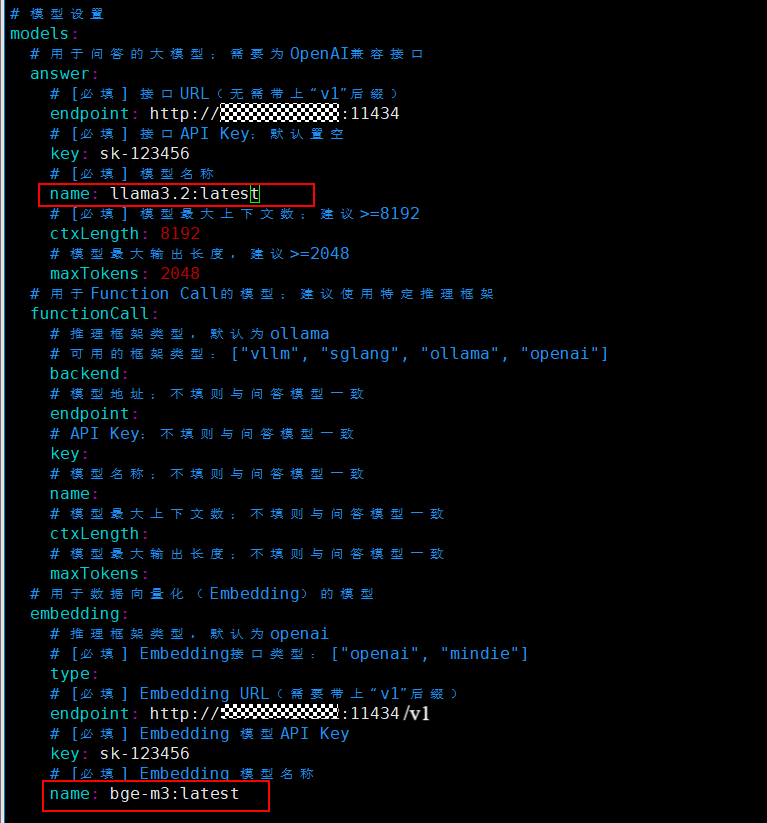

# 部署基于openGauss向量数据库的openEuler Intelligence
本文主要介绍如何部署openEuler Intelligence，并使用openGauss DataVec向量数据库作为RAG引擎语料库。

## openEuler Intelligence部署
### 环境要求
#### 软件要求
|     类型        |      版本要求                         |  说明                                |
|----------------| -------------------------------------|--------------------------------------|
| 操作系统    | openEuler 22.03 LTS 及以上版本         | 无                                   |
| K3s        | >= v1.30.2，带有 Traefik Ingress 工具   | K3s 提供轻量级的 Kubernetes 集群，易于部署和管理 |
| Helm       | >= v3.15.3                           | Helm 是一个 Kubernetes 的包管理工具，其目的是快速安装、升级、卸载 openEuler Intelligence 服务 |
| python     | >=3.9.9                              | python3.9.9 以上版本为模型的下载和安装提供运行环境 |
---
#### 硬件规格

| 硬件资源      |  最小配置                  |    推荐配置               |
|--------------|----------------------------|------------------------------|
| CPU          | 4 核心                     | 16 核心及以上                 |
| RAM          | 4 GB                       | 64 GB                        |
| 存储         | 32 GB                      | 64G                         |
| 大模型名称    | deepseek-llm-7b-chat      | DeepSeek-R1-Llama-8B                         
| 显存 (GPU)   |  NVIDIA RTX A4000 8GB	   | NVIDIA A100 80GB * 2         |


**关键说明**：
- 纯CPU环境，建议通过调用 OpenAI 接口或使用自带的模型部署方式来实现功能。
- 如果k8s集群环境，则不需要单独安装k3s，要求version >= 1.28
### 准备资源
1）在线模式
```bash
git clone https://gitee.com/openeuler/euler-copilot-framework.git -b dev
```
2）离线模式
- 获取openEuler Intelligence项目<br>
在[openEuler Intelligence官方仓库](https://gitee.com/openeuler/euler-copilot-framework/tree/dev/)下载压缩包，上传至服务器并解压。
  ```bash
  unzip euler-copilot-framework.tar -d <YourPath>
  ```
- 获取镜像、模型以及工具包

  参照1.2资源列表在
  [openEuler Intelligence资源下载地址](https://repo.oepkgs.net/openEuler/rpm/openEuler-22.03-LTS/contrib/eulercopilot/)中下载需要使用的镜像、模型以及工具包。

  确保服务器已创建以下目录，并把下载好的资源放入对应文件夹：
  ```
  /home/eulercopilot/
  ├── images/    # 存放镜像文件
  ├── models/    # 存放模型文件
  └── tools/     # 存放工具包
  ```
在线模式和离线模式仅在资源准备阶段不同，后续步骤完全一致。
### 运行部署脚本
```bash
# 切换目录至部署脚本路径下
cd euler-copilot-framework/deploy/scripts
# 为脚本文件添加可执行权限
chmod -R +x ./*
# 运行部署脚本
bash deploy.sh
```

### 开始部署服务
运行完部署脚本后会出现下面的部署菜单列表，我们将采用分步手动部署的方式来完成这个项目，以便更清晰地理解每个环节的实现细节。
```
==============================
        主部署菜单
==============================
0) 一键自动部署
1) 手动分步部署
2) 重启服务
3) 卸载所有组件并清除数据
4) 退出程序
==============================
请输入选项编号（0-3）: 1
```
```
# 输入选项编号（0-9），逐步部署
==============================
       手动分步部署菜单
==============================
1) 执行环境检查脚本
2) 安装k3s和helm
3) 安装Ollama
4) 部署Deepseek模型
5) 部署Embedding模型
6) 安装数据库
7) 安装AuthHub
8) 安装EulerCopilot
9) 返回主菜单
==============================
请输入选项编号（0-9）:
```
这里只要确保每个步骤都能顺利完成且不出现错误提示，即可进入下一环节。如果以下服务pod状态都正常就可以开启访问openEuler Intelligence之旅啦。
```
[root@localhost euler_copilot]# kubectl get pods -A
NAMESPACE       NAME                                      READY   STATUS      RESTARTS   AGE
euler-copilot   authhub-backend-deploy-9f46b886b-c25nl    1/1     Running     0          29h
euler-copilot   authhub-web-deploy-7957555974-7fgsx       1/1     Running     0          29h
euler-copilot   framework-deploy-cffdfc75f-pvv4c          1/1     Running     0          9m21s
euler-copilot   minio-deploy-746786cf66-6rnwt             1/1     Running     0          29h
euler-copilot   mongo-deploy-c89868d7d-5nczl              1/1     Running     0          29h
euler-copilot   mysql-deploy-7c6b8997cf-xrqjp             1/1     Running     0          29h
euler-copilot   opengauss-deploy-968d7848d-vqgjw          1/1     Running     0          11m
euler-copilot   rag-deploy-79ddfd786d-rtzw9               1/1     Running     0          38s
euler-copilot   rag-web-deploy-7df6d6b66d-bkh5v           1/1     Running     0          19h
euler-copilot   redis-deploy-7fb5b67844-kv9mz             1/1     Running     0          29h
euler-copilot   web-deploy-59dcfb78f7-cd54l               1/1     Running     0          19h
kube-system     coredns-576bfc4dc7-9v7dm                  1/1     Running     0          29h
kube-system     helm-install-traefik-crd-wwv9f            0/1     Completed   0          19h
kube-system     helm-install-traefik-dgszg                0/1     Completed   0          19h
kube-system     local-path-provisioner-6795b5f9d8-msz9p   1/1     Running     0          29h
kube-system     metrics-server-557ff575fb-grbm6           1/1     Running     0          29h
kube-system     svclb-traefik-be11ef18-qzv8d              2/2     Running     0          29h
kube-system     traefik-5fb479b77-pcbgr                   1/1     Running     0          29h
```

注意，如果本地有ollama服务并拉取了embedding和chat大模型，`可以跳过3-5步骤`，在安装完openEuler Intelligence服务后修改模型配置即可，下面是修改步骤及内容。
```bash
cd euler-copilot-framework/deploy/chart/euler-copilot
```
```
vim values.yaml
```


按照上图修改模型名称后更新openEuler Intelligence的部署：
```bash
helm upgrade euler-copilot -n euler-copilot .
```

具体操作见[从数据到智能：openGauss+openEuler Intelligence的RAG架构实战](openGauss-eulercopilot.md)