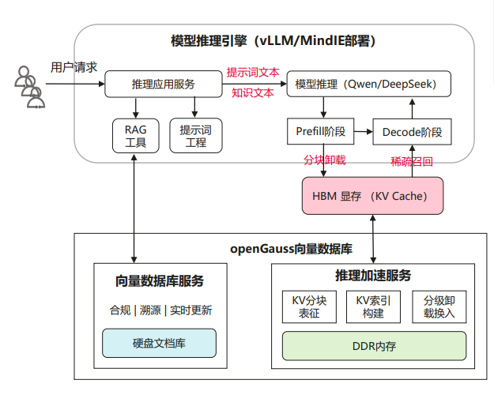
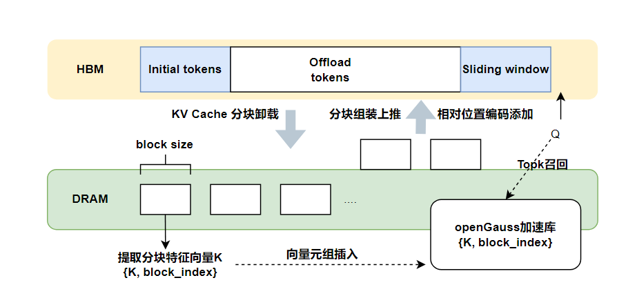

# KV Cache 以查代算推理加速

## 介绍
基于 Transformer 架构的大模型每一步推理都需依赖之前所有层的 key 和 value 来计算注意力权重，重复计算量大。KV Cache 将已计算的 key 和 value 缓存，极大减少计算量。针对长序列推理场景，KV Cache中存在较大的稀疏性，即全量 KV Cache 中只有少量 token 会对当前注意力权重计算有关键影响。因此，长序列推理时可以让关键的 KV 占用显卡的计算资源和 HBM，从而提升大模型在长序列场景下端到端推理性能。本特性将 [vllm-ascend](https://github.com/vllm-project/vllm-ascend/tree/v0.7.3rc1) 和 自研的 openGauss 加速库相结合，实现KV Cache 以查代算推理加速。



## 整体方案
整体思路是利用大模型推理 Decode 阶段长序列 KV Cache的稀疏性，在注意力计算时进行稀疏计算和分块卸载，来实现长序列推理中 NPU 计算量的减少和 HBM 占用的降低，从而提高token by token的速度。具体实现如下：



将整个长序列 KV Cache 分为3部分：initial_tokens、sliding_window 和 offload_tokens。由于 initial_tokens 和 sliding_window 对推理的结果较为重要，这两部分一直存在 HBM 中；offload_tokens 中的 KV Cache 以块的粒度特征提取为一个个表征向量，将{表征向量 K，block_index}存入 openGauss 加速库中，并将 offload_tokens 中的 KV Cache 卸载到 DDR 内存中；每轮推理时对 offload_tokens 的 KV Cache 稀疏召回，将被选中的KV Cache块加载到 HBM，与 initial_tokens 和 sliding_window 中的 KV Cache 进行拼接，参与注意力计算。

稀疏召回就是将推理过程中当前token计算的 Q 向量与每个表征向量 K 计算 IP 距离，选取最相近的 topK 个 KV Cache 块进行召回，这 topK 个块会对当前注意力权重计算产生关键的影响。

openGauss 加速库的生命周期和读写流程与 RetrievalKV插件耦合； openGauss 加速库的写入集中在 Prefill 阶段，读取集中在 Decode 阶段。

> **限制：<br>**
>本特性暂时只支持Qwen2系列大模型。<br>
>本特性主要针对长序列推理场景。 <br>
>本特性只支持运行在 NPU 加速卡上。

## 支持的配套版本
- Python 3.9
- Pytorch_npu 2.5.1 [下载](https://pytorch-package.obs.cn-north-4.myhuaweicloud.com/pta/Daily/v2.5.1/20250320.3/pytorch_v2.5.1_py39.tar.gz)
- vllm 0.7.3
- vllm_ascend 0.7.3rc1
- RetrievalKV （基于vllm_ascend进行KV Cache 以查代算推理加速的插件）
- openGauss 加速库

## 配置参数
- 是否开启以查代算

    vllm_ascend（非以查代算）运行时需要配置
    ```
    export VLLM_PLUGINS=ascend_enhanced_model,ascend
    ```

    vllm_ascend + RetrievalKV（以查代算）运行时需要配置
    ```
    export VLLM_PLUGINS=ascend_enhanced_model,ascend,retrieval
    ```
- 相关参数

    initial tokens的长度：VLLM_RETRIEVAL_INIT_TOKENS_NUM，默认为1024；

    local tokens的长度：VLLM_RETRIEVAL_LOCAL_TOKENS_NUM，默认为7192；

    稀疏召回比例：VLLM_RETRIEVAL_TOPK_PERCENT，默认为0.2。

- KV Cache分块大小：推荐配置为128

- 不同输入长度适应以查代算的配置

    KV Cache全计算：VLLM_RETRIEVAL_DENSE_BOUNDARY，默认为32K。对于prompt长度 < VLLM_RETRIEVAL_DENSE_BOUNDARY 的序列，注意力计算过程中不使用以查代算加速；

    稀疏计算但不卸载：VLLM_RETRIEVAL_OFFLOAD_BOUNDARY，默认为64K。对于 VLLM_RETRIEVAL_DENSE_BOUNDARY < prompt长度 < VLLM_RETRIEVAL_OFFLOAD_BOUNDARY 的序列，注意力计算过程中进行稀疏计算但不会将 sliding_window 部分的 KV 卸载到 DDR 内存中；

    稀疏计算且卸载：prompt长度 > VLLM_RETRIEVAL_OFFLOAD_BOUNDARY 的序列，注意力计算时进行稀疏召回，且会将不活跃的 KV 卸载到 DDR 内存中。


