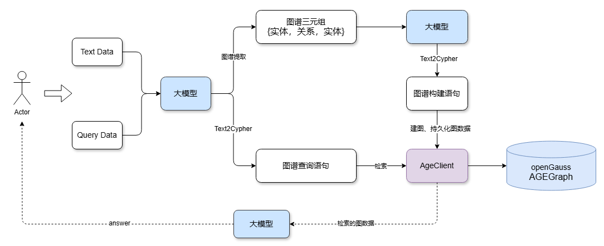

# openGauss AGEGraph + 大模型实现 GraphRAG，助力更强 RAG

传统 RAG（检索增强生成）通常使用向量数据库检索相关文档来提高大模型的问题回答准确性，但是基于向量的 RAG 不能够很好的表达事物之间的联系。而GraphRAG基于知识图谱的检索增强生成，能够提供结构化检索能力，将图作为传统的RAG多路召回的一环，使知识表达更易解释、对复杂关系更易支持。

目前 [openGauss AGEGraph](https://docs.opengauss.org/zh/docs/latest/docs/DataVec/Gallery-Engine-AGE.html) 已经提供了图数据库引擎的能力。本文将详细介绍如何借助大模型以及 openGauss 图数据库快速提取文档知识图谱并持久化。 随后，将问题输入大模型，大模型自动提取关键词并转换为图查询语句连接 openGauss 图数据库进行图数据检索。最后，将图数据输入大模型生成问题答案反馈给用户。


### 1.环境准备

#### 1.1 openGauss 容器化部署
可参考[openGauss容器镜像安装](https://docs.opengauss.org/zh/docs/7.0.0-RC1/docs/InstallationGuide/%E5%AE%B9%E5%99%A8%E9%95%9C%E5%83%8F%E5%AE%89%E8%A3%85.html)部署openGauss。

openGauss容器启动后可以执行`docker ps`查看容器是否在运行
输出

```
CONTAINER ID        IMAGE                                                  COMMAND                  CREATED             STATUS                          PORTS                                              NAMES
253714c9c869        opengauss:7.0.0-rc1                                    "entrypoint.sh gauss…"   8 minutes ago       Up 8 minutes                    0.0.0.0:6543->5432/tcp                             opengauss-age

```
#### 1.2 python依赖安装

```
pip install -U langchain_community langchain langgraph  langchain-ollama langchain-experimental  langchain-openai langchain-opengauss
```

### 2. 利用 模型和 openGauss AGEGraph 快速构建知识图谱和检索
本文使用百炼大模型，取得api-key，并且配置DASHSCOPE_API_KEY环境变量
#### 2.1 初始化大模型

```
from langchain_community.llms import Tongyi
import os

os.environ["DASHSCOPE_API_KEY"] = "sk-**"
graph_llm =Tongyi(model="qwen-plus", temperature=0, base_url="https://dashscope.aliyuncs.com/compatible-mode/v1")

```
#### 2.2 通过大模型提取文本数据中的实体和关系


```
from langchain_core.documents import Document
from langchain_experimental.graph_transformers import LLMGraphTransformer

#设置需要提取的实体类型和关系
llm_transformer = LLMGraphTransformer(
    llm=graph_llm,
    allowed_nodes=["Person", "Organization", "Location", "Award", "ResearchField"],
    allowed_relationships = ["SPOUSE", "AWARD", "FIELD_OF_RESEARCH", "WORKS_AT", "IN_LOCATION"],
)

text = """
Marie Curie, 7 November 1867 – 4 July 1934, was a Polish and naturalised-French physicist and chemist who conducted pioneering research on radioactivity.
She was the first woman to win a Nobel Prize, the first person to win a Nobel Prize twice, and the only person to win a Nobel Prize in two scientific fields.
Her husband, Pierre Curie, was a co-winner of her first Nobel Prize, making them the first-ever married couple to win the Nobel Prize and launching the Curie family legacy of five Nobel Prizes.
She was, in 1906, the first woman to become a professor at the University of Paris.
Also, Robin Williams.
"""

# 将文本转化为图
documents = [Document(page_content=text)]
graph_documents = llm_transformer.convert_to_graph_documents(documents)


print(f"Nodes from graph doc:{graph_documents[0].nodes}")
print(f"Relationships from graph doc:{graph_documents[0].relationships}")
```
输出

```
Nodes from graph doc:[Node(id='Nobel Prize', type='Award', properties={}), Node(id='University of Paris', type='Organization', properties={}), Node(id='Marie Curie', type='Person', properties={}), Node(id='radioactivity', type='ResearchField', properties={}), Node(id='Pierre Curie', type='Person', properties={})]
Relationships from graph doc:[Relationship(source=Node(id='Marie Curie', type='Person', properties={}), target=Node(id='radioactivity', type='ResearchField', properties={}), type='FIELD_OF_RESEARCH', properties={}), Relationship(source=Node(id='Marie Curie', type='Person', properties={}), target=Node(id='Nobel Prize', type='Award', properties={}), type='AWARD', properties={}), Relationship(source=Node(id='Marie Curie', type='Person', properties={}), target=Node(id='Nobel Prize', type='Award', properties={}), type='AWARD', properties={}), Relationship(source=Node(id='Marie Curie', type='Person', properties={}), target=Node(id='Pierre Curie', type='Person', properties={}), type='SPOUSE', properties={}), Relationship(source=Node(id='Pierre Curie', type='Person', properties={}), target=Node(id='Nobel Prize', type='Award', properties={}), type='AWARD', properties={}), Relationship(source=Node(id='Marie Curie', type='Person', properties={}), target=Node(id='University of Paris', type='Organization', properties={}), type='WORKS_AT', properties={})]
```
#### 2.3 openGauss AGE插件安装
如果对应的数据库已经创建age插件，此步骤可以忽略

```
import psycopg2
connection = psycopg2.connect(
    database = "omm",
    user = "gaussdb",
    password = "YourPassoword",
    host = "Your IP",
    port = 8888
)

try:
    cursor = connection.cursor()
    sql_qeury = "create extension age;"
    cursor.execute(sql_query)
    connection.commit()
except Exception as e:
    print(e)
finally:
    cursor.close()
    connection.close()
```
#### 2.4 实例化 openGauss AGEGraph 客户端，持久化图数据

```
from langchain_opengauss import openGaussAGEGraph, openGaussSettings

conf = openGaussSettings(
    database = "omm",
    user = "gaussdb",
    password = "YourPassoword",
    host = "Your IP",
    port = 8888
)
graph=openGaussAGEGraph(graph_name='graph_test1',conf=conf,create=True)
graph.add_graph_documents(graph_documents)
graph.refresh_schema()

```

#### 2.5 大模型 Text2Cypher：提取问题关键词并生成图检索语句

通过增加提示词`cypher_prompt`，可以让大模型生成的图查询语句更加精准
```
from langchain_core.prompts import PromptTemplate
from langchain.chains import GraphCypherQAChain

cypher_prompt = PromptTemplate(
    template="""你是 AGE Cypher 查询生成的专家。
    使用以下架构生成一个 Cypher 查询，以回答给定问题。
    不要出现name和properties和cypher

    架构：
    {schema}

    问题：{question}

    Cypher 查询：""",
    input_variables=["schema", "question"],
)

chain = GraphCypherQAChain.from_llm(
    graph_llm, graph=graph, verbose=True, allow_dangerous_requests=True, cypher_validation=True, return_intermediate_steps=True,cypher_prompt=cypher_prompt
)

question = "Who get Nobel Prize ?"
result = chain.invoke({"query": question})
```
输出

> Entering new GraphCypherQAChain chain...
Generated Cypher:
MATCH (p:Person)-[:AWARD]->(a:Award)
WHERE a.id = "Nobel Prize"
RETURN p.id
Full Context:
[{'p_id': 'Pierre Curie'}, {'p_id': 'Marie Curie'}]

### 3. 大模型依据检索的图数据生成回答

#### 3.1 设置提示词
```
prompt = PromptTemplate(
    template="""You are an assistant for question-answering tasks. 
    Use the following pieces of retrieved context from a graph database to answer the question. If you don't know the answer, just say that you don't know. 
    Use two sentences maximum and keep the answer concise:
    Question: {question} 
    Graph Context: {graph_context}
    Answer: 
    """,
    input_variables=["question", "graph_context"],
)

```
#### 3.2 生成回答
```
from langchain_core.output_parsers import StrOutputParser

composite_chain = prompt | graph_llm |StrOutputParser()

answer = composite_chain.invoke(
    {"question": question, "graph_context": result}
)
print(answer)
```
输出

```
Marie Curie and Pierre Curie received the Nobel Prize. They were recognized for their groundbreaking work in radioactivaity.
```

### 4. 总结
结合大模型和 openGauss AGEGraph 图数据库，我们可以快速进行知识图谱的生成、持久化以及检索，完成 GraphRAG 的搭建。此外，当前 openGauss 还支持标量、向量类型存储与检索，只需部署 openGauss 数据库，即可实现支持标量、向量、知识图谱多路召回的更强 RAG 系统。
