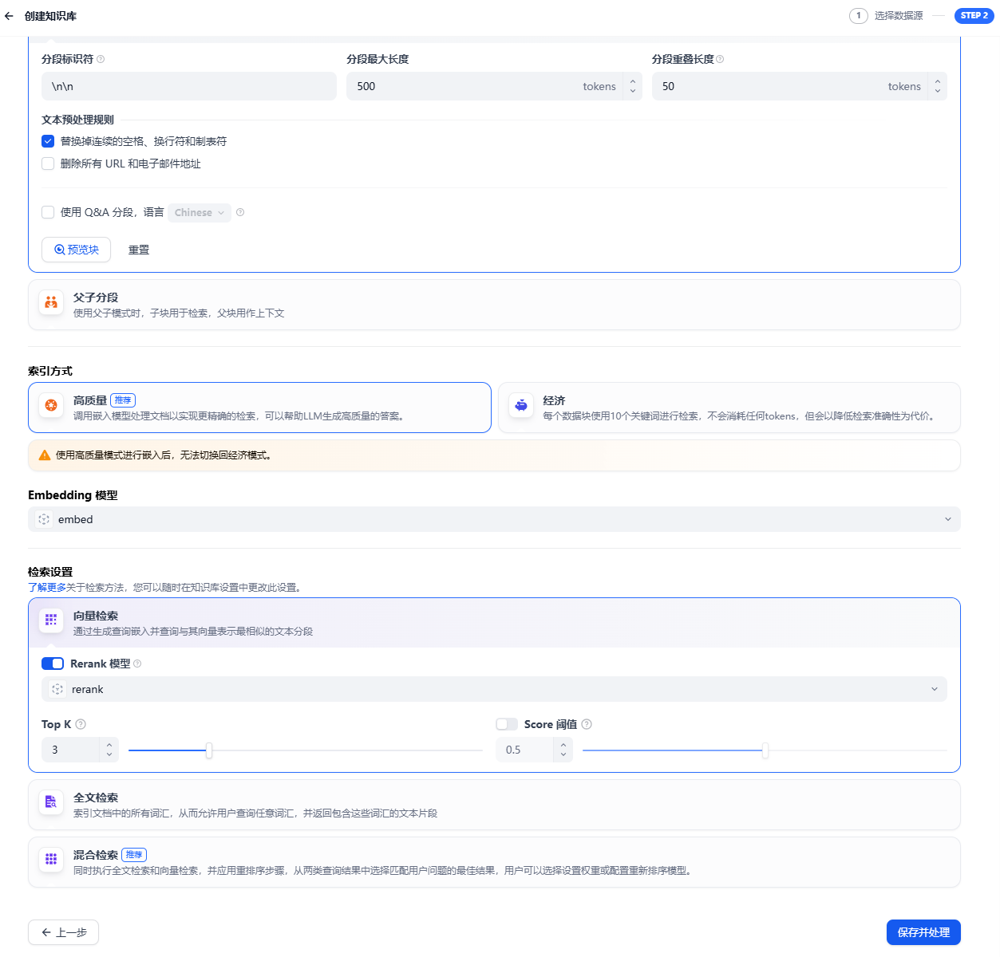

# openGauss Datavec + Dify，快速搭建你的智能助手平台
在当今数字化和智能化的时代，大语言模型（LLM）的应用正以前所未有的速度改变着各个领域的工作方式和用户体验。Dify 作为一个开源的大语言模型应用开发平台，为开发者们提供了便捷且强大的工具，助力构建从基础智能体到复杂人工智能工作流程的各类大语言模型应用。其核心优势在于集成了检索增强（RAG）引擎，通过对海量数据的智能检索与分析，能够精准地为大语言模型提供相关信息，极大地提升模型输出的准确性和相关性。
本文着重介绍如何部署Dify，并使用openGauss DataVec向量数据库作为RAG引擎语料库，从而搭建出高效智能的助手平台。

## Dify部署
### 获取Dify源码
要开启Dify的部署之旅，首先需要获取其源码<https://github.com/langgenius/dify/releases/tag/1.1.3>。Dify自1.1.0版本起，对openGauss提供了有力支持，1.1.3版本引入了PQ。因此，本文以 Dify1.1.0版本作为示例进行讲解。


### 配置参数
在获取源码压缩包后，需要创建特定目录并解压源码。具体操作如下：
```bash
mkdir /usr/local/dify
unzip 1.1.0.zip -d /usr/local/dify/
cd /usr/local/dify/dify-1.1.0/docker
```
接下来的关键步骤是配置环境变量。在此过程中，需要修改.env文件，将VECTOR_STORE设置为opengauss。执行以下命令进行文件复制和编辑：
```bash
cp .env.example .env
vim .env
```


### 启动容器
完成上述配置后，执行以下命令，系统将自动拉取对应的Docker镜像，并启动Dify服务：
```bash
docker-compose up -d
```
容器启动完毕后，为了确保各项服务均正常运行，可以执行docker ps命令。若一切顺利，你将看到类似下图所示的运行状态：


## AI服务集成
### 创建用户并登陆
当Dify服务成功启动后，在浏览器中访问本地部署的Dify web服务页面：
```bash
http://your_server_ip
```

在该页面，你可以创建管理员用户。只需输入有效的邮箱及自定义密码即可完成创建并登录：


### 接入大模型
在主界面点击右上角用户名，然后点击“设置”进入设置页面，单击“模型供应商”，选择“Ollama”单击“安装”按钮。（ollama服务及大模型部署参考：[openGauss-RAG实践](openGauss-RAG实践.md)）


安装完成后，在添加模型页面，“模型类型”选择“LLM”，配置如下：


接着选择“Text Embeding”，配置如下：


### 导入语料
本文以openGauss语料知识为例，为你展示如何导入语料。在页面中单击 “知识库” 标签，选择 “导入已有文本” 选项，即可将本地准备好的语料导入到系统中：


导入时，“Embeding 模型” 需选择之前配置好的模型，然后单击 “保存并处理” 按钮：



此时，系统将自动处理语料，并将其存入 openGauss 向量数据库。你只需耐心等待处理完成，当看到类似下图的提示时，就表明语料已经成功存储：


### 对话
完成上述所有设置后，就可以开启聊天窗口进行对话测试了。在聊天窗口中输入问题，然后等待系统回答：


从首次回答结果可以看出，回答质量较低，描述并不准确。接下来，我们引入之前导入的openGauss语料库作为上下文，再次进行问答：


可以清晰地看到，借助于openGauss语料库，系统给出了更为准确的答案。至此，基于openGauss向量数据库的Dify RAG引擎搭建圆满完成。​