# openGauss + Ragflow 从部署到集成
在当今数据驱动的时代，高效、可靠的数据库系统和智能化的检索增强生成（Retrieval-Augmented Generation, RAG）技术成为企业提升数据处理能力和知识管理效率的关键。将openGauss与RAG流程（RagFlow）集成，不仅可以充分发挥openGauss的高效数据存储与检索优势，还能借助RAG技术实现智能化的知识问答、数据分析与内容生成，从而构建更强大的企业级数据智能解决方案。

本文旨在提供一份从部署到集成的完整指南，通过本文的指导，读者将能够掌握openGauss与RagFlow的协同部署方法，并利用这一强大组合构建高性能、智能化的数据应用系统。
## Ragflow部署
### 1.环境要求
#### 1.1 系统要求

在安装 RAGFlow 之前，请确保您的机器满足以下最低系统要求：

- CPU >= 4 核
- RAM >= 16 GB
- Disk >= 50 GB

#### 1.2 操作系统和软件要求

- OS : openEuler 22.03 LTS SP3 for Arm / BClinux for Euler 21.10U4 / CTyunOS3 / CULinux3.0
- Docker : >= 28.0.1 for Arm
- Docker Compose : >= 2.33.1 for Arm

### 2.安装
#### 2.1 项目获取
拉取KunpengRAG项目仓库并进入ragflow的docker-compose部署目录
```bash
git clone https://gitee.com/kunpeng_compute/KunpengRAG.git
cd KunpengRAG/deployment/docker-compose/ragflow
```
#### 2.2 启动容器
启动 RAGFlow 服务器的最简单方法是运行我们的 [docker-compose.yml](https://gitee.com/kunpeng_compute/KunpengRAG/blob/master/deployment/docker-compose/ragflow/docker-compose.yml) 文件。

```bash
docker compose up -d
```
如果以下容器都正常运行，并且ragflow-server容器日志无报错，就表示ragflow安装成功啦。
```bash
[root@sharedstore003 docker]# docker ps | grep ragflow
68eee5519e8f   opengauss:7.0.0-rc1                                "entrypoint.sh gauss…"   4 hours ago   Up 4 hours (healthy)    0.0.0.0:6601->5432/tcp, :::6601->5432/tcp                                                                                                                                                                                       ragflow-opengauss
b1307bba2277   mysql:8.0.39                                       "docker-entrypoint.s…"   4 hours ago   Up 4 hours (healthy)    33060/tcp, 0.0.0.0:5455->3306/tcp, :::5455->3306/tcp                                                                                                                                                                            ragflow-mysql
f6d95b01622f   infiniflow/ragflow:v0.18.0                         "./entrypoint.sh"        4 hours ago   Up 4 hours              0.0.0.0:80->80/tcp, :::80->80/tcp, 0.0.0.0:443->443/tcp, :::443->443/tcp, 0.0.0.0:5678-5679->5678-5679/tcp, :::5678-5679->5678-5679/tcp, 0.0.0.0:9380->9380/tcp, :::9380->9380/tcp, 0.0.0.0:9382->9382/tcp, :::9382->9382/tcp   ragflow-server
a4693b4c7e6d   valkey/valkey:8                                    "docker-entrypoint.s…"   4 hours ago   Up 4 hours              0.0.0.0:6379->6379/tcp, :::6379->6379/tcp                                                                                                                                                                                       ragflow-redis
00686502f65a   quay.io/minio/minio:RELEASE.2023-12-20T01-00-02Z   "/usr/bin/docker-ent…"   4 hours ago   Up 4 hours              0.0.0.0:9000-9001->9000-9001/tcp, :::9000-9001->9000-9001/tcp                                                                                                                                                                   ragflow-minio
```
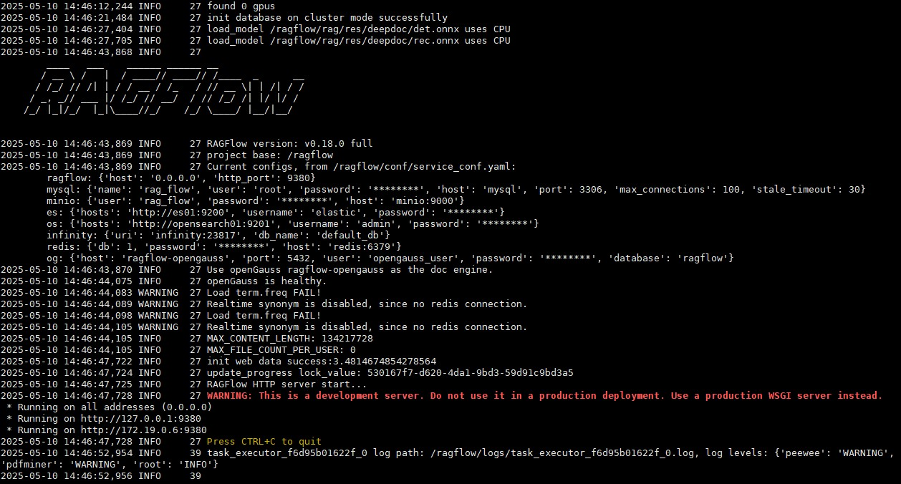
>注意：<br>
>KunpengRAG项目中仅提供了arm架构的ragflow+opengauss镜像，x86架构的镜像可以参考[这篇文档](https://ragflow.io/docs/dev/build_docker_image)根据[源码](https://github.com/lauraty123/ragflow/tree/adapt_opengauss)自行构建镜像。

#### 2.3 访问Ragflow网页界面
浏览器打开`http://<您的服务器ip>/login`即可访问登录页面，点击sign up进行注册，填入电子邮箱和密码后，返回登录页，就可以使用刚刚注册的账号登录了。

### 3.模型配置
本文使用ollama工具实现大模型的接入，点击头像进入设置界面，选择“模型提供商”，单击ollama图标下的“添加模型”选项。
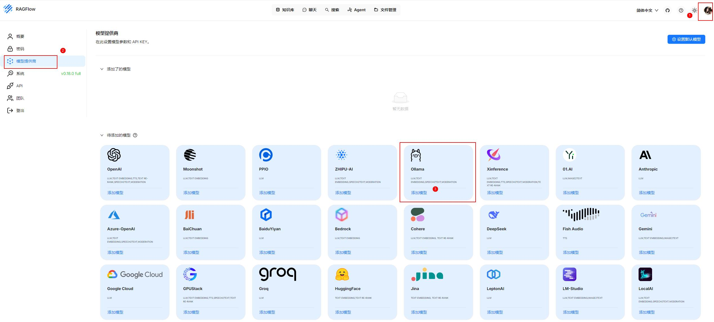
以下是添加embedding模型的配置示例。

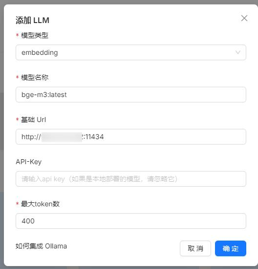

以下是添加chat模型的配置示例。

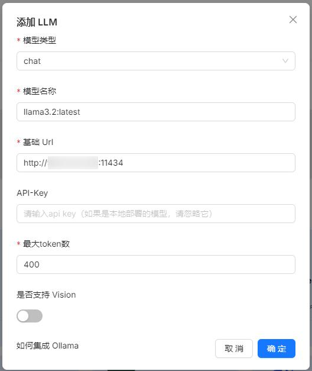

LLM模型接入好后就可以将其设置为本项目的默认模型，点击“设置默认模型”进行配置。
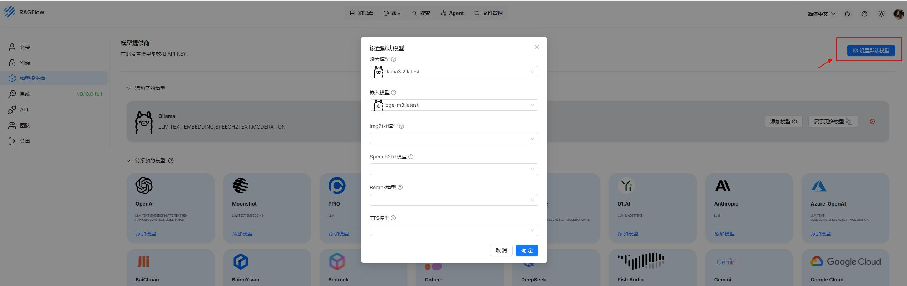

### 4.知识库创建
本小节主要介绍Ragflow中知识库的构建步骤，便于后续聊天、Agent模块中使用，使用外挂知识库可以通过检索权威数据增强生成结果的准确性，避免AI“胡编乱造”，同时支持动态更新知识，无需反复训练模型。<br>
点击“创建知识库”选项，输入知识库名称：
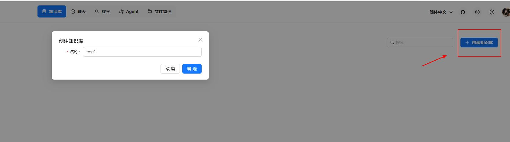

Ragflow支持丰富的文件类型，包括 Word 文档、PPT、excel 表格、txt 文件、图片、PDF、影印件、复印件、结构化数据、网页等。本次示例传入了一篇pdf格式的论文。
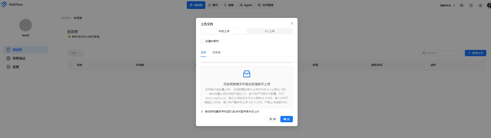

文件上传成功后，点击解析图标开始给文本进行自动分块：
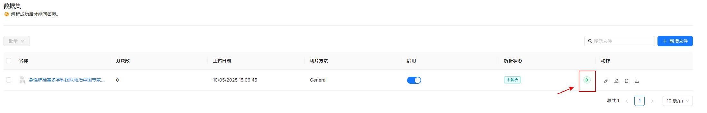

文本解析结果如下：
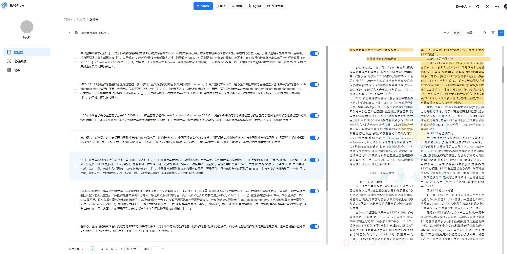

点击“检索测试”选项测试文本搜索效果，这里可以动态调整全文搜索和向量搜索的权重大小：
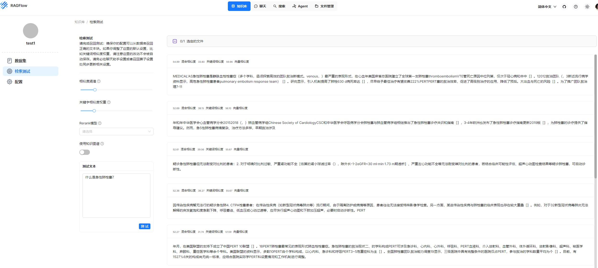

### 5.聊天实践

点击“新建助手”并在配置中关联知识库：
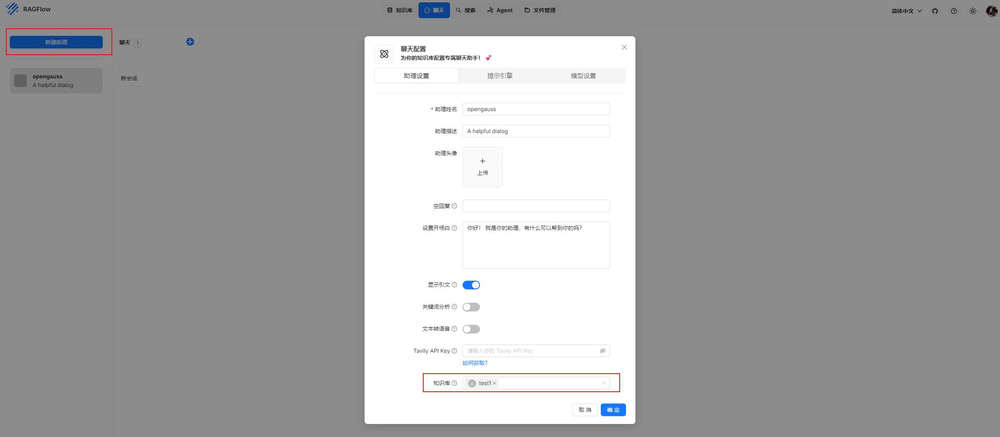

开始进行实时对话：
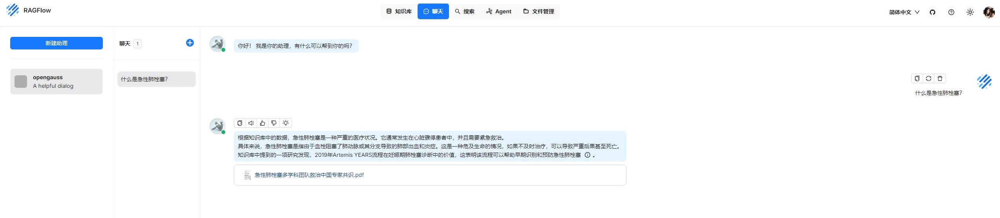

### 6.Agent实践
Ragflow也提供了全程自动化的工作流，用户可以按照需要进行工作流配置，下图为简单的对话工作流示例：
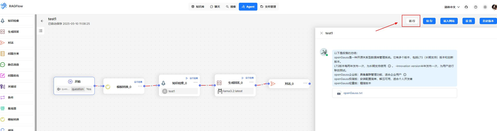

至此，基于openGauss向量数据库的Ragflow搭建圆满完成。​