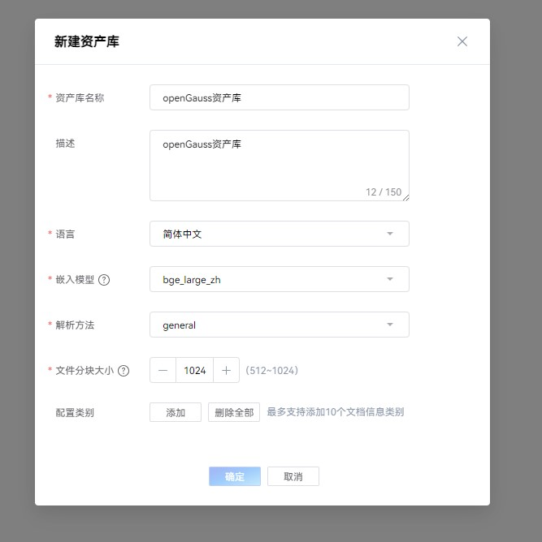
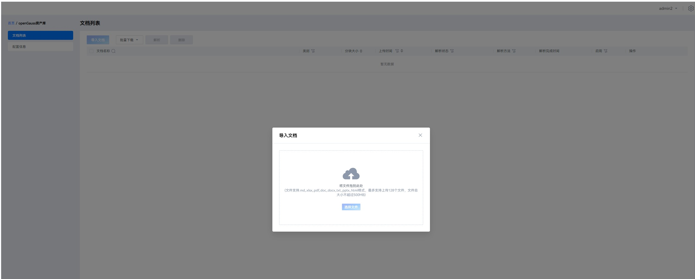
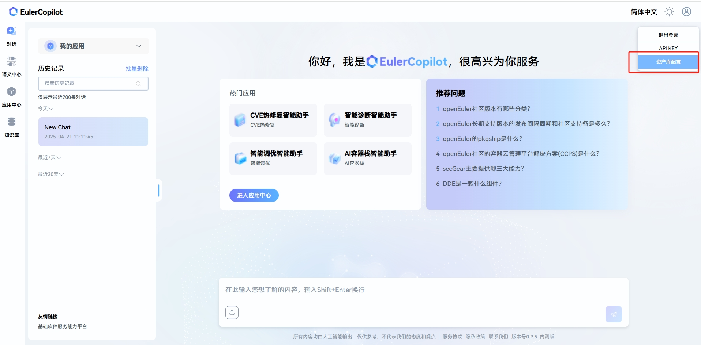

# 从数据到智能：openGauss+openEuler Intelligence的RAG架构实战
随着人工智能和大规模语言模型技术的崛起，传统的搜索引擎由于其只能提供简单的关键字匹配结果，已经越来越无法满足用户对于复杂、多样化和上下文相关的知识检索需求。与此相对，RAG（Retrieval-Augmented Generation）技术既借鉴了传统搜索引擎的优势，又结合了先进的大语言模型和向量数据库技术，使其能够在复杂查询和自然语言交互中表现得更为智能。这种增强生成技术在很多应用场景下都能提供更丰富和个性化的体验。那么，本地如何快速创建一个RAG智能问答模型呢？

本文将使用openEuler Intelligence智能问答工具和openGauss向量数据库从零到一搭建一个openGauss专有领域智能问答助手，下面让我们一起逐步完成这个技术实践项目。

## openEuler Intelligence部署
### 1. 服务部署总览
#### 1.1 部署图


#### 1.2 软件要求
| 类型       | 资源名称 | 版本| 下载链接
|------------|--------------|--------------|--------------|
| **镜像** | `euler-copilot-framework`<br>`euler-copilot-web`<br>`data_chain_back_end`<br>`data_chain_web`<br>`authhub`<br>`authhub-web`<br>`opengauss`<br>`redis`<br>`mysql`<br>`minio`<br>`mongo`<br>`secret_inject`<br> |0.9.5<br>0.9.5<br>0.9.5<br>0.9.5<br>0.9.3<br>0.9.3<br>7.0.0-RC1<br>7.4-alpine<br>8<br>empty<br>7.0.16<br>dev|[镜像包链接](https://repo.oepkgs.net/openEuler/rpm/openEuler-22.03-LTS/contrib/eulercopilot/images/)|
| **模型** | `bge-m3-Q4_K_M`<br>`deepseek-llm-7b-chat-Q4_K_M`<br> |无<br>无|[模型链接](https://repo.oepkgs.net/openEuler/rpm/openEuler-22.03-LTS/contrib/eulercopilot/models/)|
| **工具**   | `helm`<br>`k3s`<br>`ollama` |v3.15.0<br>v1.30.3<br>0.6.5|[工具包链接](https://repo.oepkgs.net/openEuler/rpm/openEuler-22.03-LTS/contrib/eulercopilot/tools/)|

### 2. 构建RAG系统
openEuler Intelligence 是一个基于 openEuler 操作系统的人工智能助手，可以帮助用户解决各种技术问题，提供技术支持和咨询服务。它使用了最先进的自然语言处理技术和机器学习算法，能够理解用户的问题并提供相应的解决方案。其安装模式灵活适配不同环境：
- 在线模式：自动拉取镜像，一键部署，适合网络畅通的云端或个人开发环境。
- 离线模式：手动导入镜像文件，保障内网或安全敏感场景下的稳定运行。

两种模式仅在资源准备阶段存在差异，后续使用流程完全一致，用户可根据实际需求自由选择。

#### 2.1 准备资源
1）在线模式
```bash
git clone https://gitee.com/openeuler/euler-copilot-framework.git -b dev
```
2）离线模式
- 获取openEuler Intelligence项目<br>
在[openEuler Intelligence官方仓库](https://gitee.com/openeuler/euler-copilot-framework/tree/dev/)下载压缩包，上传至服务器并解压。
  ```bash
  unzip euler-copilot-framework.tar -d <YourPath>
  ```
- 获取镜像、模型以及工具包

  参照1.2资源列表在
  [openEuler Intelligence资源下载地址](https://repo.oepkgs.net/openEuler/rpm/openEuler-22.03-LTS/contrib/eulercopilot/)中下载需要使用的镜像、模型以及工具包。

  确保服务器已创建以下目录，并把下载好的资源放入对应文件夹：
  ```
  /home/eulercopilot/
  ├── images/    # 存放镜像文件
  ├── models/    # 存放模型文件
  └── tools/     # 存放工具包
  ```
在线模式和离线模式仅在资源准备阶段不同，后续步骤完全一致。
#### 2.2 运行部署脚本
```bash
# 切换目录至部署脚本路径下
cd euler-copilot-framework/deploy/scripts
# 为脚本文件添加可执行权限
chmod -R +x ./*
# 运行部署脚本
bash deploy.sh
```

#### 2.3 开始部署服务
运行完部署脚本后会出现下面的部署菜单列表，我们将采用分步手动部署的方式来完成这个项目，以便更清晰地理解每个环节的实现细节。
```
==============================
        主部署菜单
==============================
0) 一键自动部署
1) 手动分步部署
2) 重启服务
3) 卸载所有组件并清除数据
4) 退出程序
==============================
请输入选项编号（0-3）: 1
```
```
# 输入选项编号（0-9），逐步部署
==============================
       手动分步部署菜单
==============================
1) 执行环境检查脚本
2) 安装k3s和helm
3) 安装Ollama
4) 部署Deepseek模型
5) 部署Embedding模型
6) 安装数据库
7) 安装AuthHub
8) 安装EulerCopilot
9) 返回主菜单
==============================
请输入选项编号（0-9）:
```
这里只要确保每个步骤都能顺利完成且不出现错误提示，即可进入下一环节。如果以下服务pod状态都正常就可以开启访问openEuler Intelligence之旅啦。
```
[root@localhost euler_copilot]# kubectl get pods -A
NAMESPACE       NAME                                      READY   STATUS      RESTARTS   AGE
euler-copilot   authhub-backend-deploy-9f46b886b-c25nl    1/1     Running     0          29h
euler-copilot   authhub-web-deploy-7957555974-7fgsx       1/1     Running     0          29h
euler-copilot   framework-deploy-cffdfc75f-pvv4c          1/1     Running     0          9m21s
euler-copilot   minio-deploy-746786cf66-6rnwt             1/1     Running     0          29h
euler-copilot   mongo-deploy-c89868d7d-5nczl              1/1     Running     0          29h
euler-copilot   mysql-deploy-7c6b8997cf-xrqjp             1/1     Running     0          29h
euler-copilot   opengauss-deploy-968d7848d-vqgjw          1/1     Running     0          11m
euler-copilot   rag-deploy-79ddfd786d-rtzw9               1/1     Running     0          38s
euler-copilot   rag-web-deploy-7df6d6b66d-bkh5v           1/1     Running     0          19h
euler-copilot   redis-deploy-7fb5b67844-kv9mz             1/1     Running     0          29h
euler-copilot   web-deploy-59dcfb78f7-cd54l               1/1     Running     0          19h
kube-system     coredns-576bfc4dc7-9v7dm                  1/1     Running     0          29h
kube-system     helm-install-traefik-crd-wwv9f            0/1     Completed   0          19h
kube-system     helm-install-traefik-dgszg                0/1     Completed   0          19h
kube-system     local-path-provisioner-6795b5f9d8-msz9p   1/1     Running     0          29h
kube-system     metrics-server-557ff575fb-grbm6           1/1     Running     0          29h
kube-system     svclb-traefik-be11ef18-qzv8d              2/2     Running     0          29h
kube-system     traefik-5fb479b77-pcbgr                   1/1     Running     0          29h
```

注意，如果本地有ollama服务并拉取了embedding和chat大模型，`可以跳过3-5步骤`，在安装完openEuler Intelligence服务后修改模型配置即可，下面是修改步骤及内容。
```bash
cd euler-copilot-framework/deploy/chart/euler-copilot
```
```
vim values.yaml
```


按照上图修改模型名称后更新euler-copilot的部署：
```bash
helm upgrade euler-copilot -n euler-copilot .
```
其他GPU/NPU模型部署参考[大模型准备](https://gitee.com/openeuler/euler-copilot-framework/blob/master/documents/user-guide/%E9%83%A8%E7%BD%B2%E6%8C%87%E5%8D%97/NPU%E6%8E%A8%E7%90%86%E6%9C%8D%E5%8A%A1%E5%99%A8%E9%83%A8%E7%BD%B2%E6%8C%87%E5%8D%97.md)。

#### 2.4 访问openEuler Intelligence网页界面
在访问网页前需要先配置域名：
```
# 本地Windows主机中进行配置
# 打开 C:\Windows\System32\drivers\etc\hosts 添加记录
<服务器IP> authhub.eulercopilot.local(或者您自定义的域名)
<服务器IP> www.eulercopilot.local(或者您自定义的域名)
```
最后，在浏览器中输入 https://authhub.eulercopilot.local(或者您自定义的域名) 链接访问 openEuler Intelligence 的网页界面：


### 3. 准备openGauss领域知识库
本文以构建openGauss知识库为例，语料可以在openGauss官网中下载收集。

首先选择openEuler Intelligence页面左侧工具栏中的知识库，注册账号登录后点击右上角的设置按钮，进行语言模型的选择。这里选择本地ollama部署的llama3.2模型，配置页面如下：


接下来就可以创建专属openGauss的资产库了，描述信息填写示例如下：



之后点进创建好的资产库就可以导入并解析文档：



以下是文本解析后的具体内容，可以通过页面右侧的滑动开关选择是否采用该条文本块：


### 4. 对话测试
当专属知识库创建完成后，我们可以将其作为外部知识源集成到对话应用中，实现知识增强的智能问答功能。

- 这里需要先在知识库界面获取资产库ID作为唯一标识，然后进入对话页面，将获得的ID配置到知识库关联设置中，设置页面如下：



- 最后我们通过实际测试对比加入知识库前后的回答效果差异，对于"openGauss版本"的提问：<br>
    未接入知识库的回答表现：存在明显的虚构内容，版本号等关键信息失实<br>
    接入知识库后的回答表现：准确返回真实版本信息，附带版本特性说明<br>

    知识库的引入有效杜绝了大模型的虚构回答，确保技术细节的准确性和可靠性。
    
  

至此，基于openGauss向量数据库的openEuler Intelligence搭建圆满完成。​
## 总结
通过本文的实践，我们不仅成功构建了一个基于openEuler Intelligence和openGauss的专有领域智能问答系统，更验证了RAG技术在解决传统搜索局限性方面的强大潜力。这个项目充分展示了如何将前沿的AI技术与专业领域知识深度结合，为开发者提供了一条可复现的技术升级路径。期待读者能将此方案拓展到更多业务场景，推动知识检索技术向更智能、更精准的方向持续演进。

### 参考资料
- [Euler Copilot无网络环境下部署指南](https://gitee.com/openeuler/euler-copilot-framework/blob/master/documents/user-guide/%E9%83%A8%E7%BD%B2%E6%8C%87%E5%8D%97/%E6%97%A0%E7%BD%91%E7%BB%9C%E7%8E%AF%E5%A2%83%E4%B8%8B%E9%83%A8%E7%BD%B2%E6%8C%87%E5%8D%97.md)
- [Euler Copilot网络环境下部署指南](https://gitee.com/openeuler/euler-copilot-framework/blob/master/documents/user-guide/%E9%83%A8%E7%BD%B2%E6%8C%87%E5%8D%97/%E7%BD%91%E7%BB%9C%E7%8E%AF%E5%A2%83%E4%B8%8B%E9%83%A8%E7%BD%B2%E6%8C%87%E5%8D%97.md)