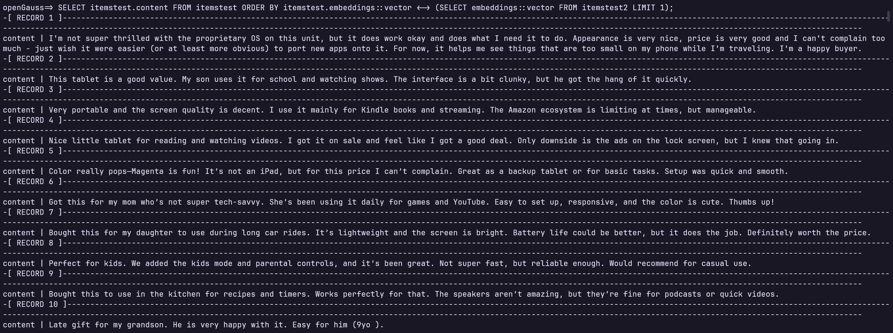

# openGauss + MindsDB 轻松为数据库实现AI赋能

## MindsDB介绍
MindsDB是一个开源机器学习项目，通过将机器学习模型集成到现有数据库系统中来简化机器学习模型的部署。通过集成各类主流数据库，MindsDB可以减少使用者在数据迁移，机器学习模型训练和部署上耗费的时间，通过让用户通过使用SQL语句进行数据查询和模型训练，以此搭建起数据库与机器学习之间的桥梁。

在本文中，我们将通过两个简单的示例介绍如何以openGauss为数据底座，结合MindsDB高效易用的AI功能，快速实现数据库AI赋能。

## 部署&安装

### 安装MindsDB

在开始之前，我们首先需要安装MindsDB, MindsDB提供了容器部署和Python部署(更便于调试)两种方式，具体可以参考[官网](https://docs.mindsdb.com/setup/self-hosted/docker)
### 安装openGauss

具体可以参考[openGauss官网](https://docs.opengauss.org/zh/docs/latest/docs/GettingStarted/%E5%AE%89%E8%A3%85openGauss.html)，在此不做赘述

## 开始使用

### 建立连接

MindsDB部署完成后，我们可以进入MindsDB Studio页面


使用如下命令与openGauss建立连接，其中`PORT`为openGauss Server监听的端口号，`DBNAME`为openGauss中用户准备使用的数据库，`USER`与`PASSWORD`分别为数据库用户的用户名和密码

```sql 

CREATE DATABASE opengauss_datasource
WITH
  ENGINE = 'opengauss',
  PARAMETERS = {
    "host": "127.0.0.1",
    "port": PORT,
    "database": DBNAME,
    "user": USERNAME,
    "password": PASSWORD
  };
```


在MindsDB中，当SQL命令执行成功时，MindsDB Studio会有如下显示：


如果我们想要断开MindsDB与openGauss的连接，可以使用如下sql
```sql
DROP DATABASE opengauss_datasource
```

在MindsDB中，我们可以通过执行SQL对openGauss中的数据表进行一些基本操作

### 数据准备
首先我们需要在openGauss中创建一张包含vector列的表: 
```sql
CREATE TABLE test(id int, val vector(3));
```

现在我们回到MindsDB Studio中，通过MindsDB Studio操作该表

### 插入数据
```sql
INSERT INTO opengauss_datasource.test(val) VALUES(1, '[1, 2, 3]'); 
```

### 更新数据
```sql
UPDATE opengauss_datasource.test SET val = '[2, 3, 4]' WHERE id = 1;
```

### 删除数据
```sql
DELETE FROM opengauss_datasource.test WHERE id = 1;
```

### 查询数据
```sql
SELECT * FROM opengauss_datasource.test LIMIT 1;
```

### 距离计算
```sql
SELECT * FROM opengauss_datasource.test ORDER BY val <-> '[3,1,2]' LIMIT 5;
SELECT * FROM opengauss_datasource.test ORDER BY val <#> '[3,1,2]' LIMIT 5;
SELECT * FROM opengauss_datasource.test ORDER BY val <=> '[3,1,2]' LIMIT 5;
```

## MindsDB + openGauss实战，使用MindsDB进行词嵌入

首先我们使用MindsDB提供的文本数据建立一张我们自己的数据表, 在`mysql_demo_db`中，mindsdb提供了一些样例数据供我们使用
这里我们使用`amazon_reviews`

```sql
CREATE DATABASE mysql_demo_db
WITH ENGINE = 'mysql',
PARAMETERS = {
    "user": "user",
    "password": "MindsDBUser123!",
    "host": "samples.mindsdb.com",
    "port": "3306",
    "database": "public"
};

CREATE TABLE opengauss_datasource.amazon_reviews
    (SELECT * FROM mysql_demo_db.amazon_reviews LIMIT 10);

```

可以看到该表由两列构成，一列为产品名，另一列为顾客对该产品的评价


我们使用openai提供的词嵌入模型对文本进行词嵌入操作，首先我们需要准备好我们将要使用的机器学习引擎，使用如下命令创建，这里需要我们申请一个openai api key以便我们调用openai的模型接口， 使用时用自己的api key替换`your-api-key`即可

```sql

CREATE ML_ENGINE openai
FROM openai
USING
    api_key = your-api-key
```

我们可以使用`SHOW ML_ENGINES WHERE name = 'openai'`查看引擎信息


当然，除此之外MindsDB也提供了其他诸如HuggingFace等机器学习引擎供用户使用。这里我们使用`CREATE MODEL`创建需要的词嵌入模型。创建模型时需要指定使用的ML Engine, 这里我们使用上个步骤中创建的`openai` Engine。然后，我们需要指定使用的词嵌入模型，这里我们使用`text-embedding-ada-002`，同时设置`mode`为`embedding`。最后我们需要制定将哪一列转换为词嵌入，这里我们制定`review`列，最后我们需要再次使用上一步中的api key来建立模型。

```sql

CREATE MODEL openai_emb 
PREDICT embedding 
USING    
  engine = 'openai',
  model_name='text-embedding-ada-002',    
  mode = 'embedding',    
  question_column = 'review',
  openai_api_key = your-api-key;
```

执行成功时可以看到模型信息如下


最后，我们调用词嵌入模型进行文本转换，将文本转换为向量数据
```sql
create table opengauss_datasource.itemstest (
SELECT m.embedding AS embeddings, t.review content FROM  opengauss_datasource.amazon_reviews t
  join openai_emb  m
);
```


可以看到文本数据已经被转换成了词嵌入。

利用向量计算功能，我们可以实现近似文本的搜索，这里我们在用来词嵌入的数据中随机挑选一句进行改写，改写后使其原义不偏离原句但是句子本身与原句不同。

原始数据如下: 


我们改写其中一句:

```sql
原句: I'm not super thrilled with the proprietary OS on this unit, but it does work okay and does what I need it to do. Appearance is very nice, price is very good and I can't complain too much - just wish it were easier (or at least more obvious) to port new apps onto it. For now, it helps me see things that are too small on my phone while I'm traveling. I'm a happy buyer.

改写后: The custom operating system is not my favorite, but the tablet performs well enough for my needs. It looks great, the price was excellent, and overall I’m satisfied. I do wish installing new apps was more straightforward, though. Still, it’s been a helpful device for reading and browsing when I am on the go and don’t want to use my phone’s small screen.
```

现在我们将改写后的句子也进行词嵌入操作

```sql
CREATE TABLE opengauss_datasource.amazon_reviews2(product_name text, review text);

insert into amazon_reviews2 values('All-New Fire HD 8 Tablet, 8 HD Display, Wi-Fi, 16 GB - Includes Special Offers, Magenta', 'The custom operating system is not my favorite, but the tablet performs well enough for my needs. It looks great, the price was excellent, and overall I’m satisfied. I do wish installing new apps was more straightforward, though. Still, it’s been a helpful device for reading and browsing when I am on the go and don’t want to use my phone’s small screen.');

create table opengauss_datasource.itemstest2 (
SELECT m.embedding AS embeddings, t.review content FROM  opengauss_datasource.amazon_reviews2 t
  join openai_emb  m
);
```


这样我们就得到了改写后句子的词嵌入，下面我们需要在openGauss中通过词嵌入寻找出与改写后句子语义最相近的句子，由于MindsDB的语法限制， 我们无法在通过MindsDB执行转型操作，以下SQL需要在openGauss中执行：


```sql
SELECT itemstest.content FROM itemstest ORDER BY itemstest.embeddings::vector <-> (SELECT embeddings::vector FROM itemstest2 LIMIT 1);
```

可以看到结果如下，符合预期。




## MindsDB + openGauss实战，使用MindsDB辅助构建本地知识库

除了进行词嵌入，我们也可以通过MindsDB方便地调用模型来帮助我们解决问题，然后我们可以将答案存储到openGauss中方便后续使用。

首先我们依旧需要指定使用的模型：
```sql
CREATE MODEL question_answering_model
PREDICT answer
USING
    engine = 'openai',
    prompt_template = 'answer the question of text:{{question}}', 
    openai_api_key = your-api-key;
```

`engine`我们在前面已经创建过，创建`engine`的部分可以参考前文
这里我们构建一张表，表中储存我们想让LLM回答我们的问题，创建表的部分省略，仅展示我们将要使用的简单表：

```sql
SELECT * FROM opengauss_datasource.questions;
```


调用模型来生成答案：
```sql 
CREATE TABLE opengauss_datasource.answer (
SELECT m.answer AS answer, t.question question FROM opengauss_datasource.questions t
  join question_answering_model m
);
```

这里answer列为生成的答案，question为输入的问题，我们通过执行该SQL语句使MindsDB调用大模型为表中每一个问题生成对应答案。


