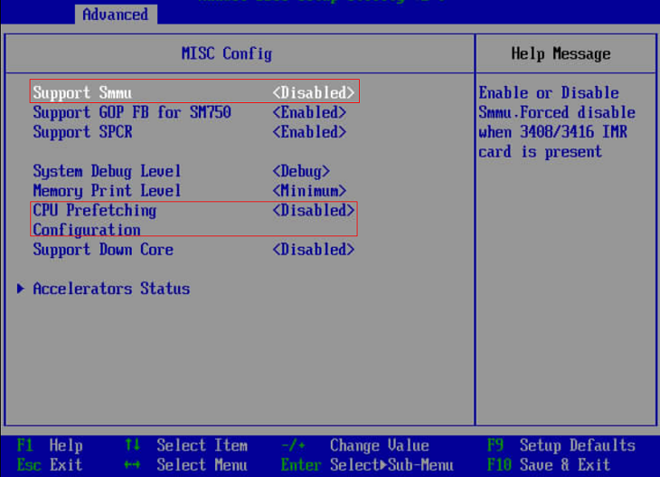
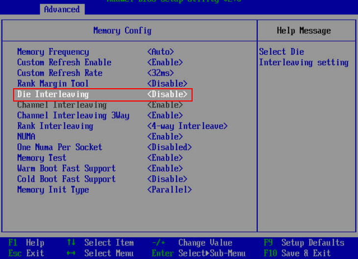
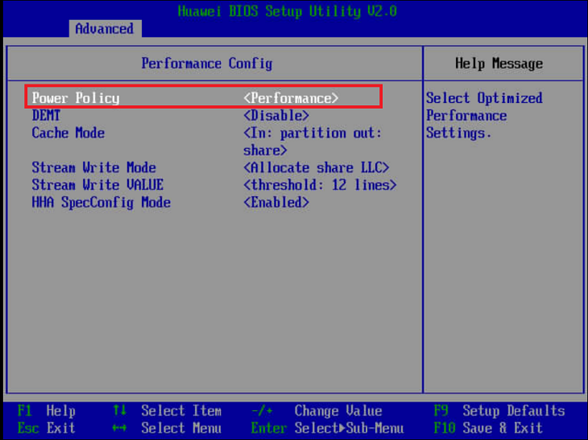

# MOT服务器优化：基于Arm的华为TaiShan2P/4P服务器<a name="ZH-CN_TOPIC_0280525129"></a>

以下是基于Arm/鲲鹏架构的华为TaiShan 2280 v2服务器（2路128核）和TaiShan 2480 v2服务器（4路256核）上运行MOT时的建议配置。

除非另有说明，以下设置适用于客户端和服务器的机器。

## BIOS<a name="section31155189"></a>

修改BIOS相关设置：

1.  选择 **BIOS** \>  **Advanced**  \>  **MISC Config**。设置 **Support Smmu** 为 **Disabled**。
2.  选择 **BIOS** \>  **Advanced**  \>  **MISC Config**。设置 **CPU Prefetching Configuration** 为 **Disabled**。

    

3.  选择 **BIOS**  \>  **Advanced**  \>  **Memory Config**。设置 **Die Interleaving** 为 **Disabled** 。

    

4.  选择 **BIOS**  \>  **Advanced**  \>  **Performance Config**。设置 **Power Policy** 为 **Performance**。

    


## 操作系统：内核和启动<a name="section11961253"></a>

-   以下操作系统内核和启动参数通常由sysadmin配置。

    配置内核参数，如下所示。

    ```
    net.ipv4.ip_local_port_range = 9000 65535 
    kernel.sysrq = 1 
    kernel.panic_on_oops = 1 
    kernel.panic = 5 
    kernel.hung_task_timeout_secs = 3600 
    kernel.hung_task_panic = 1 
    vm.oom_dump_tasks = 1 
    kernel.softlockup_panic = 1 
    fs.file-max = 640000 
    kernel.msgmnb = 7000000 
    kernel.sched_min_granularity_ns = 10000000 
    kernel.sched_wakeup_granularity_ns = 15000000 
    kernel.numa_balancing=0 
    vm.max_map_count = 1048576 
    net.ipv4.tcp_max_tw_buckets = 10000 
    net.ipv4.tcp_tw_reuse = 1 
    net.ipv4.tcp_tw_recycle = 1 
    net.ipv4.tcp_keepalive_time = 30 
    net.ipv4.tcp_keepalive_probes = 9 
    net.ipv4.tcp_keepalive_intvl = 30 
    net.ipv4.tcp_retries2 = 80 
    kernel.sem = 32000 1024000000      500     32000 
    kernel.shmall = 52805669 
    kernel.shmmax = 18446744073692774399 
    sys.fs.file-max = 6536438 
    net.core.wmem_max = 21299200 
    net.core.rmem_max = 21299200 
    net.core.wmem_default = 21299200 
    net.core.rmem_default = 21299200 
    net.ipv4.tcp_rmem = 8192 250000 16777216 
    net.ipv4.tcp_wmem = 8192 250000 16777216 
    net.core.somaxconn = 65535 
    vm.min_free_kbytes = 5270325 
    net.core.netdev_max_backlog = 65535 
    net.ipv4.tcp_max_syn_backlog = 65535 
    net.ipv4.tcp_syncookies = 1 
    vm.overcommit_memory = 0 
    net.ipv4.tcp_retries1 = 5 
    net.ipv4.tcp_syn_retries = 5 
    ##NEW 
    kernel.sched_autogroup_enabled=0 
    kernel.sched_min_granularity_ns=2000000 
    kernel.sched_latency_ns=10000000 
    kernel.sched_wakeup_granularity_ns=5000000 
    kernel.sched_migration_cost_ns=500000 
    vm.dirty_background_bytes=33554432 
    kernel.shmmax=21474836480 
    net.ipv4.tcp_timestamps = 0 
    net.ipv6.conf.all.disable_ipv6=1 
    net.ipv6.conf.default.disable_ipv6=1 
    net.ipv4.tcp_keepalive_time=600 
    net.ipv4.tcp_keepalive_probes=3 
    kernel.core_uses_pid=1
    ```

-   调优服务

    以下为必填项。

    服务器必须运行throughput-performance配置文件：

    ```
    [...]$ tuned-adm profile throughput-performance
    ```

    throughput-performance配置文件是广泛适用的调优，它为各种常见服务器工作负载提供卓越的性能。

    其他不太适合openGauss和MOT服务器的配置可能会影响MOT的整体性能，包括：平衡配置、桌面配置、延迟性能配置、网络延迟配置、网络吞吐量配置和节能配置。

-   启动调优

    在内核启动参数中添加iommu.passthrough=1。

    在pass-through模式下运行时，适配器需要DMA转换到内存，从而提高性能。


