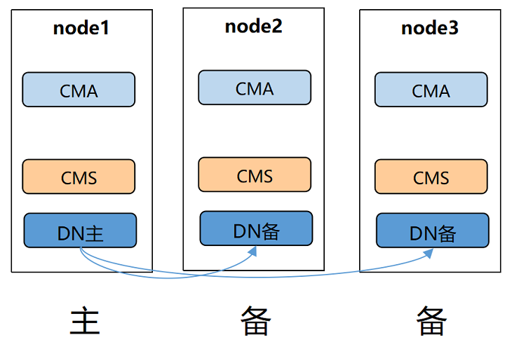
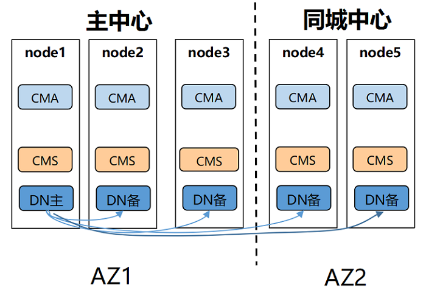
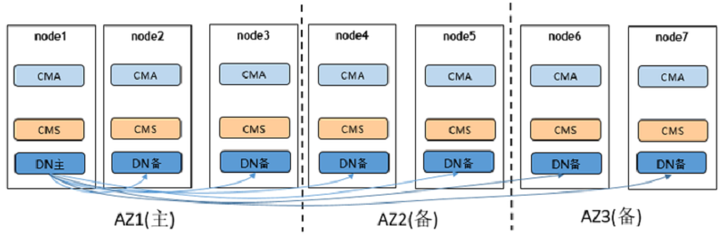
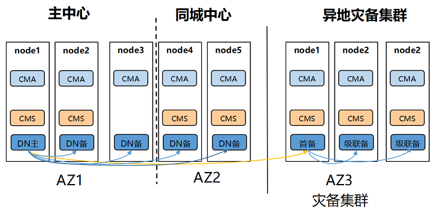

# 常见主备部署方案

## 单中心

**图 1**  单中心部署图 

组网特点：
单AZ部署，可以配置一个同步备一个异步备

优势：
1. 三个node完全等价，故障任意一个node都可以提供服务
2. 成本低

劣势：
高可用能力较低，发生AZ级故障只能依赖节点恢复

适用性：
适用于对高可用性要求较低的业务系统

## 同城双中心

**图 2**  同城双中心部署图  

组网特点：
同城两个AZ，相比单AZ可靠性更强，主中心和同城中心可以分别配置一个同步备

优势：
1. 同城同步复制，任意一个中心故障，另一个中心还可以提供服务，数据不丢失，RPO=0
2. 成本适中

劣势：
1. 同城距离不宜太远，一般建议70km以内，业务设计要考虑读写次数过多导致的总延时
2. 不具备异地容灾能力

适用性：
适用于一般业务系统

## 两地三中心

**图 3**  两地三中心部署图  

组网特点：
两地三中心，每个AZ都保证至少有一个同步备，同时地点和中心数的增加，集群的可靠性能够达到最高

优势：
具备异地容灾能力，并且能够保证异地容灾数据不丢失，RPO=0，可靠性最强

劣势：
1. 异地距离较远，若在异地中心配置了同步备，可能会影响性能
2. 成本较高

适用性：
适用于核心重要业务系统

## 两地三中心流式容灾方案

**图 4**  两地三中心流式容灾方案部署图  
    

组网特点：
双集群容灾方案，两个独立集群，主备集群组网方式可任意选择，备集群会选出首备连接主集群的主DN，灾备集群内都以级联备方式连接首备

优势：
1. 主集群具备单集群组网的优点，只有主集群彻底不可用后才需要手动切换为备集群
2. 跨集群(异地)复制链路无论是否发生容灾切换都只有一条，占用网络带宽相对较少
3. 组网更加灵活，主集群和灾备集群都可以选择不同的组网

劣势：
1. 需要增加灾备集群，相应增加成本
2. 异地灾备RPO>0

适用性：
适用于核心重要业务系统

两地三中心流式容灾方案更多信息详见[两地三中心跨Region容灾](两地三中心跨Region容灾.md)

> **说明：** 
>
>以上为一些典型的部署方案，用户可以依据自身实际业务场景对以上各种部署方案进行调整，比如增减备机数量、调整中心数量、适当安置同步备和异步备、适当使用级联备机等

