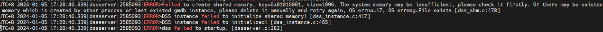

# 未擦除头部文件
## 现象
同一环境上安装过数据库，再次安装时出现如下图错误。




## 原因
再次安装时没有擦除头部文件或未删除数据库安装目录。

## 解决方案
- 擦除头部文件
 ```shell
 #/home/test/dss/dev/dss-dba为$DSS_HOME,可直接将路径替换为$DSS_HOME
  dd if=/dev/zero of=/home/test/dss/dev/dss-dba bs=2M count=51200 >/dev/null 2>&1
  ```
  - 删除数据库安装目录
```shell
#data目录为数据库安装目录
rm -rf /home/test/data/node1 /home/test/data/node2
```