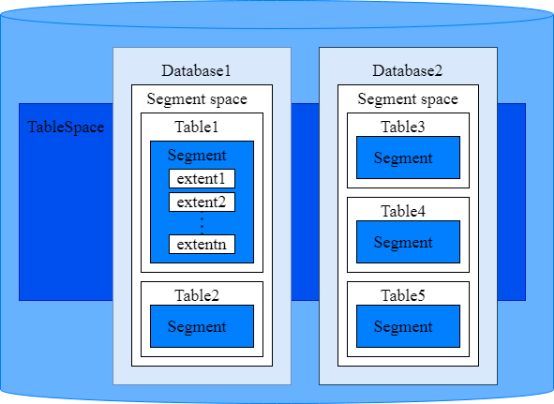
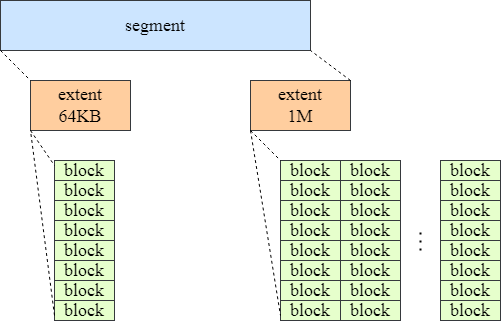

# 段页式存储结构

本节主要从逻辑视角介绍数据库段页式存储结构，段页式存储结构如图1。

**图 1**  段页式存储结构图  
  

> **说明：**
> 1. Tablespace，即表空间，是一个目录，可以存在多个，里面存储的是它所包含的数据库的各种物理文件。每个表空间可以对应多个Database。  
> 2. Database，即数据库，用于管理各类数据对象，各数据库间相互隔离。数据库管理的对象可分布在多个Tablespace上。  
> 3. Segment space，段空间，每个database有且仅有一个段空间，创建数据库同时会创建该数据库对应的段空间。每个段空间有5个文件，命名为1、2、3、4、5；文件1存储段页式相关的元数据，文件2至文件5存储用户数据和一些段页式相关的元数据。  
> 4. Table，即表，每张表只能属于一个数据库，也只能对应到一个Tablespace。每张表对应的数据文件必须在同一个Tablespace中。  
> 5. Segment，即段，用于存储table的数据，每个table都有一个逻辑上的segment。  
> 6. extent，即区，一个段的全部数据以区为单位存储在段空间的5个文件中，有64KB/1M/8M/64M四种类型，相同类型的extent存放在同一个物理文件中。extent在segment中的分布如图2所示。  

**图 2**  一个segment的extent分布结构图  
  

> **说明：**
>每个segment会挂载多个extent，extent之间不一定连续，但同一个extent中的页面（block，大小为8KB）连续。
