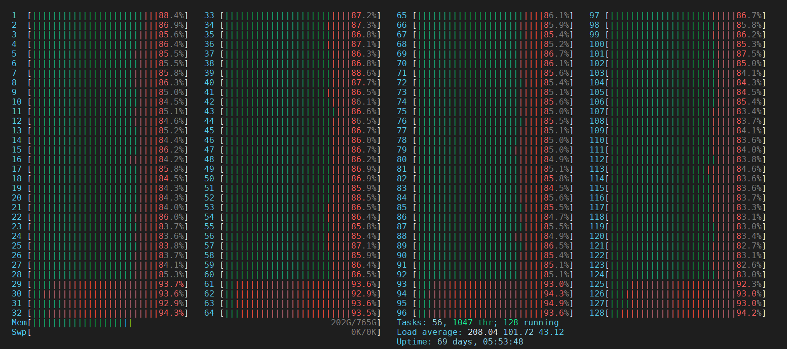

# 资源池化POC性能测试指南

## 内容简介

本章节主要介绍资源池化架构下TPCC的极限性能的测试方法，以及为达到最佳tpmC性能所依赖的相关GUC参数调优和OS调优。

## 硬件环境

- 计算
    目前最佳TPCC结果是使用2个2路鲲鹏服务器（128C, 512G-1024G内存）
    OS版本为openEuler 20.03 LTS
- 存储
    使用企业集中式存储，目前通过验证的硬件型号为OceanStor Dorado 5300/5500/18000/16000 V6系列
- 网络
    鲲鹏配套的Hi1822（如果使用ROCE网络，网卡当前仅支持Mellox CX5）

## 软件环境

- 数据库：openGauss 5.0.1 正式发布版本
    
- TPCC客户端：使用tidb优化过的BenchmarkSQL 5.0（[https://github.com/pingcap/benchmarksql](https://github.com/pingcap/benchmarksql)）
    
- 依赖包
    
    |所需软件|建议版本|
    |:--|:--|
    |numactl|–|
    |jdk|1.8.0-242|
    |ant|1.10.5|
    |htop|–|
    
## 主机BIOS和OS部分调优

1. 主机BIOS参数设置

    - BIOS>Advanced>MISC Config，配置Support Smmu为Disabled
    - BIOS>Advanced>MISC Config，配置CPU Prefetching Configuration为Disabled
    - BIOS>Advanced>Memory Config，配置Die Interleaving为Disable
    - BIOS>Advanced>Performance Config，配置Power Policy为Performance

2. 操作系统优化

    - 修改操作系统内核PAGESIZE为64KB（默认值）
    - 关闭irqbalance
    
        ```bash
        systemctl stop irqbalance
        ```
    - 调整numa_balance
        ```bash
        echo 0 > /proc/sys/kernel/numa_balancing
        ```
    - 调整透明大页
        ```bash
        echo 'never' > /sys/kernel/mm/transparent_hugepage/enabled
        echo 'never' > /sys/kernel/mm/transparent_hugepage/defrag
        ```

3. 网络配置

- 网络平面说明

    一般情况下，数据库集群的网络可以分为3个平面：存储网络，计算节点间网络，业务侧网络
    - 存储网络：计算节点与磁阵之间连接的网络，建议网卡带宽不低于10GE
    - 计算网络：计算节点之间连接的网络，建议网卡带宽不低于10GE
    - 业务侧网络：计算节点与业务客户端（或TPCC压测客户端）的网络，建议网卡带宽不低于10GE

    性能测试场景下，需要对存储网络使用的网卡进行中断绑定CPU核的设置（因为存储IO流量最大，如果是主备同时压测，那么计算网络也会有一定的流量），计算网络可以按需要设置
    如果网卡配置中使用了BOND或者VxLAN，需要对实际的物理网卡做中断绑定CPU核的设置
    如果部分网络平面重合，比如存储网络和计算网络共用，或者计算网络和业务侧网络共用，那么也需要对实际的物理网卡做中断绑定CPU核的设置

- 网卡多中断队列设置

    ```text
    ##此处enp4s0为存储网络的物理网卡
    [root@localhost]# ethtool -L enp4s0 combined 16
    ```
    
- 中断调优开启tso，lro，gro，gso特性。
    
    ```bash
    ethtool -K enp4s0 tso on
    ethtool -K enp4s0 lro on
    ethtool -K enp4s0 gro on
    ethtool -K enp4s0 gso on
    ```

- 网卡固件确认与更新
    
    ```text
    [root@localhost]# ethtool -i enp4s0
    driver: hinic
    version: 2.3.2.11
    firmware-version: 2.4.1.0
    expansion-rom-version:
    bus-info: 0000:04:00.0
    supports-statistics: yes
    supports-test: yes
    supports-eeprom-access: no
    supports-register-dump: no
    supports-priv-flags: no
    ```

    网卡固件版本应为2.4.1.0
    
## 安装数据库

安装一主一备openGauss资源池化环境。参考[资源池化OM安装部署](./%E8%B5%84%E6%BA%90%E6%B1%A0%E5%8C%96OM%E5%AE%89%E8%A3%85%E9%83%A8%E7%BD%B2.md)。

## 磁盘IO队列调度机制设置
    
- 针对磁盘IO队列调度机制设置，此处的sb*表示使用的磁阵的LUN映射在主机侧的块设备盘符。由于安装过程中OM会修改该配置，所以需要在安装完成后执行。
    
    ```bash
    echo none > /sys/block/sb*/queue/scheduler
    ```
    
## 网卡中断绑核

首先获取网卡对应的中断号

    [root@localhost]# cat /proc/interrupts | grep enp4s0 | awk '{print $1$NF}'
    405:enp4s0_qp0
    406:enp4s0_qp1
    407:enp4s0_qp2
    408:enp4s0_qp3
    409:enp4s0_qp4
    410:enp4s0_qp5
    411:enp4s0_qp6
    412:enp4s0_qp7
    413:enp4s0_qp8
    414:enp4s0_qp9
    415:enp4s0_qp10
    416:enp4s0_qp11
    417:enp4s0_qp12
    418:enp4s0_qp13
    419:enp4s0_qp14
    420:enp4s0_qp15

绑定对应的CPU核

    [root@localhost]# echo 28 >  /proc/irq/405/smp_affinity_list
    [root@localhost]# echo 29 >  /proc/irq/406/smp_affinity_list
    [root@localhost]# echo 30 >  /proc/irq/407/smp_affinity_list
    [root@localhost]# echo 31 >  /proc/irq/408/smp_affinity_list
    [root@localhost]# echo 60 >  /proc/irq/409/smp_affinity_list
    [root@localhost]# echo 61 >  /proc/irq/410/smp_affinity_list
    [root@localhost]# echo 62 >  /proc/irq/411/smp_affinity_list
    [root@localhost]# echo 63 >  /proc/irq/412/smp_affinity_list
    [root@localhost]# echo 92 >  /proc/irq/413/smp_affinity_list
    [root@localhost]# echo 93 >  /proc/irq/414/smp_affinity_list
    [root@localhost]# echo 94 >  /proc/irq/415/smp_affinity_list
    [root@localhost]# echo 95 >  /proc/irq/416/smp_affinity_list
    [root@localhost]# echo 124 > /proc/irq/417/smp_affinity_list
    [root@localhost]# echo 125 > /proc/irq/418/smp_affinity_list
    [root@localhost]# echo 126 > /proc/irq/419/smp_affinity_list
    [root@localhost]# echo 127 > /proc/irq/420/smp_affinity_list

## 准备测试工具

1. 下载TPCC标准测试工具BenchmarkSQL5.0。
    
    ```bash
    [root@localhost]# git clone -b 5.0-mysql-support-opt-2.1 https://github.com/pingcap/benchmarksql.git
    Cloning into 'tpcc-mysql'...
    remote: Enumerating objects: 106, done.
    remote: Total 106 (delta 0), reused 0 (delta 0), pack-reused 106
    Receiving objects: 100% (106/106), 64.46 KiB | 225.00 KiB/s, done.
    Resolving deltas: 100% (30/30), done.
    ```
    
4. 下载安装JDK和ant依赖包。
    
    ```bash
    [root@localhost]# rpm -ivh ant-1.10.5-6.oe1.noarch.rpm jdk-8u281-linux-aarch64.rpm --force --nodeps
    warning: ant-1.10.5-6.oe1.noarch.rpm: Header V3 RSA/SHA1 Signature, key ID b25e7f66: NOKEY
    warning: jdk-8u281-linux-aarch64.rpm: Header V3 RSA/SHA256 Signature, key ID ec551f03: NOKEY
    Verifying...                          ################################# [100%]
    Preparing...                          ################################# [100%]
    Updating / installing...
       1:jdk1.8-2000:1.8.0_281-fcs        ################################# [ 50%]
    Unpacking JAR files...
            tools.jar...
            rt.jar...
            jsse.jar...
            charsets.jar...
            localedata.jar...
       2:ant-0:1.10.5-6.oe1               ################################# [100%]
    ```
    
5. 配置JAVA环境变量
    
    ```bash
    [root@localhost]# tail -3  /root/.bashrc
    export JAVA_HOME=/usr/java/jdk1.8.0_281-aarch64
    export PATH=$JAVA_HOME/bin:$PATH
    export CLASSPATH=.:JAVA_HOME/lib:$BENCHMARKSQLPATH/run/ojdbc7.jar
    ```
    
6. 在BenchmarkSQL所在目录下输入ant命令进行编译，编译成功后会生成build和dist两个目录。
    
    ```bash
    [root@localhost]# pwd
    /tmp/benchmarksql-5.0-mysql-support-opt-2.1
    [root@localhost]# ant
    Buildfile: /tmp/benchmarksql-5.0-mysql-support-opt-2.1/build.xml
    
    init:
        [mkdir] Created dir: /tmp/benchmarksql-5.0-mysql-support-opt-2.1/build
    
    compile:
        [javac] Compiling 12 source files to /tmp/benchmarksql-5.0-mysql-support-opt-2.1/build
    
    dist:
        [mkdir] Created dir: /tmp/benchmarksql-5.0-mysql-support-opt-2.1/dist
          [jar] Building jar: /tmp/benchmarksql-5.0-mysql-support-opt-2.1/dist/BenchmarkSQL-5.0.jar
    
    BUILD SUCCESSFUL
    Total time: 1 second
    ```
    
7. [下载对应的JDBC驱动](https://opengauss.org/zh/download/)至BenchmarkSQL目录的lib/postgresql文件夹，并解压，删除自带的JDBC驱动。
    
    ```bash
    [root@localhost]# pwd
    /tmp/benchmarksql-5.0-mysql-support-opt-2.1/lib/postgres/
    [root@localhost]# ls
    openGauss-5.1.0-JDBC.tar.gz  postgresql-9.3-1102.jdbc41.jar
    [root@localhost]# rm -f postgresql-9.3-1102.jdbc41.jar
    [root@localhost]# tar -xf openGauss-5.1.0-JDBC.tar.gz
    [root@localhost]# ls
    openGauss-5.1.0-JDBC.tar.gz  postgresql.jar
    ```
    
8. 调整性能测试相关配置

- 连接串
    
    ```bash
    conn=jdbc:opengauss://20.0.0.103:26000/tpcc?prepareThreshold=1&batchMode=on&fetchsize=10&loggerLevel=off
    ```

- 修改文件内容将数据分散，调整FILLFACTOR，数据分区。
    
    ```sql
    [root@localhost]# ls benchmarksql-5.0-mysql-support-opt-2.1/run/sql.common/tableCreates.sql
    benchmarksql-5.0-mysql-support-opt-2.1/run/sql.common/tableCreates.sql
    [root@localhost]# cat tableCreates.sql
    CREATE TABLESPACE example2 relative location 'tablespace2';
    CREATE TABLESPACE example3 relative location 'tablespace3';
    
    create table bmsql_config (
      cfg_name    varchar(30),
      cfg_value   varchar(50)
    );
    
    create table bmsql_warehouse (
      w_id        integer   not null,
      w_ytd       decimal(12,2),
      w_tax       decimal(4,4),
      w_name      varchar(10),
      w_street_1  varchar(20),
      w_street_2  varchar(20),
      w_city      varchar(20),
      w_state     char(2),
      w_zip       char(9)
    ) WITH (FILLFACTOR=80);
    
    create table bmsql_district (
      d_w_id       integer       not null,
      d_id         integer       not null,
      d_ytd        decimal(12,2),
      d_tax        decimal(4,4),
      d_next_o_id  integer,
      d_name       varchar(10),
      d_street_1   varchar(20),
      d_street_2   varchar(20),
      d_city       varchar(20),
      d_state      char(2),
      d_zip        char(9)
     ) WITH (FILLFACTOR=80);
    
    create table bmsql_customer (
      c_w_id         integer        not null,
      c_d_id         integer        not null,
      c_id           integer        not null,
      c_discount     decimal(4,4),
      c_credit       char(2),
      c_last         varchar(16),
      c_first        varchar(16),
      c_credit_lim   decimal(12,2),
      c_balance      decimal(12,2),
      c_ytd_payment  decimal(12,2),
      c_payment_cnt  integer,
      c_delivery_cnt integer,
      c_street_1     varchar(20),
      c_street_2     varchar(20),
      c_city         varchar(20),
      c_state        char(2),
      c_zip          char(9),
      c_phone        char(16),
      c_since        timestamp,
      c_middle       char(2),
      c_data         varchar(500)
    ) WITH (FILLFACTOR=80) tablespace example2;
    
    create sequence bmsql_hist_id_seq;
    
    create table bmsql_history (
      hist_id  integer,
      h_c_id   integer,
      h_c_d_id integer,
      h_c_w_id integer,
      h_d_id   integer,
      h_w_id   integer,
      h_date   timestamp,
      h_amount decimal(6,2),
      h_data   varchar(24)
    ) WITH (FILLFACTOR=80);
    
    create table bmsql_new_order (
      no_w_id  integer   not null,
      no_d_id  integer   not null,
      no_o_id  integer   not null
    ) WITH (FILLFACTOR=80);
    
    create table bmsql_oorder (
      o_w_id       integer      not null,
      o_d_id       integer      not null,
      o_id         integer      not null,
      o_c_id       integer,
      o_carrier_id integer,
      o_ol_cnt     integer,
      o_all_local  integer,
      o_entry_d    timestamp
    ) WITH (FILLFACTOR=80);
    
    create table bmsql_order_line (
      ol_w_id         integer   not null,
      ol_d_id         integer   not null,
      ol_o_id         integer   not null,
      ol_number       integer   not null,
      ol_i_id         integer   not null,
      ol_delivery_d   timestamp,
      ol_amount       decimal(6,2),
      ol_supply_w_id  integer,
      ol_quantity     integer,
      ol_dist_info    char(24)
    ) WITH (FILLFACTOR=80);
    
    create table bmsql_item (
      i_id     integer      not null,
      i_name   varchar(24),
      i_price  decimal(5,2),
      i_data   varchar(50),
      i_im_id  integer
    );
    
    create table bmsql_stock (
      s_w_id       integer       not null,
      s_i_id       integer       not null,
      s_quantity   integer,
      s_ytd        integer,
      s_order_cnt  integer,
      s_remote_cnt integer,
      s_data       varchar(50),
      s_dist_01    char(24),
      s_dist_02    char(24),
      s_dist_03    char(24),
      s_dist_04    char(24),
      s_dist_05    char(24),
      s_dist_06    char(24),
      s_dist_07    char(24),
      s_dist_08    char(24),
      s_dist_09    char(24),
      s_dist_10    char(24)
    ) WITH (FILLFACTOR=80) tablespace example3;
    ```

## 计算节点数据库进程绑核

- 计算节点上安装numactl
        
   ```bash
   yum install numactl -y
   ```

- 计算节点数据库进程绑核
  关闭集群 

   ```bash
   [omm@localhost]$ cm_ctl stop
   ``` 
  替换启动数据库节点命令：

   ```bash
   ## $GAUSSHOME为数据库二进制安装的目录
   [omm@localhost]$ sed -i 's/nohup/nohup numactl -C 1-28,32-60,64-92,96-124/' $GAUSSHOME/bin/dms_contrl.sh
   ```

## 设置性能测试数据库参数（极限性能测试使用）

- 切换到数据库安装用户下面执行如下命令
    ```bash
    gs_guc set -N all -I all -h "host all all  0.0.0.0/0 sha256"
    gs_guc set -N all -I all -c "listen_addresses ='*'"
    gs_guc set -N all -I all -c "max_connections = 4096"
    gs_guc set -N all -I all -c "remote_read_mode = non_authentication"
    gs_guc set -N all -I all -c "allow_concurrent_tuple_update = true"
    gs_guc set -N all -I all -c "audit_enabled = off"
    gs_guc set -N all -I all -c "cstore_buffers = 16MB"
    gs_guc set -N all -I all -c "enable_alarm = off"
    gs_guc set -N all -I all -c "enable_codegen = false"
    gs_guc set -N all -I all -c "enable_data_replicate = off"
    gs_guc set -N all -I all -c "full_page_writes = off"
    gs_guc set -N all -I all -c "max_files_per_process = 100000"
    gs_guc set -N all -I all -c "max_prepared_transactions = 2048"
    gs_guc set -N all -I all -c "max_process_memory = 500GB"
    gs_guc set -N all -I all -c "shared_buffers = 300GB"
    gs_guc set -N all -I all -c "use_workload_manager = off"
    gs_guc set -N all -I all -c "wal_buffers = 1GB"
    gs_guc set -N all -I all -c "work_mem = 1MB"
    gs_guc set -N all -I all -c "transaction_isolation = 'read committed'"
    gs_guc set -N all -I all -c "default_transaction_isolation = 'read committed'"
    gs_guc set -N all -I all -c "synchronous_commit = on"
    gs_guc set -N all -I all -c "fsync = on"
    gs_guc set -N all -I all -c "maintenance_work_mem = 2GB"
    gs_guc set -N all -I all -c "vacuum_cost_limit = 10000"
    gs_guc set -N all -I all -c "autovacuum = on"
    gs_guc set -N all -I all -c "autovacuum_mode = vacuum"
    gs_guc set -N all -I all -c "autovacuum_max_workers = 20"
    gs_guc set -N all -I all -c "autovacuum_naptime = 5s"
    gs_guc set -N all -I all -c "autovacuum_vacuum_cost_delay = 10"
    gs_guc set -N all -I all -c "update_lockwait_timeout = 20min"
    gs_guc set -N all -I all -c "enable_mergejoin = off"
    gs_guc set -N all -I all -c "enable_nestloop = off"
    gs_guc set -N all -I all -c "enable_hashjoin = off"
    gs_guc set -N all -I all -c "enable_material = off"
    gs_guc set -N all -I all -c "wal_log_hints = off"
    gs_guc set -N all -I all -c "log_duration = off"
    gs_guc set -N all -I all -c "checkpoint_timeout = 15min"
    gs_guc set -N all -I all -c "autovacuum_vacuum_scale_factor = 0.1"
    gs_guc set -N all -I all -c "autovacuum_analyze_scale_factor = 0.02"
    gs_guc set -N all -I all -c "enable_save_datachanged_timestamp = false"
    gs_guc set -N all -I all -c "enable_double_write = on"
    gs_guc set -N all -I all -c "enable_incremental_checkpoint = on"
    gs_guc set -N all -I all -c "enable_opfusion = on"
    gs_guc set -N all -I all -c "advance_xlog_file_num = 5"
    gs_guc set -N all -I all -c "track_activities = off"
    gs_guc set -N all -I all -c "enable_instr_track_wait = off"
    gs_guc set -N all -I all -c "enable_instr_rt_percentile = off"
    gs_guc set -N all -I all -c "track_counts = off"
    gs_guc set -N all -I all -c "track_sql_count = off"
    gs_guc set -N all -I all -c "enable_instr_cpu_timer = off"
    gs_guc set -N all -I all -c "plog_merge_age = 0"
    gs_guc set -N all -I all -c "session_timeout = 0"
    gs_guc set -N all -I all -c "enable_instance_metric_persistent = off"
    gs_guc set -N all -I all -c "enable_logical_io_statistics = off"
    gs_guc set -N all -I all -c "enable_page_lsn_check = off"
    gs_guc set -N all -I all -c "enable_user_metric_persistent = off"
    gs_guc set -N all -I all -c "enable_xlog_prune = off"
    gs_guc set -N all -I all -c "enable_resource_track = off"
    gs_guc set -N all -I all -c "instr_unique_sql_count=0"
    gs_guc set -N all -I all -c "remote_read_mode=non_authentication"
    gs_guc set -N all -I all -c "wal_level = archive"
    gs_guc set -N all -I all -c "hot_standby = off"
    gs_guc set -N all -I all -c "hot_standby_feedback = off"
    gs_guc set -N all -I all -c "client_min_messages = ERROR"
    gs_guc set -N all -I all -c "log_min_messages = FATAL"
    gs_guc set -N all -I all -c "enable_asp = off"
    gs_guc set -N all -I all -c "enable_bbox_dump = off"
    gs_guc set -N all -I all -c "bgwriter_flush_after = 32"
    gs_guc set -N all -I all -c "wal_keep_segments = 1025"
    gs_guc set -N all -I all -c "enable_bitmapscan = off"
    gs_guc set -N all -I all -c "enable_seqscan = off"
    gs_guc set -N all -I all -c "enable_beta_opfusion=on"
    gs_guc set -N all -I all -c "checkpoint_segments=8000"
    gs_guc set -N all -I all -c "enable_stmt_track=false"
    gs_guc set -N all -I all -c "bgwriter_delay = 5s"
    gs_guc set -N all -I all -c "incremental_checkpoint_timeout = 5min"
    gs_guc set -N all -I all -c "xloginsert_locks = 16"
    gs_guc set -N all -I all -c "walwriter_cpu_bind = 0"
    gs_guc set -N all -I all -c "wal_file_init_num = 20"
    gs_guc set -N all -I all -c "pagewriter_sleep = 5s"
    gs_guc set -N all -I all -c "walwriter_sleep_threshold = 50000"
    gs_guc set -N all -I all -c "gs_clean_timeout = 0"
    gs_guc set -N all -I all -c "undo_zone_count = 0"
    gs_guc set -N all -I all -c "pagewriter_thread_num = 4"
    gs_guc set -N all -I all -c "max_redo_log_size = 400GB"
    gs_guc set -N all -I all -c "max_io_capacity = 10GB"
    gs_guc set -N all -I all -c "local_syscache_threshold = 32MB"
    gs_guc set -N all -I all -c "segment_buffers = 1GB"
    gs_guc set -N all -I all -c "numa_distribute_mode ='all'"
    gs_guc set -N all -I all -c "enable_cachedplan_mgr = off"
    gs_guc set -N all -I all -c "light_comm = on"
    gs_guc set -N all -I all -c "enable_indexscan_optimization = on"
    gs_guc set -N all -I all -c "ss_enable_ssl = off"
    gs_guc set -N all -I all -c "ssl = off"
    gs_guc set -N all -I all -c "ss_interconnect_channel_count = 32"
    gs_guc set -N all -I all -c "ss_work_thread_count = 128"
    gs_guc set -N all -I all -c "ss_recv_msg_pool_size = 1GB"
    gs_guc set -N all -I all -c "enable_global_syscache = on"
    ```
## 创建测试数据库和用户
    
- 在主机侧创建数据库tpcc及用户tpcc。
    
    ```bash
    [omm@localhost]$ gsql -d postgres -p 26000 -r
    postgres=# create database tpcc;
    CREATE DATABASE
    postgres=# \q
    [omm@localhost]$ gsql -d tpcc -p 26000 -r
    tpcc=# CREATE USER tpcc WITH PASSWORD "tpcc@123";
    CREATE ROLE
    tpcc=# GRANT ALL ON schema public TO tpcc;
    GRANT
    tpcc=# ALTER User tpcc sysadmin;
    ALTER ROLE
    ```
## 修改测试客户端配置
    
- 进入BenchmarkSQL目录下的run文件夹，编辑benchmarksql配置文件，修改测试参数，包括数据库用户名、密码、IP、端口、数据库。
    
    ```bash
    [root@localhost]# cd /tmp/benchmarksql-5.0-mysql-support-opt-2.1/run
    [root@localhost]# vim props.og
    db=postgres
    driver=org.opengauss.Driver
    conn=jdbc:opengauss://20.20.20.103:26000/tpcc?prepareThreshold=1&batchMode=on&fetchsize=10&loggerLevel=off #修改连接字符串, 包含IP、端口号、数据库
    user=tpcc #用户名
    password=tpcc@123 #密码
    warehouses=1000  #仓位数
    terminals=696 #并发数
    runMins=15  #运行时间
    runTxnsPerTerminal=0
    loadWorkers=100
    limitTxnsPerMin=0
    terminalWarehouseFixed=true
    newOrderWeight=45
    paymentWeight=43
    orderStatusWeight=4
    deliveryWeight=4
    stockLevelWeight=4
    ```
## 导入测试数据
    
- 执行如下命令导入测试数据。

    ```bash
    [root@localhost]# sh runDatabaseBuild.sh props.og
    # ------------------------------------------------------------
    # Loading SQL file ./sql.common/tableCreates.sql
    # ------------------------------------------------------------
    create table bmsql_config (
    cfg_name    varchar(30) primary key,
    cfg_value   varchar(50)
    );
    ......
    # ------------------------------------------------------------
    # Loading SQL file ./sql.postgres/buildFinish.sql
    # ------------------------------------------------------------
    -- ----
    -- Extra commands to run after the tables are created, loaded,
    -- indexes built and extra's created.
    -- PostgreSQL version.
    -- ----
    vacuum analyze;
    ```
## 执行测试
    
- 执行如下命令开始测试。
    ```bash
    [root@localhost]# sh runBenchmark.sh props.og
    ```
- 为了避免多次测试导致数据量太大，影响性能，可以把数据清空重新开始。
    ```bash
    [root@localhost]# sh runDatabaseDestroy.sh props.og
    # ------------------------------------------------------------
    # Loading SQL file ./sql.common/tableDrops.sql
    # ------------------------------------------------------------
    drop table bmsql_config;
    drop table bmsql_new_order;
    drop table bmsql_order_line;
    drop table bmsql_oorder;
    drop table bmsql_history;
    drop table bmsql_customer;
    drop table bmsql_stock;
    drop table bmsql_item;
    drop table bmsql_district;
    drop table bmsql_warehouse;
    drop sequence bmsql_hist_id_seq;
    ```
- 如果调整配置后重新测试，或者复测，需要重新执行 Build / Run / Destroy。

## 主机读写加备机只读性能测试

- 上述步骤是测试单独压主机读写的测试，如果需要测试主机读写同时备机只读，那么需要启动2个BenchmarkSQL分别对主机和备机进行压测

    - 主机侧的BenchmarkSQL的测试配置如下（与只测试主机读写相同）：
    
    ```text
    db=postgres
    driver=org.opengauss.Driver
    conn=jdbc:opengauss://20.20.20.103:26000/tpcc?prepareThreshold=1&batchMode=on&fetchsize=10&loggerLevel=off #修改连接字符串, 包含IP、端口号、数据库
    user=tpcc #用户名
    password=tpcc@123 #密码
    warehouses=1000  #仓位数
    terminals=696 #并发数
    runMins=15  #运行时间
    runTxnsPerTerminal=0
    loadWorkers=100
    limitTxnsPerMin=0
    terminalWarehouseFixed=true
    newOrderWeight=45
    paymentWeight=43
    orderStatusWeight=4
    deliveryWeight=4
    stockLevelWeight=4
    ```

    - 备机侧的BenchmarkSQL的测试配置如下：
    
    ```text
    db=postgres
    driver=org.opengauss.Driver
    conn=jdbc:opengauss://20.20.20.104:26000/tpcc?prepareThreshold=1&batchMode=on&fetchsize=10&loggerLevel=off #修改连接字符串, 包含IP、端口号、数据库
    user=tpcc #用户名
    password=tpcc@123 #密码
    warehouses=1000  #仓位数
    terminals=100 #并发数
    runMins=15  #运行时间
    runTxnsPerTerminal=0
    loadWorkers=100
    limitTxnsPerMin=0
    terminalWarehouseFixed=true
    newOrderWeight=0
    paymentWeight=0
    orderStatusWeight=50
    deliveryWeight=0
    stockLevelWeight=50
    ```
- 除了启动2个独立的BenchmarkSQL测试客户端执行测试外，其余的数据库参数、OS参数、网卡绑中断等配置与单独测试主机相同。

## 基于典型生产参数测试

- 在某些POC测试中，客户希望用数据库的典型生产参数测试，而不是用极限性能参数设置，故这里给出一套典型的生产参数举例。
- 典型生产参数举例，切换到数据库安装用户下面执行如下命令：

    ```
    gs_guc set -N all -I all -h "host all all  0.0.0.0/0 sha256"
    gs_guc set -N all -I all -c "authentication_timeout=15s"
    gs_guc set -N all -I all -c "cstore_buffers = 32MB"
    gs_guc set -N all -I all -c "enable_alarm = off"
    gs_guc set -N all -I all -c "enable_delta_store = on"
    gs_guc set -N all -I all -c "enable_double_write = on"
    gs_guc set -N all -I all -c "enable_incremental_checkpoint = on"
    gs_guc set -N all -I all -c "enable_wdr_snapshot = off"
    gs_guc set -N all -I all -c "enable_xlog_prune = on"
    gs_guc set -N all -I all -c "log_min_duration_statement = 1s"
    gs_guc set -N all -I all -c "maintenance_work_mem=2GB"
    gs_guc set -N all -I all -c "max_connections = 2000"
    gs_guc set -N all -I all -c "max_files_per_process = 10000"
    gs_guc set -N all -I all -c "max_prepared_transactions = 2000"
    gs_guc set -N all -I all -c "modify_initial_password = off"
    gs_guc set -N all -I all -c "password_effect_time = 0"
    gs_guc set -N all -I all -c "password_lock_time = 0"
    gs_guc set -N all -I all -c "password_reuse_time=0"
    gs_guc set -N all -I all -c "password_min_digital=1"
    gs_guc set -N all -I all -c "password_min_length=8"
    gs_guc set -N all -I all -c "password_min_lowercase=1"
    gs_guc set -N all -I all -c "password_min_special=1"
    gs_guc set -N all -I all -c "password_min_uppercase=1"
    gs_guc set -N all -I all -c "password_policy=1"
    gs_guc set -N all -I all -c "session_timeout = 0"
    gs_guc set -N all -I all -c "shared_buffers = 150GB"
    gs_guc set -N all -I all -c "synchronous_commit = on"
    gs_guc set -N all -I all -c "temp_buffers = 1GB"
    gs_guc set -N all -I all -c "update_lockwait_timeout = 20min"
    gs_guc set -N all -I all -c "wal_buffers = 64MB"
    gs_guc set -N all -I all -c "wdr_snapshot_interval = 10min"
    gs_guc set -N all -I all -c "work_mem = 512MB"
    gs_guc set -N all -I all -c "log_temp_files = 100MB"
    gs_guc set -N all -I all -c "most_available_sync = ON"
    gs_guc set -N all -I all -c "enable_mergejoin = ON"
    gs_guc set -N all -I all -c "enable_nestloop = ON"
    gs_guc set -N all -I all -c "advance_xlog_file_num = 10"
    gs_guc set -N all -I all -c "pagewriter_sleep = 1000ms"
    gs_guc set -N all -I all -c "xloginsert_locks = 50"
    gs_guc set -N all -I all -c "lockwait_timeout = 20min"
    gs_guc set -N all -I all -c "enable_opfusion = off"
    gs_guc set -N all -I all -c "max_process_memory=200GB"
    gs_guc set -N all -I all -c "log_file_mode = 0755"
    gs_guc set -N all -I all -c "audit_enabled=on"
    gs_guc set -N all -I all -c "audit_resource_policy=on"
    gs_guc set -N all -I all -c "audit_space_limit=10GB"
    gs_guc set -N all -I all -c "audit_set_parameter=0"
    gs_guc set -N all -I all -c "audit_system_object=524287"
    gs_guc set -N all -I all -c "audit_grant_revoke=1"
    gs_guc set -N all -I all -c "audit_database_process=1"
    gs_guc set -N all -I all -c "audit_user_locked=1"
    gs_guc set -N all -I all -c "audit_login_logout=2"
    gs_guc set -N all -I all -c "max_size_for_xlog_prune=10GB"
    gs_guc set -N all -I all -c "wal_sender_timeout=180s"
    gs_guc set -N all -I all -c "wal_receiver_timeout=180s"
    gs_guc set -N all -I all -c "log_hostname=off"
    gs_guc set -N all -I all -c "instr_unique_sql_count=20000"
    gs_guc set -N all -I all -c "track_activity_query_size=10240"
    gs_guc set -N all -I all -c "enable_asp=on"
    gs_guc set -N all -I all -c "listen_addresses='*'"
    gs_guc set -N all -I all -c "wal_keep_segments=640"
    gs_guc set -N all -I all -c "pagewriter_sleep=500ms"
    gs_guc set -N all -I all -c "bgwriter_delay=1s"
    gs_guc set -N all -I all -c "enable_auto_clean_unique_sql=on"
    gs_guc set -N all -I all -c "autoanalyze_timeout=1200"
    gs_guc set -N all -I all -c "autovacuum_max_workers=10"
    gs_guc set -N all -I all -c "autovacuum_naptime=300"
    gs_guc set -N all -I all -c "autovacuum_vacuum_threshold=1000"
    gs_guc set -N all -I all -c "autovacuum_analyze_threshold=1000"
    gs_guc set -N all -I all -c "autovacuum_vacuum_scale_factor=0.05"
    gs_guc set -N all -I all -c "autovacuum_vacuum_cost_delay=0"
    gs_guc set -N all -I all -c "autovacuum_vacuum_cost_limit=10000"
    gs_guc set -N all -I all -c "vacuum_cost_delay=0"
    gs_guc set -N all -I all -c "vacuum_cost_limit=10000"
    gs_guc set -N all -I all -c "log_lock_waits=on"
    gs_guc set -N all -I all -c "wal_level=logical"
    gs_guc set -I all -N all -c "enable_segment=on"
    gs_guc set -I all -N all -c "recovery_max_workers=4"
    gs_guc set -I all -N all -c "local_syscache_threshold=32MB"
    gs_guc set -I all -N all -c "idle_in_transaction_session_timeout=3600"
    gs_guc set -N all -I all -c "ss_interconnect_channel_count = 32"
    gs_guc set -N all -I all -c "ss_work_thread_count = 128"
    gs_guc set -N all -I all -c "ss_recv_msg_pool_size = 1GB"
    gs_guc set -N all -I all -c "enable_global_syscache = on"
    ```
- 除了上述数据库参数的差异外，其余OS参数、网卡绑中断等配置与极限参数配置下的测试相同。
## Sysbench测试
- Sysbench测试与TPCC测试除了测试客户端和测试模型不同之外，其他基本一致

## 观察系统资源工具

- htop 观察CPU使用情况，arm平台需要从源码编译。
    
    使用htop监控数据库服务端和tpcc客户端CPU利用情况，最佳性能测试情况下，各个业务CPU的占用率都非常高（> 80%）。如果有CPU占用率没有达标，可能是绑核方式不对或其他问题，需要定位找到根因进行调整。
    
- iostat 查看系统IO使用情况。
    
- sar 查看网络使用情况。
## 部分数据截图
- 理想情况下，运行压力测试时当数据库htop显示如下。可以看到网卡中断所绑定的CPU核的系统调用较高。数据库使用的CPU核的用户态调用较高。
    
## 理想结果
- 在2路鲲鹏128C的服务器+OceanStor Dorado 18000 V6集中式存储的环境上，按上述步骤执行TPCC测试的参考结果如下，测试数据量为1000仓：
<table>
    <tr>
        <th colspan="2">测试场景</th><th colspan="2">测试并发数</th><th rowspan="2">测试使用参数</th><th colspan="2">测试结果</th>
    </tr>
    <tr>
        <th>主机</th><th>备机</td><th>主机</th><th>备机</td><th>主机（tpmC）</th><th>备机（tpmTOTAL）</td>
    </tr>
    <tr>
        <td>读写</td><td>空载</td><td>696</td><td>NA</td><td>极限性能参数</td><td>120W</td><td>NA</td>
    </tr>
    <tr>
        <td>读写</td><td>只读</td><td>600</td><td>100</td><td>极限性能参数</td><td>100W</td><td>100W</td>
    </tr>
    <tr>
        <td>读写</td><td>空载</td><td>696</td><td>NA</td><td>典型生产参数</td><td>54W</td><td>NA</td>
    </tr>
    <tr>
        <td>读写</td><td>只读</td><td>600</td><td>100</td><td>典型生产参数</td><td>51.4W</td><td>102.2W</td>
    </tr>
</table>

- 在2路鲲鹏128C的服务器+OceanStor Dorado 18000 V6集中式存储的环境上，按上述步骤执行sysbench测试的参考结果如下，测试数据量为8张表，每张表有64000000记录：

<table>
    <tr>
        <th colspan="2">测试场景</th><th colspan="2">测试并发数</th><th rowspan="2">测试使用参数</th><th colspan="2">测试结果</th>
    </tr>
    <tr>
        <th>主机</th><th>备机</td><th>主机</th><th>备机</td><th>主机（TPS）</th><th>备机（TPS）</td>
    </tr>
    <tr>
        <td>读写</td><td>空载</td><td>256</td><td>NA</td><td>极限性能参数</td><td>1</td><td>NA</td>
    </tr>
    <tr>
        <td>读写</td><td>只读</td><td>256</td><td>256</td><td>极限性能参数</td><td>1W</td><td>1W</td>
    </tr>
    <tr>
        <td>读写</td><td>空载</td><td>256</td><td>NA</td><td>典型生产参数</td><td>1W</td><td>NA</td>
    </tr>
    <tr>
        <td>读写</td><td>只读</td><td>256</td><td>256</td><td>典型生产参数</td><td>1W</td><td>1W</td>
    </tr>
</table>
