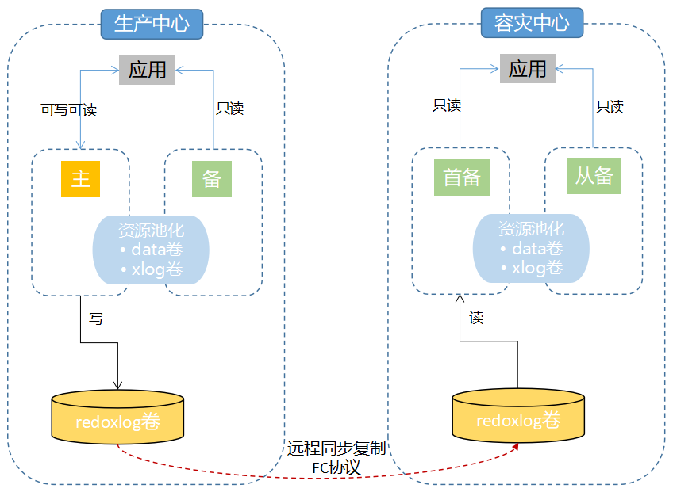

# 资源池化同城双中心部署

## 内容简介

openGauss资源池化是openGauss推出的一种新型的集群架构.通过DMS和DSS组件,实现集群中多个节点的底层存储数据共享和节点间的内存实时共享，达到节省底层存储资源以及集群内部支持一写多读且可以实时一致性读的目的。
本文主要介绍基于资源池化部署同城双中心。


  - 资源池化部署图参考：

<p align="center"><b>图1: openGauss资源池化同城双中心部署图</b></p>



  - 在社区上正式发布的企业版安装包中, 如果需要搭建资源池化同城双中心, 在硬件上需要准备磁阵, 服务器和光交换机，且需要部署CM和OM组件。

  - 当前版本只支持资源池化本地xlog日志和远程同步复制xlog日志共存的实现下部署资源池化双集群。


## 手动部署同城双中心示例<a name="section188071153201818"></a>
资源池化部署通过om管理工具部署两个资源池化单集群，再配置容灾参数，从而搭建同城双中心。

> **说明：** 
>此处的手动安装是指工程编译之后，可通过om管理工具执行相关命令进行资源池化集群安装部署，openGauss常规安装请参照《安装指南》。

-   前置条件
    -   工程已完成代码编译，编译请参见[软件安装编译](../CompilationGuide/版本编译.md)。
    -   主备存储已经挂载磁阵LUN设备，并且已经安装ultrapath多路径软件，磁阵设备可用。

-   限制条件
    -   两套正常的dorado存储，需要搭建两套资源池化集群。
    -   基于资源池化本地日志和同步复制共享xlog两份日志基础上部署，所以需要单独划分一个同步复制共享xlog卷，后期会支持两份日志合一。

-   组网方式
    
    <table>
    <tbody>
    <tr>
        <td rowspan='2'>生产中心</td>
        <td rowspan='2'>主端</td>
        <td>业务计算节点0</td>
        <td rowspan='2'>主存储</td>
        <td rowspan='2'>Dorado</td>
    </tr>
        <td>业务计算节点1</td>
    <tr>
        <td rowspan='2'>容灾中心</td>
        <td rowspan='2'>备端</td>
        <td>业务计算节点0</td>
        <td rowspan='2'>备存储</td>
        <td rowspan='2'>Dorado</td>
    </tr>
        <td>业务计算节点1</td>
    </tbody>
    </table>

-   操作步骤
    1. 在主存储上创建资源池化需要的lun，以及远程同步复制xlog卷对应的lun，并且所有lun全部映射到业务计算节点上

        <table>
        <tbody>
        <tr>
            <td rowspan='1'>lun</td>
            <td rowspan='1'>盘符</td>
        </tr>
        <tr>
            <td rowspan='1'>data</td>
            <td rowspan='1'>/dev/sda</td>
        </tr>
        <tr>
            <td rowspan='1'>xlog0</td>
            <td rowspan='1'>/dev/sdb</td>
        </tr>
        <tr>
            <td rowspan='1'>xlog1</td>
            <td rowspan='1'>/dev/sdc</td>
        </tr>
        <tr>
            <td rowspan='1'>votingDiskPath</td>
            <td rowspan='1'>/dev/sdd</td>
        </tr>
        <tr>
            <td rowspan='1'>shareDiskDir</td>
            <td rowspan='1'>/dev/sde</td>
        </tr>
        <tr>
            <td rowspan='1'>远程同步复制xlog</td>
            <td rowspan='1'>/dev/sdf</td>
        </tr>
        </tbody>
        </table>

    2.  主存储上准备xml文件。
        在《文档->安装指南->企业版安装->安装openGauss->创建XML配置文件->配置数据库名称及各项目录》中有配置说明, https://docs.opengauss.org/zh/docs/5.0.0/docs/InstallationGuide/%E5%88%9B%E5%BB%BAXML%E9%85%8D%E7%BD%AE%E6%96%87%E4%BB%B6.html

        根据配置说明准备资源池化集群需要的xml文件，以一主一备举例：

        ```
        <?xml version="1.0" encoding="UTF-8"?>
        <ROOT>
            <!-- openGauss整体信息 -->
            <CLUSTER>
                <!-- 数据库名称 -->
                <PARAM name="clusterName" value="sbss" />
                <!-- 数据库节点名称(hostname) -->
                <PARAM name="nodeNames" value="node1,node2" />
                <!-- 数据库安装目录-->
                <PARAM name="gaussdbAppPath" value="/opt/huawei/install/app" />
                <!-- 日志目录-->
                <PARAM name="gaussdbLogPath" value="/opt/huawei/install/log" />
                <!-- 临时文件目录-->
                <PARAM name="tmpMppdbPath" value="/opt/huawei/install/tmp"/>
                <!-- 数据库工具目录-->
                <PARAM name="gaussdbToolPath" value="/opt/huawei/install/tool" />
                <!-- 数据库core文件目录-->
                <PARAM name="corePath" value="/opt/huawei/install/corefile"/>
                <!-- 节点IP，与数据库节点名称列表一一对应 -->
                <PARAM name="backIp1s" value="10.10.10.10,10.10.10.20"/>
                <PARAM name="clusterType" value="single-inst"/>
                        <PARAM name="GaussVT" value="Fusion"/>
                        <PARAM name="enable_dss" value="on"/>
                        <PARAM name="dss_home" value="/opt/huawei/install/dss_home"/>
                        <PARAM name="dss_vg_info" value="data:/dev/sda,log0:/dev/sdb,log1:/dev/sdc"/>
                        <PARAM name="votingDiskPath" value="/dev/sdd"/>
                        <PARAM name="shareDiskDir" value="/dev/sde"/>
                        <PARAM name="ss_dss_vg_name" value="data"/>
                        <PARAM name="dss_ssl_enable" value="on"/>
            </CLUSTER>
            <!-- 每台服务器上的节点部署信息 -->
            <DEVICELIST>
                <!-- 节点1上的部署信息 -->
                <DEVICE sn="node1">
                    <PARAM name="name" value="node1"/>
                    <PARAM name="azName" value="AZ1"/>
                    <PARAM name="azPriority" value="1"/>
                    <PARAM name="backIp1" value="10.10.10.10"/>
                    <PARAM name="sshIp1" value="10.10.10.10"/>

                                <PARAM name="cmDir" value="/opt/huawei/install/cm"/>
                                <PARAM name="cmsNum" value="1"/>
                                <PARAM name="cmServerPortBase" value="27000"/>
                                <PARAM name="cmServerListenIp1" value="10.10.10.10,10.10.10.20"/>
                                <PARAM name="cmServerlevel" value="1"/>
                                <PARAM name="cmServerRelation" value="node1,node2"/>

                                <PARAM name="dataNum" value="1"/>
                                <PARAM name="dataPortBase" value="25400"/>
                                <PARAM name="dataNode1" value="/opt/huawei/install/data/dn,node2,/opt/huawei/install/data/dn"/>
                </DEVICE>

                <!-- 节点2上的节点部署信息，其中“name”的值配置为主机名称 -->
                                <DEVICE sn="node2">
                    <PARAM name="name" value="node2"/>
                    <PARAM name="azName" value="AZ1"/>
                    <PARAM name="azPriority" value="1"/>
                    <PARAM name="backIp1" value="10.10.10.20"/>
                    <PARAM name="sshIp1" value="10.10.10.20"/>
                    <PARAM name="cmDir" value="/opt/mpp/install/cm"/>
                </DEVICE>
            </DEVICELIST>
        </ROOT>
        ```
        `Tips`: 用户需要修改节点名称、节点IP、目录、盘符、端口号

    3.  在主存储上执行如下操作安装部署主集群，安装用户omm。
        执行《文档->安装指南->企业版安装->安装openGauss->初始化安装环境》中的步骤, https://docs.opengauss.org/zh/docs/5.0.0/docs/InstallationGuide/%E5%88%9D%E5%A7%8B%E5%8C%96%E5%AE%89%E8%A3%85%E7%8E%AF%E5%A2%83.html

        简化步骤如下：
        ```
        su - root 
        mkdir -p /opt/software/openGauss
        chmod 755 -R /opt/software
        将下载的安装包放置/opt/software/openGauss目录下

        cd /opt/software/openGauss
        tar -zxvf openGauss-x.x.x-openEuler-64bit-all.tar.gz
        tar -zxvf openGauss-x.x.x-openEuler-64bit-om.tar.gz

        cd /opt/software/openGauss/script
        gs_preinstall -U omm -G dbgrp -X /opt/software/openGauss/cluster_config.xml --sep-env-file=/home/omm/env

        su - omm
        source /home/omm/env
        gs_install -X /opt/software/openGauss/cluster_config.xml --dorado-config=/dev/sdf
        ```

        参数解释：
           + sep-env-file    分离环境变量，参数取值是一个安装用户omm可以访问到的文件目录
           + dorado-config   主存储上为远程同步复制xlog划分的lun，只取值主存储对应的远程同步复制xlog划分的lun对应的盘符

    4.  查询主集群状态。
        建立容灾关系之后就是主集群，未建立容灾关系之前还是资源池化单集群。
        ```
        [mpp@node1 dn_6001]$ cm_ctl query -Cvidp
        [  CMServer State   ]

        node           node_ip         instance                           state
        -------------------------------------------------------------------------
        1  node1 10.10.10.10   1    /opt/mpp/install/cm/cm_server Primary
        2  node2 10.10.10.20   2    /opt/mpp/install/cm/cm_server Standby


        [ Defined Resource State ]

        node           node_ip         res_name instance  state
        ---------------------------------------------------------
        1  node1 10.10.10.10   dms_res  6001      OnLine
        2  node2 10.10.10.20   dms_res  6002      OnLine
        1  node1 10.10.10.10   dss      20001     OnLine
        2  node2 10.10.10.20   dss      20002     OnLine

        [   Cluster State   ]

        cluster_state   : Normal
        redistributing  : No
        balanced        : Yes
        current_az      : AZ_ALL

        [  Datanode State   ]

        node           node_ip         instance                             state            | node           node_ip         instance                             state
        ------------------------------------------------------------------------------------------------------------------------------------------------------------------------------
        1  node1 10.10.10.10   6001 25400  /opt/mpp/install/data/dn P Primary Normal | 2  node2 10.10.10.20   6002 25400  /opt/mpp/install/data/dn S Standby Normal
        ```

    5.  在备存储上准备lun和xml文件。
        同第1步和第2步一样，第1步不需要创建远程同步复制xlog对应的lun

    6.  在备存储上集群(建立容灾关系之后就是备集群)上执行如下操作安装部署备集群,安装用户omm。

        简化步骤如下：
        ```
        su - root 
        mkdir -p /opt/software/openGauss
        chmod 755 -R /opt/software
        将下载的安装包放置/opt/software/openGauss目录下

        cd /opt/software/openGauss
        tar -zxvf openGauss-x.x.x-openEuler-64bit-all.tar.gz
        tar -zxvf openGauss-x.x.x-openEuler-64bit-om.tar.gz

        cd /opt/software/openGauss/script
        gs_preinstall -U omm -G dbgrp -X /opt/software/openGauss/cluster_config.xml --sep-env-file=/home/omm/env

        su - omm
        gs_install -X /opt/software/openGauss/cluster_config.xml
        ```
        `Tips`: 备存储上单集群安装部署gs_install不加dorado-config参数

    7.  查询备存储上集群(建立容灾关系之后就是备集群)状态。
        建立容灾关系之后就是备集群，未建立容灾关系之前还是资源池化单集群。
        ```
        [omm@node1 dn_6001]$ cm_ctl query -Cvidp
        [  CMServer State   ]

        node           node_ip         instance                           state
        -------------------------------------------------------------------------
        1  node1 20.20.20.10   1    /opt/huawei/install/cm/cm_server Primary
        2  node2 20.20.20.20   2    /opt/huawei/install/cm/cm_server Standby


        [ Defined Resource State ]

        node           node_ip         res_name instance  state
        ---------------------------------------------------------
        1  node1 20.20.20.10   dms_res  6001      OnLine
        2  node2 20.20.20.20   dms_res  6002      OnLine
        1  node1 20.20.20.10   dss      20001     OnLine
        2  node2 20.20.20.20   dss      20002     OnLine

        [   Cluster State   ]

        cluster_state   : Normal
        redistributing  : No
        balanced        : Yes
        current_az      : AZ_ALL

        [  Datanode State   ]

        node           node_ip         instance                             state            | node           node_ip         instance                             state
        ------------------------------------------------------------------------------------------------------------------------------------------------------------------------------
        1  node1 20.20.20.10   6001 25400  /opt/huawei/install/data/dn P Primary Normal | 2  node2 20.20.20.20   6002 25400  /opt/huawei/install/data/dn S Standby Normal
        ```

    8. 登录主存储管控平台，与备存储建立远程同步复制
        + data protection -> luns -> remote replication pairs(远程复制对) -> create ->选择主存储需要同步复制给备存储的lun -> next
        + 选择同步 -> Automatic -> 备存储的存储池名称 -> next
        + 最后会显示successful，表示成功
        
        `Tips`: 选择主存储需要同步复制给备存储的lun，指第1步表格中的远程同步复制xlog对应的lun


    9. 在备存储上查询远程同步复制xlog对应的lun
        ```
        rescan-scsi-bus.sh       upadmin show vlun         lsscsi -is
        ```

        lun和盘符对应关系：

        <table>
        <tbody>
        <tr>
            <td rowspan='1'>lun</td>
            <td rowspan='1'>盘符</td>
        </tr>
        <tr>
            <td rowspan='1'>远程同步复制xlog</td>
            <td rowspan='1'>/dev/sdf</td>
        </tr>
        </tbody>
        </table>

    10. 停止主集群，配置容灾参数，重新拉起主集群
        ```
        cm_ctl stop
        ```

        &emsp;<font color='red'>主集群节点0的postgresql.conf文件</font>
        ```
        gs_guc set -N node1 -D /opt/mpp/install/data/dn -c "xlog_file_path = '/dev/sdf'"
        gs_guc set -N node1 -D /opt/mpp/install/data/dn -c "xlog_lock_file_path = '/home/mpp/install/shared_lock_primary'"
        gs_guc set -N node1 -D /opt/mpp/install/data/dn -c "application_name = 'dn_master_0'"
        gs_guc set -N node1 -D /opt/mpp/install/data/dn -c "cross_cluster_replconninfo1='localhost=10.10.10.10 localport=25400 remotehost=20.20.20.10 remoteport=25400'"
        gs_guc set -N node1 -D /opt/mpp/install/data/dn -c "cross_cluster_replconninfo2='localhost=10.10.10.10 localport=25400 remotehost=20.20.20.20 remoteport=25400'"
        gs_guc set -N node1 -D /opt/mpp/install/data/dn -c "cluster_run_mode = 'cluster_primary'"
        gs_guc set -N node1 -D /opt/mpp/install/data/dn -c "ha_module_debug = off"
        ```
        &emsp;<font color='red'>主集群节点0的pg_hba.conf文件</font>
        ```
        gs_guc set -N node1 -D /opt/mpp/install/data/dn -h "host    all             all             20.20.20.10/32        trust"
        gs_guc set -N node1 -D /opt/mpp/install/data/dn -h "host    all             all             20.20.20.20/32        trust"
        ```

        &emsp;<font color='red'>主集群节点1的postgresql.conf文件</font>
        ```
        gs_guc set -N node2 -D /opt/mpp/install/data/dn -c "xlog_file_path = '/dev/sdf'"
        gs_guc set -N node2 -D /opt/mpp/install/data/dn -c "xlog_lock_file_path = '/home/mpp/install/shared_lock_primary'"
        gs_guc set -N node2 -D /opt/mpp/install/data/dn -c "application_name = 'dn_master_1'"
        gs_guc set -N node2 -D /opt/mpp/install/data/dn -c "cross_cluster_replconninfo1='localhost=10.10.10.20 localport=25400 remotehost=20.20.20.10 remoteport=25400'"
        gs_guc set -N node2 -D /opt/mpp/install/data/dn -c "cross_cluster_replconninfo2='localhost=10.10.10.20 localport=25400 remotehost=20.20.20.20 remoteport=25400'"
        gs_guc set -N node2 -D /opt/mpp/install/data/dn -c "cluster_run_mode = 'cluster_primary'"
        gs_guc set -N node2 -D /opt/mpp/install/data/dn -c "ha_module_debug = off"
        ```

        &emsp;<font color='red'>主集群节点1的pg_hba.conf文件</font>
        ```
        gs_guc set -N node2 -D /opt/mpp/install/data/dn -h "host    all             all             20.20.20.10/32        trust"
        gs_guc set -N node2 -D /opt/mpp/install/data/dn -h "host    all             all             20.20.20.20/32        trust"
        ```

        ```
        cm_ctl start
        ```

    11. 停止备存储上的资源池化单集群(建立容灾关系之后就是备集群)，配置容灾参数
        ```
        cm_ctl stop
        ```

        &emsp;<font color='red'>备集群节点0的postgresql.conf文件</font>
        ```
        gs_guc set -N node1 -D /opt/mpp/install/data/dn -c "xlog_file_path = '/dev/sdf'"
        gs_guc set -N node1 -D /opt/mpp/install/data/dn -c "xlog_lock_file_path = '/home/huawei/install/shared_lock_standby'"
        gs_guc set -N node1 -D /opt/mpp/install/data/dn -c "application_name = 'dn_sandby_0'"
        gs_guc set -N node1 -D /opt/mpp/install/data/dn -c "cross_cluster_replconninfo1='localhost=20.20.20.10 localport=25400 remotehost=10.10.10.10 remoteport=25400'"
        gs_guc set -N node1 -D /opt/mpp/install/data/dn -c "cross_cluster_replconninfo2='localhost=20.20.20.10 localport=25400 remotehost=10.10.10.20 remoteport=25400'"
        gs_guc set -N node1 -D /opt/mpp/install/data/dn -c "cluster_run_mode = 'cluster_standby'"
        gs_guc set -N node1 -D /opt/mpp/install/data/dn -c "ha_module_debug = off"
        ```

        &emsp;<font color='red'>备集群节点0的pg_hba.conf文件</font>
        ```
        gs_guc set -N node1 -D /opt/mpp/install/data/dn -h "host    all             all             10.10.10.10/32        trust"
        gs_guc set -N node1 -D /opt/mpp/install/data/dn -h "host    all             all             10.10.20.20/32        trust"
        ```

        &emsp;<font color='red'>备集群节点1的postgresql.conf文件</font>
        ```
        gs_guc set -N node2 -D /opt/mpp/install/data/dn -c "xlog_file_path = '/dev/sdf'"
        gs_guc set -N node2 -D /opt/mpp/install/data/dn -c "xlog_lock_file_path = '/home/huawei/install/shared_lock_standby'"
        gs_guc set -N node2 -D /opt/mpp/install/data/dn -c "application_name = 'dn_standby_1'"
        gs_guc set -N node2 -D /opt/mpp/install/data/dn -c "cross_cluster_replconninfo1='localhost=20.20.20.20 localport=25400 remotehost=10.10.10.10 remoteport=25400'"
        gs_guc set -N node2 -D /opt/mpp/install/data/dn -c "cross_cluster_replconninfo2='localhost=20.20.20.20 localport=25400 remotehost=10.10.10.20 remoteport=25400'"
        gs_guc set -N node2 -D /opt/mpp/install/data/dn -c "cluster_run_mode = 'cluster_standby'"
        gs_guc set -N node2 -D /opt/mpp/install/data/dn -c "ha_module_debug = off"
        ```

        &emsp;<font color='red'>备集群节点1的pg_hba.conf文件</font>
        ```
        gs_guc set -N node2 -D /opt/mpp/install/data/dn -h "host    all             all             10.10.10.10/32        trust"
        gs_guc set -N node2 -D /opt/mpp/install/data/dn -h "host    all             all             10.10.10.20/32        trust"
        ```
       
    12. 拉起首备dssserver，执行build
        ```
        export DSS_MAINTAIN=TRUE
        dssserver -D /opt/huawei/install/dss_home &
        gs_ctl build -D /opt/huawei/install/data/dn -b cross_cluster_full -g 0 --vgname=+data --enable-dss --socketpath='UDS:/opt/huawei/install/dss_home/.dss_unix_d_socket' -q
        ```
        `Tips`: -g参数指即将成为首备的节点，必须选择单集群下role是primary的节点作为首备，build必须需要加-q，指build成功后不拉起数据库，build完成后需要手动kill掉dssserver。

    13. 配置备集群cm参数，重新拉起备集群
        ```
        cm_ctl set --param --server -k backup_open=1
        cm_ctl set --param --agent -k agent_backup_open=1

        cm_ctl start
        ```

    14. 查询集群状态
        主集群使用cm_ctl query -Cvidp查询出来同第步一样
        备集群查询结果如下，备集群节点0从没有建立容灾关系时的primary变成建立容灾关系之后的Main Standby
        ```
        [mpp@node2 dn_6002]$ cm_ctl query -Cvidp
        [  CMServer State   ]

        node           node_ip         instance                           state
        -------------------------------------------------------------------------
        1  node1 20.20.20.10   1    /opt/huawei/install/cm/cm_server Primary
        2  node2 20.20.20.20   2    /opt/huawei/install/cm/cm_server Standby


        [ Defined Resource State ]

        node           node_ip         res_name instance  state
        ---------------------------------------------------------
        1  node1 20.20.20.10   dms_res  6001      OnLine
        2  node2 20.20.20.20   dms_res  6002      OnLine
        1  node1 20.20.20.10   dss      20001     OnLine
        2  node2 20.20.20.20   dss      20002     OnLine

        [   Cluster State   ]

        cluster_state   : Normal
        redistributing  : No
        balanced        : Yes
        current_az      : AZ_ALL

        [  Datanode State   ]

        node           node_ip         instance                             state            | node           node_ip         instance                             state
        ------------------------------------------------------------------------------------------------------------------------------------------------------------------------------
        1  node1 20.20.20.10   6001 25400  /opt/huawei/install/data/dn P Main Standby Normal | 2  node2 20.20.20.20   6002 25400  /opt/huawei/install/data/dn S Standby Normal
        ```

    15. 在主集群主机和备集群首备执行查询，可观察到流复制信息
        ```
        主集群主节点0
        [omm@node1 dn]$ gs_ctl query -D /opt/huawei/install/data/dn
        [2023-04-18 09:38:34.397][1498175][][gs_ctl]: gs_ctl query ,datadir is /opt/huawei/install/data/dn
        HA state:
                local_role                     : Primary
                static_connections             : 2
                db_state                       : Normal
                detail_information             : Normal

        Senders info:
                sender_pid                     : 1456376
                local_role                     : Primary
                peer_role                      : StandbyCluster_Standby
                peer_state                     : Normal
                state                          : Streaming
                sender_sent_location           : 2/5C8
                sender_write_location          : 2/5C8
                sender_flush_location          : 2/5C8
                sender_replay_location         : 2/5C8
                receiver_received_location     : 2/5C8
                receiver_write_location        : 2/5C8
                receiver_flush_location        : 2/5C8
                receiver_replay_location       : 2/5C8
                sync_percent                   : 100%
                sync_state                     : Async
                sync_priority                  : 0
                sync_most_available            : Off
                channel                        : 10.10.10.10:25400-->20.20.20.10:43350

        Receiver info:
        No information

        备集群首备节点0
        [omm@nodename pg_log]$ gs_ctl query -D /opt/huawei/install/data/dn
        [2023-04-18 11:33:09.288][2760315][][gs_ctl]: gs_ctl query ,datadir is /opt/huawei/install/data/dn
        HA state:
                local_role                     : Main Standby
                static_connections             : 2
                db_state                       : Normal
                detail_information             : Normal

        Senders info:
        No information
        Receiver info:
                receiver_pid                   : 1901181
                local_role                     : Standby
                peer_role                      : Primary
                peer_state                     : Normal
                state                          : Normal 
                sender_sent_location           : 2/5C8
                sender_write_location          : 2/5C8
                sender_flush_location          : 2/5C8
                sender_replay_location         : 2/5C8
                receiver_received_location     : 2/5C8
                receiver_write_location        : 2/5C8
                receiver_flush_location        : 2/5C8
                receiver_replay_location       : 2/5C8
                sync_percent                   : 100%
                channel                        : 20.20.20.10:43350<--10.10.10.10:25400
        ```