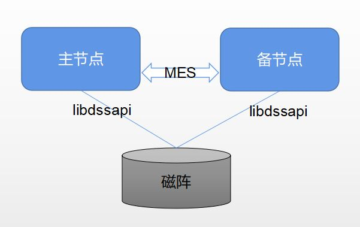

# 资源池化开发者环境部署指南

## 内容简介

openGauss资源池化是openGauss推出的一种新型的集群架构.通过DMS和DSS组件,实现集群中多个节点的底层存储数据共享和节点间的内存实时共享，达到节省底层存储资源以及集群内部支持一写多读且可以实时一致性读的目的。
本文主要介绍开发者如何搭建一个可以用于自己学习或者开发的资源池化环境。

## 预备知识

开发者最好具备以下基础:
- Linux的基础命令，比如dd命令，iscis等。
- 对磁阵有一定的了解。
- 对传统的openGauss编译方式十分熟悉。

## 注意事项

  - 资源池化部署图参考：

<p align="center"><b>图1: openGauss资源池化部署图</b></p>



  - 在社区上正式发布的企业版安装包中, 如果需要搭建资源池化架构, 在硬件上需要准备磁阵, 服务器和光交换机，且需要部署CM和OM组件。

  - 本文主要介绍可用于开发者进行开发的编译环境搭建方式, 不需要磁阵、CM和OM组件, 仅需要一台普通的物理机就可以搭建出资源池化的环境。

  - 需要注意的是, 因为没有使用到真正的CM,  这种方式搭建的环境不能用于调试主备倒换或failover场景, 只能用于验证集群正常运行时的场景。

## 环境预备
  - 一台单独的物理机，且至少存在一个剩余空间大于200GB的磁盘分区。
  - 已经自行使用编译方式编译出了openGauss带资源池化代码的debug版本的安装包, 可以通过确认生成的bin目录下是否有dssserver, dsscmd, lib目录下是否有libdms.so, libdssapi.so , libdssaio.so, 来判断，同时要保证编译openGauss时使用的是测试版本的DSS组件和DMS组件，详细参考下面的步骤。

## 独立编译安装指南
> **注意：** 
>
> 以下部署操作请勿用于生产环境

 > **说明：**   
  > - openGauss必须用Debug模式编译，不能使用Release模式，DMS和DSS组件需要使用测试版本。
  > - 手动编译安装的方式中，没有包含CM和OM组件，而正式的使用环境中DSS组件和DMS组件对CM有依赖，所以在编译openGauss之前需要先用测试的模式分别编译DSS和DMS组件，参考下面的编译方式说明。

1. 编译测试版本的DSS组件。

      a.下载最新版本CBB代码，编译安装替换三方库中的CBB。

      b.下载最新版本的DSS代码，并根据src/gausskernel/ddes/ddes_commit_id内的版本号，回退DSS至指定版本。

      c.编译安装替换三方库中的DSS组件，命令如下（DSS_CODE_PATH表示解压后的DSS源码目录，ThirdParty_Binarylibs_Path表示解压后的三方库目录）：
```shell
  #-3rd后面跟三方库对应的绝对路径
  cd [DSS_CODE_PATH]/build/linux/opengauss
  sh build.sh -3rd [ThirdParty_Binarylibs_Path] -t cmake -m DebugDsstest
```
2. 编译测试版本的DMS组件。

      a.下载最新版本CBB代码，编译安装替换三方库中的CBB。

      b.下载最新版本的DMS代码，并根据src/gausskernel/ddes/ddes_commit_id内的版本号，回退DMS至指定版本。

      c.编译安装替换三方库中的DMS组件，命令如下（DMS_CODE_PATH表示解压后的DMS源码目录，ThirdParty_Binarylibs_Path表示解压后的三方库目录）：
```shell
  cd [DMS_CODE_PATH]/build/linux/opengauss
  sh build.sh -3rd [ThirdParty_Binarylibs_Path] -t cmake -m Release
  cd [DMS_CODE_PATH]
  mkdir -p tmp
  export BUILD_MODE=Debug
  cmake . -DCMAKE_BUILD_TYPE=Debug -D DMS_TEST=ON -DOPENGAUSS=yes -B ./tmp
  cd tmp/
  make -sj
```
>  **注意：** 
>
>    当编译完DSS、DMS、CBB之后，会自动更新到三方库，不需要手动拷贝，接下来只需按标准步骤编译数据库即可。

3. 配置环境变量。

   下面是以2个节点为例进行说明，参考示例, 其中DSS_HOME是dn实例1的dssserver运行时需要的目录, 需要手动新建。将下面的内容写入到/home/test/envfile中作为环境变量导入。

  ```shell
export GAUSSHOME=/home/test/openGauss-server/dest/
export LD_LIBRARY_PATH=$GAUSSHOME/lib:$LD_LIBRARY_PATH
export PATH=$GAUSSHOME/bin:$PATH
export DSS_HOME=/home/test/dss/dss0/dssdba
  ```
4. 新建dsssever的目录。
  ```shell
  cd /home/test
  mkdir -p dss/dss0/dssdba/cfg
  mkdir -p dss/dss0/dssdba/log
  mkdir -p dss/dss1/dssdba/cfg
  mkdir -p dss/dss1/dssdba/log
  mkdir -p dss/dev
  ```

5. 用dd命令新建一个模拟的块设备文件。

  下面的命令是建2T的命令，请根据自己需要的大小调整bs和count的值，执行时间依赖于磁盘的性能。
  ```shell
  dd if=/dev/zero of=/home/test/dss/dev/dss-dba bs=2M count=1024000 >/dev/null 2>&1
  ```

6. 创建2个dn节点需要的dss实例0和dss实例1的配置文件。

    创建dss实例0的配置文件：
  ```shell
  vim /home/test/dss/dss0/dssdba/cfg/dss_inst.ini
  ```
  文件中的内容如下：
  ```shell
  INST_ID=0
  _LOG_LEVEL=255
  DSS_NODES_LIST=0:127.0.0.1:17102,1:127.0.0.1:18102
  DISK_LOCK_FILE_PATH=/home/test/dss/dss0
  LSNR_PATH=/home/test/dss/dss0
  _LOG_MAX_FILE_SIZE=20M
  _LOG_BACKUP_FILE_COUNT=128
  ```

  创建dss实例0的卷配置文件：
  ```shell
  vim /home/test/dss/dss0/dssdba/cfg/dss_vg_conf.ini
  ```
  文件中的内容如下, 里面就是卷名加dd模拟出来的设备名字：
  ```shell
  data:/home/test/dss/dev/dss-dba
  ```

  创建dss实例1的配置文件：
  ```shell
  vim /home/test/dss/dss1/dssdba/cfg/dss_inst.ini
  ```
  文件中的内容如下, 注意DISK_LOCK_FILE_PATH配置的与1一致：
  ```shell
  INST_ID=1
  _LOG_LEVEL=255
  DSS_NODES_LIST=0:127.0.0.1:17102,1:127.0.0.1:18102
  DISK_LOCK_FILE_PATH=/home/test/dss/dss0
  LSNR_PATH=/home/test/dss/dss1
  _LOG_MAX_FILE_SIZE=20M
  _LOG_BACKUP_FILE_COUNT=128
  ```

  创建dss实例1的卷配置文件：
  ```shell
  vim /home/test/dss/dss1/dssdba/cfg/dss_vg_conf.ini
  ```
  文件中的内容如下, 里面就是卷名加dd模拟出来的设备名字：
  ```shell
  data:/home/test/dss/dev/dss-dba
  ```
>  **注意：** 
>
> 一台服务器上建多个dn(数据库)节点, ip是相同的, 服务使用的端口号不同。

7. 创建存放数据库数据的数据卷, 启动dssserver服务。

  ```shell
  ##这里是第3步中配好的环境变量
  source /home/test/envfile
  dsscmd cv -g data -v /home/test/dss/dev/dss-dba
  dssserver -D /home/test/dss/dss0/dssdba &
  #上个命令显示DSS SERVER STARTED即为成功
  dssserver -D /home/test/dss/dss1/dssdba &
  #上个命令显示DSS SERVER STARTED即为成功

  #创建完可以通过如下命令确认是否建卷成功
  dsscmd lsvg -U UDS:/home/test/dss/dss0/.dss_unix_d_socket
  dsscmd ls -m M -p +data -U UDS:/home/test/dss/dss0/.dss_unix_d_socket
  ```
>  **注意：** 
>
> dss不支持启动后修改卷组配置，如涉及修改请重新执行上述步骤。

8. 依次执行每个节点的gs_initdb操作。

  ```shell
mkdir -p /home/test/data
rm -rf node1 node2

gs_intdb -D /home/test/data/node1 --nodename=node1 -U tester -w Pasword --vgname=+data --enable-dss --dms_url="0:127.0.0.1:1613,1:127.0.0.1:1614" -I 0 --socketpath='UDS:/home/test/dss/dss0/.dss_unix_d_socket'

echo "ss_enable_ssl = off
listen_addresses = '*'
port=12210
ss_enable_reform = off
ss_work_thread_count = 32
enable_segment = on
ss_log_level = 255
ss_log_backup_file_count = 100
ss_log_max_file_size = 1GB
" >> /home/test/data/node1/postgresql.conf

sed '91 ahost       all        all         0.0.0.0/0        sha256' -i /home/test/data/node1/pg_hba.conf

gs_intdb -D /home/test/data/node2 --nodename=node2 -U tester -w Pasword --vgname=+data --enable-dss --dms_url="0:127.0.0.1:1613,1:127.0.0.1:1614" -I 1 --socketpath='UDS:/home/test/dss/dss1/.dss_unix_d_socket'

echo "ss_enable_ssl = off
listen_addresses = '*'
port=13210
ss_enable_reform = off
ss_work_thread_count = 32
enable_segment = on
ss_log_level = 255
ss_log_backup_file_count = 100
ss_log_max_file_size = 1GB
" >> /home/test/data/node2/postgresql.conf

sed '91 ahost       all        all         0.0.0.0/0        sha256' -i /home/test/data/node2/pg_hba.conf
  ```

9. 创建模拟CM功能的文件，并将其加入到第3步创建的环境变量中。
```shell
  echo "REFORMER_ID = 0" > /home/test/cm_config.ini
  echo "BITMAP_ONLINE = 3" >> /home/test/cm_config.ini
  echo "export CM_CONFIG_PATH=/home/test/cm_config.ini" >> /home/test/envfile
```

10. 依次启动节点1和节点2。
```shell
  source /home/test/envfile
  gs_ctrl start -D /home/test/data/node1
  gs_ctrl start -D /home/test/data/node2
```

## 部分补充说明

+ ss_log_level参数用于控制日志中打印DMS和DSS相关的日志, 日志目录在pg_log/DMS里面。

  - 17102和18102是dssserver要用的端口。

  - 1613和1614是dms通信要用的端口。

  - 12210和13210是openGauss数据库提供服务需要用的端口。

  - dssserver配置中INST_ID不能有冲突, 比如多个dssserver配置成相同的ID。

  - 该方式搭建出来的环境不支持高可用, 不能测试倒换和failover。

  - 如果启动时报错，提示如“dms library version is not matched”等报错，表示DMS/DSS组件版本号错误，请参考编译步骤重新编译。

  - 非CM环境下，限制了0节点为主节点，因此需要确保initdb阶段0节点创建成功。

  - 如果安装过程出现报错，再次initdb时候可能会提示目录不为空。此时需要清理文件系统及DSS中的残留文件。文件系统可以通过rm命令直接删除node文件夹，DSS中可以对模拟的块设备文件头部写0（DSS将元数据信息记录在头部），清理完成后重新从第7步开始执行，清理命令参考如下：
  
    ```
    rm -rf /home/test/data/node1 /home/test/data/node2
    dd if=/dev/zero of=/home/test/dss/dev/dss-dba bs=2M count=10 conv=notrunc >/dev/null 2>&1
    ```
    
    
