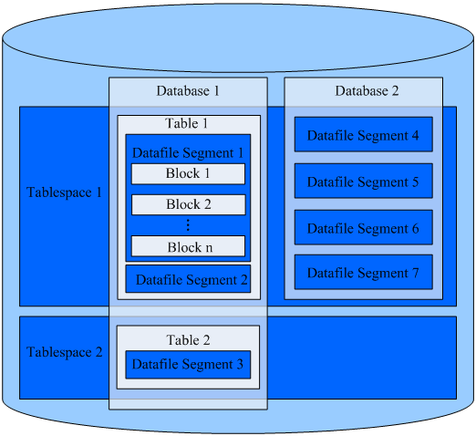

# 数据库逻辑结构图

openGauss的数据库节点负责存储数据，其存储介质也是磁盘，本节主要从逻辑视角介绍数据库节点都有哪些对象，以及这些对象之间的关系。数据库逻辑结构如[图1](#zh-cn_topic_0237120245_zh-cn_topic_0059779316_fb2fa3b3cc8824dea95318504e0537913)。

**图 1**  数据库逻辑结构图  

> **说明：**

> 1. Tablespace，即表空间，是一个目录，可以存在多个，里面存储的是它所包含的数据库的各种物理文件。每个表空间可以对应多个Database。  
> 2. Database，即数据库，用于管理各类数据对象，各数据库间相互隔离。数据库管理的对象可分布在多个Tablespace上。  
> 3. Datafile Segment，即数据文件，通常每张表只对应一个数据文件。如果某张表的数据大于1GB，则会分为多个数据文件存储。  
> 4. Table，即表，每张表只能属于一个数据库，也只能对应到一个Tablespace。每张表对应的数据文件必须在同一个Tablespace中。  
> 5. Block，即数据块，是数据库管理的基本单位，默认大小为8KB。  
