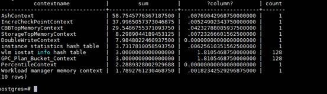
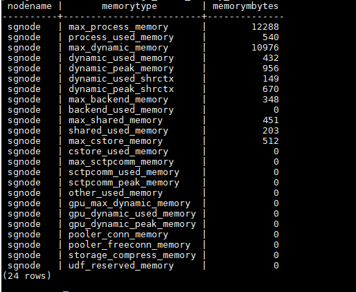
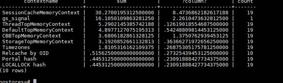
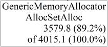

# 内存不足问题

## 问题现象<a name="zh-cn_topic_0283137168_section4753114614509"></a>

客户端或日志里出现错误：memory usage reach the max\_dynamic\_memory。

## 原因分析<a name="zh-cn_topic_0283137168_section31031614204014"></a>

出现内存不足可能因GUC参数max\_process\_memory值设置较小相关，该参数限制一个openGauss实例可用最大内存。

## 处理分析<a name="zh-cn_topic_0283137168_section12618818144413"></a>

通过工具gs\_guc适当调整max\_process\_memory参数值。注意需重启实例生效。

## 定位方法

1、数据库内存不足时，正常端口连接会失败，此时连接内存不足节点的+1。

2、端口+1登录成功后查询总的内存使用视图：

 ```

        select * from gs_total_memory_detail;

 ```





max_process_memory：guc参数设置

process_used_memory：进程实际使用的内存大小，同操作系统RES

max_dynamic_memory：MemoryContext能够使用的内存大小

dynamic_used_memory：MemoryContext实际使用的内存大小

dynamic_used_shrctx：SharedMemoryContext使用的内存大小

max_shared_memory：shared_buffers + 元数据

shared_used_memory：进程使用的共享内存大小

max_cstore_memory：cstore_buffers

other_used_memory：process_used_memory – dynamic_used_memory –shared_used_memory – cstore_used_memory


3、根据第2步中查出的内存使用情况进行如下分析：

-    若dynamic_used_shrctx数据异常大，查询如下视图：gs_shared_memory_detail


 ```

select contextname, sum(totalsize)/1024/1024 sum, sum(freesize)/1024/1024, count(*) count from gs_shared_memory_detail group by contextname order by sum desc limit 10;

 ```
根据查出的内存context信息，使用内存最大的context可能存在内存泄漏。


-  若dynamic_used_memory数值较大，dynamic_used_shrctx数值很小，则查询如下视图：gs_session_memory_detail


 ```
select contextname, sum(totalsize)/1024/1024 sum, sum(freesize)/1024/1024, count(*) count from gs_session_memory_detail group by contextname order by sum desc limit 10;

 ```



根据查出的内存context信息，看使用内存最大的context是否是常见的context，若不是则该context可能存在内存泄漏。

一般正常较大的context为：

SessionCacheMemoryContext，StorageTopMemoryContext

 

4、根据第3步中确认的可能存在内存泄漏的context，通过如下视图可直接查询该context上内存申请的详细信息；


gs_get_shared_memctx_detail(text)
描述：返回指定内存上下文上的内存申请的详细信息，包含每一处内存申请所在的文件、行号和大小（同一文件同一行大小会做累加）。只支持查询通过pg_shared_memory_detail视图查询出来的内存上下文，入参为内存上下文名称（即pg_shared_memory_detail返回结果的contextname列）。查询该函数必须具有sysadmin权限或者monitor admin权限。查询结果为如下三列：
<div class="tablenoborder">
<div class="table_box">
<table id="ZH-CN_TOPIC_0237121998__table119476261700" border="1" rules="all" frame="border" cellspacing="0" cellpadding="4" summary="" style="position: relative; word-break: break-all; width: 572px;">
  <thead align="left">
    <tr id="ZH-CN_TOPIC_0237121998__row69478262010">
      <th align="left" class="cellrowborder" id="mcps1.3.6.36.3.1.4.1.1" valign="top" style="width: 63px;">
      <p id="ZH-CN_TOPIC_0237121998__p4948132617012">名称</p>
      </th>
      <th align="left" class="cellrowborder" id="mcps1.3.6.36.3.1.4.1.2" valign="top" style="width: 78px;">
      <p id="ZH-CN_TOPIC_0237121998__p8948122613019">类型</p>
      </th>
      <th align="left" class="cellrowborder" id="mcps1.3.6.36.3.1.4.1.3" valign="top" style="width: 412px;">
      <p id="ZH-CN_TOPIC_0237121998__p694832616014">描述</p>
      </th>
    </tr>
  </thead>
  <tbody>
    <tr id="ZH-CN_TOPIC_0237121998__row1994817261015">
      <td class="cellrowborder" valign="top" headers="mcps1.3.6.36.3.1.4.1.1 ">
      <p id="ZH-CN_TOPIC_0237121998__p894842614011">file</p>
      </td>
      <td class="cellrowborder" valign="top" headers="mcps1.3.6.36.3.1.4.1.2 ">
      <p id="ZH-CN_TOPIC_0237121998__p794811261018">text</p>
      </td>
      <td class="cellrowborder" valign="top" headers="mcps1.3.6.36.3.1.4.1.3 ">
      <p id="ZH-CN_TOPIC_0237121998__p1994810261008">申请内存所在文件的文件名。</p>
      </td>
    </tr>
    <tr id="ZH-CN_TOPIC_0237121998__row1494892619013">
      <td class="cellrowborder" valign="top" headers="mcps1.3.6.36.3.1.4.1.1 ">
      <p id="ZH-CN_TOPIC_0237121998__p1494810267016">line</p>
      </td>
      <td class="cellrowborder" valign="top" headers="mcps1.3.6.36.3.1.4.1.2 ">
      <p id="ZH-CN_TOPIC_0237121998__p11948426309">int8</p>
      </td>
      <td class="cellrowborder" valign="top" headers="mcps1.3.6.36.3.1.4.1.3 ">
      <p id="ZH-CN_TOPIC_0237121998__p129481626002">申请内存所在文件的代码行号。</p>
      </td>
    </tr>
    <tr id="ZH-CN_TOPIC_0237121998__row89482261803">
      <td class="cellrowborder" valign="top" headers="mcps1.3.6.36.3.1.4.1.1 ">
      <p id="ZH-CN_TOPIC_0237121998__p1894820262017">size</p>
      </td>
      <td class="cellrowborder" valign="top" headers="mcps1.3.6.36.3.1.4.1.2 ">
      <p id="ZH-CN_TOPIC_0237121998__p1294842611017">int8</p>
      </td>
      <td class="cellrowborder" valign="top" headers="mcps1.3.6.36.3.1.4.1.3 ">
      <p id="ZH-CN_TOPIC_0237121998__p9949132618015">申请的内存大小，同一文件同一行多次申请会做累加。</p>
      </td>
    </tr>
  </tbody>
</table>
</div>
</div>
<div class="note" id="ZH-CN_TOPIC_0237121998__note1779151518138">
<div class="notebody">
<p id="ZH-CN_TOPIC_0237121998__p117911415161318">注：该视图不支持release版本小型化场景。</p>
</div>
</div>
</li>
<li id="ZH-CN_TOPIC_0237121998__li181595437541">gs_get_session_memctx_detail(text)
<p id="ZH-CN_TOPIC_0237121998__p610163511518"><a target="_blank" name="ZH-CN_TOPIC_0237121998__li181595437541"></a><a target="_blank" name="li181595437541"></a>描述：返回指定内存上下文上的内存申请的详细信息，包含每一处内存申请所在的文件、行号和大小（同一文件同一行大小会做累加）。仅在线程池模式下生效。且只支持查询通过pv_session_memory_context视图查询出来的内存上下文，入参为内存上下文名称（即pv_session_memory_context返回结果的contextname列）。查询该函数必须具有sysadmin权限或者monitor admin权限。<span style="color: rgb(51, 51, 51); font-family: 微软雅黑, 宋体, arial; font-size: 14px; font-style: normal; font-variant-ligatures: normal; font-variant-caps: normal; font-weight: 400; letter-spacing: normal; orphans: 2; text-align: left; text-indent: 0px; text-transform: none; white-space: normal; widows: 2; word-spacing: 0px; -webkit-text-stroke-width: 0px; background-color: rgb(255, 255, 255); text-decoration-thickness: initial; text-decoration-style: initial; text-decoration-color: initial; display: inline !important; float: none;">查询结果为如下三列：</span></p>
<div class="tablenoborder">
<div class="table_box">
<table id="ZH-CN_TOPIC_0237121998__table210123512516" border="1" rules="all" frame="border" cellspacing="0" cellpadding="4" summary="" style="position: relative; word-break: break-all; width: 570px;">
  <thead align="left">
    <tr id="ZH-CN_TOPIC_0237121998__row5113358519">
      <th align="left" class="cellrowborder" id="mcps1.3.6.37.3.1.4.1.1" valign="top" style="width: 64px;">
      <p id="ZH-CN_TOPIC_0237121998__p1111735959">名称</p>
      </th>
      <th align="left" class="cellrowborder" id="mcps1.3.6.37.3.1.4.1.2" valign="top" style="width: 80px;">
      <p id="ZH-CN_TOPIC_0237121998__p6111135557">类型</p>
      </th>
      <th align="left" class="cellrowborder" id="mcps1.3.6.37.3.1.4.1.3" valign="top" style="width: 407px;">
      <p id="ZH-CN_TOPIC_0237121998__p1911183510510">描述</p>
      </th>
    </tr>
  </thead>
  <tbody>
    <tr id="ZH-CN_TOPIC_0237121998__row3114351353">
      <td class="cellrowborder" valign="top" headers="mcps1.3.6.37.3.1.4.1.1 ">
      <p id="ZH-CN_TOPIC_0237121998__p71111351054">file</p>
      </td>
      <td class="cellrowborder" valign="top" headers="mcps1.3.6.37.3.1.4.1.2 ">
      <p id="ZH-CN_TOPIC_0237121998__p1711153512519">text</p>
      </td>
      <td class="cellrowborder" valign="top" headers="mcps1.3.6.37.3.1.4.1.3 ">
      <p id="ZH-CN_TOPIC_0237121998__p91183512513">申请内存所在文件的文件名。</p>
      </td>
    </tr>
    <tr id="ZH-CN_TOPIC_0237121998__row14113356512">
      <td class="cellrowborder" valign="top" headers="mcps1.3.6.37.3.1.4.1.1 ">
      <p id="ZH-CN_TOPIC_0237121998__p121173511515">line</p>
      </td>
      <td class="cellrowborder" valign="top" headers="mcps1.3.6.37.3.1.4.1.2 ">
      <p id="ZH-CN_TOPIC_0237121998__p3111357513">int8</p>
      </td>
      <td class="cellrowborder" valign="top" headers="mcps1.3.6.37.3.1.4.1.3 ">
      <p id="ZH-CN_TOPIC_0237121998__p6114358519">申请内存所在文件的代码行号。</p>
      </td>
    </tr>
    <tr id="ZH-CN_TOPIC_0237121998__row1511173511512">
      <td class="cellrowborder" valign="top" headers="mcps1.3.6.37.3.1.4.1.1 ">
      <p id="ZH-CN_TOPIC_0237121998__p21173511510">size</p>
      </td>
      <td class="cellrowborder" valign="top" headers="mcps1.3.6.37.3.1.4.1.2 ">
      <p id="ZH-CN_TOPIC_0237121998__p7124351759">int8</p>
      </td>
      <td class="cellrowborder" valign="top" headers="mcps1.3.6.37.3.1.4.1.3 ">
      <p id="ZH-CN_TOPIC_0237121998__p612235452">申请的内存大小，同一文件同一行多次申请会做累加。</p>
      </td>
    </tr>
  </tbody>
</table>
</div>
</div>
<div class="note" id="ZH-CN_TOPIC_0237121998__note1121815717142">
<div class="notebody">
<p id="ZH-CN_TOPIC_0237121998__p1021877171413">注：该视图仅在线程池模式下生效，且该视图不支持release版本小型化场景。</p>
</div>
</div>
</li>
5、基本的context下的内存泄漏问题都可以用上述方法定位，如果是other_used_memory占用较大，此时则不能通过上述方法正常定位，此时需要使用Jemalloc自带的采用工具，收集malloc的调用和分配关系进行分析，步骤如下：

（1）在debug版本下，设置环境变量：

export MALLOC_CONF=prof:true,prof_final:false,prof_gdump:true,lg_prof_sample:20 。其中最后的20表示每2^20B（1MB）产生一个heap文件，该值可以调，但是调大以后，虽然heap文件会减少，但也会丢失一些内存申请信息。

（2）重启集群，如果是集群环境，需要kill om_monitor，并手动将om_monitor进程拉起。查看数据目录是否产生大量heap文件，如果产生，说明配置成功，否则需要重复上述步骤，直到产生heap文件。

（3）运行相关业务一段时间，取业务开始和最新的heap文件。

（4）使用jeprof处理heap文件，生成pdf。jeprof在代码仓binarylibs/${platForm}/jemalloc/debug/bin下可以获取，此外使用该二进制需要安装graphviz，可以通过yum install graphviz安装。

（5）生成pdf的命令：

全量：jeprof –show_bytes –pdf gaussdb *.heap > out.pdf

增量：jeprof –pdf gaussdb –base=start.heap end.heap > out.pdf

（6）根据生成的PDF分析结果：



可以看出该函数总共申请的内存大小，占系统总共申请内存大小的百分比等信息。