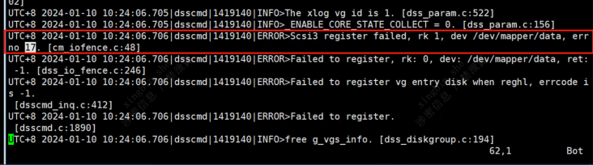

# 因部分节点卸载失败导致卸载失败问题

## 一、问题现象
使用`gs_uninstall --delete-data`命令卸载数据库，部分节点卸载失败，报错信息如下。

```shell
Checking uninstallation.
[GAUSS-51400] : Failed to execute the command: python3 'dbuser/script/local/CheckUninstall.py' -R $GAUSSHOME -U user -l gs_local.log -d. Result:{'openGaussxxx': 'Failure', 'openGaussxxx': 'Success', 'openGaussxxx': 'Success'}.
Error:
[FAILURE] openGaussxxx:
[SUCCESS] openGaussxxx:
Checking OS version.
Successfully checked OS version.
Skipping user check.
Checking installation path.
Successfully checked installation path.
[SUCCESS] openGaussxxx:
Checking OS version.
Successfully checked OS version.
Skipping user check.
Checking installation path.
Successfully checked installation path.
```

## 二、定位方法
根据报错信息，在卸载失败节点上执行相关命令，查看具体报错情况。

## 三、问题根因
如果出现部分节点卸载成功，部分节点卸载失败，怀疑是节点间的互信出问题，查看卸载失败节点的/etc/hosts文件，是否缺少节点的互信信息。

## 四、解决方法
1. 分别在各个节点上执行`gs_unistall --delete-data -L`命令。
2. 按下图方法添加回信息，再次执行`gs_uninstall --delete-data`命令。  
](image-6.png)