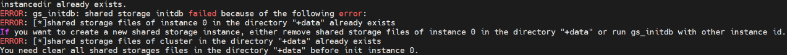

# 数据库重启失败

## 现象
数据库之前可以正常运行，数据库重启之后再次拉起数据库失败，进入$DSS_HOME/log/run目录，查看dss日志，看到如下图的报错。


## 原因
errno17通常是磁盘或磁阵的权限问题，是由于没有对perctrl提升权限。
   > **说明：**   
   perctrl：用于对dss相关工具和进程赋予读写权限的可执行工具。
  
## 解决方案
用如下方法对perctrl提升权限。
```shell
sudo -i setcap CAP_SYS_RAWIO+ep 绝对路径/perctrl
```